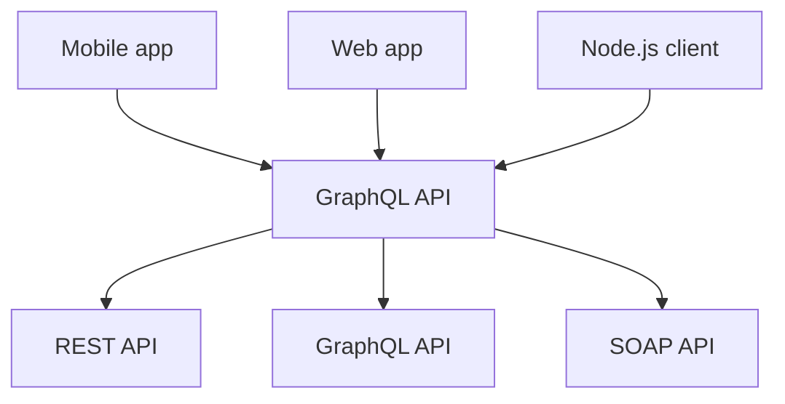
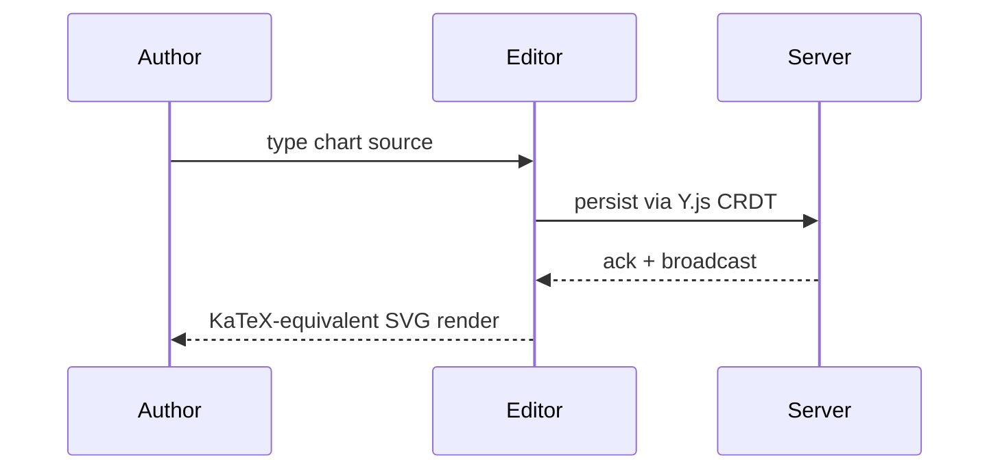
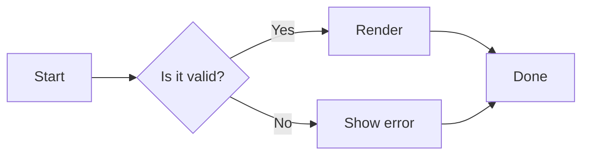

# Mermaid

Re-introduces Mermaid support that was removed 2026-04-21 (placeholder stub deleted per the greenfield directive). Now ships with a working renderer (`mermaid-js` v11 lazy-imported on first mount). Two source forms — both render through the canonical `<Mermaid>` React component.

## ` ```mermaid ` fenced code

Authors prefer the fence form for multi-line charts — the body IS the chart, no escaping. Source mode shows the raw text, WYSIWYG renders the SVG.







## `<Mermaid>` MDX JSX

Authors who paste Mermaid Live Editor links or generated charts can use the JSX form. PropPanel auto-focuses the `chart` field on insert. Multi-line charts in a JSX attribute are awkward today (NG16-deferred PropPanel UX) — prefer the fence form for anything beyond a one-liner.

<Mermaid chart="graph TD; A-->B;" />

<Mermaid chart="graph TD; A-->B;" id="trivial-diagram" />

## Things to try

- `/mermaid` in the slash menu → block `<Mermaid>` insert.
- Type in source mode: ` ```mermaid `, hit enter, type `graph TD; A-->B;`, close fence — switch to WYSIWYG, see the SVG.
- Click a rendered diagram → PropPanel opens with `chart` / `id` / `theme` fields.
- Edit the `chart` prop → diagram re-renders inline.
- Type intentionally-malformed mermaid (`graph TD;\nA-->`) → renders as an error chrome with the source visible (no editor crash, no blank space).
- Toggle to source mode → mermaid shows in either ` ```mermaid `…``` ` (fence form) or `<Mermaid chart="…" />` (JSX form), whichever the doc was authored in. γ preserves source bytes on pristine save.
