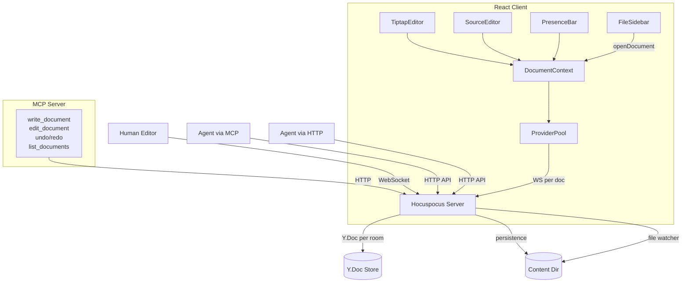
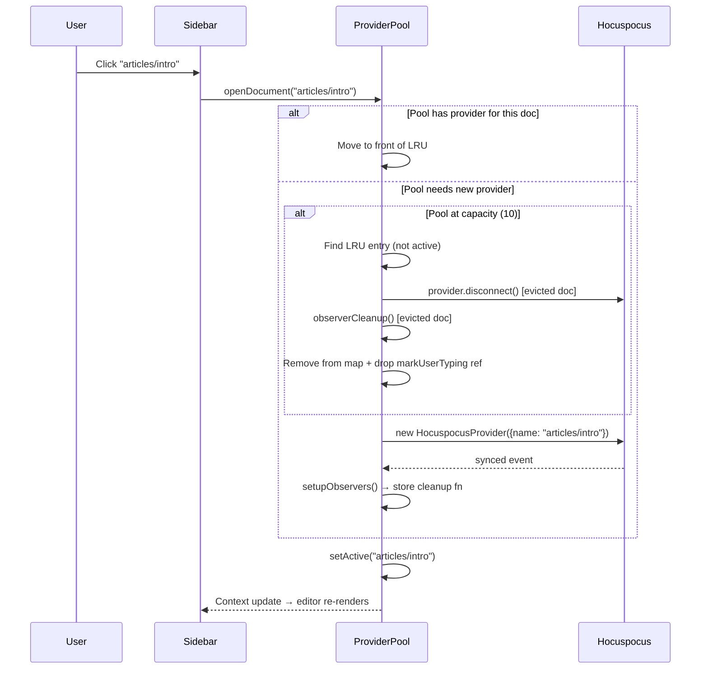

# Multi-File Document Support

**Status:** Superseded — split into three parallel specs
**Created:** 2026-04-10
**Baseline commit:** 748f63e

**Decomposed into:**
1. [`specs/2026-04-10-provider-pool/`](../2026-04-10-provider-pool/SPEC.md) — Provider pool, DocumentContext, editor refactor, persistence mkdir fix (`packages/app/` + one server fix)
2. [`specs/2026-04-10-document-list-api/`](../2026-04-10-document-list-api/SPEC.md) — `GET /api/documents` endpoint (`packages/server/` only)
3. [`specs/2026-04-10-mcp-write-tools/`](../2026-04-10-mcp-write-tools/SPEC.md) — Revive write/edit/undo/redo + list MCP tools (`packages/cli/` only)

All three can be developed in parallel — no code overlap between packages.

---

## 1. Problem Statement

**Situation:** The Hocuspocus server already supports multi-file editing — each markdown file maps to its own Y.Doc "room" identified by `docName`. The persistence layer, file watcher, agent session manager, undo stacks, and HTTP API all work per-document. Agents can already target any file via `docName` in API requests.

**Complication:** The React UI is hardcoded to a single document (`const DOC_NAME = 'test-doc'`). The `HocuspocusProvider` is created as a module-level singleton bound to this one room name. The `FileSidebar` shows "No files yet." There is no URL routing, no document switching, and no way for a human to view or edit any file other than `test-doc`. The MCP write tools that would let agents target specific documents via the CRDT path are commented out (D1-deferred).

**Resolution:** Introduce a client-side provider pool that manages up to 10 concurrent `HocuspocusProvider` instances keyed by `docName`. Add a document list API endpoint. Make the same `docName`-based addressing available to both the React client and MCP/HTTP agents. The file tree sidebar UI is out of scope (separate PR) — this spec covers the infrastructure layer.

---

## 2. Goals

1. **Dynamic document opening** — the React editor can open any document by `docName`, not just `test-doc`
2. **Provider pool** — up to 10 concurrent providers with LRU eviction, enabling future tabbed editing
3. **Document list API** — server endpoint to enumerate available documents in `contentDir`
4. **Consistent document addressing** — same `docName` parameter works across the React client, HTTP API, and MCP tools
5. **Nested path support** — `docName` supports `/`-separated paths (e.g., `articles/architecture`) for subdirectory content

## 3. Non-Goals

- **NOT NOW:** File tree sidebar UI (separate PR, will consume the APIs defined here)
- **NOT NOW:** Tabbed editor UI (provider pool enables this, but the tab chrome is future work)
- **NOT NOW:** URL routing / deep links (document selection is ephemeral app state for now; routing can be layered on without re-architecture)
- **NEVER:** Per-document auth/permissions (all documents are accessible to all consumers)
- **NOT UNLESS triggered:** Reviving D2-rejected read tools (`read_document`, `search_documents`) — agents use native file tools. Only revisit if disk-only read path proves insufficient.

---

## 4. Consumers

| Consumer | How they address documents | Current state |
|----------|--------------------------|---------------|
| **Human (React UI)** | Opens doc by clicking sidebar / calling API | Hardcoded to `test-doc` |
| **Agent (MCP tools)** | `path` parameter on write/edit tools | D1-deferred, tools commented out |
| **Agent (HTTP API)** | `docName` in request body or query param | Working, but defaults to `test-doc` |
| **File tree sidebar** | Calls provider pool to open/close documents | Does not exist yet (future PR) |

---

## 5. Current State

### Server (ready for multi-file)
- `AgentSessionManager`: `Map<string, AgentDirectConnection>` — one session per docName
- `hocuspocus.documents`: `Map<string, Document>` — one Y.Doc per room
- Persistence: `safeContentPath(docName, contentDir)` → `${contentDir}/${docName}.md` — supports nested paths
- File watcher: recursive via `@parcel/watcher`, `pathToDocName()` preserves nested paths
- HTTP API: all endpoints accept `docName` parameter

### Client (single-document)
- `const DOC_NAME = 'test-doc'` — hardcoded (TiptapEditor.tsx:23)
- Module-level singleton provider (TiptapEditor.tsx:59-100)
- Bidirectional observers set up once on first sync, never cleaned up
- No React context for active document — manual prop drilling
- FileSidebar is a placeholder ("No files yet")

### MCP (disk-only, no document tools)
- Three workflow tools (init-content, ingest, research) — return instructions, not data
- D1-deferred write tools commented in `packages/cli/src/mcp/tools.ts`
- No connection between MCP server and Hocuspocus HTTP API

### Config (content directory + glob patterns)
- `config.content.dir` — base content directory (default: `'.'` = project root)
- `config.content.include` — glob patterns for tracked files (default: `['**/*.md']`)
- `config.content.exclude` — glob patterns to exclude (default: `[]`)
- `contentDir` resolved as `resolve(cwd, config.content.dir)`
- Catalog system uses `include`/`exclude` to filter what's tracked

---

## 6. Target State

### 6.1 Provider Pool (client-side)

A `ProviderPool` class manages `HocuspocusProvider` instances:

```
ProviderPool
├── providers: Map<docName, PoolEntry>     // active providers
├── lruOrder: string[]                      // docNames in LRU order
├── maxSize: 10                             // eviction threshold
├── open(docName): PoolEntry                // get or create
├── close(docName): void                    // explicit close
├── getActive(): PoolEntry | null           // currently focused doc
├── setActive(docName): void                // switch focus
└── evictLRU(): void                        // drop least recently used

PoolEntry {
  provider: HocuspocusProvider
  observerCleanup: (() => void) | null
  markUserTyping: (() => void) | null   // per-document typing state
  syncState: 'connecting' | 'synced' | 'disconnected'
  docName: string
  lastAccessedAt: number
}
```

**Eviction behavior:**
- When `providers.size >= maxSize` and a new document is opened, evict the LRU entry
- Eviction order: `provider.disconnect()` first (stops Y.Doc updates), then `observerCleanup()`, then remove from map
- The server-side Y.Doc persists independently — re-opening is a fresh sync
- The currently active document is never evicted

### 6.2 React Context

```typescript
interface DocumentContext {
  activeDocName: string | null
  activeProvider: HocuspocusProvider | null
  syncState: 'connecting' | 'synced' | 'disconnected'
  openDocument: (docName: string) => void
  closeDocument: (docName: string) => void
}
```

`<DocumentProvider>` wraps the app, owns the `ProviderPool` instance, and provides context to all editors and presence components.

### 6.3 Document List API

New endpoint on the Hocuspocus HTTP API:

```
GET /api/documents?dir=<optional-subdir>

Response: {
  ok: true,
  documents: [
    { docName: "test-doc", size: 1234, modified: "2026-04-10T..." },
    { docName: "articles/architecture", size: 5678, modified: "2026-04-09T..." },
    ...
  ]
}
```

Recursively lists files under `contentDir` (or a subdirectory) that match the configured `content.include`/`content.exclude` glob patterns, returning docName (path relative to contentDir, without `.md`), file size, and modification time. The glob patterns are already available in the config passed to `createServer()` — the list endpoint should respect them so the UI and server agree on what constitutes a "document."

### 6.4 MCP Write Tools (D1 revival)

Revive the deferred write tools from `packages/cli/src/mcp/tools.ts`, updated for consistent `docName` addressing:

| Tool | Parameters | Maps to HTTP endpoint |
|------|-----------|----------------------|
| `write_document` | `docName`, `markdown`, `position` | `POST /api/agent-write-md` |
| `edit_document` | `docName`, `find`, `replace` | `POST /api/agent-patch` |
| `undo_agent_edit` | `docName` | `POST /api/agent-undo` |
| `redo_agent_edit` | `docName` | `POST /api/agent-redo` |

Key changes from the commented-out reference:
- Parameter renamed from `path` to `docName` for consistency with HTTP API
- `undo_agent_edit` and `redo_agent_edit` now require `docName` (previously had no document targeting)
- `list_documents` added as a new MCP tool (calls `GET /api/documents`)
- `update_frontmatter` deferred — can be composed from `edit_document`

### 6.5 Nested Path Support

`docName` is a `/`-separated path relative to `contentDir`:
- `test-doc` → `contentDir/test-doc.md`
- `articles/architecture` → `contentDir/articles/architecture.md`
- `research/crdt-analysis` → `contentDir/research/crdt-analysis.md`

Server-side already handles this. One bug fix needed: `persistence.ts` must `mkdir -p` parent directories before writing (see evidence/persistence-nested-paths.md).

---

## 7. Architecture

### System Context



### Provider Pool Lifecycle



---

## 8. Detailed Design

### 8.1 ProviderPool implementation

**Location:** New file `packages/app/src/editor/provider-pool.ts`

The pool is a plain TypeScript class (not a React hook) — it owns WebSocket connections and must survive React re-renders. The React context layer wraps it.

**State authority:** The pool is the single source of truth for which providers exist, their sync state, and which document is active. React state in `DocumentProvider` is derived from the pool (set after pool operations succeed). If `pool.open()` throws, React state is not updated. The pool emits state changes via callbacks; React subscribes.

```typescript
export class ProviderPool {
  private entries = new Map<string, PoolEntry>();
  private lruOrder: string[] = [];
  private activeDocName: string | null = null;
  private readonly maxSize: number;
  private readonly wsUrl: string;
  private readonly onSyncStateChange: (docName: string, state: SyncState) => void;

  constructor(options: PoolOptions) { ... }

  open(docName: string): PoolEntry { ... }
  close(docName: string): void { ... }
  setActive(docName: string): void { ... }
  getActive(): PoolEntry | null { ... }
  has(docName: string): boolean { ... }
  dispose(): void { ... }  // cleanup all providers
}
```

**LRU eviction rules:**
1. The active document is never evicted
2. On capacity overflow, evict the entry with the oldest `lastAccessedAt`
3. Eviction disconnects the WebSocket and calls observer cleanup
4. Re-opening an evicted doc creates a fresh provider (full sync from server)

### 8.2 Observer lifecycle

Currently, `setupObservers()` returns a cleanup function stored at module level. With the pool:

- Each `PoolEntry` stores its own `observerCleanup` function
- Observers are set up after the provider's `synced` event fires
- On eviction or explicit close: **disconnect the provider first** (stops Y.Doc updates, prevents observer callbacks firing on a disconnecting doc), **then** call `observerCleanup()`
- The `TiptapEditor` component receives the Y.Doc via context, not via module-level globals

**Per-document typing state:** The module-level `lastUserTypedAt` variable (observers.ts:61) must become per-document state. Currently, `markUserTyping()` sets a shared timestamp that Observer B reads to defer tree-replacement sync during user typing. With multiple documents, typing in Document A would incorrectly defer Observer B on Document B.

Fix: `setupObservers()` returns `{ cleanup, markUserTyping }` instead of just `cleanup`. Each `PoolEntry` stores its own `markUserTyping` function. `TiptapEditor` calls the active document's `markUserTyping` from its DOM event handlers instead of the module-level export. The module-level `lastUserTypedAt` is removed.

### 8.3 DocumentContext (React)

**Location:** New file `packages/app/src/editor/DocumentContext.tsx`

```typescript
const DocumentContext = createContext<DocumentContextValue>(null!);

export function DocumentProvider({ children }: { children: ReactNode }) {
  const poolRef = useRef<ProviderPool>();
  const [activeDoc, setActiveDoc] = useState<{
    docName: string;
    provider: HocuspocusProvider;
    syncState: SyncState;
  } | null>(null);

  // Pool created once, survives re-renders
  if (!poolRef.current) {
    poolRef.current = new ProviderPool({
      maxSize: 10,
      wsUrl: `ws://${window.location.host}/collab`,
      onSyncStateChange: (docName, state) => { ... },
    });
  }

  const openDocument = useCallback((docName: string) => {
    const pool = poolRef.current!;
    const entry = pool.open(docName);
    pool.setActive(docName);
    setActiveDoc({ docName, provider: entry.provider, syncState: entry.syncState });
  }, []);

  const closeDocument = useCallback((docName: string) => {
    poolRef.current!.close(docName);
    if (activeDoc?.docName === docName) setActiveDoc(null);
  }, [activeDoc]);

  return (
    <DocumentContext.Provider value={{ ...activeDoc, openDocument, closeDocument }}>
      {children}
    </DocumentContext.Provider>
  );
}
```

### 8.4 TiptapEditor refactor

Key changes:
1. Remove `const DOC_NAME = 'test-doc'` and `singletonProvider` globals
2. Receive `provider` and `docName` from `DocumentContext` instead
3. Observer setup moves to the pool (or runs in an effect keyed on `provider`)
4. Flash state, awareness, and metadata effects keyed on `provider` instance — React re-runs them when the provider changes

### 8.4.1 AgentUndoButton refactor

Currently polls `/api/agent-undo-status` and sends undo/redo without `docName` — always hits default `test-doc`.

Changes:
- Consume `activeDocName` from `DocumentContext`
- Pass `docName` query param to status poll: `/api/agent-undo-status?docName=${activeDocName}`
- Pass `docName` in undo/redo POST body: `{ docName: activeDocName }`
- Disable button when no document is active

### 8.4.2 EditorHeader refactor

Currently shows hardcoded `untitled.md` (EditorHeader.tsx:22).

Changes:
- Consume `activeDocName` from `DocumentContext`
- Display the document name (last path segment + `.md`, or full path for disambiguation)
- Show sync state indicator (connecting/synced/disconnected) from context

### 8.4.3 Blank state (no document open)

When `activeDocName` is `null` (app load, or after closing last document):
- TiptapEditor and SourceEditor are not rendered
- EditorArea shows a centered placeholder: "No document open"
- EditorHeader shows no filename, mode toggle is disabled
- AgentUndoButton is disabled
- PresenceBar shows no participants

The `DocumentProvider` initializes with `activeDocName: null`. The file tree sidebar (future PR) calls `openDocument(docName)` to enter editing state.

### 8.5 Document list endpoint

**Location:** Add handler to `packages/server/src/api-extension.ts`

```typescript
/** Validate a subdirectory path is within contentDir. Like safeContentPath but for directories. */
function safeSubdir(subdir: string, contentDir: string): string {
  const resolved = resolve(contentDir, subdir);
  if (!resolved.startsWith(contentDir)) {
    throw new Error(`Invalid directory: ${subdir}`);
  }
  return resolved;
}

async function handleDocumentList(req: IncomingMessage, res: ServerResponse): Promise<void> {
  if (req.method !== 'GET') { res.writeHead(405); res.end(); return; }
  
  const url = new URL(req.url ?? '/', `http://${req.headers.host ?? 'localhost'}`);
  const subdir = url.searchParams.get('dir') || '';
  const baseDir = subdir ? safeSubdir(subdir, contentDir) : contentDir;
  
  // Recursive readdir, filter .md, map to docName + stat
  const documents = listMarkdownFiles(baseDir, contentDir);
  json(res, 200, { ok: true, documents });
}
```

Route: `'/api/documents': handleDocumentList`

### 8.6 MCP tool revival

**Location:** New files in `packages/cli/src/mcp/tools/` following the existing registry pattern (one file per tool, registered via `tools/index.ts`). The commented code in `tools.ts` is a reference implementation, not a drop-in — adapt to the current per-file pattern used by init-wiki, ingest, and research.

The MCP server needs access to the Hocuspocus HTTP URL to proxy write requests. This is already available via config (`serverUrl`). Tools register on the McpServer instance and call `fetch()` to the Hocuspocus HTTP API.

Changes from the commented reference:
- Rename `path` parameter to `docName` everywhere
- Add `docName` to undo/redo tools
- Add `list_documents` tool calling `GET /api/documents`
- Remove `dry_run` from edit_document (not needed — agents can read first)
- Remove `read_document` (D2-rejected, agents use native Read)
- Remove `search_documents` (D2-rejected, agents use native Grep)

**Error behavior (D11):** All write/edit/undo/redo tools check Hocuspocus reachability before executing. If the server is unreachable, return a clear error:
```
Error: Hocuspocus server is not running. Start it with `open-knowledge start`, then retry.
For disk-only writes without real-time sync, use your native Edit tool directly.
```

### 8.7 Persistence bug fix

**Location:** `packages/server/src/persistence.ts`, line 363

Add `mkdir` before `writeFile`:
```typescript
import { mkdir } from 'node:fs/promises';
import { dirname } from 'node:path';

// In onStoreDocument:
const filePath = safeContentPath(documentName, contentDir);
const tmpPath = `${filePath}.tmp`;
try {
  await mkdir(dirname(filePath), { recursive: true });
  await writeFile(tmpPath, markdown, 'utf-8');
```

---

## 9. Risks / Unknowns

| Risk | Severity | Mitigation |
|------|----------|------------|
| Observer cleanup race — evicting a provider while its observers fire | Medium | Disconnect provider first (stops Y.Doc updates), then run cleanup |
| Memory from 10 concurrent Y.Docs on the client | Low | Y.Docs for typical markdown files are small (<100KB); 10 is well within budget |
| Provider reconnection after eviction — stale local state | Low | Fresh provider = full sync from server; no stale state possible |
| MCP write tools fail when Hocuspocus is not running | Medium | Tools check `serverUrl` reachability; return clear error if server is down |
| Nested docName in URL encoding (future deep links) | Low | Standard `encodeURIComponent` handles `/` → `%2F`; or use path-based routing later |
| SourceEditor rebinding on doc switch — CodeMirror's `yCollab` creates a persistent binding to a specific Y.Text | Medium | React `key` prop on SourceEditor keyed by docName forces remount. **Accepted trade-off:** brief visual flash on switch, scroll/cursor position lost. No better alternative given yCollab's binding model. Same applies to TiptapEditor's Collaboration extension. |
| E2E test access — `window.__hocuspocusProvider` used in 16 places across `ux-interactions.spec.ts` and `crdt-stress.spec.ts` | Medium | Expose `window.__providerPool` (pool instance) + `window.__activeProvider` (getter for current active provider). Update test files to use new API. |

---

## 10. Decision Log

| # | Decision | Type | Status | Confidence | Rationale |
|---|----------|------|--------|------------|-----------|
| D1 | Provider pool (not dynamic room) | Technical | LOCKED | HIGH | User requires future tabbed view with multiple docs open simultaneously. Dynamic room (destroy/recreate) forecloses tabs. |
| D2 | LRU eviction, cap of 10 | Technical | LOCKED | HIGH | User-specified. Prevents unbounded provider/WebSocket growth. |
| D3 | DocName supports nested `/`-separated paths | Cross-cutting | LOCKED | HIGH | Required for `.open-knowledge/` tree structure (articles/, research/, etc.). Server already supports it. |
| D4 | File tree sidebar UI is out of scope | Product | LOCKED | HIGH | User-specified separate PR. This spec defines the APIs it will consume. |
| D5 | URL routing is out of scope | Product | DIRECTED | HIGH | Deferred — can be layered on without re-architecture. Document selection is ephemeral state for now. |
| D6 | Revive D1-deferred MCP write tools | Cross-cutting | DIRECTED | HIGH | Multi-file requires agents to target documents by name. The commented code is a ready reference. |
| D7 | Add `list_documents` MCP tool + HTTP endpoint | Cross-cutting | DIRECTED | MEDIUM | Agents and future sidebar need document discovery. D2-rejected reads, but listing is distinct from reading content. |
| D8 | Rename MCP `path` param to `docName` | Cross-cutting | DIRECTED | HIGH | Consistency with HTTP API. One naming convention across all surfaces. |
| D9 | No auth/permissions on documents | Product | LOCKED | HIGH | User-specified NEVER. All documents accessible to all consumers. |
| D10 | Blank state on app load (no default document) | Product | LOCKED | HIGH | No auto-open. Sidebar (future PR) is the entry point. Editor shows placeholder until a document is opened. Accepted regression: app is unusable between this PR and sidebar PR. |
| D11 | MCP write tools require Hocuspocus running | Technical | LOCKED | HIGH | No disk-only fallback. Clear error if server unreachable. Agents use native Edit for disk-only writes. |
| D12 | Defer `update_frontmatter` MCP tool | Technical | DIRECTED | MEDIUM | Composable from `edit_document` (agent reads frontmatter, edits, replaces). Reference implementation at tools.ts:254-301 if revived later. |

---

## 11. Open Questions

| # | Question | Type | Priority | Status |
|---|----------|------|----------|--------|
| OQ1 | Should `list_documents` return file tree structure (nested objects) or flat list with path-like docNames? | Product | P0 | **RESOLVED** — flat list. Tree derived client-side. |
| OQ2 | Should the provider pool be a singleton module or owned by React context? | Technical | P0 | **RESOLVED** — singleton class, React context wraps it. Same pattern as current singleton, generalized. |
| OQ3 | What should the default document be when the app loads? First file alphabetically? Last opened? Nothing (blank state)? | Product | P0 | **RESOLVED** — blank state. No document open on load. Sidebar (future PR) is the entry point. |
| OQ4 | Should MCP tools work in disk-only mode (no Hocuspocus) with a fallback, or require Hocuspocus? | Technical | P0 | **RESOLVED** — require Hocuspocus. Clear error if unreachable. Agents use native Edit for disk-only. |
| OQ5 | How should the pool handle a provider that fails to connect or sync? Retry? Remove from pool? | Technical | P0 | **RESOLVED** — HocuspocusProvider has built-in auto-reconnect. Pool tracks sync state per entry. Failed connections stay in pool with `disconnected` state. |

---

## 12. Assumptions

| # | Assumption | Confidence | Verification |
|---|-----------|------------|--------------|
| A1 | Y.Docs for typical markdown files are small enough that 10 concurrent client-side docs won't cause memory issues | HIGH | Napkin math: avg wiki article ~5KB markdown, Y.Doc overhead ~3-5x → ~25KB per doc, 10 docs = ~250KB |
| A2 | `@parcel/watcher` recursive watching handles deeply nested directories without performance issues | HIGH | Already used in production; tested with wiki structure |
| A3 | HocuspocusProvider can be safely disconnected and garbage collected | MEDIUM | Hocuspocus docs confirm `disconnect()` cleans up WebSocket; need to verify no event listener leaks |
| A4 | The MCP server can reach the Hocuspocus HTTP API when both are running | HIGH | One-shot detection at MCP startup (`packages/cli/src/mcp/server.ts:82-93`, `detectHocuspocus()`). Does not continuously verify — MCP tools check reachability per-request (D11). |

---

## 13. Acceptance Criteria

1. **AC1:** Opening a document by `docName` creates a provider, syncs the Y.Doc, and renders the document in TiptapEditor and SourceEditor
2. **AC2:** Opening an 11th document evicts the least recently used provider (not the active one)
3. **AC3:** Switching back to a previously opened (non-evicted) document reuses the existing provider without re-syncing
4. **AC4:** Switching to an evicted document creates a fresh provider and syncs from server
5. **AC5:** `GET /api/documents` returns a list of all `.md` files with docName, size, and modification time
6. **AC6:** `GET /api/documents?dir=articles` returns only files under the `articles/` subdirectory
7. **AC7:** MCP `write_document` tool writes to the specified document and the change appears in the editor within the CRDT sync window
8. **AC8:** MCP `list_documents` tool returns the same data as `GET /api/documents`
9. **AC9:** Nested docNames (e.g., `articles/my-doc`) work end-to-end: create, edit, persist, list, re-open
10. **AC10:** The persistence layer creates parent directories when writing a nested document for the first time

---

## 14. Implementation Plan

### Phase 1: Server-side foundation
1. Fix `persistence.ts` mkdir bug for nested paths
2. Add `GET /api/documents` endpoint to `api-extension.ts`
3. Verify nested docName round-trip: create → persist → watcher → reload

### Phase 2: Client-side provider pool
4. Create `ProviderPool` class (`packages/app/src/editor/provider-pool.ts`)
5. Create `DocumentContext` React context (`packages/app/src/editor/DocumentContext.tsx`)
6. Refactor `TiptapEditor` to consume context instead of singleton
7. Refactor `SourceEditor` to consume context
8. Refactor `EditorPane`/`EditorArea` to use context
9. Update presence hooks to work with dynamic provider

### Phase 3: MCP tool revival
10. Create new tool files in `packages/cli/src/mcp/tools/` (write-document, edit-document, undo, redo, list-documents)
11. Register in `tools/index.ts`
12. Use `docName` parameter consistently across all tools
13. Wire tools to Hocuspocus HTTP API with per-request reachability check (D11)

### Phase 4: Integration & test updates
14. Update E2E tests to use `window.__providerPool` / `window.__activeProvider` API
15. Smoke-test: agent writes to doc A, human opens doc A in UI, sees changes
16. Smoke-test: human edits doc B, agent reads doc B content
17. Test LRU eviction with >10 documents

---

## 15. Future Work

### Explored (ready to implement)
- **Tabbed editor UI** — provider pool enables this. Add tab bar component, wire to `pool.open()`/`pool.setActive()`. No architectural changes needed.
- **URL routing for deep links** — hash or path routing keyed on `docName`. DocumentContext's `openDocument` is the hook point.
- **File tree sidebar** — separate PR. Calls `GET /api/documents`, renders tree, calls `openDocument(docName)` on click.
- **`update_frontmatter` MCP tool** (D12) — deferred. Reference implementation at `tools.ts:254-301`. Parses YAML, merges fields, writes back. Agents can compose this from `edit_document` for now, but the dedicated tool is smoother UX.

### Identified (needs own spec)
- **Document creation from UI** — creating new `.md` files through the editor (currently only via disk or agent writes)
- **Cross-document search** — searching across all documents for content (agents have native Grep; UI would need a search panel)
- **Document rename/move** — renaming files through the UI, with provider pool and server session cleanup

### Noted
- **Adaptive write path** — MCP tools currently require Hocuspocus running. A disk-only fallback (direct file write + file watcher pickup) could make write tools work without the server.
- **Per-document presence** — presence bar currently shows all connected users. With multi-doc, should show per-document presence.

---

## 16. Agent Constraints

**SCOPE:**
- `packages/app/src/editor/` — provider pool, context, editor refactor
- `packages/app/src/components/` — EditorPane, EditorArea, App (context wiring)
- `packages/app/src/presence/` — update hooks for dynamic provider
- `packages/server/src/persistence.ts` — mkdir fix
- `packages/server/src/api-extension.ts` — list endpoint
- `packages/cli/src/mcp/tools/` — new tool files (write, edit, undo, redo, list)
- `packages/cli/src/mcp/tools/index.ts` — register new tools
- E2E test files using `window.__hocuspocusProvider` (update to new pool API)

**EXCLUDE:**
- `packages/app/src/components/FileSidebar.tsx` — out of scope (separate PR)
- `packages/server/src/file-watcher.ts` — no changes needed
- `packages/server/src/standalone.ts` — no changes needed (except if list API needs server factory updates)
- `packages/cli/src/mcp/server.ts` — minimal changes (tool registration)
- `docs/` — documentation site

**STOP_IF:**
- Changes affect the Y.Doc schema (shared extensions, XML fragment structure)
- Changes break the bidirectional observer sync contract
- The mkdir fix causes tests in persistence.test.ts to fail

**ASK_FIRST:**
- Before changing the `safeContentPath` validation logic
- Before modifying the file watcher's event classification
- Before adding new dependencies to the app package
