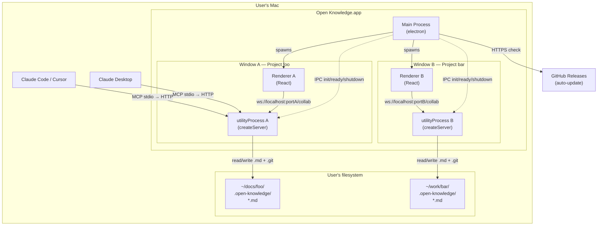
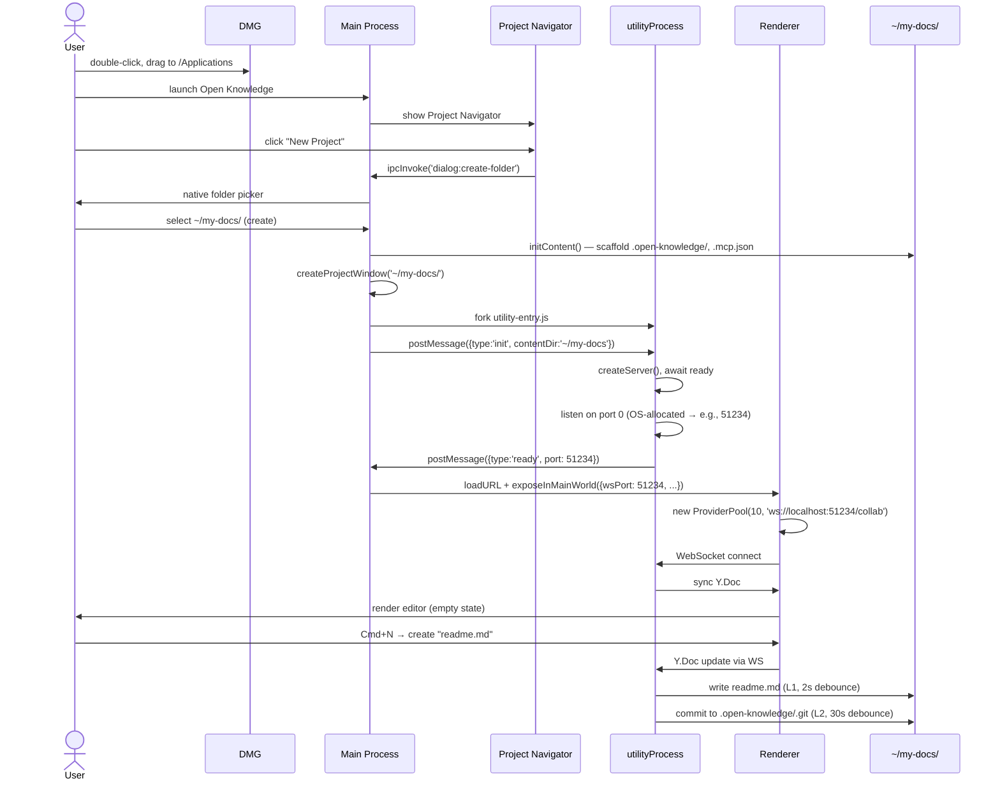
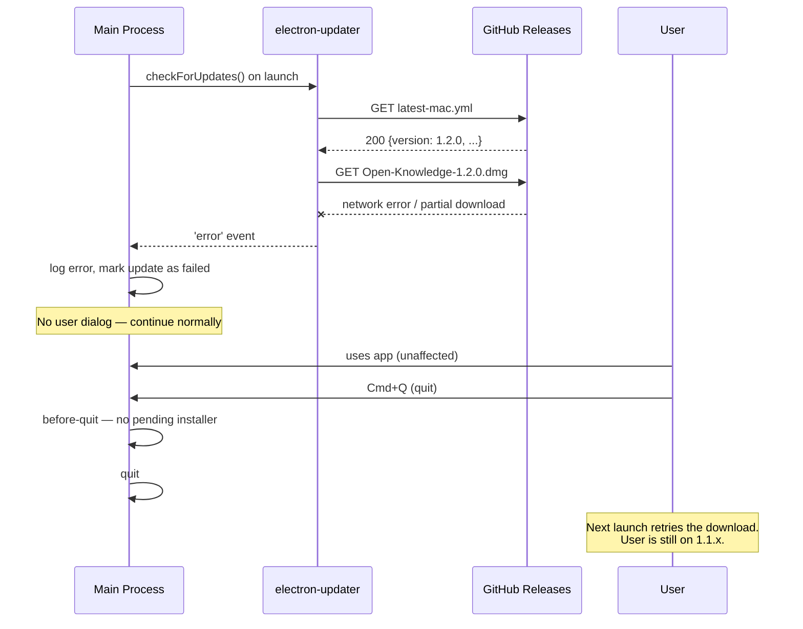

# Electron Desktop App for Open Knowledge — Day-0 Native macOS Distribution

**Status:** Draft (Intake)
**Owner(s):** Nick Gomez
**Last updated:** 2026-04-11
**Baseline commit:** `4884f5f`
**Links:**
- Evidence: [./evidence/](./evidence/)
- Changelog: [./meta/_changelog.md](./meta/_changelog.md)
- Related research:
  - [reports/web-to-macos-desktop-wrapping-2025/REPORT.md](../../reports/web-to-macos-desktop-wrapping-2025/REPORT.md) — framework selection (Electron vs Tauri), 20-app stack inspection
  - [reports/electron-desktop-app-operations-2025/REPORT.md](../../reports/electron-desktop-app-operations-2025/REPORT.md) — operational reference (versioning, signing, updates, CI, security)
  - [reports/oss-licensing-strategies-open-core/REPORT.md](../../reports/oss-licensing-strategies-open-core/REPORT.md) — license strategy
  - [reports/open-core-split-licensing-engineering/REPORT.md](../../reports/open-core-split-licensing-engineering/REPORT.md) — ee/ patterns
- Related specs:
  - [specs/2026-04-08-cli-packaging/SPEC.md](../2026-04-08-cli-packaging/SPEC.md) — current `npx @inkeep/open-knowledge` distribution (NEEDS RECONCILIATION — see Decision D1)
  - [specs/2026-04-10-provider-pool/SPEC.md](../2026-04-10-provider-pool/SPEC.md) — multi-document architecture
  - [specs/2026-04-10-document-list-api/SPEC.md](../2026-04-10-document-list-api/SPEC.md) — `/api/documents` design
  - [specs/2026-04-11-content-config-unification/SPEC.md](../2026-04-11-content-config-unification/SPEC.md) — content config schema
  - [specs/2026-04-11-exclude-gitignored-files/SPEC.md](../2026-04-11-exclude-gitignored-files/SPEC.md) — ContentFilter design
  - [specs/2026-04-11-sidebar-realtime-updates/SPEC.md](../2026-04-11-sidebar-realtime-updates/SPEC.md) — sidebar UX

---

## 1) Problem statement

**Situation:** Open Knowledge is a CRDT-collaborative MDX editor distributed today as `npx @inkeep/open-knowledge` — a Bun-built CLI that wraps a Hocuspocus server, file watcher, git persistence pipeline, and MCP stdio bridge into a `start` command. The "project" model is established: any folder containing a `.open-knowledge/` directory is a project, with content-config-driven document discovery (gitignore-aware via `ContentFilter`), per-project `.mcp.json` integration, and per-project hierarchical YAML config. As of April 11, 2026, multi-file document support has shipped (LRU provider pool, `DocumentContext`, `/api/documents` endpoint, sidebar with real-time updates). The CLI distribution serves developers comfortable with terminals, npx, and per-project bootstrap via `open-knowledge init`.

**Complication:** The `npx @inkeep/open-knowledge` distribution is a non-starter for the day-0 target persona — **documentation authors writing MDX with AI assistance**. These users may or may not code, may not have Node.js installed, are not comfortable in a terminal, and expect "double-click to install" software. Concretely:

- `npx @inkeep/open-knowledge` requires Node.js 22+ pre-installed and terminal comfort
- No Dock icon, no menu bar, no native window — feels like a web app, not a "real tool that owns my documents"
- Users must run `open-knowledge start` before editing — there's no "open the app and write" flow
- MCP server must be manually wired into Claude Desktop / Cursor config files
- Multi-project switching only works via opening multiple terminal sessions with different `cwd`s
- No discoverability of recent projects, no project navigator, no "switch to my other docs" affordance
- Updates require manual `npm update -g`, no auto-update mechanism
- Cannot launch the editor without the user understanding "the server" and "the browser frontend" as separate concepts

The result: OK's architectural advantages (local-first, CRDT, AI agent collaboration via MCP, MDX with custom components, gitignore-aware content filtering) are invisible to anyone who doesn't already know how to use a terminal. The addressable market is currently developers who also write docs — a subset of a subset of the total market for AI-assisted docs authoring tools.

**Resolution:** Distribute Open Knowledge as a **native macOS Electron desktop app on day 0**, alongside the existing `npx @inkeep/open-knowledge` CLI. The desktop app bundles the full stack — Hocuspocus server, `@parcel/watcher`, `simple-git`, MCP stdio bridge — into a drag-and-drop installable signed DMG. A documentation author downloads, drags to Applications, double-clicks, and is editing an MDX document with AI agent collaboration in under a minute. Multi-project support is surfaced via a Project Navigator + multi-window UX (one project per window, click to switch in current window OR Cmd+Click for new window). Each window owns its own `utilityProcess` running its own Hocuspocus instance scoped to one project — zero changes to the existing server architecture, clean isolation, automatic lock-file safety. No cloud services, no account, no centralized backend.

## 2) Goals

- **G1 — Day-0 user can install and start writing in <60 seconds.** Download DMG → drag to Applications → open → first MDX document on screen with AI collaboration ready.
- **G2 — Multi-project workflow that maps to docs author mental model.** User can have multiple OK projects (one per docs set: API reference, user guides, blog) and switch between them or view side-by-side. Each project is a folder, opens in its own window with its own Hocuspocus instance.
- **G3 — Zero terminal contact required for the primary persona.** A documentation author who never opens Terminal.app can install, configure, and use Open Knowledge end-to-end.
- **G4 — MCP integration with Claude Desktop / Cursor / Continue is automatic on first launch.** User does not need to edit JSON config files manually.
- **G5 — Coexists with the existing npm CLI distribution.** Both ship in parallel; the npm CLI remains the developer-facing path. Users can have both installed without conflict (lock files prevent collision on the same project).
- **G6 — Native macOS feel.** Real menu bar, Dock icon, native dialogs, native folder picker, native notifications, install-on-quit auto-update (no "Restart now" nags).
- **G7 — Boring/maintainable architecture.** Reuse existing OK packages unchanged. Each Electron window = one utilityProcess + one Hocuspocus instance scoped to one project. No multi-project Hocuspocus refactor. No cloud services. No account system.
- **G8 — Signed and notarized from day 0.** No "Apple cannot check for malicious software" friction on first launch. Apple Developer Org enrollment + Azure Trusted Signing for Windows when that platform follows.
- **G9 — Local-first everything.** No outgoing network calls in default config except the auto-update check. No telemetry without explicit user opt-in.

## 3) Non-goals

- **[NEVER] NG1: Cloud sync, hosted backend, or account system.** The desktop app is fully local. No "log in to sync across devices." If we ever do that, it's a separate product, not bolted onto this.
- **[NEVER] NG2: Mac App Store distribution.** MAS sandbox is incompatible with `@parcel/watcher` recursive watching, `simple-git` shelling out to `git`, and arbitrary file access. Direct DMG download only.
- **[NEVER] NG3: Telemetry without explicit opt-in.** Following Obsidian's model. No default opt-out.
- **[NOT NOW] NG4: Windows and Linux desktop packaging.** macOS-first for day 0. Windows is the planned next target. Linux is opportunistic. Revisit when macOS is shipped and stable.
- **[NOT NOW] NG5: Multi-user real-time collaboration across devices.** Hocuspocus supports it but the day-0 product is solo-user + AI agent. CRDT collaboration across devices requires a relay server or P2P transport — both are out of scope.
- **[NOT NOW] NG6: Plugin marketplace or third-party extension API.** OK has a custom JSX component schema today; opening that to third parties is a future spec.
- **[NOT NOW] NG7: Publishing-to-web workflows.** OK is for authoring MDX in a folder. Publishing that folder to a docs site (Fumadocs, Mintlify, Docusaurus) is the user's responsibility — OK doesn't need to ship a build/deploy pipeline.
- **[NOT NOW] NG8: Settings UI inside the app.** Day-0 settings live in `~/.open-knowledge/config.yml` and per-project `.open-knowledge/config.yml`. No GUI for editing config until needed.
- **[NOT NOW] NG9: Auto-scan filesystem for existing `.open-knowledge/` projects on first launch.** Empty Project Navigator on first launch, user explicitly opens or creates projects. No surprise scanning.
- **[NOT NOW] NG10: Onboarding wizard / tutorial walkthrough.** First launch goes straight to Project Navigator. Sample document inside a new project is the implicit tutorial.
- **[NOT NOW] NG11: In-app AI agent (built-in LLM client).** OK integrates with the user's existing Claude Desktop / Cursor / Continue via MCP. We don't bundle an LLM client.
- **[NOT UNLESS] NG12: Multi-project-in-one-window (workspace tabs).** If the multi-window pattern proves unwieldy in practice (heavy memory, window management friction), revisit. Day-0 commits to multi-window.
- **[NOT UNLESS] NG13: A separate Hocuspocus process serving multiple projects.** Each window having its own utilityProcess is the boring correct choice. Only consolidate to a shared multi-project server if memory cost becomes a real complaint.
- **[NEVER] NG14: Telemetry, crash reporting, or analytics on day 0.** Per D9 — Obsidian model. Zero Sentry, zero PostHog, zero usage pings. Only outgoing call in default config is the electron-updater GitHub check.
- **[NOT NOW] NG15: Auto-writing user-level AI tool config files (Claude Desktop, Cursor, Continue, Windsurf, Zed).** Per D10. Day-0 MCP scope is project-level `.mcp.json` only (unchanged from `open-knowledge init`). Auto-wiring across popular platforms is a separate workstream. Revisit once that workstream has a concrete scope.

## 4) Personas / consumers

- **P1 — Documentation author writing MDX with AI assistance (PRIMARY):**
  - **Role:** Technical writer, DevRel, developer advocate, docs engineer, solo founder doing their own product docs
  - **Skills:** Comfortable writing markdown/MDX, may or may not code, familiar with git conceptually but prefers GUI tools
  - **Environment:** macOS user, owns Claude Desktop / Cursor / Claude Code (at least one AI tool installed)
  - **Current tools:** Notion, Obsidian, VS Code, generic Markdown editors, Mintlify cloud
  - **Pain:** Cloud tools lose local-first benefits and data ownership; dev tools require terminal comfort; AI collaboration is either cloud-only or DIY
  - **Success:** Can install OK, open a project, write/edit an MDX doc with AI collaboration, save to disk, and maintain that as their source of truth — without ever opening a terminal

- **P2 — Developer using OK as a docs tool (SECONDARY):**
  - **Role:** Software engineer who maintains docs alongside code, uses Claude Code or Cursor for both code and docs work
  - **Environment:** Comfortable with `npx @inkeep/open-knowledge`, may also want the desktop app for visual editing
  - **Current tools:** VS Code/Cursor for code + Markdown, occasionally Obsidian for personal notes
  - **Need:** A docs editor that respects their existing project structure (no opinionated location), handles MDX with components, integrates with their AI tools
  - **Note:** The CLI distribution remains the primary path for this persona. The desktop app is a convenience, not a replacement.

- **P3 — AI coding/writing agent (CONSUMER):**
  - **Role:** Claude Desktop, Cursor, Claude Code, Continue — connecting to OK via MCP
  - **Needs:** Read documents, write documents (with proper agent attribution), undo/redo scoped to the agent, awareness of what the human is editing
  - **Interaction:** MCP stdio server (launched by the agent as a subprocess) connecting to OK's HTTP API on a localhost port, OR direct MCP connection if OK is running

## 5) Constraints

### Locked (from prior research or established OK architecture)

- **Electron 41+** — required for CVE-2025-55305 ASAR integrity fix (Trail of Bits Sept 2025)
- **electron-vite + electron-builder** toolchain — mature, mainstream, compatible with OK's Vite plugin pattern
- **Node.js 22+ in `utilityProcess`** — Hocuspocus runs in a fork of the main process via `utilityProcess.fork()`. ESM not supported in `utilityProcess` entry — server package needs CJS build target ([electron/electron#40031](https://github.com/electron/electron/issues/40031))
- **`@parcel/watcher` native N-API addon** — file watcher must work in packaged builds via `electron-builder install-app-deps` rebuild + `asarUnpack` config
- **AGPL-3.0 license** — Open Knowledge framework license; desktop app inherits
- **GitHub Releases** for distribution and auto-update (free, unlimited bandwidth, native electron-updater provider)
- **Apple Developer Program ($99/yr)** + **Azure Trusted Signing (~$120/yr)** for code signing
- **Install-on-quit auto-update pattern** — Obsidian/Claude Desktop model, not Slack-style "Restart now" nags
- **Opt-in telemetry only** — Obsidian model, default off
- **Project = folder with `.open-knowledge/`** — established model, not redesigned by this spec
- **Content config schema:** `content.dir`, `content.include`, `content.exclude` — established by `2026-04-11-content-config-unification`
- **Multi-document via LRU provider pool** — established by `2026-04-10-provider-pool`
- **ContentFilter respects gitignore + config exclude** — established by `2026-04-11-exclude-gitignored-files`

### Open / inherited from in-flight specs (TBD as worldmodel + spec reading completes)

- Sidebar architecture and how it handles multi-window
- Document switching UX patterns from `2026-04-11-sidebar-realtime-updates`
- Any existing assumptions in the React app about a single Hocuspocus URL

## 6) User journeys

All journeys target **P1 — Documentation author writing MDX with AI assistance** unless noted.

### J1 — First launch (no existing projects)

1. User downloads `Open-Knowledge-x.y.z-arm64.dmg` from the website or a GitHub release.
2. Double-click DMG → drag `Open Knowledge.app` to `/Applications`.
3. First open: Gatekeeper accepts the notarized, signed binary with no "cannot verify developer" dialog.
4. App launches → **Project Navigator window** appears (no editor, no project open).
   - Title: "Open Knowledge"
   - Content: empty state illustration + two primary buttons: **Open Project** and **New Project**
   - Optional: "Recent Projects" section (empty on first run)
5. User clicks **New Project** → native `dialog.showOpenDialog` with `properties: ['openDirectory', 'createDirectory']` → user picks or creates a folder anywhere on disk (e.g., `~/Documents/my-docs`).
6. Main process runs `initContent(path)` (existing `packages/cli/src/content/init.ts` logic) to scaffold `.open-knowledge/`, writes `.mcp.json`, then sends `open-project` IPC to a new BrowserWindow.
7. New BrowserWindow spawns its own `utilityProcess` which runs `createServer({ contentDir, projectDir })`, awaits `ready`, reports the allocated port back to main via IPC.
8. Main forwards port to renderer via preload bridge → renderer constructs `new ProviderPool(10, 'ws://localhost:<port>/collab')` → React app renders FileSidebar + empty-state editor.
9. User creates their first document (Cmd+N or sidebar "+") → writes a paragraph → edit persists to disk within 2s (L1 debounce) and to shadow git within 30s (L2 debounce).

**Success criteria:** From "download starts" to "first word typed into editor" is under 60 seconds on a typical broadband connection, assuming the user has a macOS 12.6+ machine.

### J2 — Returning user (one or more projects in Recent)

1. User clicks Open Knowledge in Dock → app launches.
2. **Decision point (Open Question OQ1):** Does it open the Project Navigator, or auto-open the last project?
   - **Current default assumption:** Open the last-used project in a fresh window. Hold Option/Alt to force Project Navigator.
3. If auto-opened: the window restores with last sidebar state (selected document, scroll position, editor mode).
4. utilityProcess starts, `ready` resolves, renderer connects.

### J3 — Creating a new project from inside the app (already have one open)

1. From menu bar: **File → New Project...** (Cmd+Shift+N)
2. Native folder picker appears (same as J1 step 5).
3. Main scaffolds `.open-knowledge/` at the chosen path.
4. **Decision point (per D3):** A new BrowserWindow opens with the new project. The existing window stays on its existing project. The user now has two windows.

### J4 — Switching between two projects

**Two sub-journeys (per D3):**

**J4a — Click to switch in current window (two-phase drain, per D17+D19):**
1. User opens Project Navigator via **File → Open Recent** or a menu item.
2. User clicks a project row.
3. Main sends `shutdown:begin` event to renderer → renderer calls `pool.flushAllProviders()` (waits for every provider's `hasUnsyncedChanges === 0`, 5s timeout).
4. Renderer calls `shutdown:client-drained` IPC → main receives.
5. Main posts `shutdown` to utilityProcess → utilityProcess runs patched `destroy()` (phases 1–5 per §8.3.1) → flushes L1 markdown writes awaiting `afterUnloadDocument` → flushes L2 git commits → exits.
6. Main spawns new utilityProcess for the target project with the same BrowserWindow → awaits `ready` → gets new port.
7. Main calls `projectWindow.webContents.loadURL(\`http://localhost:${newPort}/\`)` → renderer reloads fresh, ProviderPool reconstructs, React sidebar fetches `/api/documents` from the new server.
8. Window title updates. User sees a brief full-page reload flash (500ms–2s).

**J4b — Cmd+Click for new window:**
1. User opens Project Navigator.
2. User **Cmd+Clicks** a project row.
3. Main spawns new BrowserWindow + new utilityProcess for that project. Existing window untouched.
4. User now has two windows, one per project.

### J5 — P1 + P3 (AI agent) collaboration on a document

1. User opens a project in Open Knowledge → begins editing `articles/foo.md`.
2. Separately, user opens Claude Desktop / Cursor / Claude Code (which already has `open-knowledge` MCP server registered from J1 step 6 or J2).
3. AI tool's MCP client spawns the MCP stdio subprocess, which connects to OK's localhost HTTP API.
4. User asks Claude: "Add a section about authentication."
5. Claude calls MCP `write_document` → MCP bridge POSTs to `http://localhost:<port>/api/agent-write` with origin `agent-claude`.
6. OK's `AgentSessionManager` applies the write via `dc.document.transact(fn, 'agent-claude')` — the write appears in the user's editor with a brief agent-flash animation (defined in `packages/core/src/constants/activity.ts`).
7. User can undo the agent's write scoped to that agent only (via `AgentUndoButton`).
8. Disk persistence and git commit follow the normal L1/L2 debounce flow.

### J6 — Auto-update (install-on-quit)

Model: Obsidian / Claude Desktop. **Not** Slack's "Restart now" nag.

1. At app launch, electron-updater polls GitHub Releases for `latest-mac.yml`.
2. If a newer version is available and the user's bucket is within `stagingPercentage`, downloader starts in background.
3. Download completes → stores the installer in userData/pending.
4. App continues running normally. **No dialog, no nag.**
5. User quits the app (Cmd+Q or File → Quit).
6. On `app.on('before-quit')`, the pending installer is invoked → new version replaces old atomically.
7. Next launch: user is on the new version. Optional "What's new" toast on first launch post-update.

### J7 — Failure modes

- **J7a — Failed update.** Download fails or installer corrupts. electron-updater logs the error; next launch retries. Version stays current. No user-visible breakage. Manual fallback: user can re-download DMG from website.
- **J7b — Project lock collision.** User has the same project open in two windows (or in the app + the CLI). Lock file at `.open-knowledge/.lock` contains the PID of the owning process. Second process detects the lock, presents a dialog: "This project is already open in another window/process. Open anyway? [Cancel] [Open Read-Only]." Read-only mode disables editor writes and file-watcher-driven persistence.
- **J7c — Stale lock from ungraceful crash.** Lock contains a PID that no longer exists. New process detects stale lock (`isProcessAlive(pid)` returns false), overwrites lock, proceeds normally.
- **J7d — Content directory moved/deleted while open.** File watcher reports errors → window shows error state: "Project folder is no longer available. [Close Window] [Choose New Location]."
- **J7e — No AI tool installed.** MCP wiring step in J1 finds no AI tool config files. App shows an info banner in the Project Navigator: "No AI tool detected. Open Knowledge works standalone. [Learn how to add AI]." Editor remains fully functional without AI.
- **J7f — File system permissions.** On Sequoia/Sonoma, user declines Full Disk Access for the chosen folder. App shows: "Open Knowledge needs permission to access this folder. [Open System Settings]."
- **J7g — utilityProcess crash (bounded-loss recovery via provider recycling, per revised D18).** Main process monitors the child via `utilityProcess.on('exit')`. On **unintentional** exit (i.e., without a prior `shutdown` IPC): main distinguishes crash from graceful shutdown via an `intentionalShutdown` flag, sends `utility:crashed` IPC to renderer (which shows a "Reconnecting to project..." banner), waits 250ms for OS port release, then respawns a new utilityProcess with the same `contentDir`. The new server loads markdown from disk → the renderer's `HocuspocusProviderWebsocket` auto-reconnects (exponential backoff via `@lifeomic/attempt`, default `delay=1000`) → **PR #56's provider-pool recycler checks whether the disconnected provider had completed initial sync and has `unsyncedChanges === 0`; if so, it recycles the provider (creates a fresh Y.Doc) so the client picks up clean state from the server's disk-loaded Y.Doc**. The "Reconnecting..." banner auto-dismisses when the fresh provider reaches `synced`. Add crash-loop guard: "max 3 crashes in 60s → escalate to hard fail dialog." **Data-loss budget: bounded by the L1 debounce window** (up to 2-10s of keystrokes that were in the server's Y.Doc but not yet persisted to disk when the utilityProcess died). Client-offline-edit preservation only kicks in when the client had `unsyncedChanges > 0` at the moment of disconnect — in that case PR #56's recycler keeps the existing provider, preserving those edits for the next sync round-trip. **This is a significant correction from earlier session framing** which claimed "zero loss" via commutative CRDT merge — that merge was actually producing whole-document duplication before PR #56.
- **J7h — Native module load failure (packaged build).** If `@parcel/watcher` fails to load (wrong ABI, corrupted asar unpack), the server startup throws during `createServer()` → main process catches → window displays: "Open Knowledge could not start the file watcher. This is likely a build issue. [Send Report] [Close]."

## 7) Current state (how it works today)

Grounded in the worldmodel topology ([evidence/worldmodel-topology.md](./evidence/worldmodel-topology.md)) and in-flight spec summary ([evidence/in-flight-specs-summary.md](./evidence/in-flight-specs-summary.md)).

### 7.1 Distribution (existing)

A user runs `npx @inkeep/open-knowledge` (or `npm i -g @inkeep/open-knowledge && open-knowledge`) from a folder containing a `.open-knowledge/` directory. The CLI entry point is `packages/cli/src/cli.ts`, which parses Commander options, resolves the hierarchical config (CLI flags > env > workspace `.open-knowledge/config.yml` > user `~/.open-knowledge/config.yml` > Zod defaults in `packages/cli/src/config/schema.ts`), and invokes the `start` command.

### 7.2 Server (reusable unchanged)

`packages/cli/src/commands/start.ts` calls `createServer()` from `@inkeep/open-knowledge-server` (`packages/server/src/standalone.ts`). The factory returns a `ServerInstance`:

```typescript
interface ServerInstance {
  hocuspocus: Hocuspocus;
  sessionManager: AgentSessionManager;
  destroy: () => Promise<void>;
  ready: Promise<void>;  // Async init: shadow repo + watcher + HEAD watcher
}
```

Key traits that make the server **Electron-ready without modification**:

- **Pure Node.js.** No DOM, no Vite, no browser-only APIs. Uses `node:http`, `node:fs`, `node:path`, `@parcel/watcher`, `simple-git`.
- **Factory takes everything via options.** `contentDir`, `projectDir`, `port`, `host`, `includePatterns`, `excludePatterns`, `debounce`, `maxDebounce`, `gitEnabled` — no global state, no environment variables read inside the factory.
- **Synchronous create + async ready.** `createServer()` returns immediately with a `ready` promise that resolves once the shadow repo is initialized, the file watcher is running, and the HEAD watcher is running.
- **Graceful shutdown via `destroy()`.** Flushes pending git commits, unsubscribes watchers, closes agent sessions, flushes pending stores, destroys the shadow repo.

The Hocuspocus instance handles `/collab` (WebSocket for Y.js CRDT sync) and the API extension (`packages/server/src/api-extension.ts`) handles `/api/*` HTTP routes: `GET /api/documents`, `POST /api/pages`, `POST /api/agent-write`, `POST /api/agent-undo`, `POST /api/agent-redo`.

Default port is **3000** (Zod default in `packages/cli/src/config/schema.ts:17`), host `localhost`. The CLI's `start.ts` wires `createServer()`'s Hocuspocus + API extension into a single `node:http` server, and serves the React app's static bundle from `packages/app/dist` via `sirv`.

### 7.3 File watcher + ContentFilter (established 2026-04-11)

`packages/server/src/file-watcher.ts` uses `@parcel/watcher` (native N-API addon, cross-platform: kqueue/FSEvents on macOS, inotify on Linux, ReadDirectoryChangesW on Windows) to watch `projectDir`. It:

- Maintains an in-memory file index `Map<docName, FileIndexEntry>` — the **single source of truth** for "what documents exist" (used by `GET /api/documents` and the MCP `list_documents` tool).
- Applies `ContentFilter` (gitignore rules via `ignore` npm package + `content.exclude` globs via `picomatch`) during initial scan and on every event.
- Detects self-writes via content-hash tracker (`registerWrite`/`isSelfWrite`) to prevent feedback loops.
- Emits a typed `DiskEvent` union: `create | update | delete | rename | conflict`.

Gitignore rules are loaded at startup only (no hot-reload — a known limitation from `2026-04-11-exclude-gitignored-files`).

### 7.4 Persistence (established)

`packages/server/src/persistence.ts` is a two-layer debounced auto-save:

- **L1 (CRDT → markdown → disk):** On Hocuspocus `onStoreDocument`, serialize Y.XmlFragment + frontmatter to markdown, write to `.md` file. Debounced 2s / max 10s.
- **L2 (disk → git):** Enqueue shadow-repo commit after disk write. Debounced 30s idle.

Shadow repo at `.open-knowledge/.git` (bare repo, branch `refs/wip/main`) stores version history without touching the user's working git repo. Three-way reconciliation uses a per-branch `reconciledBaseByBranch: Map<branch, Map<docName, markdown>>` as merge base.

### 7.5 React app (existing multi-document client)

`packages/app/src/main.tsx` renders `<App />` which wraps the tree with `<DocumentProvider>` (from `packages/app/src/editor/DocumentContext.tsx`).

**ProviderPool** (`packages/app/src/editor/provider-pool.ts`):

- Module-level LRU singleton (default cap 10) of `HocuspocusProvider` instances.
- Constructor: `new ProviderPool(maxSize, wsUrl?)` where `wsUrl` defaults to `ws://${location.host}/collab` — **inferred from the browser's current origin**, not hardcoded.
- `pool.open(docName)` creates or reuses a provider; never evicts the active document.
- `pool.close(docName)` disconnects and removes.
- Observer cleanup: each `PoolEntry` stores its own `observerCleanup`; eviction disconnects first, then cleans up.

**DocumentContext** exposes `{ activeDocName, activeProvider, syncState, openDocument, closeDocument }` to components. `TiptapEditor` (WYSIWYG) and `SourceEditor` (CodeMirror 6) bind to the active provider's Y.Doc via Collaboration + yCollab extensions. Switching documents forces editor remount (yCollab binding requires it) — there's an accepted brief flash.

`FileSidebar.tsx` polls `GET /api/documents` every 5 seconds (a draft spec `2026-04-11-sidebar-realtime-updates` is in research phase to move to event-driven updates).

**Critical inheritance for desktop spec:** the ProviderPool is per-`<DocumentProvider>`. In a multi-window desktop app, **each window will have its own pool**, independent of others — this is not a regression, it matches the D6 architecture (one utilityProcess + one server + one renderer per window).

### 7.6 Dev mode (existing Vite plugin pattern)

`packages/app/src/server/hocuspocus-plugin.ts` is the Vite plugin that co-locates Hocuspocus in dev mode — resolves config, creates the `ContentFilter`, calls `createServer()`, wires the WebSocket via Vite's HTTP server. This is the proof-of-concept that `createServer()` can run inside an arbitrary Node host — the Electron `utilityProcess` will follow the same pattern.

### 7.7 MCP stdio bridge (existing)

`packages/cli/src/commands/mcp.ts` runs a stdio-based MCP server that Claude Code, Cursor, Continue, etc. spawn as a subprocess. It exposes tools for file discovery, document read, and agent writes. Per-project `.mcp.json` (written by `open-knowledge init`) tells each editor how to launch the MCP server for that project:

```json
{
  "mcpServers": {
    "open-knowledge": {
      "command": "npx",
      "args": ["@inkeep/open-knowledge", "mcp"]
    }
  }
}
```

### 7.8 `.open-knowledge/` directory (the project marker)

```
project-root/
├── .open-knowledge/
│   ├── config.yml              # Workspace config
│   ├── catalogs/               # Mirrored catalog index (gitignored)
│   ├── AGENTS.md
│   ├── INDEX.md
│   └── .git/                   # Shadow repo for version history
├── .mcp.json                   # MCP server entries
├── content/ or . or docs/      # Content directory (per config.content.dir)
│   └── *.md
└── .git/                       # User's own git repo (untouched)
```

### 7.9 What's missing for a desktop-author UX

1. No native window, menu bar, dock icon, or install flow — it's a CLI + browser tab.
2. No Project Navigator or "open recent" affordance — you're always in whatever folder you `cd`'d into.
3. No auto-update — you `npm update -g`.
4. MCP wiring requires hand-editing `claude_desktop_config.json` / `.cursor/mcp.json` / `~/.config/Continue/config.json`.
5. No way to run two projects side-by-side without two terminals.
6. The sidebar + editor tree is designed for a single, stable "this folder" scope — not for project-switching within a single window.

## 8) Proposed solution (vertical slice)

### 8.1 Process model

```
┌─────────────────────────────────────────────────────────────────┐
│  Main Process (Electron)                                        │
│  - BrowserWindow lifecycle (N windows)                          │
│  - Native menu bar, dock, dialogs, notifications                │
│  - Project state (recent projects, last-opened)                 │
│  - electron-updater (install-on-quit)                           │
│  - MCP wiring orchestrator (writes to claude_desktop_config.json│
│    and equivalents, only on explicit first-run prompt)          │
│  - Per-window: spawns + supervises utilityProcess               │
│  - Lock file management                                         │
└───────────────┬─────────────────────────────┬──────────────────┘
                │                             │
                │ IPC (ipcMain/ipcRenderer)   │ utilityProcess.fork
                │                             │ (one per window)
  ┌─────────────▼───────────┐   ┌─────────────▼────────────────┐
  │ Renderer (BrowserWindow)│   │ utilityProcess (Node runtime)│
  │  - React app (existing  │   │  - createServer({contentDir, │
  │    packages/app)        │   │    projectDir, port: 0})     │
  │  - DocumentProvider     │   │    (port 0 = OS-allocated)   │
  │  - ProviderPool         │   │  - Hocuspocus + WebSocket    │
  │  - TiptapEditor,        │   │  - @parcel/watcher           │
  │    SourceEditor,        │   │  - ContentFilter (gitignore) │
  │    FileSidebar          │   │  - simple-git (shadow repo)  │
  │                         │   │  - API extension             │
  │ Connects to             │   │                              │
  │ ws://localhost:<port>   │   │ Returns port via IPC once    │
  │ /collab                 │   │ server.ready resolves        │
  └─────────────────────────┘   └──────────────────────────────┘
```

**One BrowserWindow = one utilityProcess = one server = one project.** Per D6.

### 8.2 Main process responsibilities

- **Window manager.** `createProjectWindow(projectPath)` spawns a BrowserWindow + a utilityProcess for that project path. Tracks the mapping `Map<BrowserWindow, ProjectContext>`.
- **Project Navigator window.** A special BrowserWindow that loads a lightweight React view (could reuse `packages/app` with a `?mode=navigator` query string, or a separate bundle). Shows recent projects + Open/New buttons. This window has no utilityProcess — it does not host a server.
- **Menu bar.** `Menu.setApplicationMenu(...)` with File (New Project, Open Project, Open Recent, Close Window, Quit), Edit (undo/redo/cut/copy/paste/find), View (Toggle Sidebar, Toggle Source/WYSIWYG, Reload), Project (Switch Project, Project Settings), Help (Documentation, Report Issue, Check for Updates).
- **App state persistence.** `app.getPath('userData')/state.json` stores: `{ recentProjects: string[], lastOpenedProject: string | null, windowBounds: Record<projectPath, Rect> }`.
- **Lock file coordinator.** Before opening a project, check `.open-knowledge/.lock`. If stale (dead PID), overwrite. If alive, prompt user (per J7b).
- **electron-updater.** `autoUpdater.setFeedURL({ provider: 'github', ... })` + `checkForUpdates()` on launch + `autoUpdater.on('update-downloaded')` stages the installer for install-on-quit.
- **MCP wiring orchestrator.** On first launch of a new project: detect presence of `~/Library/Application Support/Claude/claude_desktop_config.json`, `~/.cursor/mcp.json`, `~/.config/Continue/config.json`. Prompt user once: "Add Open Knowledge to your AI tools? [Claude Desktop ☑] [Cursor ☑] [Continue ☐] [Skip]". On confirm, merge MCP server entries idempotently (same logic as `open-knowledge init` → `.mcp.json` scaffolding).
- **Crash/restart supervisor.** Listens to `utilityProcess.on('exit')` → on unexpected exit, renders the crash recovery state (J7g).

### 8.3 utilityProcess responsibilities

A new entry point at `packages/desktop/src/utility/server-entry.mjs` that:

1. Receives `{ contentDir, projectDir, debounce, maxDebounce, includePatterns, excludePatterns }` via `process.parentPort.on('message', ...)`.
2. Calls `createServer(...)` from `@inkeep/open-knowledge-server` — imports as ESM (per D13, no CJS adapter needed).
3. Wires Hocuspocus + API extension to a `node:http` server on `port: 0` (OS-allocated ephemeral port). Also mounts `sirv` on `packages/app/dist` so the BrowserWindow can load the React bundle from the same origin (per §8.4's URL-plumbing simplification).
4. Awaits `server.ready`.
5. Sends `{ type: 'ready', port: server.address().port }` back via `parentPort.postMessage(...)`.
6. Listens for `{ type: 'shutdown' }` → calls `serverInstance.destroy()` (which uses the patched sequence below) → calls `process.exit(0)`.

**ESM support (resolved):** Per D13 / OQ-01 / [R1 research](../../reports/electron-41-production-config-for-ok-desktop/REPORT.md) §OQ-01 — `utilityProcess.fork()` has supported ESM entry points since Electron 28.0.0 (Dec 2023). Electron 41 inherits. **No CJS adapter, no dual-format build, no `createRequire` hack.** The existing tsdown ESM build is sufficient.

**Native modules:** `@parcel/watcher` ships prebuilt per-platform binaries via its optional-dependencies layout (`@parcel/watcher-darwin-arm64`, `@parcel/watcher-darwin-x64`, etc.). `electron-builder install-app-deps` rebuilds against Electron's Node ABI. See §8.9 for the complete `asarUnpack` globs (per D16 / OQ-06).

#### 8.3.1 Patched `destroy()` sequence (per D17)

**The current `createServer().destroy()` in `packages/server/src/standalone.ts:399-424` has a data-loss bug and must be replaced** before the desktop app ships. Current bugs:
1. `hocuspocus.flushPendingStores()` is fire-and-forget (returns `void`, not `Promise`) — verified in `@hocuspocus/server/src/Hocuspocus.ts:165-177`.
2. L2 git-commit flush is called BEFORE L1 markdown-write flush — so L2 drains an empty queue and L1 writes land after L2 completes.

**New `destroy()` sequence:**

```typescript
// Add this helper inside createServer() scope:
async function flushAllStoresAndWait(): Promise<void> {
  const docNames = Array.from(hocuspocus.documents.keys());
  if (docNames.length === 0) return;

  // One-shot afterUnloadDocument hook resolves the promise when all docs drain
  const allDone = new Promise<void>((resolve) => {
    hocuspocus.configuration.extensions.push({
      async afterUnloadDocument({ instance }) {
        if (instance.getDocumentsCount() === 0) resolve();
      },
    });
    if (hocuspocus.getDocumentsCount() === 0) resolve();  // race guard
  });

  hocuspocus.closeConnections();      // force-close clients so docs can unload
  hocuspocus.flushPendingStores();    // trigger the debouncer.executeNow chain

  await Promise.race([
    allDone,
    new Promise<void>((_, reject) =>
      setTimeout(() => reject(new Error('flushAllStoresAndWait timeout')), 10_000),
    ),
  ]).catch((err) => console.error('[shutdown] flush timed out:', err));
}

async function destroy(): Promise<void> {
  await ready.catch(() => {});

  // Phase 1: stop watchers first — prevents disk-write events from triggering
  //          reconciliation loops during the drain
  if (headWatcher) { await headWatcher.unsubscribe(); headWatcher = null; }
  if (watcher)     { await watcher.unsubscribe();     watcher = null; }

  // Phase 2: drain agent sessions (DirectConnections hold docs open)
  await sessionManager.closeAll();

  // Phase 3: drain L1 (CRDT → markdown → disk) — await via afterUnloadDocument hook
  await flushAllStoresAndWait();

  // Phase 4: drain L2 (disk → git) — only meaningful AFTER L1 has run
  await persistence.flushPendingGitCommit();
  await persistence.waitForPendingCommits();

  // Phase 5: release shadow repo writer lock
  if (shadowRef.current) destroyShadowRepo(shadowRef.current);
}
```

**Why the order matters:** Watchers must stop BEFORE L1 drains, because L1 writes markdown to disk and the watcher would observe those writes as external events, triggering the three-way merge path. L1 must run BEFORE L2, because `persistence.onStoreDocument` is what schedules the L2 timer (the L2 drain has nothing to do if L1 hasn't run).

**The 10-second timeout** defends against `onStoreDocument` throwing during destroy (Hocuspocus leaves docs in memory on store failure per `Hocuspocus.ts:486-490` — the promise would never resolve without a timeout). If the timeout fires, the shutdown continues but logs a warning; the user will see the editor close and some recent work may be lost — worth a UX flow (rescue buffer dump?) but out of scope for day 0.

### 8.4 Renderer responsibilities

**Zero changes to the React app's core rendering, and no URL plumbing via preload bridge.** Key finding from `A4` verification: every production `fetch()` call in `packages/app/src` uses a **relative URL** (`/api/documents`, `/api/pages`, `/api/agent-undo`, `/api/agent-redo`, `/api/agent-undo-status`, `/api/create-page`) — resolved against `location.origin`. The `ProviderPool` default WS URL is also `ws://${location.host}/collab`.

**Consequence:** If the utilityProcess's HTTP server also **serves the React bundle from `packages/app/dist`** (exactly as the existing CLI `start` command does via `sirv` at `packages/cli/src/commands/start.ts:77–120`), the BrowserWindow can simply load `http://localhost:<port>/` and **all URLs resolve naturally**. No URL rewriting. No port injection. No preload-based base-URL plumbing. The renderer doesn't need to know it's in Electron for URL purposes.

**BrowserWindow load:**
```typescript
const projectWindow = new BrowserWindow({
  width: 1200, height: 800,
  webPreferences: {
    contextIsolation: true,
    nodeIntegration: false,
    preload: path.join(__dirname, 'preload.js'),
    sandbox: true,  // Electron 41 default
  },
});
projectWindow.loadURL(`http://localhost:${wsPort}/`);
```

**Preload bridge** (`packages/desktop/src/preload/index.ts`): limited to **project metadata and main-process IPC invocations**, not URL plumbing.

```typescript
contextBridge.exposeInMainWorld('okDesktop', {
  // Metadata for UI chrome (window title, navigator links)
  projectPath: string,
  projectName: string,
  isDesktop: true,

  // Main→Renderer events
  onProjectSwitching: (cb) => ipcRenderer.on('project:switching', cb),
  onProjectSwitched:  (cb) => ipcRenderer.on('project:switched',  cb),
  onMenuAction:       (cb) => ipcRenderer.on('menu:action',       cb),

  // Renderer→Main requests
  openFolderDialog:   () => ipcRenderer.invoke('dialog:open-folder'),
  createFolderDialog: () => ipcRenderer.invoke('dialog:create-folder'),
  listRecentProjects: () => ipcRenderer.invoke('project:list-recent'),
  openProject:        (path, target) => ipcRenderer.invoke('project:open', { path, target }),
  closeProject:       () => ipcRenderer.invoke('project:close'),
});
```

**Web version untouched.** `window.okDesktop === undefined` in the web build; conditional UI chrome (project title, Recent Projects menu) gated on that check. Same React bundle serves both. The only `isDesktop`-gated changes are **UI affordances**, not networking — which means the desktop vs web behavioral divergence is minimal.

**Server-serving-bundle responsibility:** Extract the `sirv` + `packages/app/dist` wiring from `packages/cli/src/commands/start.ts` into a reusable helper inside `packages/server/src/standalone.ts` (or a new small module). Both the CLI and the desktop utilityProcess will call it. This is a **small additive refactor** to the CLI start command, not a restructure.

**Project-switch flow (J4a):** Use `projectWindow.loadURL(newUrl)` — the renderer reloads fresh against the new port's server, and its prior Y.Doc state is gone (which is correct, because we explicitly drained it before teardown). Full reload flash during switch-in-place is accepted.

#### 8.4.1 Client-side drain barrier — `ProviderPool.flushAllProviders()` (per D19)

**Required to prevent client-buffered Y.Doc state loss during project switch.** Server-side `flushAllStoresAndWait()` (§8.3.1) only persists what the server's Y.Doc *already has* — updates still buffered on the client (e.g., keystrokes from the last 16ms before the shutdown IPC arrived) would be lost without a client-side barrier.

Add the following method to `packages/app/src/editor/provider-pool.ts`:

```typescript
async flushAllProviders(timeoutMs = 5000): Promise<void> {
  const providers = Array.from(this.entries.values()).map((e) => e.provider);
  if (providers.length === 0) return;

  // Force a sync round-trip on every provider
  for (const provider of providers) {
    provider.forceSync();
  }

  // Wait for all providers to report no unsynced changes (server ACK'd every update)
  const allSettled = providers.map((provider) => new Promise<void>((resolve) => {
    if (!provider.hasUnsyncedChanges) { resolve(); return; }
    const onChange = ({ number }: { number: number }) => {
      if (number === 0) {
        provider.off('unsyncedChanges', onChange);
        resolve();
      }
    };
    provider.on('unsyncedChanges', onChange);
  }));

  await Promise.race([
    Promise.all(allSettled),
    new Promise<void>((_, reject) =>
      setTimeout(() => reject(new Error('flushAllProviders timeout')), timeoutMs),
    ),
  ]).catch((err) => {
    console.warn('[pool] flushAllProviders timed out:', err);
  });
}
```

**Semantics:** `hasUnsyncedChanges === false` means every client update has been ACK'd by the server (`SyncStatus(true)` received, per `@hocuspocus/provider/src/MessageReceiver.ts:93-97`). That moment is the safe barrier — the server now owns the state, and server-side L1 flush can persist it.

**Two-phase shutdown choreography (§8.5):** Main sends `shutdown:begin` → renderer calls `pool.flushAllProviders()` → renderer returns via `shutdown:client-drained` IPC → main posts `shutdown` to utilityProcess → utilityProcess runs the patched `destroy()` → exits.

### 8.5 IPC channel inventory

**Main ↔ utilityProcess** (via `process.parentPort` / `utilityProcess.postMessage`)

| Direction | Message | Payload | Purpose |
|-----------|---------|---------|---------|
| Main → Util | `init` | ServerOptions | Start server |
| Util → Main | `ready` | `{ port }` | Server is listening (after `server.ready` resolves) |
| Util → Main | `error` | `{ message, stack }` | Startup or runtime failure |
| Main → Util | `shutdown` | — | Graceful stop — utility calls patched `destroy()` then `process.exit(0)` |
| Util → Main | `sidebar-update` | `{ fileIndex }` | (optional) File watcher push — only if we decide to bypass polling for desktop |

**Main ↔ Renderer** (via `ipcMain.handle` + `ipcRenderer.invoke` for requests; `webContents.send` + `ipcRenderer.on` for events)

| Direction | Channel | Payload | Purpose |
|-----------|---------|---------|---------|
| R → M (invoke) | `dialog:open-folder` | — | Native folder picker, returns `string \| null` |
| R → M (invoke) | `dialog:create-folder` | — | Native picker with `createDirectory: true` |
| R → M (invoke) | `project:get-info` | — | Returns `{ projectPath, projectName, wsPort }` |
| R → M (invoke) | `project:list-recent` | — | Recent projects from app state |
| R → M (invoke) | `project:open` | `{ path, target: 'current' \| 'new-window' }` | Switch in current or open new window |
| R → M (invoke) | `project:close` | — | Close current project window |
| M → R (event) | `project:switching` | `{ projectPath }` | Show loading state |
| M → R (event) | `project:switched` | `{ projectPath, wsPort }` | Reinit ProviderPool with new port |
| M → R (event) | `menu:action` | `{ action: 'new-doc' \| 'toggle-sidebar' \| ... }` | Menu bar → renderer commands |
| M → R (event) | `shutdown:begin` | — | Renderer must call `pool.flushAllProviders()` before shutdown proceeds (per §8.4.1 + D19) |
| R → M (invoke) | `shutdown:client-drained` | — | Renderer signals that all Y.Doc state is ACK'd by server; main can proceed with utilityProcess teardown |
| M → R (event) | `utility:crashed` | `{ code, signal }` | utilityProcess exited unexpectedly; renderer shows "Reconnecting to project..." banner (dismissed automatically when provider reaches `synced` state after respawn — per D18) |

### 8.6 Project Navigator window

A distinct BrowserWindow (title: "Open Knowledge — Projects") loaded at app launch when no project is auto-opened.

**Layout:**
```
┌──────────────────────────────────────────┐
│  Open Knowledge                          │
├──────────────────────────────────────────┤
│                                          │
│     [Open Project]   [New Project]       │
│                                          │
│  Recent                                  │
│  ─────                                   │
│  📁 my-docs           ~/Documents/docs   │
│  📁 api-reference     ~/work/api-ref     │
│  📁 blog              ~/blog             │
│                                          │
│  (Click to open in this window,          │
│   ⌘-Click to open in a new window)       │
│                                          │
└──────────────────────────────────────────┘
```

- **Click a row** → main closes this window + opens the chosen project in this same window (replaces Navigator with Editor).
- **Cmd+Click** → main spawns a new BrowserWindow with the chosen project. Navigator stays open.
- **Open Project** button → native folder picker → if folder has no `.open-knowledge/`, prompt: "This folder isn't an Open Knowledge project. Initialize it? [Cancel] [Initialize]." On confirm, run `initContent(path)` and open.
- **New Project** button → native folder picker with `createDirectory: true` → `initContent(path)` → open in current window.

### 8.7 Multi-window lifecycle

- **App launch:** electron-updater check → restore state → if `lastOpenedProject` and **not** Option-held → open project window directly. Else → open Project Navigator.
- **User opens second project (J3/J4b):** new BrowserWindow + new utilityProcess.
- **User closes last window:** macOS convention — app stays running (dock icon visible). Click dock icon → reopen Project Navigator.
- **User quits app (Cmd+Q):**
  1. `app.on('before-quit')` fires.
  2. For each open project window: send `shutdown` IPC → utilityProcess flushes git commits + unsubscribes watchers → exits.
  3. Flush window state to `state.json`.
  4. electron-updater runs pending installer (if staged).
  5. Actually quit.

### 8.8 Lock file model

Per project, at `<projectPath>/.open-knowledge/.lock`:

```json
{
  "pid": 12345,
  "host": "hostname",
  "startedAt": "2026-04-11T14:30:00Z",
  "owner": "desktop|cli",
  "wsPort": 51234
}
```

**Protocol:**
1. Before spawning utilityProcess, main reads `.lock`. If missing, proceed.
2. If present, check `isProcessAlive(pid)` (via `process.kill(pid, 0)` in main).
3. Alive → present J7b dialog; dead → overwrite + proceed.
4. Lock written synchronously before `server.ready` resolves.
5. On graceful shutdown (`utilityProcess` receives `shutdown`), delete `.lock` before exit.
6. On crash, lock is stale; next launch cleans it up via step 3.

**Interop with CLI:** The existing `open-knowledge start` CLI must also write and respect this lock. This is a **small additive change** to `packages/cli/src/commands/start.ts` (not a blocker — can ship in parallel).

### 8.9 electron-builder configuration

**Locked by D14 (min macOS), D15 (entitlements), D16 (asarUnpack), all primary-source-verified in [R1 research](../../reports/electron-41-production-config-for-ok-desktop/REPORT.md).**

```yaml
# electron-builder.yml
appId: com.inkeep.open-knowledge
productName: Open Knowledge
directories:
  output: dist-desktop
files:
  - "packages/desktop/dist/**/*"
  - "packages/app/dist/**/*"         # React bundle (built separately)
  - "packages/server/dist/**/*"      # Server (Bun/tsdown ESM output)
  - "!**/*.map"

# D16 — explicit asarUnpack globs for @parcel/watcher (per-platform optional deps)
# plus defense-in-depth catch-all for any future .node binary.
# The leading **/ is critical for Bun's nested .bun/ symlink layout.
asarUnpack:
  - "**/node_modules/@parcel/watcher/**"
  - "**/node_modules/@parcel/watcher-darwin-x64/**"
  - "**/node_modules/@parcel/watcher-darwin-arm64/**"
  - "**/node_modules/@parcel/watcher-*/**"
  - "**/*.node"

mac:
  category: public.app-category.productivity
  minimumSystemVersion: "12.0"       # D14 — macOS 12 Monterey minimum (Electron 41 floor)
  target:
    - target: dmg
      arch: [arm64, x64]             # Universal vs split still OQ-03
  hardenedRuntime: true
  gatekeeperAssess: false             # notarization provides the trust gate
  entitlements: build/entitlements.mac.plist
  entitlementsInherit: build/entitlements.mac.plist  # critical — apply to helper binaries
  notarize:
    teamId: <APPLE_TEAM_ID>
afterSign: scripts/notarize.js

publish:
  provider: github
  owner: inkeep
  repo: open-knowledge
```

**`build/entitlements.mac.plist`** (per D15 — identical to electron-builder's default template):

```xml
<?xml version="1.0" encoding="UTF-8"?>
<!DOCTYPE plist PUBLIC "-//Apple//DTD PLIST 1.0//EN" "http://www.apple.com/DTDs/PropertyList-1.0.dtd">
<plist version="1.0">
<dict>
  <!-- V8 JIT requires writable+executable memory pages -->
  <key>com.apple.security.cs.allow-jit</key>
  <true/>

  <!-- V8 writes JIT code via mmap; required alongside allow-jit -->
  <key>com.apple.security.cs.allow-unsigned-executable-memory</key>
  <true/>

  <!-- REQUIRED: dlopen @parcel/watcher's watcher.node under hardened runtime -->
  <!-- Without this, the utilityProcess crashes immediately with ERR_DLOPEN_FAILED -->
  <!-- because watcher.node has a different Team ID than the host process.       -->
  <key>com.apple.security.cs.disable-library-validation</key>
  <true/>
</dict>
</plist>
```

**NOT set** (per D15 reasoning):
- `com.apple.security.app-sandbox` — we don't target Mac App Store (NG2), no sandbox.
- `com.apple.security.files.user-selected.read-write` — sandbox-only entitlement, irrelevant.
- Network entitlements — unsandboxed apps have full localhost access by default.

**Build-time verification step in CI** (catches regressions):

```bash
# Assert @parcel/watcher's .node files are in app.asar.unpacked, not in app.asar
npx asar list "dist-desktop/mac-arm64/Open Knowledge.app/Contents/Resources/app.asar" \
  | grep -c '\.node$' \
  | grep -q '^0$' || { echo 'FAIL: .node files found inside asar'; exit 1; }

find "dist-desktop/mac-arm64/Open Knowledge.app/Contents/Resources/app.asar.unpacked" \
  -name 'watcher.node' | head -n 1 | read _ || { echo 'FAIL: watcher.node missing'; exit 1; }

# Assert entitlements are inherited by the Utility Helper (where the server runs)
codesign -d --entitlements - \
  "dist-desktop/mac-arm64/Open Knowledge.app/Contents/Frameworks/Open Knowledge Helper (Plugin).app" \
  | grep -q 'disable-library-validation' || { echo 'FAIL: entitlement not inherited'; exit 1; }
```

### 8.10 electron-updater configuration

```typescript
import { autoUpdater } from 'electron-updater';

autoUpdater.autoDownload = true;
autoUpdater.autoInstallOnAppQuit = true;     // Install-on-quit (D-critical)
autoUpdater.channel = 'latest';               // or 'beta' for beta channel
autoUpdater.on('update-downloaded', () => {
  // Silent — no dialog, no nag. Installs on next quit.
});
```

**Staged rollouts** via `latest-mac.yml`'s `stagingPercentage` field (written by a post-release script): 10% → 25% → 50% → 100% over 24–48h. Unhealthy releases paused by flipping percentage to 0% — users on old version stay on old version.

### 8.11 MCP integration on first launch

On first project creation (J1 step 6), the main process runs `runInit(projectPath)` from `packages/cli/src/commands/init.ts` — the existing, already-tested logic that writes `.open-knowledge/` + project-level `.mcp.json`.

**Per D10, day-0 scope stops here.** The desktop shell does **not** touch user-level config files (`~/Library/Application Support/Claude/claude_desktop_config.json`, Cursor, Continue, Windsurf, Zed). Users of those tools continue to wire OK manually. Auto-wiring across popular platforms is a **separate workstream** (NG15); when that workstream ships, the desktop shell can pick up its logic as a drop-in call.

**First-launch UX impact:** On a fresh install with no existing user-level AI tool config that points at OK, the user will not get AI collaboration until they hand-wire their AI tool once. This is an accepted trade-off for day 0 — the workstream to automate it is tracked separately.

### 8.12 CLI shim install (optional)

Menu item: **File → Install Command Line Tool...**

On click, main process:
1. Prompts for `sudo` via `dialog.showMessageBox` + `child_process.exec` (`osascript -e 'do shell script "..." with administrator privileges'`).
2. Creates a symlink at `/usr/local/bin/ok` → pointing to a shim script bundled in the app that runs the CLI entry point from the bundled server package.
3. Reports success/failure.

**Naming:** `ok` for the desktop-launched shim, `open-knowledge` for the npm-installed CLI. They can coexist.

### 8.13 Rejected architectural alternative (for completeness)

**Shared utilityProcess serving multiple projects via IPC relay.** All windows would share a single `utilityProcess` hosting a multi-project-aware Hocuspocus + single `ProviderPool`, with IPC relaying messages between windows.

**Why rejected (per D6, NG13):**
- Requires refactoring the server to be multi-tenant (contentDir no longer a startup constant).
- Requires refactoring `ProviderPool` to be cross-window (IPC-based eviction, cross-window observer cleanup).
- Eliminates the isolation benefit — a crash in one project takes down all windows.
- File watcher semantics get complicated (multiple `@parcel/watcher` instances at different paths in one process vs one recursive watcher).
- The only win is memory (one Node process instead of N). Modern Electron apps already spend ~200MB baseline; a second utilityProcess adds ~60–80MB. Acceptable for day 0.

**Trigger to revisit (per NG13):** Users report >3 windows routinely consuming >1GB, or window-launch latency exceeds 2s consistently.

### 8.14 System context diagram



### 8.15 Sequence: first launch → first edit (happy path)



### 8.16 Sequence: failed update recovery (J7a)



## 9) Risks / unknowns

**TBD — first pass (will be expanded during iterative loop):**

- ~~**R1 — ESM in `utilityProcess` blocked.**~~ **RESOLVED per D13 / OQ-01 (R1 research).** Electron shipped ESM utilityProcess entry points in 28.0.0 (Dec 2023). Electron 41 inherits. The existing ESM server package can be forked as-is — no CJS adapter.
- **R1-a (new) — Current `createServer().destroy()` has a data-loss bug.** `packages/server/src/standalone.ts:399-424` calls `hocuspocus.flushPendingStores()` without awaiting it (the method is fire-and-forget, returns void — verified by source reading per D17), and calls the L2 git commit flush BEFORE the L1 markdown flush (reverse order). Up to 2s of L1 markdown writes are lost on every graceful shutdown. **This is a pre-existing bug in CLI shutdown, not a new desktop concern.** Must be fixed before shipping desktop because project switching and window close trigger it often. Fix is mechanically small (see D17 + §8.3). Needs a dedicated test that simulates rapid typing → shutdown → re-open and asserts no lost characters.
- **R2 — Native module rebuild on Electron upgrade.** Every Electron major bump (every 8 weeks) requires `@parcel/watcher` to be rebuilt against the new Node ABI. Risk of silent breakage if CI isn't gating on packaged-app smoke test.
- **R3 — Switch-in-current-window state management.** Tearing down the current utilityProcess + spawning a new one + reconnecting the renderer is a multi-step async dance with multiple failure modes. Will need careful testing.
- **R4 — MCP integration writes to user's other apps' config files.** Modifying `~/Library/Application Support/Claude/claude_desktop_config.json` or Cursor's MCP config without explicit permission may surprise users. Need a UX moment for this.
- **R5 — Lock file recovery from stale locks.** If the desktop app crashes ungracefully, the project's lock file will be stale. Stale-lock detection (`isProcessAlive(pid)`) needs to be reliable.
- **R6 — Coexistence with the npm CLI distribution.** A user with both installed could collide on the same project. Lock file is the primary defense; need to verify the lock is respected by both distributions.
- **R7 — First-launch MCP wiring requires the user to have Claude Desktop / Cursor installed.** What if neither is installed? Need a graceful fallback (OK still works as a plain editor; show a help link for "Install Claude Desktop").
- **R8 — Signed but not notarized installer is treated worse than fully unsigned by macOS Sequoia.** Notarization is mandatory from day 0, not optional.
- **R9 — Apple Developer Org enrollment requires D-U-N-S Number, 1-6 week wait.** This is a real path-blocker if not started early.
- **R10 — Native module load failures only surface in packaged builds.** Need a packaged-app smoke test in CI before every release.
- **R11 — DMG size bloat.** A typical Electron app ships 140–180MB unpacked. Bundling `@parcel/watcher` prebuilds for arm64 + x64, the React bundle, server package, and Electron itself could push us to ~200MB per-arch. If we ship universal binary, ~300–380MB. G1 (<60s install) assumes ≤150MB; if we go higher, we miss G1 on slower connections. Measure in a spike.
- **R12 — macOS TCC (Files and Folders) prompts on protected directories.** If a user picks `~/Desktop`, `~/Documents`, or `~/Downloads` as a project folder on Sequoia, macOS prompts the user to grant access. First-time prompt can be confusing for P1. Document the expected UX in §6 (tied to OQ-13/J7f).
- **R13 — Apple Developer enrollment D-U-N-S delay (1–6 weeks).** R9 restated: this is a **real path-blocker** for G8 (signed day 0). Must be started well before any notarized build attempt. If enrollment isn't complete by target launch, the only alternatives are (a) delay launch, (b) ship as unsigned with a "right-click → Open" workaround (broken on Sequoia — not viable), (c) ship via self-hosted signing and notarize later (not viable — notarization is required).
- **R14 — Rolling Electron upgrade cadence.** Electron ships every 8 weeks. Each upgrade requires: native module rebuild, packaged-app smoke test, regression pass on IPC channels, entitlements audit for new APIs. If we skip an upgrade, security patch window opens. If we upgrade every release, engineering overhead accumulates. Cadence TBD in ops playbook.

## 10) Decision Log

| ID | Status | Type | Description | Resolution | Confidence | Reversibility |
|----|--------|------|-------------|------------|------------|---------------|
| D1 | LOCKED | Cross-cutting | Reconcile `cli-packaging` spec's "NEVER GUI/Electron packaging" non-goal. The original decision was a phasing call ("ship CLI first"), not a permanent rejection. The cli-packaging spec's NG should be reclassified from `[NEVER]` to `[NOT NOW]` (now flipping) with a back-reference to this spec. | Update `cli-packaging/SPEC.md` non-goals at finalization. | HIGH | Reversible (just an artifact correction) |
| D2 | LOCKED | Product | Persona is documentation author writing MDX with AI assistance (Persona D from intake), not "all developers" or "all docs authors" or "all knowledge workers." | Persona P1 in §4 is the design target. P2 (developers) and P3 (AI agents) are secondary consumers. | HIGH | 1-way door for marketing/positioning |
| D3 | LOCKED | Product | Multi-window project model with Project Navigator. Each window = one project = one utilityProcess + one Hocuspocus instance. Click to switch in current window, Cmd+Click for new window. | Architecture diagram in §8 will reflect this. | HIGH | 1-way door for UX model; Architecture is reversible if memory cost forces consolidation |
| D4 | LOCKED | Product | First-launch UX shows empty Project Navigator with "Open Project" / "New Project" buttons. No auto-scan for existing `.open-knowledge/` folders. | NG9 reflects this. | HIGH | Reversible |
| D5 | LOCKED | Product | "New Project" uses native macOS folder picker with `createDirectory: true` — user picks/creates the location anywhere on disk. No auto-default to `~/Documents/Open Knowledge/`. | Implementation in §8. | HIGH | Reversible |
| D6 | LOCKED | Technical | Each Electron window owns its own `utilityProcess` running its own `createServer()` instance scoped to one project. No shared multi-project Hocuspocus server. | NG13 explicitly defers consolidation. | HIGH | Architectural; reversible only by consolidation refactor |
| D7 | LOCKED | Technical | macOS-first for day 0. Windows and Linux deferred to NG4 (NOT NOW). | NG4 reflects this. | HIGH | Reversible — additive |
| D8 | LOCKED | Technical | Skip Mac App Store distribution. Direct DMG only. | NG2 reflects this (NEVER — sandbox incompatible). | HIGH | 1-way door (sandbox limitations are not going to change) |
| D9 | LOCKED | Technical | **Zero telemetry, zero Sentry on day 0 (Obsidian model).** No crash reporting, no analytics, no usage metrics in the default binary. Only outgoing network call is the electron-updater check against GitHub Releases. Add opt-in telemetry only if a compelling diagnostic need emerges later. | G9 unchanged. Resolves OQ-15. | HIGH | 1-way door for brand trust — users hate telemetry retrofits. Easier to add opt-in later than to take it away. |
| D10 | LOCKED | Product | **Day-0 MCP wiring = project-level `.mcp.json` only** (same as `open-knowledge init` today). No touching of `claude_desktop_config.json`, Cursor, Continue, Windsurf, or Zed user-level configs in the desktop shell. Auto-wiring across popular platforms is a separate workstream. | Resolves OQ-12 and OQ-13; adds NG15 (below). | HIGH | Reversible — we can ship user-level auto-wiring later as the separate workstream lands. |
| D11 | LOCKED | Product | **Auto-open last project on launch; hold Option/Alt to force Project Navigator.** First launch (no last project) shows Navigator. | Resolves OQ-07; §6 J2 already reflects this. | HIGH | Reversible — can flip default later without architectural change. |
| D12 | LOCKED | Cross-cutting | **CLI must respect the desktop lock file on day 0.** `packages/cli/src/commands/start.ts` gets additive lock-check + lock-write before `createServer()`. Both distributions interoperate cleanly from day one. The `cli-packaging` spec's scope grows to include this change. | Resolves OQ-17. Touches [specs/2026-04-08-cli-packaging/SPEC.md](../2026-04-08-cli-packaging/SPEC.md). | HIGH | Architectural — reversible only by undoing lock protocol. |
| D13 | LOCKED | Technical | **ESM in utilityProcess.fork() is supported — no CJS adapter needed.** Electron shipped ESM utilityProcess entry points in 28.0.0 (Dec 2023). Electron 41 inherits this. The existing `createServer()` ESM module can be forked as-is; a thin `server-entry.mjs` wrapper in `packages/desktop/src/utility/` calls it. | Resolves OQ-01. Remove R1's severity. Reference: [reports/electron-41-production-config-for-ok-desktop/REPORT.md](../../reports/electron-41-production-config-for-ok-desktop/REPORT.md) §OQ-01. | **HIGH — primary-source verified** | 1-way door for build pipeline (no dual-format build step) |
| D14 | LOCKED | Technical | **Minimum macOS version: 12 Monterey.** Electron 38+ (Sep 2025) dropped Big Sur support due to Chromium 140 dropping macOS 11. Electron 41 inherits. Docs-author persona is skewed to recent hardware; CLI distribution via `npx @inkeep/open-knowledge` remains the fallback for pre-Monterey users. | Resolves OQ-02. Reference: [reports/electron-41-production-config-for-ok-desktop/REPORT.md](../../reports/electron-41-production-config-for-ok-desktop/REPORT.md) §OQ-02. | **HIGH — primary-source verified** | 1-way door for supported-platform set. |
| D15 | LOCKED | Technical | **Entitlements: `allow-jit`, `allow-unsigned-executable-memory`, `disable-library-validation` — exactly matching electron-builder's default template.** `disable-library-validation` is mandatory for dlopen of `@parcel/watcher`'s prebuilt `watcher.node` (Team ID mismatch under hardened runtime). No narrower alternative exists. Commit `build/entitlements.mac.plist` explicitly; set `entitlementsInherit` in electron-builder config so every helper binary (including the Utility Helper) inherits the plist. | Resolves OQ-05. §8.9 updated. Reference: [reports/electron-41-production-config-for-ok-desktop/REPORT.md](../../reports/electron-41-production-config-for-ok-desktop/REPORT.md) §OQ-05. | **HIGH — primary-source verified** | 1-way door — this is the bare minimum for a hardened-runtime app with native modules. |
| D16 | LOCKED | Technical | **`asarUnpack` = 5 explicit globs** scoped to `@parcel/watcher` + its per-platform packages + `**/*.node` defense-in-depth. Auto-detection is unreliable for Bun's symlink layout. `@parcel/watcher` is the only runtime native dep in the server package; no other unpacking needed. | Resolves OQ-06. §8.9 updated. Reference: [reports/electron-41-production-config-for-ok-desktop/REPORT.md](../../reports/electron-41-production-config-for-ok-desktop/REPORT.md) §OQ-06. | **HIGH — primary-source verified** | Reversible — easy to add more globs if new native deps land. |
| D17 | LOCKED | Technical | **Patch `createServer().destroy()` in `packages/server/src/standalone.ts:399-424` before shipping the desktop app.** The current destroy() has a data-loss bug: `flushPendingStores()` is fire-and-forget (returns void, not Promise) and is called AFTER `flushPendingGitCommit()` — up to 2s of L1 markdown writes are lost on every shutdown. Fix: implement `flushAllStoresAndWait()` helper using a one-shot `afterUnloadDocument` hook, reorder destroy() to run L1 drain before L2 drain. Patch-level surgery, not a redesign. **This is a pre-existing bug, not a new desktop concern — it would bite CLI users on SIGINT too. The desktop spec work surfaced it.** | Resolves OQ-08. §8.3 updated with concrete teardown code. Reference: [reports/hocuspocus-flush-and-reconnect-semantics/REPORT.md](../../reports/hocuspocus-flush-and-reconnect-semantics/REPORT.md) §OQ-08. | **HIGH — primary-source verified + bug confirmed in source** | 1-way door for data-loss fix; required before desktop launch. |
| D18 | **REVISED 2026-04-11** | Technical | **utilityProcess crash recovery requires client-side provider recycling — the y-protocols "lossless merge" model is wrong in practice.** The original R2-driven framing claimed SyncStep1/SyncStep2 handshake on reconnect was commutative + lossless. **PR [#56](https://github.com/inkeep/open-knowledge/pull/56) ("Prevent whole-document duplication after server restart", mike-inkeep) invalidates that claim:** when the server restarts and reconstructs the Y.Doc from markdown into a fresh Yjs item tree, the client's stale in-memory Y.Doc has *different Yjs item identities* for the "same" content, and `Y.applyUpdate` merges them as two copies — causing **whole-document duplication that compounds on each reconnect**. The fix landed in PR #56: on clean disconnect, the provider pool **recycles** the provider (creates a fresh Y.Doc, new sync from server) when `synced === true && unsyncedChanges === 0`. Crash recovery in the Electron desktop app therefore: (1) renderer's WebSocket auto-reconnects after main respawns utilityProcess (as before — `@lifeomic/attempt` retry loop); (2) on successful reconnect, the provider-pool recycling logic (from PR #56) discards the stale client Y.Doc and syncs fresh from disk state — so **the client loses any in-memory edits that hadn't yet been persisted by the dead utilityProcess**; (3) data-loss budget in this flow is **no longer zero** — it's bounded by the L1 debounce window (0-2s or up to 10s with maxDebounce) between the last successful disk flush and the utilityProcess crash. Client-offline-edit preservation only applies when `unsyncedChanges > 0` (the recycler keeps the current provider in that case). Main process still owns crash detection, respawn, and port re-binding; the only behavioral change is the "Reconnecting..." banner's meaning — it's "resynchronizing from disk" now, not "merging your in-flight edits." | Resolves OQ-11 with revised semantics. §6 J7g rewritten to reflect recycle-on-reconnect model. Reference: [PR #56](https://github.com/inkeep/open-knowledge/pull/56) + [reports/hocuspocus-flush-and-reconnect-semantics/REPORT.md](../../reports/hocuspocus-flush-and-reconnect-semantics/REPORT.md) §OQ-11. | **HIGH — verified from PR #56 root-cause analysis and behavioral evidence** | Architectural — fix is shipped upstream; reversal would require a different CRDT reconciliation approach. |
| D19 | LOCKED | Technical | **Add `ProviderPool.flushAllProviders()` as a client-side drain barrier for clean shutdown.** Uses `HocuspocusProvider.forceSync()` + waits on `hasUnsyncedChanges === 0` events with a 5s timeout. Called from renderer during `shutdown:begin` IPC before the main process tells utilityProcess to destroy. Required because server-side L1 flush can only persist what the server's Y.Doc already has — client-buffered updates need to be ack'd first. | Complements D17. §8.4 updated. Reference: [reports/hocuspocus-flush-and-reconnect-semantics/REPORT.md](../../reports/hocuspocus-flush-and-reconnect-semantics/REPORT.md) §OQ-08-C and §OQ-11-D. | **HIGH — primary-source verified** | Architectural — small surface addition to ProviderPool. |

## 11) Open questions (backlog)

Extracted via three probes: **walk-through** (element-by-element audit of §§1–8), **tensions** (conflicting requirements/constraints), **negative space** (what's conspicuously absent).

Every item is classified as **P0 (In Scope, must resolve before spec is done)** or **P2 (Out of Scope or reversible later)**. Tags: `[Product|Technical|Cross-cutting]` `[1-way|reversible]` `[HIGH|MED|LOW confidence]`.

### P0 — Must resolve

**Process model & packaging**

- **~~OQ-01~~** ✅ **RESOLVED 2026-04-11 → D13.** ESM in utilityProcess supported since Electron 28.0.0 (Dec 2023). The OK server package can be forked as-is. No CJS adapter needed. [R1 report §OQ-01](../../reports/electron-41-production-config-for-ok-desktop/REPORT.md).
- **~~OQ-02~~** ✅ **RESOLVED 2026-04-11 → D14.** Electron 41 minimum = macOS 12 Monterey. Big Sur dropped in Electron 38 (Sep 2025). [R1 report §OQ-02](../../reports/electron-41-production-config-for-ok-desktop/REPORT.md).
- **OQ-03** `[T][reversible][HIGH]` **Universal binary vs separate arm64/x64 DMGs.** Universal ≈ 2× DMG size (~280MB), simpler CI. Separate ≈ 140MB per arch, doubles build matrix. **Still needs judgment call.**
- **OQ-04** `[T][reversible][LOW]` **Actual packaged DMG size.** G1 (<60s install) depends on DMG size. Needs a build spike to measure — can't be resolved via research. **Open; deferred to implementation spike.**
- **~~OQ-05~~** ✅ **RESOLVED 2026-04-11 → D15.** Three entitlements required (`allow-jit`, `allow-unsigned-executable-memory`, `disable-library-validation`); no narrower alternative to library-validation exists. Concrete plist in §8.9. [R1 report §OQ-05](../../reports/electron-41-production-config-for-ok-desktop/REPORT.md).
- **~~OQ-06~~** ✅ **RESOLVED 2026-04-11 → D16.** Five explicit asarUnpack globs for `@parcel/watcher` + per-platform packages + `**/*.node` catch-all. `@parcel/watcher` is the ONLY runtime native dep in the production tree. Concrete config in §8.9. [R1 report §OQ-06](../../reports/electron-41-production-config-for-ok-desktop/REPORT.md).

**Window + project lifecycle**

- **~~OQ-07~~** ✅ **RESOLVED 2026-04-11 → D11.** Auto-open last project on launch; hold Option for Navigator.
- **~~OQ-08~~** ✅ **RESOLVED 2026-04-11 → D17 + D19.** Two-phase drain barrier: renderer `pool.flushAllProviders()` via `shutdown:begin` IPC, then server-side patched `destroy()` with `flushAllStoresAndWait()` helper running L1 drain before L2. **R2 research surfaced a pre-existing data-loss bug** in the current `createServer().destroy()` — fire-and-forget `flushPendingStores()` + wrong L1/L2 order. Bug fix is part of this spec's scope. [R2 report §OQ-08](../../reports/hocuspocus-flush-and-reconnect-semantics/REPORT.md).
- **OQ-09** `[P][reversible][HIGH]` **Read-only mode for lock collisions (J7b).** When a user opens a project already locked, "Open Read-Only" is offered. Semantics: are Y.Doc writes silently discarded? UI inputs disabled? Observe-only WebSocket? **Still needs judgment call.**
- **OQ-10** `[T][reversible][HIGH]` **Project Navigator bundle strategy.** Reuse `packages/app` with `?mode=navigator` query param, or ship a separate lightweight `packages/desktop/navigator/` React bundle? First option = smaller build matrix + DRY; second = faster Navigator launch + no risk of React app regressions breaking Navigator. **Still needs judgment call.**
- **~~OQ-11~~** ✅ **RESOLVED 2026-04-11 → D18 (revised).** Earlier resolution claimed "commutative + lossless y-protocols merge on reconnect" — **that framing was wrong in practice.** PR [#56](https://github.com/inkeep/open-knowledge/pull/56) demonstrated that the merge was producing whole-document duplication because the client's stale Y.Doc and the server's disk-reloaded Y.Doc had different Yjs item identities for "the same" content. PR #56's fix is **client-side provider recycling**: on clean disconnect with `synced && unsyncedChanges === 0`, the pool replaces the provider with a fresh one. Crash recovery in Electron: main respawns utilityProcess, renderer's WebSocket auto-reconnects, provider is recycled (fresh Y.Doc from server's disk state), **bounded data loss of up to the L1 debounce window** (2–10s of typing that was in the dead server's Y.Doc but not yet on disk). The destroy-fix spec's patched `destroy()` closes most of this window on **graceful** shutdown; the crash path retains a residual window that only instrumentation or rescue-buffer snapshotting could close further. [PR #56](https://github.com/inkeep/open-knowledge/pull/56) + [R2 report §OQ-11](../../reports/hocuspocus-flush-and-reconnect-semantics/REPORT.md) (original R2 framing now superseded by PR #56 behavioral evidence).

**MCP wiring + AI tool coordination**

- **~~OQ-12~~** ✅ **RESOLVED 2026-04-11 → D10 + NG15.** Day-0 MCP scope = project-level `.mcp.json` only. User-level auto-wiring across popular platforms deferred to a separate workstream.
- **~~OQ-13~~** ✅ **RESOLVED 2026-04-11 → D10.** No AI tool detection or fallback UI on day 0 (per D10 scope narrowing). Info banner deferred to the separate auto-wiring workstream.
- **~~OQ-14~~** ✅ **Resolved implicitly by D10.** Re-run MCP wiring handled by the separate auto-wiring workstream, not this spec.

**Distribution & release operations**

- **~~OQ-15~~** ✅ **RESOLVED 2026-04-11 → D9 + NG14.** Zero telemetry, zero Sentry on day 0 (Obsidian model).
- **OQ-16** `[T][reversible][HIGH]` **Staged rollout flip process.** `latest-mac.yml.stagingPercentage` is flipped by a post-release script that updates the YAML in GitHub Releases. Who flips it, on what signal (since we're zero-telemetry per D9, we have no crash-rate signal — so GitHub Issues volume + GitHub Discussions + manual go/no-go are the only inputs), with what cadence? **Still needs judgment call.**
- **~~OQ-17~~** ✅ **RESOLVED 2026-04-11 → D12.** CLI respects the desktop lock file on day 0; `cli-packaging` spec scope grows to include this additive change.
- **OQ-18** `[X][reversible][MED]` **Desktop vs CLI version coupling.** Does the desktop app ship a specific pinned version of the server/app packages, or does it auto-update those independently of the Electron shell? **Still needs judgment call.**

**Author UX (P1-critical, bite-size but real)**

- **OQ-19** `[P][reversible][MED]` **Clipboard image paste.** User pastes screenshot into editor. Options: (a) save to `<contentDir>/attachments/<doc>-YYYYMMDD-HHMMSS.png` + insert markdown image ref; (b) base64-inline into the markdown (ugly but portable); (c) reject with a "save the file first" message. For a docs-authoring tool, (a) is table stakes. **Judgment call needed.**
- **OQ-20** `[P][reversible][MED]` **Drag-and-drop from Finder.** (a) Drop `.md` file onto a window → open it in current project (if inside `contentDir`) or prompt to copy; (b) drop image file → embed via same attachments strategy as OQ-19. **Judgment call needed.**
- **OQ-21** `[P][reversible][MED]` **Empty project state.** User opens a project with zero matching `.md` files. Sidebar empty + editor blank state. Show: (a) "Create your first document" CTA; (b) sample document pre-created by New Project flow; (c) just an empty state illustration. **Judgment call needed.**
- **OQ-22** `[P][reversible][MED]` **Window state persistence scope.** Which per-window fields persist across quits? Size, position, active document, sidebar width, sidebar collapsed state, source/WYSIWYG mode toggle. All? Minimal? **Judgment call needed.**

### P2 — Discovery mode / future work triggers

- **OQ-P2-01** `[P][reversible][LOW]` Menu bar keyboard shortcuts beyond standard Cmd+N/O/W/Q/Z/F. Full shortcut table deferred to a UX pass.
- **OQ-P2-02** `[P][reversible][LOW]` File → "Reveal in Finder" on sidebar items (standard macOS affordance).
- **OQ-P2-03** `[P][reversible][LOW]` `.md` file association via LaunchServices UTI (right-click in Finder → Open With → Open Knowledge).
- **OQ-P2-04** `[P][reversible][LOW]` Deep-link URL scheme `open-knowledge://open?path=...` for handoff from other apps.
- **OQ-P2-05** `[P][reversible][LOW]` macOS Notifications on agent writes / update available / lock collision (spam risk).
- **OQ-P2-06** `[P][reversible][LOW]` Dark mode — inherit macOS system theme automatically, or app-level override?
- **OQ-P2-07** `[P][reversible][LOW]` Spellcheck enabled via Electron default + dictionary language following system locale.
- **OQ-P2-08** `[T][reversible][LOW]` CLI shim name — `ok` risks collisions with existing unix tools (`ok`, `okay`, `ok.sh`). Alternative: `open-knowledge` (same as npm CLI), `okw`, or user-chosen at install.
- **OQ-P2-09** `[P][reversible][LOW]` Export to PDF from menu bar (leverage Chromium print-to-PDF).
- **OQ-P2-10** `[X][reversible][LOW]` Internationalization of menus and dialogs (English-only day 0; if the editor localizes later, menu bar follows).
- **OQ-P2-11** `[P][reversible][LOW]` Accessibility audit — VoiceOver support on sidebar + editor, keyboard-only navigation, WCAG contrast in editor chrome.
- **OQ-P2-12** `[T][reversible][LOW]` Memory pressure handling — can we teardown an idle window's utilityProcess on `powerMonitor.on('memory-pressure')`? Modest memory win; reversible later.
- **OQ-P2-13** `[X][reversible][LOW]` Accessibility: macOS "Reduced Motion" system setting respected (disable agent-flash animation, project-switch transitions).

### Tensions & negative-space observations

Recorded from the probes but not yet turned into decisions. Each is a latent open question until it surfaces.

- **T1 — Zero-terminal-contact (G3) vs no-settings-UI (NG8).** P1 non-dev users need to change `content.dir`, `content.include`, etc., but there's no GUI. Mitigation: `New Project` flow auto-generates a sensible default `config.yml` so users never touch it. Risk: users with "weird" projects (docs in multiple subdirs, custom file naming) hit friction. Likely future-work trigger.
- **T2 — Local-first (G9) vs auto-update check (G6).** One outgoing network call in default config. Consider exposing an "Auto-check for updates" preference to let users fully air-gap.
- **T3 — Install-on-quit (G6) vs force-quit reality.** If the user always Cmd+Option+Esc quits (force-quit bypasses `before-quit`), the installer never runs. How often is this the pattern among P1 users? Worth observing.
- **T4 — P1 "may not code" vs MDX component schema.** If the user doesn't know what a "component" is, does the JSX component insertion UI in Tiptap feel alien? Worth observing on first internal-dogfooding pass.
- **T5 — Quarantine attribute + notarization first-launch UX.** macOS Sequoia's stricter Gatekeeper removed the old right-click-Open workaround. Need to verify that a notarized + stapled DMG truly opens without friction on a fresh-download quarantine attribute. Easy to test once we have a notarized build.

## 12) Assumptions

| # | Assumption | Confidence | Verification plan | Expires |
|---|-----------|------------|-------------------|---------|
| A1 | `createServer({ contentDir, projectDir })` runs unchanged inside `utilityProcess.fork()` | **HIGH** — confirmed by worldmodel: server is pure Node, factory is self-contained, already runs inside Vite plugin's dev-server host (same pattern) | Spike: a minimal main.js + utility-entry.js that calls createServer and pipes port back | Step 4 (P0 investigation) |
| A2 | `@parcel/watcher` rebuilds cleanly against Electron 41's Node ABI via `electron-builder install-app-deps` | MEDIUM | Spike: run `electron-builder install-app-deps --electron-version 41.0.0` and verify .node file is present in packaged asar-unpacked dir; launch packaged app and confirm watcher fires on file change | Step 4 |
| A3 | Hocuspocus + Y.Doc + ProviderPool work identically in Electron renderer as in Vite dev | **HIGH** — confirmed by provider-pool spec evidence; the only URL assumption is `location.host` which we can inject via preload bridge | No spike needed; covered by provider-pool spec | — |
| A4 | The React app uses only **relative** URLs for API fetches and `location.host` for WS (no hardcoded ports) | **HIGH — VERIFIED 2026-04-11** | Grep packages/app/src for `localhost`/`:3000`/`:8080`/`/api/`/`fetch(`. Only hit is `provider-pool.ts:35` (location.host) + test files. All `fetch()` in production code uses relative `/api/*`. **Consequence:** load the renderer from the utilityProcess's HTTP server → URL plumbing solves itself, no preload port injection needed. See §8.4. | — (expired / resolved) |
| A5 | `simple-git` works inside `utilityProcess` — git binary on PATH for GUI-launched apps | MEDIUM — GUI-launched apps inherit a minimal PATH that may not include `/usr/local/bin` where Homebrew git lives, but system git at `/usr/bin/git` (Xcode CLT) is always there | Spike: in a packaged app, check `process.env.PATH` and `which git` | Step 4 |
| A6 | Modifying `~/Library/Application Support/Claude/claude_desktop_config.json` from a signed + notarized app is allowed by TCC | MEDIUM — file is in user-writable location, no sandbox restrictions apply (we're not sandboxed) | No spike needed; verified by existing `open-knowledge init` behavior on the same file class | — |
| A7 | Electron 41 supports ESM in utilityProcess.fork entry | LOW — needs verification per OQ-01 | Check release notes + electron/electron#40031 | Step 4 (P0) |
| A8 | DMG size lands under 200MB arm64 single-arch | LOW — R11 | Spike: build a stub app with full dep tree, measure | Step 4 (P0) |
| A9 | A user's default broadband (50Mbps+) downloads a 150–200MB DMG in under 30s | HIGH (commonly verified) | No spike | — |
| A10 | The existing `initContent()` logic (`packages/cli/src/content/init.ts`) can be invoked directly from main process without CLI bootstrapping overhead | HIGH — already a pure function, confirmed by reading `runInit()` signature | No spike | — |
| A11 | `utilityProcess.fork()` ABI allows `postMessage` with structured clone of objects (ServerOptions + responses) | HIGH (standard Electron API) | No spike | — |
| A12 | `dialog.showOpenDialog` with `properties: ['openDirectory', 'createDirectory']` creates directories in-place (supports the New Project flow without custom code) | HIGH (standard macOS behavior) | No spike | — |
| A13 | Lock file using PID + `process.kill(pid, 0)` is a reliable liveness check on macOS | HIGH (POSIX standard) | No spike | — |

## 13) Future work (Out of Scope)

**TBD** — populated as scope is contracted during iterative loop.

## 14) References

- Research reports: see Links section at top
- Related specs: see Links section at top

## 15) Agent Constraints

**SCOPE / EXCLUDE / STOP_IF / ASK_FIRST** — TBD at finalization (Step 8).
