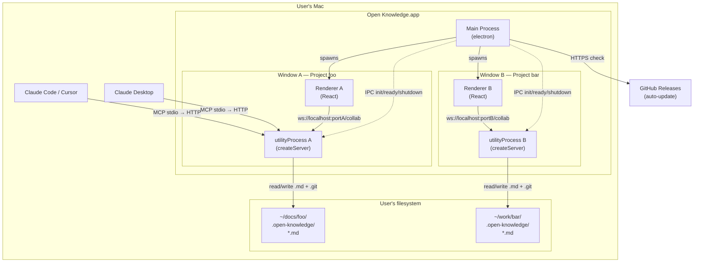
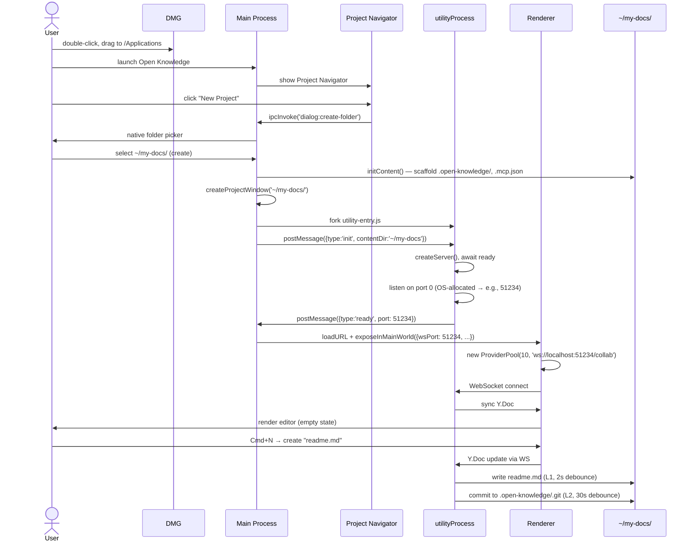
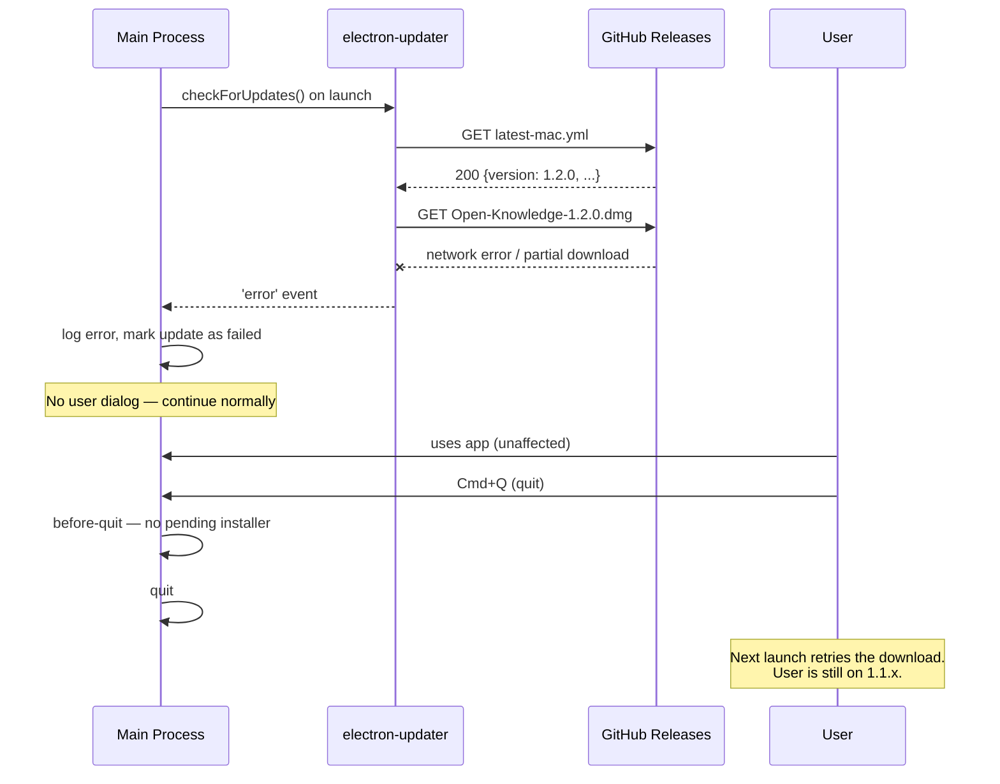

# Electron Desktop App for Open Knowledge — Day-0 Native macOS Distribution

**Status:** Draft (Intake)
**Owner(s):** Nick Gomez
**Last updated:** 2026-04-11
**Baseline commit:** `4884f5f`
**Links:**
- Evidence: [./evidence/](./evidence/)
- Changelog: [./meta/_changelog.md](./meta/_changelog.md)
- Related research:
  - [reports/web-to-macos-desktop-wrapping-2025/REPORT.md](../../reports/web-to-macos-desktop-wrapping-2025/REPORT.md) — framework selection (Electron vs Tauri), 20-app stack inspection
  - [reports/electron-desktop-app-operations-2025/REPORT.md](../../reports/electron-desktop-app-operations-2025/REPORT.md) — operational reference (versioning, signing, updates, CI, security)
  - [reports/oss-licensing-strategies-open-core/REPORT.md](../../reports/oss-licensing-strategies-open-core/REPORT.md) — license strategy
  - [reports/open-core-split-licensing-engineering/REPORT.md](../../reports/open-core-split-licensing-engineering/REPORT.md) — ee/ patterns
- Related specs:
  - [specs/2026-04-08-cli-packaging/SPEC.md](../2026-04-08-cli-packaging/SPEC.md) — current `npx @inkeep/open-knowledge` distribution (NEEDS RECONCILIATION — see Decision D1)
  - [specs/2026-04-10-provider-pool/SPEC.md](../2026-04-10-provider-pool/SPEC.md) — multi-document architecture
  - [specs/2026-04-10-document-list-api/SPEC.md](../2026-04-10-document-list-api/SPEC.md) — `/api/documents` design
  - [specs/2026-04-11-content-config-unification/SPEC.md](../2026-04-11-content-config-unification/SPEC.md) — content config schema
  - [specs/2026-04-11-exclude-gitignored-files/SPEC.md](../2026-04-11-exclude-gitignored-files/SPEC.md) — ContentFilter design
  - [specs/2026-04-11-sidebar-realtime-updates/SPEC.md](../2026-04-11-sidebar-realtime-updates/SPEC.md) — sidebar UX

---

## 1) Problem statement

**Situation:** Open Knowledge is a CRDT-collaborative MDX editor distributed today as `npx @inkeep/open-knowledge` — a Bun-built CLI that wraps a Hocuspocus server, file watcher, git persistence pipeline, and MCP stdio bridge into a `start` command. The "project" model is established: any folder containing a `.open-knowledge/` directory is a project, with content-config-driven document discovery (gitignore-aware via `ContentFilter`), per-project `.mcp.json` integration, and per-project hierarchical YAML config. As of April 11, 2026, multi-file document support has shipped (LRU provider pool, `DocumentContext`, `/api/documents` endpoint, sidebar with real-time updates). The CLI distribution serves developers comfortable with terminals, npx, and per-project bootstrap via `open-knowledge init`.

**Complication:** The `npx @inkeep/open-knowledge` distribution is a non-starter for the day-0 target persona — **documentation authors writing MDX with AI assistance**. These users may or may not code, may not have Node.js installed, are not comfortable in a terminal, and expect "double-click to install" software. Concretely:

- `npx @inkeep/open-knowledge` requires Node.js 22+ pre-installed and terminal comfort
- No Dock icon, no menu bar, no native window — feels like a web app, not a "real tool that owns my documents"
- Users must run `open-knowledge start` before editing — there's no "open the app and write" flow
- MCP server must be manually wired into Claude Desktop / Cursor config files
- Multi-project switching only works via opening multiple terminal sessions with different `cwd`s
- No discoverability of recent projects, no project navigator, no "switch to my other docs" affordance
- Updates require manual `npm update -g`, no auto-update mechanism
- Cannot launch the editor without the user understanding "the server" and "the browser frontend" as separate concepts

The result: OK's architectural advantages (local-first, CRDT, AI agent collaboration via MCP, MDX with custom components, gitignore-aware content filtering) are invisible to anyone who doesn't already know how to use a terminal. The addressable market is currently developers who also write docs — a subset of a subset of the total market for AI-assisted docs authoring tools.

**Resolution:** Distribute Open Knowledge as a **native macOS Electron desktop app on day 0**, alongside the existing `npx @inkeep/open-knowledge` CLI. The desktop app bundles the full stack — Hocuspocus server, `@parcel/watcher`, `simple-git`, MCP stdio bridge — into a drag-and-drop installable signed DMG. A documentation author downloads, drags to Applications, double-clicks, and is editing an MDX document with AI agent collaboration in under a minute. Multi-project support is surfaced via a Project Navigator + multi-window UX (one project per window, click to switch in current window OR Cmd+Click for new window). Each window owns its own `utilityProcess` running its own Hocuspocus instance scoped to one project — zero changes to the existing server architecture, clean isolation, automatic lock-file safety. No cloud services, no account, no centralized backend.

## 2) Goals

- **G1 — Day-0 user can install and start writing in <60 seconds.** Download DMG → drag to Applications → open → first MDX document on screen with AI collaboration ready.
- **G2 — Multi-project workflow that maps to docs author mental model.** User can have multiple OK projects (one per docs set: API reference, user guides, blog) and switch between them or view side-by-side. Each project is a folder, opens in its own window with its own Hocuspocus instance.
- **G3 — Zero terminal contact required for the primary persona.** A documentation author who never opens Terminal.app can install, configure, and use Open Knowledge end-to-end.
- **G4 — MCP integration with Claude Desktop / Cursor / Continue is automatic on first launch.** User does not need to edit JSON config files manually.
- **G5 — Coexists with the existing npm CLI distribution.** Both ship in parallel; the npm CLI remains the developer-facing path. Users can have both installed without conflict (lock files prevent collision on the same project).
- **G6 — Native macOS feel.** Real menu bar, Dock icon, native dialogs, native folder picker, native notifications, install-on-quit auto-update (no "Restart now" nags).
- **G7 — Boring/maintainable architecture.** Reuse existing OK packages unchanged. Each Electron window = one utilityProcess + one Hocuspocus instance scoped to one project. No multi-project Hocuspocus refactor. No cloud services. No account system.
- **G8 — Signed and notarized from day 0.** No "Apple cannot check for malicious software" friction on first launch. Apple Developer Org enrollment + Azure Trusted Signing for Windows when that platform follows.
- **G9 — Local-first everything.** No outgoing network calls in default config except the auto-update check. No telemetry without explicit user opt-in.

## 3) Non-goals

- **[NEVER] NG1: Cloud sync, hosted backend, or account system.** The desktop app is fully local. No "log in to sync across devices." If we ever do that, it's a separate product, not bolted onto this.
- **[NEVER] NG2: Mac App Store distribution.** MAS sandbox is incompatible with `@parcel/watcher` recursive watching, `simple-git` shelling out to `git`, and arbitrary file access. Direct DMG download only.
- **[NEVER] NG3: Telemetry without explicit opt-in.** Following Obsidian's model. No default opt-out.
- **[NOT NOW] NG4: Windows and Linux desktop packaging.** macOS-first for day 0. Windows is the planned next target. Linux is opportunistic. Revisit when macOS is shipped and stable.
- **[NOT NOW] NG5: Multi-user real-time collaboration across devices.** Hocuspocus supports it but the day-0 product is solo-user + AI agent. CRDT collaboration across devices requires a relay server or P2P transport — both are out of scope.
- **[NOT NOW] NG6: Plugin marketplace or third-party extension API.** OK has a custom JSX component schema today; opening that to third parties is a future spec.
- **[NOT NOW] NG7: Publishing-to-web workflows.** OK is for authoring MDX in a folder. Publishing that folder to a docs site (Fumadocs, Mintlify, Docusaurus) is the user's responsibility — OK doesn't need to ship a build/deploy pipeline.
- **[NOT NOW] NG8: Settings UI inside the app.** Day-0 settings live in `~/.open-knowledge/config.yml` and per-project `.open-knowledge/config.yml`. No GUI for editing config until needed.
- **[NOT NOW] NG9: Auto-scan filesystem for existing `.open-knowledge/` projects on first launch.** Empty Project Navigator on first launch, user explicitly opens or creates projects. No surprise scanning.
- **[NOT NOW] NG10: Onboarding wizard / tutorial walkthrough.** First launch goes straight to Project Navigator. Sample document inside a new project is the implicit tutorial.
- **[NOT NOW] NG11: In-app AI agent (built-in LLM client).** OK integrates with the user's existing Claude Desktop / Cursor / Continue via MCP. We don't bundle an LLM client.
- **[NOT UNLESS] NG12: Multi-project-in-one-window (workspace tabs).** If the multi-window pattern proves unwieldy in practice (heavy memory, window management friction), revisit. Day-0 commits to multi-window.
- **[NOT UNLESS] NG13: A separate Hocuspocus process serving multiple projects.** Each window having its own utilityProcess is the boring correct choice. Only consolidate to a shared multi-project server if memory cost becomes a real complaint.

## 4) Personas / consumers

- **P1 — Documentation author writing MDX with AI assistance (PRIMARY):**
  - **Role:** Technical writer, DevRel, developer advocate, docs engineer, solo founder doing their own product docs
  - **Skills:** Comfortable writing markdown/MDX, may or may not code, familiar with git conceptually but prefers GUI tools
  - **Environment:** macOS user, owns Claude Desktop / Cursor / Claude Code (at least one AI tool installed)
  - **Current tools:** Notion, Obsidian, VS Code, generic Markdown editors, Mintlify cloud
  - **Pain:** Cloud tools lose local-first benefits and data ownership; dev tools require terminal comfort; AI collaboration is either cloud-only or DIY
  - **Success:** Can install OK, open a project, write/edit an MDX doc with AI collaboration, save to disk, and maintain that as their source of truth — without ever opening a terminal

- **P2 — Developer using OK as a docs tool (SECONDARY):**
  - **Role:** Software engineer who maintains docs alongside code, uses Claude Code or Cursor for both code and docs work
  - **Environment:** Comfortable with `npx @inkeep/open-knowledge`, may also want the desktop app for visual editing
  - **Current tools:** VS Code/Cursor for code + Markdown, occasionally Obsidian for personal notes
  - **Need:** A docs editor that respects their existing project structure (no opinionated location), handles MDX with components, integrates with their AI tools
  - **Note:** The CLI distribution remains the primary path for this persona. The desktop app is a convenience, not a replacement.

- **P3 — AI coding/writing agent (CONSUMER):**
  - **Role:** Claude Desktop, Cursor, Claude Code, Continue — connecting to OK via MCP
  - **Needs:** Read documents, write documents (with proper agent attribution), undo/redo scoped to the agent, awareness of what the human is editing
  - **Interaction:** MCP stdio server (launched by the agent as a subprocess) connecting to OK's HTTP API on a localhost port, OR direct MCP connection if OK is running

## 5) Constraints

### Locked (from prior research or established OK architecture)

- **Electron 41+** — required for CVE-2025-55305 ASAR integrity fix (Trail of Bits Sept 2025)
- **electron-vite + electron-builder** toolchain — mature, mainstream, compatible with OK's Vite plugin pattern
- **Node.js 22+ in `utilityProcess`** — Hocuspocus runs in a fork of the main process via `utilityProcess.fork()`. ESM not supported in `utilityProcess` entry — server package needs CJS build target ([electron/electron#40031](https://github.com/electron/electron/issues/40031))
- **`@parcel/watcher` native N-API addon** — file watcher must work in packaged builds via `electron-builder install-app-deps` rebuild + `asarUnpack` config
- **AGPL-3.0 license** — Open Knowledge framework license; desktop app inherits
- **GitHub Releases** for distribution and auto-update (free, unlimited bandwidth, native electron-updater provider)
- **Apple Developer Program ($99/yr)** + **Azure Trusted Signing (~$120/yr)** for code signing
- **Install-on-quit auto-update pattern** — Obsidian/Claude Desktop model, not Slack-style "Restart now" nags
- **Opt-in telemetry only** — Obsidian model, default off
- **Project = folder with `.open-knowledge/`** — established model, not redesigned by this spec
- **Content config schema:** `content.dir`, `content.include`, `content.exclude` — established by `2026-04-11-content-config-unification`
- **Multi-document via LRU provider pool** — established by `2026-04-10-provider-pool`
- **ContentFilter respects gitignore + config exclude** — established by `2026-04-11-exclude-gitignored-files`

### Open / inherited from in-flight specs (TBD as worldmodel + spec reading completes)

- Sidebar architecture and how it handles multi-window
- Document switching UX patterns from `2026-04-11-sidebar-realtime-updates`
- Any existing assumptions in the React app about a single Hocuspocus URL

## 6) User journeys

All journeys target **P1 — Documentation author writing MDX with AI assistance** unless noted.

### J1 — First launch (no existing projects)

1. User downloads `Open-Knowledge-x.y.z-arm64.dmg` from the website or a GitHub release.
2. Double-click DMG → drag `Open Knowledge.app` to `/Applications`.
3. First open: Gatekeeper accepts the notarized, signed binary with no "cannot verify developer" dialog.
4. App launches → **Project Navigator window** appears (no editor, no project open).
   - Title: "Open Knowledge"
   - Content: empty state illustration + two primary buttons: **Open Project** and **New Project**
   - Optional: "Recent Projects" section (empty on first run)
5. User clicks **New Project** → native `dialog.showOpenDialog` with `properties: ['openDirectory', 'createDirectory']` → user picks or creates a folder anywhere on disk (e.g., `~/Documents/my-docs`).
6. Main process runs `initContent(path)` (existing `packages/cli/src/content/init.ts` logic) to scaffold `.open-knowledge/`, writes `.mcp.json`, then sends `open-project` IPC to a new BrowserWindow.
7. New BrowserWindow spawns its own `utilityProcess` which runs `createServer({ contentDir, projectDir })`, awaits `ready`, reports the allocated port back to main via IPC.
8. Main forwards port to renderer via preload bridge → renderer constructs `new ProviderPool(10, 'ws://localhost:<port>/collab')` → React app renders FileSidebar + empty-state editor.
9. User creates their first document (Cmd+N or sidebar "+") → writes a paragraph → edit persists to disk within 2s (L1 debounce) and to shadow git within 30s (L2 debounce).

**Success criteria:** From "download starts" to "first word typed into editor" is under 60 seconds on a typical broadband connection, assuming the user has a macOS 12.6+ machine.

### J2 — Returning user (one or more projects in Recent)

1. User clicks Open Knowledge in Dock → app launches.
2. **Decision point (Open Question OQ1):** Does it open the Project Navigator, or auto-open the last project?
   - **Current default assumption:** Open the last-used project in a fresh window. Hold Option/Alt to force Project Navigator.
3. If auto-opened: the window restores with last sidebar state (selected document, scroll position, editor mode).
4. utilityProcess starts, `ready` resolves, renderer connects.

### J3 — Creating a new project from inside the app (already have one open)

1. From menu bar: **File → New Project...** (Cmd+Shift+N)
2. Native folder picker appears (same as J1 step 5).
3. Main scaffolds `.open-knowledge/` at the chosen path.
4. **Decision point (per D3):** A new BrowserWindow opens with the new project. The existing window stays on its existing project. The user now has two windows.

### J4 — Switching between two projects

**Two sub-journeys (per D3):**

**J4a — Click to switch in current window:**
1. User opens Project Navigator via **File → Open Recent** or a menu item.
2. User clicks a project row.
3. Current window: main sends `close-project` IPC to utilityProcess → utilityProcess calls `serverInstance.destroy()` → waits for pending git commits → utilityProcess exits.
4. Main spawns new utilityProcess for the target project → awaits `ready` → sends new port to renderer.
5. Renderer: `ProviderPool.disconnectAll()` → constructs new pool with new WS URL → React sidebar re-fetches `/api/documents`.
6. Window title updates. User sees brief "Switching project..." loading state for 500ms–2s.

**J4b — Cmd+Click for new window:**
1. User opens Project Navigator.
2. User **Cmd+Clicks** a project row.
3. Main spawns new BrowserWindow + new utilityProcess for that project. Existing window untouched.
4. User now has two windows, one per project.

### J5 — P1 + P3 (AI agent) collaboration on a document

1. User opens a project in Open Knowledge → begins editing `articles/foo.md`.
2. Separately, user opens Claude Desktop / Cursor / Claude Code (which already has `open-knowledge` MCP server registered from J1 step 6 or J2).
3. AI tool's MCP client spawns the MCP stdio subprocess, which connects to OK's localhost HTTP API.
4. User asks Claude: "Add a section about authentication."
5. Claude calls MCP `write_document` → MCP bridge POSTs to `http://localhost:<port>/api/agent-write` with origin `agent-claude`.
6. OK's `AgentSessionManager` applies the write via `dc.document.transact(fn, 'agent-claude')` — the write appears in the user's editor with a brief agent-flash animation (defined in `packages/core/src/constants/activity.ts`).
7. User can undo the agent's write scoped to that agent only (via `AgentUndoButton`).
8. Disk persistence and git commit follow the normal L1/L2 debounce flow.

### J6 — Auto-update (install-on-quit)

Model: Obsidian / Claude Desktop. **Not** Slack's "Restart now" nag.

1. At app launch, electron-updater polls GitHub Releases for `latest-mac.yml`.
2. If a newer version is available and the user's bucket is within `stagingPercentage`, downloader starts in background.
3. Download completes → stores the installer in userData/pending.
4. App continues running normally. **No dialog, no nag.**
5. User quits the app (Cmd+Q or File → Quit).
6. On `app.on('before-quit')`, the pending installer is invoked → new version replaces old atomically.
7. Next launch: user is on the new version. Optional "What's new" toast on first launch post-update.

### J7 — Failure modes

- **J7a — Failed update.** Download fails or installer corrupts. electron-updater logs the error; next launch retries. Version stays current. No user-visible breakage. Manual fallback: user can re-download DMG from website.
- **J7b — Project lock collision.** User has the same project open in two windows (or in the app + the CLI). Lock file at `.open-knowledge/.lock` contains the PID of the owning process. Second process detects the lock, presents a dialog: "This project is already open in another window/process. Open anyway? [Cancel] [Open Read-Only]." Read-only mode disables editor writes and file-watcher-driven persistence.
- **J7c — Stale lock from ungraceful crash.** Lock contains a PID that no longer exists. New process detects stale lock (`isProcessAlive(pid)` returns false), overwrites lock, proceeds normally.
- **J7d — Content directory moved/deleted while open.** File watcher reports errors → window shows error state: "Project folder is no longer available. [Close Window] [Choose New Location]."
- **J7e — No AI tool installed.** MCP wiring step in J1 finds no AI tool config files. App shows an info banner in the Project Navigator: "No AI tool detected. Open Knowledge works standalone. [Learn how to add AI]." Editor remains fully functional without AI.
- **J7f — File system permissions.** On Sequoia/Sonoma, user declines Full Disk Access for the chosen folder. App shows: "Open Knowledge needs permission to access this folder. [Open System Settings]."
- **J7g — utilityProcess crash.** Main process monitors the child via `utilityProcess.on('exit')`. On unexpected exit, main shows: "The document server stopped unexpectedly. [Restart] [Close Window]." Restart respawns a new utilityProcess.
- **J7h — Native module load failure (packaged build).** If `@parcel/watcher` fails to load (wrong ABI, corrupted asar unpack), the server startup throws during `createServer()` → main process catches → window displays: "Open Knowledge could not start the file watcher. This is likely a build issue. [Send Report] [Close]."

## 7) Current state (how it works today)

Grounded in the worldmodel topology ([evidence/worldmodel-topology.md](./evidence/worldmodel-topology.md)) and in-flight spec summary ([evidence/in-flight-specs-summary.md](./evidence/in-flight-specs-summary.md)).

### 7.1 Distribution (existing)

A user runs `npx @inkeep/open-knowledge` (or `npm i -g @inkeep/open-knowledge && open-knowledge`) from a folder containing a `.open-knowledge/` directory. The CLI entry point is `packages/cli/src/cli.ts`, which parses Commander options, resolves the hierarchical config (CLI flags > env > workspace `.open-knowledge/config.yml` > user `~/.open-knowledge/config.yml` > Zod defaults in `packages/cli/src/config/schema.ts`), and invokes the `start` command.

### 7.2 Server (reusable unchanged)

`packages/cli/src/commands/start.ts` calls `createServer()` from `@inkeep/open-knowledge-server` (`packages/server/src/standalone.ts`). The factory returns a `ServerInstance`:

```typescript
interface ServerInstance {
  hocuspocus: Hocuspocus;
  sessionManager: AgentSessionManager;
  destroy: () => Promise<void>;
  ready: Promise<void>;  // Async init: shadow repo + watcher + HEAD watcher
}
```

Key traits that make the server **Electron-ready without modification**:

- **Pure Node.js.** No DOM, no Vite, no browser-only APIs. Uses `node:http`, `node:fs`, `node:path`, `@parcel/watcher`, `simple-git`.
- **Factory takes everything via options.** `contentDir`, `projectDir`, `port`, `host`, `includePatterns`, `excludePatterns`, `debounce`, `maxDebounce`, `gitEnabled` — no global state, no environment variables read inside the factory.
- **Synchronous create + async ready.** `createServer()` returns immediately with a `ready` promise that resolves once the shadow repo is initialized, the file watcher is running, and the HEAD watcher is running.
- **Graceful shutdown via `destroy()`.** Flushes pending git commits, unsubscribes watchers, closes agent sessions, flushes pending stores, destroys the shadow repo.

The Hocuspocus instance handles `/collab` (WebSocket for Y.js CRDT sync) and the API extension (`packages/server/src/api-extension.ts`) handles `/api/*` HTTP routes: `GET /api/documents`, `POST /api/pages`, `POST /api/agent-write`, `POST /api/agent-undo`, `POST /api/agent-redo`.

Default port is **3000** (Zod default in `packages/cli/src/config/schema.ts:17`), host `localhost`. The CLI's `start.ts` wires `createServer()`'s Hocuspocus + API extension into a single `node:http` server, and serves the React app's static bundle from `packages/app/dist` via `sirv`.

### 7.3 File watcher + ContentFilter (established 2026-04-11)

`packages/server/src/file-watcher.ts` uses `@parcel/watcher` (native N-API addon, cross-platform: kqueue/FSEvents on macOS, inotify on Linux, ReadDirectoryChangesW on Windows) to watch `projectDir`. It:

- Maintains an in-memory file index `Map<docName, FileIndexEntry>` — the **single source of truth** for "what documents exist" (used by `GET /api/documents` and the MCP `list_documents` tool).
- Applies `ContentFilter` (gitignore rules via `ignore` npm package + `content.exclude` globs via `picomatch`) during initial scan and on every event.
- Detects self-writes via content-hash tracker (`registerWrite`/`isSelfWrite`) to prevent feedback loops.
- Emits a typed `DiskEvent` union: `create | update | delete | rename | conflict`.

Gitignore rules are loaded at startup only (no hot-reload — a known limitation from `2026-04-11-exclude-gitignored-files`).

### 7.4 Persistence (established)

`packages/server/src/persistence.ts` is a two-layer debounced auto-save:

- **L1 (CRDT → markdown → disk):** On Hocuspocus `onStoreDocument`, serialize Y.XmlFragment + frontmatter to markdown, write to `.md` file. Debounced 2s / max 10s.
- **L2 (disk → git):** Enqueue shadow-repo commit after disk write. Debounced 30s idle.

Shadow repo at `.open-knowledge/.git` (bare repo, branch `refs/wip/main`) stores version history without touching the user's working git repo. Three-way reconciliation uses a per-branch `reconciledBaseByBranch: Map<branch, Map<docName, markdown>>` as merge base.

### 7.5 React app (existing multi-document client)

`packages/app/src/main.tsx` renders `<App />` which wraps the tree with `<DocumentProvider>` (from `packages/app/src/editor/DocumentContext.tsx`).

**ProviderPool** (`packages/app/src/editor/provider-pool.ts`):

- Module-level LRU singleton (default cap 10) of `HocuspocusProvider` instances.
- Constructor: `new ProviderPool(maxSize, wsUrl?)` where `wsUrl` defaults to `ws://${location.host}/collab` — **inferred from the browser's current origin**, not hardcoded.
- `pool.open(docName)` creates or reuses a provider; never evicts the active document.
- `pool.close(docName)` disconnects and removes.
- Observer cleanup: each `PoolEntry` stores its own `observerCleanup`; eviction disconnects first, then cleans up.

**DocumentContext** exposes `{ activeDocName, activeProvider, syncState, openDocument, closeDocument }` to components. `TiptapEditor` (WYSIWYG) and `SourceEditor` (CodeMirror 6) bind to the active provider's Y.Doc via Collaboration + yCollab extensions. Switching documents forces editor remount (yCollab binding requires it) — there's an accepted brief flash.

`FileSidebar.tsx` polls `GET /api/documents` every 5 seconds (a draft spec `2026-04-11-sidebar-realtime-updates` is in research phase to move to event-driven updates).

**Critical inheritance for desktop spec:** the ProviderPool is per-`<DocumentProvider>`. In a multi-window desktop app, **each window will have its own pool**, independent of others — this is not a regression, it matches the D6 architecture (one utilityProcess + one server + one renderer per window).

### 7.6 Dev mode (existing Vite plugin pattern)

`packages/app/src/server/hocuspocus-plugin.ts` is the Vite plugin that co-locates Hocuspocus in dev mode — resolves config, creates the `ContentFilter`, calls `createServer()`, wires the WebSocket via Vite's HTTP server. This is the proof-of-concept that `createServer()` can run inside an arbitrary Node host — the Electron `utilityProcess` will follow the same pattern.

### 7.7 MCP stdio bridge (existing)

`packages/cli/src/commands/mcp.ts` runs a stdio-based MCP server that Claude Code, Cursor, Continue, etc. spawn as a subprocess. It exposes tools for file discovery, document read, and agent writes. Per-project `.mcp.json` (written by `open-knowledge init`) tells each editor how to launch the MCP server for that project:

```json
{
  "mcpServers": {
    "open-knowledge": {
      "command": "npx",
      "args": ["@inkeep/open-knowledge", "mcp"]
    }
  }
}
```

### 7.8 `.open-knowledge/` directory (the project marker)

```
project-root/
├── .open-knowledge/
│   ├── config.yml              # Workspace config
│   ├── catalogs/               # Mirrored catalog index (gitignored)
│   ├── AGENTS.md
│   ├── INDEX.md
│   └── .git/                   # Shadow repo for version history
├── .mcp.json                   # MCP server entries
├── content/ or . or docs/      # Content directory (per config.content.dir)
│   └── *.md
└── .git/                       # User's own git repo (untouched)
```

### 7.9 What's missing for a desktop-author UX

1. No native window, menu bar, dock icon, or install flow — it's a CLI + browser tab.
2. No Project Navigator or "open recent" affordance — you're always in whatever folder you `cd`'d into.
3. No auto-update — you `npm update -g`.
4. MCP wiring requires hand-editing `claude_desktop_config.json` / `.cursor/mcp.json` / `~/.config/Continue/config.json`.
5. No way to run two projects side-by-side without two terminals.
6. The sidebar + editor tree is designed for a single, stable "this folder" scope — not for project-switching within a single window.

## 8) Proposed solution (vertical slice)

### 8.1 Process model

```
┌─────────────────────────────────────────────────────────────────┐
│  Main Process (Electron)                                        │
│  - BrowserWindow lifecycle (N windows)                          │
│  - Native menu bar, dock, dialogs, notifications                │
│  - Project state (recent projects, last-opened)                 │
│  - electron-updater (install-on-quit)                           │
│  - MCP wiring orchestrator (writes to claude_desktop_config.json│
│    and equivalents, only on explicit first-run prompt)          │
│  - Per-window: spawns + supervises utilityProcess               │
│  - Lock file management                                         │
└───────────────┬─────────────────────────────┬──────────────────┘
                │                             │
                │ IPC (ipcMain/ipcRenderer)   │ utilityProcess.fork
                │                             │ (one per window)
  ┌─────────────▼───────────┐   ┌─────────────▼────────────────┐
  │ Renderer (BrowserWindow)│   │ utilityProcess (Node runtime)│
  │  - React app (existing  │   │  - createServer({contentDir, │
  │    packages/app)        │   │    projectDir, port: 0})     │
  │  - DocumentProvider     │   │    (port 0 = OS-allocated)   │
  │  - ProviderPool         │   │  - Hocuspocus + WebSocket    │
  │  - TiptapEditor,        │   │  - @parcel/watcher           │
  │    SourceEditor,        │   │  - ContentFilter (gitignore) │
  │    FileSidebar          │   │  - simple-git (shadow repo)  │
  │                         │   │  - API extension             │
  │ Connects to             │   │                              │
  │ ws://localhost:<port>   │   │ Returns port via IPC once    │
  │ /collab                 │   │ server.ready resolves        │
  └─────────────────────────┘   └──────────────────────────────┘
```

**One BrowserWindow = one utilityProcess = one server = one project.** Per D6.

### 8.2 Main process responsibilities

- **Window manager.** `createProjectWindow(projectPath)` spawns a BrowserWindow + a utilityProcess for that project path. Tracks the mapping `Map<BrowserWindow, ProjectContext>`.
- **Project Navigator window.** A special BrowserWindow that loads a lightweight React view (could reuse `packages/app` with a `?mode=navigator` query string, or a separate bundle). Shows recent projects + Open/New buttons. This window has no utilityProcess — it does not host a server.
- **Menu bar.** `Menu.setApplicationMenu(...)` with File (New Project, Open Project, Open Recent, Close Window, Quit), Edit (undo/redo/cut/copy/paste/find), View (Toggle Sidebar, Toggle Source/WYSIWYG, Reload), Project (Switch Project, Project Settings), Help (Documentation, Report Issue, Check for Updates).
- **App state persistence.** `app.getPath('userData')/state.json` stores: `{ recentProjects: string[], lastOpenedProject: string | null, windowBounds: Record<projectPath, Rect> }`.
- **Lock file coordinator.** Before opening a project, check `.open-knowledge/.lock`. If stale (dead PID), overwrite. If alive, prompt user (per J7b).
- **electron-updater.** `autoUpdater.setFeedURL({ provider: 'github', ... })` + `checkForUpdates()` on launch + `autoUpdater.on('update-downloaded')` stages the installer for install-on-quit.
- **MCP wiring orchestrator.** On first launch of a new project: detect presence of `~/Library/Application Support/Claude/claude_desktop_config.json`, `~/.cursor/mcp.json`, `~/.config/Continue/config.json`. Prompt user once: "Add Open Knowledge to your AI tools? [Claude Desktop ☑] [Cursor ☑] [Continue ☐] [Skip]". On confirm, merge MCP server entries idempotently (same logic as `open-knowledge init` → `.mcp.json` scaffolding).
- **Crash/restart supervisor.** Listens to `utilityProcess.on('exit')` → on unexpected exit, renders the crash recovery state (J7g).

### 8.3 utilityProcess responsibilities

A new entry point at `packages/desktop/src/utility/server-entry.ts` (or equivalent) that:

1. Receives `{ contentDir, projectDir, debounce, maxDebounce, includePatterns, excludePatterns }` via `process.parentPort.on('message', ...)`.
2. Calls `createServer(...)` from `@inkeep/open-knowledge-server`.
3. Wires Hocuspocus + API extension to a `node:http` server on `port: 0` (OS-allocated ephemeral port).
4. Awaits `server.ready`.
5. Sends `{ type: 'ready', port: server.address().port }` back via `parentPort.postMessage(...)`.
6. Listens for `{ type: 'shutdown' }` → calls `serverInstance.destroy()` → exits.

**ESM/CJS constraint (R1):** `utilityProcess.fork()` historically required CJS entry points ([electron/electron#40031](https://github.com/electron/electron/issues/40031)). Electron 40+ supports ESM in utilityProcess; Electron 41 (locked) confirms support. The server package stays ESM. The utility entry bundles via `tsdown` or `vite build --ssr` to a single CJS **or** ESM file — pick based on Electron 41's production readiness, verify in a spike.

**Native modules:** `@parcel/watcher` ships prebuilt binaries per Node ABI. `electron-builder install-app-deps` rebuilds it against Electron's Node ABI during packaging. `asarUnpack: ["**/*.node", "**/@parcel/watcher/**"]` keeps the native binary dlopen-able from the asar archive.

### 8.4 Renderer responsibilities

**Zero changes to the React app's core rendering.** The only touchpoint is how the `ProviderPool` constructs its WebSocket URL:

**Current** (`packages/app/src/editor/provider-pool.ts:33–35`):
```typescript
constructor(maxSize = 10, wsUrl?: string) {
  this.wsUrl = wsUrl ?? `ws://${globalThis.location?.host ?? 'localhost'}/collab`;
}
```

**Desktop mode:** The renderer receives `{ wsPort, projectPath, projectName }` from main via a preload script (context isolation on, node integration off — Electron security defaults). It then constructs:

```typescript
const pool = new ProviderPool(10, `ws://localhost:${window.okDesktop.wsPort}/collab`);
```

**Preload bridge** (`packages/desktop/src/preload/index.ts`):
```typescript
contextBridge.exposeInMainWorld('okDesktop', {
  wsPort: number,
  projectPath: string,
  projectName: string,
  // Main→Renderer events (async):
  onProjectSwitch: (cb) => ipcRenderer.on('project-switch', cb),
  // Renderer→Main requests:
  openFolderDialog: () => ipcRenderer.invoke('dialog:open-folder'),
  createFolderDialog: () => ipcRenderer.invoke('dialog:create-folder'),
});
```

**Web version untouched:** when `window.okDesktop` is undefined, the ProviderPool falls back to `location.host` as today. Same React bundle, conditionally smart.

### 8.5 IPC channel inventory

**Main ↔ utilityProcess** (via `process.parentPort` / `utilityProcess.postMessage`)

| Direction | Message | Payload | Purpose |
|-----------|---------|---------|---------|
| Main → Util | `init` | ServerOptions | Start server |
| Util → Main | `ready` | `{ port }` | Server is listening |
| Util → Main | `error` | `{ message, stack }` | Startup or runtime failure |
| Main → Util | `shutdown` | — | Graceful stop |
| Util → Main | `sidebar-update` | `{ fileIndex }` | (optional) File watcher push — only if we decide to bypass polling for desktop |

**Main ↔ Renderer** (via `ipcMain.handle` + `ipcRenderer.invoke` for requests; `webContents.send` + `ipcRenderer.on` for events)

| Direction | Channel | Payload | Purpose |
|-----------|---------|---------|---------|
| R → M (invoke) | `dialog:open-folder` | — | Native folder picker, returns `string \| null` |
| R → M (invoke) | `dialog:create-folder` | — | Native picker with `createDirectory: true` |
| R → M (invoke) | `project:get-info` | — | Returns `{ projectPath, projectName, wsPort }` |
| R → M (invoke) | `project:list-recent` | — | Recent projects from app state |
| R → M (invoke) | `project:open` | `{ path, target: 'current' \| 'new-window' }` | Switch in current or open new window |
| R → M (invoke) | `project:close` | — | Close current project window |
| M → R (event) | `project:switching` | `{ projectPath }` | Show loading state |
| M → R (event) | `project:switched` | `{ projectPath, wsPort }` | Reinit ProviderPool with new port |
| M → R (event) | `menu:action` | `{ action: 'new-doc' \| 'toggle-sidebar' \| ... }` | Menu bar → renderer commands |

### 8.6 Project Navigator window

A distinct BrowserWindow (title: "Open Knowledge — Projects") loaded at app launch when no project is auto-opened.

**Layout:**
```
┌──────────────────────────────────────────┐
│  Open Knowledge                          │
├──────────────────────────────────────────┤
│                                          │
│     [Open Project]   [New Project]       │
│                                          │
│  Recent                                  │
│  ─────                                   │
│  📁 my-docs           ~/Documents/docs   │
│  📁 api-reference     ~/work/api-ref     │
│  📁 blog              ~/blog             │
│                                          │
│  (Click to open in this window,          │
│   ⌘-Click to open in a new window)       │
│                                          │
└──────────────────────────────────────────┘
```

- **Click a row** → main closes this window + opens the chosen project in this same window (replaces Navigator with Editor).
- **Cmd+Click** → main spawns a new BrowserWindow with the chosen project. Navigator stays open.
- **Open Project** button → native folder picker → if folder has no `.open-knowledge/`, prompt: "This folder isn't an Open Knowledge project. Initialize it? [Cancel] [Initialize]." On confirm, run `initContent(path)` and open.
- **New Project** button → native folder picker with `createDirectory: true` → `initContent(path)` → open in current window.

### 8.7 Multi-window lifecycle

- **App launch:** electron-updater check → restore state → if `lastOpenedProject` and **not** Option-held → open project window directly. Else → open Project Navigator.
- **User opens second project (J3/J4b):** new BrowserWindow + new utilityProcess.
- **User closes last window:** macOS convention — app stays running (dock icon visible). Click dock icon → reopen Project Navigator.
- **User quits app (Cmd+Q):**
  1. `app.on('before-quit')` fires.
  2. For each open project window: send `shutdown` IPC → utilityProcess flushes git commits + unsubscribes watchers → exits.
  3. Flush window state to `state.json`.
  4. electron-updater runs pending installer (if staged).
  5. Actually quit.

### 8.8 Lock file model

Per project, at `<projectPath>/.open-knowledge/.lock`:

```json
{
  "pid": 12345,
  "host": "hostname",
  "startedAt": "2026-04-11T14:30:00Z",
  "owner": "desktop|cli",
  "wsPort": 51234
}
```

**Protocol:**
1. Before spawning utilityProcess, main reads `.lock`. If missing, proceed.
2. If present, check `isProcessAlive(pid)` (via `process.kill(pid, 0)` in main).
3. Alive → present J7b dialog; dead → overwrite + proceed.
4. Lock written synchronously before `server.ready` resolves.
5. On graceful shutdown (`utilityProcess` receives `shutdown`), delete `.lock` before exit.
6. On crash, lock is stale; next launch cleans it up via step 3.

**Interop with CLI:** The existing `open-knowledge start` CLI must also write and respect this lock. This is a **small additive change** to `packages/cli/src/commands/start.ts` (not a blocker — can ship in parallel).

### 8.9 electron-builder configuration

```yaml
# electron-builder.yml
appId: com.inkeep.open-knowledge
productName: Open Knowledge
directories:
  output: dist-desktop
files:
  - "packages/desktop/dist/**/*"
  - "packages/app/dist/**/*"         # React bundle (built separately)
  - "packages/server/dist/**/*"      # Server + native modules
  - "!**/*.map"
asarUnpack:
  - "**/*.node"
  - "**/@parcel/watcher/**"
mac:
  category: public.app-category.productivity
  target:
    - target: dmg
      arch: [arm64, x64]             # Universal or separate — spike decision
  hardenedRuntime: true
  gatekeeperAssess: false
  entitlements: build/entitlements.mac.plist
  notarize:
    teamId: <APPLE_TEAM_ID>
afterSign: scripts/notarize.js
publish:
  provider: github
  owner: inkeep
  repo: open-knowledge
```

**Entitlements** (macOS): `com.apple.security.cs.allow-jit`, `com.apple.security.cs.allow-unsigned-executable-memory`, `com.apple.security.cs.disable-library-validation` (required for @parcel/watcher), `com.apple.security.files.user-selected.read-write`, `com.apple.security.files.bookmarks.app-scope`.

### 8.10 electron-updater configuration

```typescript
import { autoUpdater } from 'electron-updater';

autoUpdater.autoDownload = true;
autoUpdater.autoInstallOnAppQuit = true;     // Install-on-quit (D-critical)
autoUpdater.channel = 'latest';               // or 'beta' for beta channel
autoUpdater.on('update-downloaded', () => {
  // Silent — no dialog, no nag. Installs on next quit.
});
```

**Staged rollouts** via `latest-mac.yml`'s `stagingPercentage` field (written by a post-release script): 10% → 25% → 50% → 100% over 24–48h. Unhealthy releases paused by flipping percentage to 0% — users on old version stay on old version.

### 8.11 MCP integration on first launch

On first project creation (J1 step 6), the main process runs `runInit(projectPath)` from `packages/cli/src/commands/init.ts` — the existing, already-tested logic that writes `.open-knowledge/` + `.mcp.json`. This puts MCP config at the **project level**, which is what Claude Code / Cursor read from.

**For AI tools that read from user-level config** (Claude Desktop at `~/Library/Application Support/Claude/claude_desktop_config.json`, Continue at `~/.config/Continue/config.json`), the desktop app prompts the user **once per project** with a permission dialog before touching those files. On confirm, it merges a per-project MCP server entry (e.g., `"open-knowledge-my-docs"` with `cwd: projectPath`).

**Rejected alternative:** auto-writing to user-level config files silently. Too surprising for P1; violates principle of least astonishment.

### 8.12 CLI shim install (optional)

Menu item: **File → Install Command Line Tool...**

On click, main process:
1. Prompts for `sudo` via `dialog.showMessageBox` + `child_process.exec` (`osascript -e 'do shell script "..." with administrator privileges'`).
2. Creates a symlink at `/usr/local/bin/ok` → pointing to a shim script bundled in the app that runs the CLI entry point from the bundled server package.
3. Reports success/failure.

**Naming:** `ok` for the desktop-launched shim, `open-knowledge` for the npm-installed CLI. They can coexist.

### 8.13 Rejected architectural alternative (for completeness)

**Shared utilityProcess serving multiple projects via IPC relay.** All windows would share a single `utilityProcess` hosting a multi-project-aware Hocuspocus + single `ProviderPool`, with IPC relaying messages between windows.

**Why rejected (per D6, NG13):**
- Requires refactoring the server to be multi-tenant (contentDir no longer a startup constant).
- Requires refactoring `ProviderPool` to be cross-window (IPC-based eviction, cross-window observer cleanup).
- Eliminates the isolation benefit — a crash in one project takes down all windows.
- File watcher semantics get complicated (multiple `@parcel/watcher` instances at different paths in one process vs one recursive watcher).
- The only win is memory (one Node process instead of N). Modern Electron apps already spend ~200MB baseline; a second utilityProcess adds ~60–80MB. Acceptable for day 0.

**Trigger to revisit (per NG13):** Users report >3 windows routinely consuming >1GB, or window-launch latency exceeds 2s consistently.

### 8.14 System context diagram



### 8.15 Sequence: first launch → first edit (happy path)



### 8.16 Sequence: failed update recovery (J7a)



## 9) Risks / unknowns

**TBD — first pass (will be expanded during iterative loop):**

- **R1 — ESM in `utilityProcess` blocked.** Server package needs CJS build target. Existing package is ESM-everywhere. May require dual-format build via tsdown or vite library mode.
- **R2 — Native module rebuild on Electron upgrade.** Every Electron major bump (every 8 weeks) requires `@parcel/watcher` to be rebuilt against the new Node ABI. Risk of silent breakage if CI isn't gating on packaged-app smoke test.
- **R3 — Switch-in-current-window state management.** Tearing down the current utilityProcess + spawning a new one + reconnecting the renderer is a multi-step async dance with multiple failure modes. Will need careful testing.
- **R4 — MCP integration writes to user's other apps' config files.** Modifying `~/Library/Application Support/Claude/claude_desktop_config.json` or Cursor's MCP config without explicit permission may surprise users. Need a UX moment for this.
- **R5 — Lock file recovery from stale locks.** If the desktop app crashes ungracefully, the project's lock file will be stale. Stale-lock detection (`isProcessAlive(pid)`) needs to be reliable.
- **R6 — Coexistence with the npm CLI distribution.** A user with both installed could collide on the same project. Lock file is the primary defense; need to verify the lock is respected by both distributions.
- **R7 — First-launch MCP wiring requires the user to have Claude Desktop / Cursor installed.** What if neither is installed? Need a graceful fallback (OK still works as a plain editor; show a help link for "Install Claude Desktop").
- **R8 — Signed but not notarized installer is treated worse than fully unsigned by macOS Sequoia.** Notarization is mandatory from day 0, not optional.
- **R9 — Apple Developer Org enrollment requires D-U-N-S Number, 1-6 week wait.** This is a real path-blocker if not started early.
- **R10 — Native module load failures only surface in packaged builds.** Need a packaged-app smoke test in CI before every release.

## 10) Decision Log

| ID | Status | Type | Description | Resolution | Confidence | Reversibility |
|----|--------|------|-------------|------------|------------|---------------|
| D1 | LOCKED | Cross-cutting | Reconcile `cli-packaging` spec's "NEVER GUI/Electron packaging" non-goal. The original decision was a phasing call ("ship CLI first"), not a permanent rejection. The cli-packaging spec's NG should be reclassified from `[NEVER]` to `[NOT NOW]` (now flipping) with a back-reference to this spec. | Update `cli-packaging/SPEC.md` non-goals at finalization. | HIGH | Reversible (just an artifact correction) |
| D2 | LOCKED | Product | Persona is documentation author writing MDX with AI assistance (Persona D from intake), not "all developers" or "all docs authors" or "all knowledge workers." | Persona P1 in §4 is the design target. P2 (developers) and P3 (AI agents) are secondary consumers. | HIGH | 1-way door for marketing/positioning |
| D3 | LOCKED | Product | Multi-window project model with Project Navigator. Each window = one project = one utilityProcess + one Hocuspocus instance. Click to switch in current window, Cmd+Click for new window. | Architecture diagram in §8 will reflect this. | HIGH | 1-way door for UX model; Architecture is reversible if memory cost forces consolidation |
| D4 | LOCKED | Product | First-launch UX shows empty Project Navigator with "Open Project" / "New Project" buttons. No auto-scan for existing `.open-knowledge/` folders. | NG9 reflects this. | HIGH | Reversible |
| D5 | LOCKED | Product | "New Project" uses native macOS folder picker with `createDirectory: true` — user picks/creates the location anywhere on disk. No auto-default to `~/Documents/Open Knowledge/`. | Implementation in §8. | HIGH | Reversible |
| D6 | LOCKED | Technical | Each Electron window owns its own `utilityProcess` running its own `createServer()` instance scoped to one project. No shared multi-project Hocuspocus server. | NG13 explicitly defers consolidation. | HIGH | Architectural; reversible only by consolidation refactor |
| D7 | LOCKED | Technical | macOS-first for day 0. Windows and Linux deferred to NG4 (NOT NOW). | NG4 reflects this. | HIGH | Reversible — additive |
| D8 | LOCKED | Technical | Skip Mac App Store distribution. Direct DMG only. | NG2 reflects this (NEVER — sandbox incompatible). | HIGH | 1-way door (sandbox limitations are not going to change) |

## 11) Open questions

**TBD** — to be extracted systematically in Step 4 (backlog phase). First pass:

- How does the desktop app surface "AI agent is available" / "AI agent is not configured"?
- What does the menu bar look like (File, Edit, View, Project, Help — what's in each)?
- What keyboard shortcuts beyond Cmd+O, Cmd+Shift+O, Cmd+W, Cmd+Q?
- Does the app handle git operations or expose them at all (commit, push), or is git purely a behind-the-scenes persistence layer?
- What happens when a project's `content/` directory is moved/deleted while the app has it open?
- How does the desktop app's auto-update relate to the npm CLI's distribution version (do they need to stay in lockstep)?
- Where does the desktop app store its own state (recent projects, window positions, last-opened project)?
- Does the desktop app respect macOS dark mode automatically, or have its own theme system?
- What happens on second launch — auto-open the last project, or always show Project Navigator first?

## 12) Assumptions

**TBD** — populated during iterative loop. First pass:

| Assumption | Confidence | Verification plan | Expires |
|------------|------------|-------------------|---------|
| The existing `createServer({ contentDir, projectDir })` factory works unchanged inside `utilityProcess.fork()` | MEDIUM | Read packages/server/src/standalone.ts; verify no Electron-incompatible APIs | Step 3 (worldmodel) |
| `@parcel/watcher` rebuilds cleanly against Electron 41's Node 24 ABI | MEDIUM | Test with `electron-builder install-app-deps` in a spike branch | Step 4 (P0 investigation) |
| Hocuspocus + Y.Doc + provider pool work identically in Electron renderer as in dev | HIGH | Verify by reading provider-pool spec evidence | Step 3 |
| Modifying `claude_desktop_config.json` from OK is acceptable to users | LOW | User judgment call, not investigatable | Step 4 (decision presentation) |
| The current React app has no hardcoded `localhost:3000` assumptions that would break with Electron-allocated ports | MEDIUM | Read packages/app/src/editor/* for HocuspocusProvider URL construction | Step 3 |
| `simple-git` works inside `utilityProcess` (shells out to git binary which must be on PATH) | MEDIUM | Verify git is on PATH for GUI-launched apps; may need to bundle git or absolute-path | Step 4 |

## 13) Future work (Out of Scope)

**TBD** — populated as scope is contracted during iterative loop.

## 14) References

- Research reports: see Links section at top
- Related specs: see Links section at top

## 15) Agent Constraints

**SCOPE / EXCLUDE / STOP_IF / ASK_FIRST** — TBD at finalization (Step 8).
