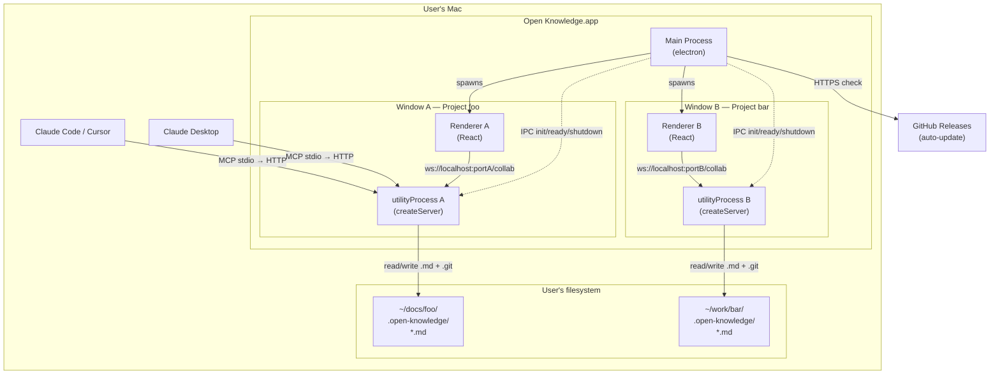
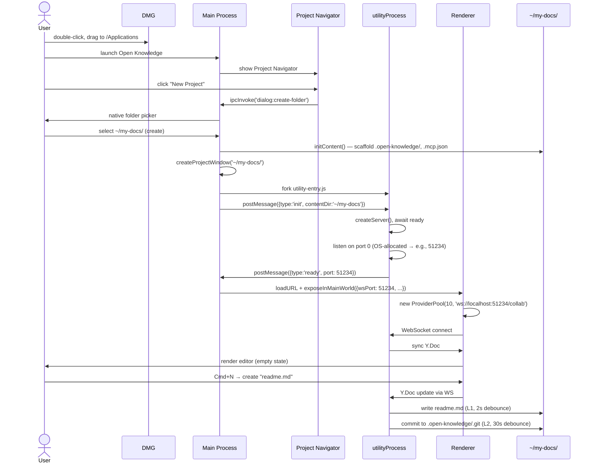
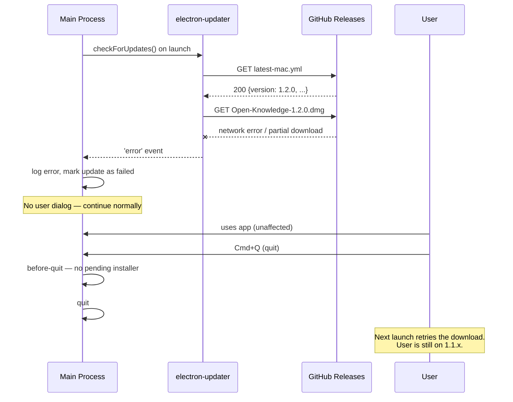

# Electron Desktop App for Open Knowledge — Day-0 Native macOS Distribution

**Status:** Draft (Re-grounded 2026-04-15 · research-consumed 2026-04-15 · scope-freeze pending)
**Owner(s):** Nick Gomez
**Last updated:** 2026-04-15
**Baseline commit:** `f17ad00` (main as of 2026-04-15; original baseline `4884f5f` preserved in changelog)
**Links:**
- Evidence: [./evidence/](./evidence/)
  - [./evidence/worldmodel-topology.md](./evidence/worldmodel-topology.md) — original (2026-04-11) topology
  - [./evidence/worldmodel-2026-04-14-regrounding.md](./evidence/worldmodel-2026-04-14-regrounding.md) — re-grounding after substrate ships
  - [./evidence/repo-integration-design.md](./evidence/repo-integration-design.md) — **1P integration design** mapping the FU-4 skeleton onto OK's Bun + turbo + Biome monorepo (735 lines, concrete `packages/desktop/` layout + turbo tasks + electron-builder.yml + CI job)
  - [./evidence/in-flight-specs-summary.md](./evidence/in-flight-specs-summary.md)
- Changelog: [./meta/_changelog.md](./meta/_changelog.md)
- Primary research report (drives all §5 / §8 / §9 / §10 / §11 decisions below):
  - [reports/electron-ai-coding-agent-development/REPORT.md](../../reports/electron-ai-coding-agent-development/REPORT.md) — 13-dimension AI-coding-agent-first Electron development synthesis + 4 follow-ups (utility-process hot-reload, packaged-build regression taxonomy, typed-IPC library comparison, agent-first repo skeleton)
- Related research:
  - [reports/web-to-macos-desktop-wrapping-2025/REPORT.md](../../reports/web-to-macos-desktop-wrapping-2025/REPORT.md) — framework selection (Electron vs Tauri), 20-app stack inspection
  - [reports/electron-desktop-app-operations-2025/REPORT.md](../../reports/electron-desktop-app-operations-2025/REPORT.md) — operational reference (versioning, signing, updates, CI, security)
  - [reports/oss-licensing-strategies-open-core/REPORT.md](../../reports/oss-licensing-strategies-open-core/REPORT.md) — license strategy
  - [reports/open-core-split-licensing-engineering/REPORT.md](../../reports/open-core-split-licensing-engineering/REPORT.md) — ee/ patterns
  - [reports/zero-config-bunx-cli-packaging/REPORT.md](../../reports/zero-config-bunx-cli-packaging/REPORT.md) — bunx distribution substrate the Electron build reuses
  - [reports/open-from-github-onboarding-mechanics/REPORT.md](../../reports/open-from-github-onboarding-mechanics/REPORT.md) — Clone from GitHub (P1 first-content path)
  - [reports/symlink-handling-file-sync-crdt/REPORT.md](../../reports/symlink-handling-file-sync-crdt/REPORT.md) — realpath-based document identity + atomic writes (shipped)
- Related specs:
  - [specs/2026-04-08-cli-packaging/SPEC.md](../2026-04-08-cli-packaging/SPEC.md) — CLI distribution (non-goal `[NEVER]` flipped to `[NOT NOW]` per D1 on 2026-04-15)
  - [specs/2026-04-11-zero-config-bunx-packaging/SPEC.md](../2026-04-11-zero-config-bunx-packaging/SPEC.md) — bunx mode; T1 (React bundle), T2 (chokidar fallback), T3 (auto-init) are substrate the Electron build inherits
  - [specs/2026-04-13-server-process-safety/SPEC.md](../2026-04-13-server-process-safety/SPEC.md) — **shipped**; defines the `server.lock` contract the Electron spec consumes (see §8.8)
  - [specs/2026-04-13-v0-2-sidebar-push/SPEC.md](../2026-04-13-v0-2-sidebar-push/SPEC.md) — CC1 push-over-awareness; server primitive shipped, client `SystemDocSubscriber` shipped (see §7.5)
  - [specs/2026-04-14-clone-from-github/SPEC.md](../2026-04-14-clone-from-github/SPEC.md) — Clone-from-GitHub; Electron Project Navigator inherits its 3-card empty state (see §8.6)
  - [specs/2026-04-10-provider-pool/SPEC.md](../2026-04-10-provider-pool/SPEC.md) — multi-document architecture
  - [specs/2026-04-10-document-list-api/SPEC.md](../2026-04-10-document-list-api/SPEC.md) — `/api/documents` design
  - [specs/2026-04-11-content-config-unification/SPEC.md](../2026-04-11-content-config-unification/SPEC.md) — content config schema
  - [specs/2026-04-11-exclude-gitignored-files/SPEC.md](../2026-04-11-exclude-gitignored-files/SPEC.md) — ContentFilter design
- Related project tracker:
  - [projects/v0-launch/PROJECT.md](../../projects/v0-launch/PROJECT.md) — Electron is `[NOT NOW]` for v0 launch; V0-20 "desktop build prep" is the gating story. This spec finalizes while substrate (V0-1 server-lock, V0-2 CC1) ships.

---

## 1) Problem statement

**Situation:** Open Knowledge is a CRDT-collaborative MDX editor distributed today as `npx @inkeep/open-knowledge` — a Bun-built CLI that wraps a Hocuspocus server, file watcher, git persistence pipeline, and MCP stdio bridge into a `start` command. The "project" model is established: any folder containing a `.open-knowledge/` directory is a project, with content-config-driven document discovery (gitignore-aware via `ContentFilter`), per-project `.mcp.json` integration, and per-project hierarchical YAML config. As of April 11, 2026, multi-file document support has shipped (LRU provider pool, `DocumentContext`, `/api/documents` endpoint, sidebar with real-time updates). The CLI distribution serves developers comfortable with terminals, npx, and per-project bootstrap via `ok init`.

**Complication:** The `npx @inkeep/open-knowledge` distribution is a non-starter for the day-0 target persona — **documentation authors writing MDX with AI assistance**. These users may or may not code, may not have Node.js installed, are not comfortable in a terminal, and expect "double-click to install" software. Concretely:

- `npx @inkeep/open-knowledge` requires Node.js 22+ pre-installed and terminal comfort
- No Dock icon, no menu bar, no native window — feels like a web app, not a "real tool that owns my documents"
- Users must run `ok start` before editing — there's no "open the app and write" flow
- MCP server must be manually wired into Claude Desktop / Cursor config files
- Multi-project switching only works via opening multiple terminal sessions with different `cwd`s
- No discoverability of recent projects, no project navigator, no "switch to my other docs" affordance
- Updates require manual `npm update -g`, no auto-update mechanism
- Cannot launch the editor without the user understanding "the server" and "the browser frontend" as separate concepts

The result: OK's architectural advantages (local-first, CRDT, AI agent collaboration via MCP, MDX with custom components, gitignore-aware content filtering) are invisible to anyone who doesn't already know how to use a terminal. The addressable market is currently developers who also write docs — a subset of a subset of the total market for AI-assisted docs authoring tools.

**Resolution:** Distribute Open Knowledge as a **native macOS Electron desktop app on day 0**, alongside the existing `npx @inkeep/open-knowledge` CLI. The desktop app bundles the full stack — Hocuspocus server, `@parcel/watcher`, `simple-git`, MCP stdio bridge — into a drag-and-drop installable signed DMG. A documentation author downloads, drags to Applications, double-clicks, and is editing an MDX document with AI agent collaboration in under a minute. Multi-project support is surfaced via a Project Navigator + multi-window UX (one project per window, click to switch in current window OR Cmd+Click for new window). Each window owns its own `utilityProcess` running its own Hocuspocus instance scoped to one project — zero changes to the existing server architecture, clean isolation, automatic lock-file safety. No cloud services, no account, no centralized backend.

## 2) Goals

- **G1 — Day-0 user can install and start writing in <60 seconds.** Download DMG → drag to Applications → open → first MDX document on screen with AI collaboration ready.
- **G2 — Multi-project workflow that maps to docs author mental model.** User can have multiple OK projects (one per docs set: API reference, user guides, blog) and switch between them or view side-by-side. Each project is a folder, opens in its own window with its own Hocuspocus instance.
- **G3 — Zero terminal contact required for the primary persona.** A documentation author who never opens Terminal.app can install, configure, and use Open Knowledge end-to-end.
- **G4 — MCP integration with detected AI tools is automatic on first launch.** User does not need to edit JSON config files manually. Current supported: Claude Code, Claude Desktop, Cursor, VS Code, Codex, Windsurf (`EditorId` union on origin/main). Continue is not supported.
- **G5 — Coexists with the existing npm CLI distribution.** Both ship in parallel; the npm CLI remains the developer-facing path. Users can have both installed without conflict (lock files prevent collision on the same project).
- **G6 — Native macOS feel.** Real menu bar, Dock icon, native dialogs, native folder picker, native notifications, install-on-quit auto-update (no "Restart now" nags).
- **G7 — Boring/maintainable architecture.** Reuse existing OK packages unchanged. Each Electron window = one utilityProcess + one Hocuspocus instance scoped to one project. No multi-project Hocuspocus refactor. No cloud services. No account system.
- **G8 — Signed and notarized from day 0.** No "Apple cannot check for malicious software" friction on first launch. Apple Developer Org enrollment + Azure Trusted Signing for Windows when that platform follows.
- **G9 — Local-first everything.** No outgoing network calls in default config except the auto-update check. No telemetry without explicit user opt-in.

## 3) Non-goals

- **[NEVER] NG1: Cloud sync, hosted backend, or account system.** The desktop app is fully local. No "log in to sync across devices." If we ever do that, it's a separate product, not bolted onto this.
- **[NEVER] NG2: Mac App Store distribution.** MAS sandbox is incompatible with `@parcel/watcher` recursive watching, `simple-git` shelling out to `git`, and arbitrary file access. Direct DMG download only.
- **[NEVER] NG3: Telemetry without explicit opt-in.** Following Obsidian's model. No default opt-out.
- **[NOT NOW] NG4: Windows and Linux desktop packaging.** macOS-only for v0 per D51 (which supersedes D32). Windows re-enters scope per D51's promote trigger ("macOS v0 stable in ≥5 design-partner machines for ≥4 weeks AND product commits to broader audience"). Linux is opportunistic. Technical cost of adding either later is low — all architectural decisions (D6, D35–D50) remain platform-agnostic; Windows/Linux re-entry adds one CI row + one builder target + conditional implementation branches in D39/D43/D46/D49 for platform-specific paths. @parcel/watcher + @napi-rs/keyring support all three platforms.
- **[NOT NOW] NG5: Multi-user real-time collaboration across devices.** Hocuspocus supports it but the day-0 product is solo-user + AI agent. CRDT collaboration across devices requires a relay server or P2P transport — both are out of scope.
- **[NOT NOW] NG6: Plugin marketplace or third-party extension API.** OK has a custom JSX component schema today; opening that to third parties is a future spec.
- **[NOT NOW] NG7: Publishing-to-web workflows.** OK is for authoring MDX in a folder. Publishing that folder to a docs site (Fumadocs, Mintlify, Docusaurus) is the user's responsibility — OK doesn't need to ship a build/deploy pipeline.
- **[NOT NOW] NG8: Settings UI inside the app.** Day-0 settings live in `~/.open-knowledge/config.yml` and per-project `.open-knowledge/config.yml`. No GUI for editing config until needed.
- **[NOT NOW] NG9: Auto-scan filesystem for existing `.open-knowledge/` projects on first launch.** Empty Project Navigator on first launch, user explicitly opens or creates projects. No surprise scanning.
- **[NOT NOW] NG10: Onboarding wizard / tutorial walkthrough.** First launch goes straight to Project Navigator. Sample document inside a new project is the implicit tutorial.
- **[NOT NOW] NG11: In-app AI agent (built-in LLM client).** OK integrates with the user's existing Claude Code / Claude Desktop / Cursor / VS Code / Codex / Windsurf via MCP. We don't bundle an LLM client.
- **[NOT UNLESS] NG12: Multi-project-in-one-window (workspace tabs).** If the multi-window pattern proves unwieldy in practice (heavy memory, window management friction), revisit. Day-0 commits to multi-window.
- **[NOT UNLESS] NG13: A separate Hocuspocus process serving multiple projects.** Each window having its own utilityProcess is the boring correct choice. Only consolidate to a shared multi-project server if memory cost becomes a real complaint.

## 4) Personas / consumers

- **P1 — Documentation author writing MDX with AI assistance (PRIMARY):**
  - **Role:** Technical writer, DevRel, developer advocate, docs engineer, solo founder doing their own product docs
  - **Skills:** Comfortable writing markdown/MDX, may or may not code, familiar with git conceptually but prefers GUI tools
  - **Environment:** macOS user, owns Claude Desktop / Cursor / Claude Code (at least one AI tool installed)
  - **Current tools:** Notion, Obsidian, VS Code, generic Markdown editors, Mintlify cloud
  - **Pain:** Cloud tools lose local-first benefits and data ownership; dev tools require terminal comfort; AI collaboration is either cloud-only or DIY
  - **Success:** Can install OK, open a project, write/edit an MDX doc with AI collaboration, save to disk, and maintain that as their source of truth — without ever opening a terminal

- **P2 — Developer using OK as a docs tool (SECONDARY):**
  - **Role:** Software engineer who maintains docs alongside code, uses Claude Code or Cursor for both code and docs work
  - **Environment:** Comfortable with `npx @inkeep/open-knowledge`, may also want the desktop app for visual editing
  - **Current tools:** VS Code/Cursor for code + Markdown, occasionally Obsidian for personal notes
  - **Need:** A docs editor that respects their existing project structure (no opinionated location), handles MDX with components, integrates with their AI tools
  - **Note:** The CLI distribution remains the primary path for this persona. The desktop app is a convenience, not a replacement.

- **P3 — AI coding/writing agent (CONSUMER):**
  - **Role:** Claude Desktop, Claude Code, Cursor, VS Code, Codex, Windsurf — connecting to OK via MCP
  - **Needs:** Read documents, write documents (with proper agent attribution), undo/redo scoped to the agent, awareness of what the human is editing
  - **Interaction:** MCP stdio server (launched by the agent as a subprocess) connecting to OK's HTTP API on a localhost port, OR direct MCP connection if OK is running

## 5) Constraints

### Locked (from prior research or established OK architecture)

**Primary principle — Agent-first from day 0, end-to-end (D30):**

Every architectural choice in this spec is evaluated against: *does this make AI coding agents faster or slower?* Applies to quality gates, test harnesses, IPC typing, logging, CI coverage, build triggers, documentation, native-module handling, and platform support. An agent spinning up a worktree for desktop work should be productive in under 60 seconds: `bun install` → read `AGENTS.md` → `bun run check` → start iterating. Where this principle trades against human-contributor convenience or one-time setup cost, **agent velocity wins** — humans can set an env-var opt-out; agents should get a working environment by default (see D33 / D34 for the canonical pattern). This is the organizing frame for all §5 / §8 / §10 decisions below and sits alongside the 10 architectural precedents in the root `CLAUDE.md`.

**Framework + runtime:**

- **Electron 41+** — target the current stable major at implementation time (41.2.0 is GA as of 2026-04-07, Chromium 146, Node.js 24). Electron 41 shipped an additional-defence hardening for ASAR-integrity-protected apps on macOS ([release notes #48587](https://github.com/electron/electron/releases/tag/v41.0.0)). **INFERRED** — appears to mitigate the class of attack described in CVE-2025-55305 (ToB, Sept 2025), but release notes do not name-check that CVE directly; the mapping of #48587 → CVE-2025-55305 is our inference from public-facing descriptions, not an Electron-maintainer confirmation. Pair with `@electron/asar ≥ 4.1.0` + the `EnableEmbeddedAsarIntegrityValidation` fuse.
- **electron-vite + electron-builder** toolchain — mature, mainstream, compatible with OK's Vite plugin pattern.
- **Node.js in `utilityProcess`** — Hocuspocus runs in a fork of the main process via `utilityProcess.fork()`. **ESM is supported** in utilityProcess since Electron ~28 via [electron/electron#40047](https://github.com/electron/electron/pull/40047) (merged Sept 2023 by MarshallOfSound, resolving #40031). The server package stays ESM everywhere — no dual CJS build target required.
- **`@parcel/watcher` native N-API addon** — primary watcher. Packaged builds rebuild against Electron's Node ABI via `electron-builder install-app-deps`; `asarUnpack: ["**/*.node", "**/@parcel/watcher/**"]` keeps the native binary dlopen-able.
- **Chokidar fallback inherited from `zero-config-bunx-packaging` T2** — if `@parcel/watcher` fails to load in a packaged build (ABI mismatch, unpacked-binary missing), the server falls through to chokidar automatically and logs a structured warning. This reduces R10 ("packaged-build native module failures") from "startup crash" to "degraded watch."

**Distribution + signing:**

- **AGPL-3.0 license** — Open Knowledge framework license; desktop app inherits.
- **GitHub Releases** for distribution and auto-update (free, unlimited bandwidth, native electron-updater provider).
- **Apple Developer Program ($99/yr)** — Developer ID Application cert for signing + Apple Notary Service for notarization. Critical-path procurement at scope freeze (1-6 weeks depending on whether Inkeep already has D-U-N-S). Azure Trusted Signing / Sectigo EV deferred to §13 Future Work per D51 (Windows NOT NOW).
- **Install-on-quit auto-update pattern** — Obsidian / Claude Desktop model, not Slack-style "Restart now" nags.
- **Opt-in telemetry only** — Obsidian model, default off.

**OK substrate the Electron build consumes (shipped or actively in-flight, treated as load-bearing):**

- **`server.lock` contract (shipped V0-1, PR #99, spec `specs/2026-04-13-server-process-safety/`).** Each utilityProcess calls `acquireServerLock(lockDir, { port: 0, worktreeRoot })` before any side effects; `updateServerLockPort(lockDir, realPort)` after `listen()` resolves; `releaseServerLock(lockDir)` in the `destroy()` shutdown phase. Lock metadata shape: `{ pid, hostname, port, startedAt, worktreeRoot }`. A live same-host collision throws `ServerLockCollisionError` — the Electron main process surfaces this as J7b.
- **CC1 push-over-awareness (shipped V0-2, PR #106, spec `specs/2026-04-13-v0-2-sidebar-push/`).** Server-side: `CC1Broadcaster` + `__system__` Y.Doc + `isSystemDoc()` guard; contract `{ v: 1, ch: 'files' | 'backlinks' | 'graph', seq: number }`, 100ms trailing-edge debounce per channel. Client-side: `SystemDocSubscriber` opens a dedicated `HocuspocusProvider` against `__system__`, parses via `parseCC1Signal`, emits `emitDocumentsChanged([ch])`; consumers (FileSidebar, BacklinksPanel, GraphView) invalidate their react-query caches on signal. **Each Electron window hosts its own `SystemDocSubscriber`** against its own utilityProcess's `__system__` doc.
- **Zero-config bunx substrate (spec `specs/2026-04-11-zero-config-bunx-packaging/`, Approved, Andrew).** The Electron packaging inherits: T1 React bundle at `packages/cli/dist/public/` (single bundling pipeline across CLI and Electron); T2 chokidar watcher fallback (see above); T3 auto-init of `.open-knowledge/` on first server start (Electron main's New Project flow relies on this — no explicit init dialog required).
- **Clone-from-GitHub substrate (spec `specs/2026-04-14-clone-from-github/`, Approved, Nick + Miles).** The Electron Project Navigator's empty-state inherits the 3-card layout: Clone / Open folder / Start fresh. Device Flow surfaces via `shell.openExternal(deviceAuthUrl)` in Electron (cleaner than CLI terminal output).
- **GitHub collaboration round-trip substrate (PR #166, **MERGED** 2026-04-17 at `986ebafe`; +10,474 LOC / 73 files changed — D31).** Ships clone → auth → auto-sync → conflict resolution end-to-end. Editor UI (`packages/app/src/components/`): `AuthModal`, `CloneDialog`, `ConflictBanner`, `ConflictResolver`, `SyncStatusBadge`, `DiffView.conflictMode`, `EditorHeader` auth button, `use-git-sync-status` hook (lives at `packages/app/src/hooks/` on main) — all inherited by the desktop build through the shared React bundle (D13), **zero Electron-side re-implementation**. Server (`packages/server/src/`): `SyncEngine` with decoupled pull (30s) / push (60s) cycles, squash-before-push (one clean origin commit per cycle), content-scope commits (never `git add .`), counted backoff, full error classification via `error-classification.ts` 5-class taxonomy; `conflict-storage.ts`, `git-handle.ts`, `git-identity.ts`, `git-mutex.ts` (`parentGitMutex` serializes all parent-git writes); new endpoints `/api/local-op/auth/*` (CLI-canonical auth relay) + `/api/sync/{status,trigger,set-enabled,conflicts,resolve-conflict,abort-merge}`. CLI: `ok clone <url>`, `ok auth {login,pat,signout,status,repos,git-credential,validate-host}`, `ok pull`, `ok push`, `ok sync`. Native: `@napi-rs/keyring` for OS keychain (macOS Keychain / Windows Credential Manager / Linux libsecret) with plaintext YAML fallback. Auth model: `gh` delegation (Tier A) → Device Flow (Tier B) → PAT (Tier C). Auto-sync is **opt-in** — signing in IS the opt-in gate; no default-on bidirectional git sync. **Re-validation (merge-gate) executed 2026-04-20:** ✓ `@napi-rs/keyring` is a real dep in `packages/cli/package.json` (utilityProcess compat remains R15 spike per T1 research); ✓ `asarUnpack` globs in §8.9 cover `@napi-rs/keyring/**` + `@napi-rs/keyring-*/**`; ✓ `createServer()`'s `ServerInstance` now exposes `syncEngine: SyncEngine | null` (§7.2 updated — M2 audit finding), so `destroy()` can invoke `syncEngine.destroy()` in the drain sequence; ✓ `/api/local-op/auth/*` + `/api/sync/*` 15-endpoint inventory matches D31's audit snapshot. No substrate-shape surprises for the Electron spec; D31's posture framing absorbed the drift gracefully.

**Data model / project model:**

- **Project = folder with `.open-knowledge/`** — established. Contents today: `config.yml`, `AGENTS.md` (when Claude Code plugin installed), `server.lock` (while server running), `.mcp.json` at project root (separate file). Shadow repo lives at `.git/openknowledge/` (integrated mode, when project has `.git/`) or `.openknowledge/` (standalone mode, added to `.gitignore`) — **not** at `.open-knowledge/.git`.
- **Content config schema:** `content.dir`, `content.include` (default `['**/*.md', '**/*.mdx']`), `content.exclude` — established by `2026-04-11-content-config-unification` + `2026-04-08-extension-aware-docName` (PR #126).
- **Multi-document via LRU provider pool** — established by `2026-04-10-provider-pool`. `ProviderPool` default WebSocket URL derives from `location.host`; in Electron the renderer MUST pass an explicit `wsUrl = 'ws://localhost:<port>/collab'` received from main via the preload bridge (§8.4).
- **ContentFilter respects gitignore + config exclude** — established by `2026-04-11-exclude-gitignored-files`.
- **Symlink handling** — realpath-based document identity, symlink-preserving atomic writes, escape-safe refusal of writes resolving outside `contentDir`. See `reports/symlink-handling-file-sync-crdt/REPORT.md`.

**Repo / toolchain integration (inherited from OK monorepo at `f17ad00` — see [`evidence/repo-integration-design.md`](./evidence/repo-integration-design.md) for concrete files):**

- **Bun `1.3.11` + turbo `^2.7` + Biome `^2.4`** — inherited. No new package manager, no new linter. Biome `noRestrictedImports` covers 4 of 5 FU-4 custom rules; the 5th (`no-loosely-typed-webcontents-ipc`) is either a Biome GritQL rule or a desktop-package-scoped ESLint fallback (see OQ-I).
- **New `packages/desktop/` package** — name `@inkeep/open-knowledge-desktop`, private. Slots into existing `packages/*` workspace glob. **No restructuring of `core`, `server`, `cli`, `app`, or `plugin`.**
- **Renderer reuses `packages/app/` Vite build as `extraResources`** — electron-builder's `extraResources: from: "../cli/dist/public"` consumes the same React bundle the CLI already produces via zero-config-bunx T1. Zero React-code duplication; `packages/app/` is the single source of the renderer UI for both bunx and Electron.
- **Utility-process entry imports `createServer()` directly** from `@inkeep/open-knowledge-server` (workspace dep). CLI is NOT a dependency of `packages/desktop/` — the Electron app uses the server library directly, not through the CLI binary. Shared helpers (`resolveContentDir`, `resolveLockDir`) move from `packages/cli/src/config/paths.ts` to `@inkeep/open-knowledge-core` so both CLI and desktop can import without cross-depending.
- **Typed-IPC baseline: hand-rolled discriminated-union channel map** — per `reports/electron-ai-coding-agent-development/fanout/.../fu3-typed-electron-ipc-comparison/`: best pick for <20 channels, zero runtime deps, best observability (grep-able channel names). Migration trigger if channel count >20 or streaming/subscription surface needed: `@electron-toolkit/typed-ipc` (20-100) or `@egoist/tipc` (100+). tRPC-over-IPC ruled out of baseline for opacity tradeoff per FU-3.
- **tsconfig project references scoped to `packages/desktop/` only** — not retrofitted into `core` / `server` / `cli` / `app`. Renderer tsconfig sets `"types": []` so `import 'fs'` in renderer code fails at typecheck.
- **Turbo tasks added (additive, no changes to existing task inputs/outputs):** `build:desktop`, `build:desktop:dir`, `build:desktop:release`, `rebuild:native`, `test:e2e:unpackaged`, `test:e2e:packaged`. `build:desktop` explicitly depends on `@inkeep/open-knowledge#build` so the shared React bundle is always fresh before electron-builder runs.
- **Electron 41 fuses enabled at package time:** `runAsNode: false`, `enableNodeCliInspectArguments: true` (required for Playwright `_electron.launch`), `enableEmbeddedAsarIntegrityValidation: true`, `onlyLoadAppFromAsar: true`, `enableNodeOptionsEnvironmentVariable: false`. Post-sign `@electron/fuses read` verification is a required release-pipeline step per FU-2 Class 8 (fuses × signtool clobber — electron-builder issue #9428).

## 6) User journeys

All journeys target **P1 — Documentation author writing MDX with AI assistance** unless noted.

### J1 — First launch (no existing projects)

1. User downloads `Open-Knowledge-x.y.z-arm64.dmg` from the website or a GitHub release.
2. Double-click DMG → drag `Open Knowledge.app` to `/Applications`.
3. First open: Gatekeeper accepts the notarized, signed binary with no "cannot verify developer" dialog.
4. App launches → **Project Navigator window** appears (no editor, no project open).
   - Title: "Open Knowledge"
   - Content: empty state with **three primary cards** — Clone from GitHub / Open folder on disk / Start fresh (§8.6).
   - "Recent" section (empty on first run).
5. User picks a path — three possible branches:
   - **Start fresh** — native `dialog.showOpenDialog({ properties: ['openDirectory', 'createDirectory'] })` → user picks or creates a folder (e.g., `~/Documents/my-docs`).
   - **Open folder on disk** — native picker with `['openDirectory']`.
   - **Clone from GitHub** — CloneDialog (URL paste / repo browse / Device-Flow sign-in per clone-from-github spec) → `simple-git` clone to user-chosen target → shadow-repo startup HEAD-drift check creates the T0 upstream-import entry.
6. Main spawns a new BrowserWindow + utilityProcess for the chosen path. `createServer({ contentDir, projectDir })` runs `acquireServerLock` → auto-init of `.open-knowledge/` (zero-config-bunx T3) if absent → `listen(0)` → `updateServerLockPort(lockDir, realPort)` → awaits `ready`.
7. utilityProcess sends `{type: 'ready', port}` → main forwards via preload bridge → renderer constructs `new ProviderPool(10, 'ws://localhost:<port>/collab')` and `SystemDocSubscriber` connects to `__system__` → React app renders FileSidebar + empty-state editor.
8. Main calls `runInit({ cwd: projectPath, editors: detectInstalledEditors(projectPath), force: false, mcp: true })` (if user consented via a one-shot MCP-setup dialog) → writes MCP entries (with bundled-CLI path preference per D52) to Claude Code / Claude Desktop / Cursor / VS Code / Codex / Windsurf configs as selected. (Signature is options-object-only per §8.11; no positional `projectPath`, no `source` field.)
9. User creates their first document (Cmd+N or sidebar "+") → writes a paragraph → edit persists to disk within 2s (L1 debounce) and to shadow git within 30s (L2 debounce).

**Success criteria:** From "download starts" to "first word typed into editor" is under 60 seconds on a typical broadband connection, assuming the user has a macOS 12.6+ machine. For the Clone path, "first word typed" is the user editing a file inside the cloned repo.

### J2 — Returning user (one or more projects in Recent)

1. User clicks Open Knowledge in Dock → app launches.
2. **Decision point (Open Question OQ1):** Does it open the Project Navigator, or auto-open the last project?
   - **Current default assumption:** Open the last-used project in a fresh window. Hold Option/Alt to force Project Navigator.
3. If auto-opened: the window restores with last sidebar state (selected document, scroll position, editor mode).
4. utilityProcess starts, `ready` resolves, renderer connects.

### J3 — Creating a new project from inside the app (already have one open)

1. From menu bar: **File → New Project...** (Cmd+Shift+N), or File → Clone from GitHub… (Cmd+Shift+O).
2. Native folder picker or CloneDialog appears (same as J1 step 5).
3. utilityProcess auto-inits `.open-knowledge/` on first `start` (T3).
4. **Per D3:** A new BrowserWindow opens with the new project. The existing window stays on its existing project. User now has two windows.

### J4 — Switching between two projects

**Two sub-journeys (per D3):**

**J4a — Click to switch in current window:**
1. User opens Project Navigator via **File → Open Recent** or the menu.
2. User clicks a project row.
3. Renderer tears down first: cancel in-flight react-query requests, `SystemDocSubscriber.destroy()`, `ProviderPool.closeAll()` — all providers disconnect cleanly.
4. Main sends `shutdown` IPC to the current utilityProcess → `destroy()` runs CC8 phases (watcher stop → agent drain → L1 flush → L2 flush → shadow-lock release → server-lock release) → utilityProcess exits.
5. Main spawns new utilityProcess for the target → `acquireServerLock` → `listen(0)` → `updateServerLockPort` → awaits `ready`.
6. Main sends new port to renderer via preload → renderer constructs fresh `ProviderPool` + `SystemDocSubscriber` bound to the new port → derived views refresh on `SystemDocSubscriber.onSynced` (seed invalidation).
7. Window title updates. User sees a "Switching project…" loading state during the handoff (typically 500ms–2s on cold start; faster on warm disk cache).

**J4b — Cmd+Click for new window:**
1. User opens Project Navigator.
2. User **Cmd+Clicks** a project row.
3. Main spawns new BrowserWindow + new utilityProcess for that project. Existing window untouched.
4. User now has two windows, one per project.

### J5 — P1 + P3 (AI agent) collaboration on a document

1. User opens a project in Open Knowledge → begins editing `articles/foo.md`.
2. Separately, user opens Claude Desktop / Cursor / Claude Code (which already has `open-knowledge` MCP server registered from J1 step 6 or J2).
3. AI tool's MCP client spawns the MCP stdio subprocess, which connects to OK's localhost HTTP API.
4. User asks Claude: "Add a section about authentication."
5. Claude calls MCP `write_document` → MCP bridge POSTs to `http://localhost:<port>/api/agent-write` with origin `agent-claude`.
6. OK's `AgentSessionManager` applies the write via `dc.document.transact(fn, 'agent-claude')` — the write appears in the user's editor with a brief agent-flash animation (defined in `packages/core/src/constants/activity.ts`).
7. User can undo the agent's write scoped to that agent only (via `AgentUndoButton`).
8. Disk persistence and git commit follow the normal L1/L2 debounce flow.

### J6 — Auto-update (install-on-quit)

Model: Obsidian / Claude Desktop. **Not** Slack's "Restart now" nag.

1. At app launch, electron-updater polls GitHub Releases for `latest-mac.yml`.
2. If a newer version is available and the user's bucket is within `stagingPercentage`, downloader starts in background.
3. Download completes → stores the installer in userData/pending.
4. App continues running normally. **No dialog, no nag.**
5. User quits the app (Cmd+Q or File → Quit).
6. On `app.on('before-quit')`, the pending installer is invoked → new version replaces old atomically.
7. Next launch: user is on the new version. Optional "What's new" toast on first launch post-update.

### J7 — Failure modes

- **J7a — Failed update.** Download fails or installer corrupts. electron-updater logs the error; next launch retries. Version stays current. No user-visible breakage. Manual fallback: user can re-download DMG from website.
- **J7b — Project lock collision.** User opens the same project in a second window (or the CLI + the app). `acquireServerLock` in the second utilityProcess throws `ServerLockCollisionError`; utilityProcess emits `{type:'error'}` via IPC; main surfaces: "This project is already open in another Open Knowledge window. [Cancel] [Focus the existing window]" (if this app owns the holding pid) or "[Cancel] [Show in Finder]" (if foreign). No read-only mode in v0 — see OQ-A.
- **J7c — Stale lock from ungraceful crash.** Covered by shipped `server-lock`: `isProcessAlive(pid)` returns false → stale lock auto-replaced with warning. No user-visible dialog needed.
- **J7d — Content directory moved/deleted while open.** File watcher reports errors → window shows error state: "Project folder is no longer available. [Close Window] [Choose New Location]."
- **J7e — No AI tool installed.** `runInit` detects absence of all supported editor config files (Claude Code / Claude Desktop / Cursor / VS Code / Codex / Windsurf). App shows an info banner in the Project Navigator: "No AI tool detected. Open Knowledge works standalone. [Learn how to add AI]." Editor remains fully functional without AI. No modal blocking.
- **J7f — File system permissions.** On Sequoia/Sonoma, user declines Full Disk Access for the chosen folder. App shows: "Open Knowledge needs permission to access this folder. [Open System Settings]."
- **J7g — utilityProcess crash.** Main process monitors the child via `utilityProcess.on('exit')`. On unexpected exit, main shows: "The document server stopped unexpectedly. [Restart] [Close Window]." Restart respawns a new utilityProcess.
- **J7h — Native module load failure (packaged build).** If `@parcel/watcher` fails to load (wrong ABI, missing asar-unpacked binary), the server falls back to **chokidar** (zero-config-bunx T2) and logs a structured `[watcher]` warning. No user-visible dialog in the common case — app starts, document-list updates in 1–2s instead of <100ms. Main surfaces a subtle status-bar indicator ("degraded watcher") so ops can diagnose without interrupting the user.

## 7) Current state (how it works today)

Grounded in the re-grounding worldmodel ([evidence/worldmodel-2026-04-14-regrounding.md](./evidence/worldmodel-2026-04-14-regrounding.md)). The original topology ([evidence/worldmodel-topology.md](./evidence/worldmodel-topology.md)) describes the 2026-04-11 substrate; this section reflects what is actually in `main` as of 2026-04-15 (140 commits / ~50 PRs past the original baseline).

### 7.1 Distribution (current state + in-flight)

Today, a user runs `npx @inkeep/open-knowledge` (or `npm i -g @inkeep/open-knowledge && open-knowledge`) from a folder containing a `.open-knowledge/` directory. The CLI entry point is `packages/cli/src/cli.ts` (Commander.js v14), which parses options, resolves hierarchical config (CLI flags > env > workspace `.open-knowledge/config.yml` > user `~/.open-knowledge/config.yml` > Zod defaults in `packages/cli/src/config/schema.ts`), and dispatches to `start` / `mcp` / `init` / `preview`.

In-flight: `zero-config-bunx-packaging` is turning `bunx @inkeep/open-knowledge` into a fully working zero-setup distribution (T1 bundle React app in the CLI package; T2 chokidar fallback for `@parcel/watcher` failures; T3 auto-init on first `start` when `.open-knowledge/` is missing; T4 Claude Code plugin). The Electron build consumes that substrate — same bundle source, same fallback, same auto-init semantics — so the desktop app and the `bunx` path share one pipeline.

### 7.2 Server factory (reusable unchanged)

`packages/cli/src/commands/start.ts` (as `bootStartServer` today; to be extracted to `packages/server/src/boot.ts` as `bootServer` per D35 — implemented in M1) and `packages/app/src/server/hocuspocus-plugin.ts` both call `createServer()` from `@inkeep/open-knowledge-server` (`packages/server/src/standalone.ts`). Post-PR #173 (Zero-Ceremony Resume, merged `d901f563`), the CLI lifecycle is split: `ok start` serves collab + `/api/*` only (404s on `/`); a new `ok ui` sibling serves the static React bundle + `/api/config` bootstrap + `/api/*` proxy. Electron does NOT run an `ok ui` equivalent — the BrowserWindow IS the UI surface (per D36).

The factory returns a `ServerInstance`:

```typescript
interface ServerInstance {
  hocuspocus: Hocuspocus;
  sessionManager: AgentSessionManager;
  cc1Broadcaster: CC1Broadcaster;
  agentFocusBroadcaster: AgentFocusBroadcaster;  // NEW per PR #152 + agent-focus module
  contentFilter: ContentFilter;
  destroy: () => Promise<void>;
  /** Resolves when shadow repo + file watcher + HEAD watcher + managed-rename-recovery are up. */
  ready: Promise<void>;
  /** Subsystems that failed to init; stable only after `await ready`.
   *  Possible values: 'shadow-repo' | 'file-watcher' | 'head-watcher' | 'managed-rename-recovery'. */
  readonly degraded: readonly string[];
  /** `<contentDir>/.open-knowledge` — caller updates lock port via updateServerLockPort. */
  readonly lockDir: string;
  /** Active SyncEngine instance (PR #166), or null if dormant / no remote detected.
   *  Electron utility's shutdown drain awaits `syncEngine?.destroy()` before agent drain. */
  readonly syncEngine: SyncEngine | null;
}
```

`ServerOptions` (partial): `contentDir` (required), `projectDir`, `port`, `host`, `debounce`, `maxDebounce`, `gitEnabled`, `commitDebounceMs` (default **30_000** per `standalone.ts:142`; note `persistence.ts` has its own internal 15_000 fallback but `createServer` always passes 30_000 through, so the effective default is 30s), `wipRef`, `includePatterns`, `excludePatterns`, `shadowRepo`, `enableTestRoutes`, `destroyTimeoutMs` (default 10_000), `onAgentWrite?: () => void` (NEW — CLI uses for auto-open-browser on first agent edit; Electron may use for window-focus).

**Auto-registered extensions (unconditional):** `createServer()` auto-registers `createServerObserverExtension` (PR #152 server-authoritative observer bridge — see §7.5), persistence extension, api-extension (with PR #166 sync/local-op endpoints when SyncEngine is enabled), CC1 broadcaster, and the agent-focus broadcaster. `recoverPendingManagedRename(contentDir)` runs during async init; failure adds `'managed-rename-recovery'` to `degraded`.

Electron-relevant properties:

- **Pure Node.** No DOM, no Vite, no browser-only APIs. `node:http`, `node:fs`, `node:path`, `@parcel/watcher`, `simple-git`.
- **Options-only.** No globals read inside the factory; the utilityProcess passes everything it needs via IPC init message.
- **Synchronous construct + async ready.** `createServer()` returns immediately; `ready` resolves after shadow repo + watchers are up.
- **`destroy()` with documented CC8 6-phase ordering.** (1) stop watchers, (2) drain agent sessions, (3) L1 flush, (4) L2 flush, (5) release shadow lock, (6) release server lock. Phase 6 runs inside `try/finally` so a mid-shutdown throw still releases the lock.

**HTTP + WebSocket surfaces** on one port:

- `GET /collab` — Hocuspocus WebSocket for Y.js CRDT sync.
- `GET /api/document` and `/api/documents` — live read + list.
- `GET /api/backlinks`, `/api/forward-links`, `/api/link-graph`, `/api/orphans`, `/api/hubs` — derived-graph reads.
- `GET /api/pages`, `/api/page-headings` — page-level metadata.
- `POST /api/create-page`, `/api/rename-path`, `/api/delete-path`, `/api/upload-image` — file operations (backlink-rewrite on rename, safeDocPath validation).
- `POST /api/agent-write`, `/api/agent-write-md`, `/api/agent-patch` — agent authoring with origin tracking.
- `POST /api/save-version`, `/api/rollback` — version save + timeline rollback.
- `GET /api/history`, `/api/history/<sha>`, `/api/diff` — shadow-repo timeline reads.
- `GET /api/metrics/reconciliation`, `/api/metrics/parse-health` — observability.
- `GET /api/rescue`, `/api/rescue/<docName>` — rescue buffers for deleted-while-dirty docs.

The above list is representative, not exhaustive — authored at spec baseline. The canonical, maintained endpoint table is in [`CLAUDE.md`](../../CLAUDE.md) under "API Endpoints." **CLAUDE.md is the source of truth**; the Electron spec defers to it. Post-PR #166 adds 15 endpoints (`/api/local-op/auth/*` + `/api/sync/*`) — see D31 substrate bullet + `meta/audit-findings.md` for the inventory.

Default port is **0** (kernel-picked — updated in PR #173; was 3000 at spec baseline); host `localhost`. Both `ok start` (CLI, via today's `bootStartServer` at `packages/cli/src/commands/start.ts:249`) and the Electron utility (once D35 lands via M1 — via the extracted `bootServer` in `packages/server/src/boot.ts`) wire Hocuspocus + API extension into a single `node:http` server; the server-lock is populated with port `0` (sentinel for "starting") before `listen()`, then updated via `updateServerLockPort(lockDir, realPort)` so MCP discovery sees the actual bound port (§8.8).

### 7.3 File watcher + ContentFilter

`packages/server/src/file-watcher.ts` wraps `@parcel/watcher` (native N-API addon: FSEvents on macOS, inotify on Linux, ReadDirectoryChangesW on Windows). Chokidar fallback activates if `@parcel/watcher` fails to load (shared with zero-config-bunx T2). The watcher:

- Maintains an in-memory filtered file index (`Map<docName, FileIndexEntry>`) — the single source of truth for "what documents exist."
- Applies `ContentFilter` (`packages/server/src/content-filter.ts`), unioning `.gitignore` rules and `content.exclude` patterns; exclusion supersedes inclusion.
- Uses realpath-based identity — symlink aliases collapse to a single canonical Y.Doc via the watcher's `aliasMap`.
- Detects self-writes via content-hash tracker to prevent feedback loops with persistence.
- Emits typed `DiskEvent` union: `create | update | delete | rename | conflict`.

Default `content.include` is `['**/*.md', '**/*.mdx']` (`.mdx` first-class since PR #126 `extension-aware docName`). Gitignore rules are loaded at startup; hot-reload is a known limitation.

### 7.4 Persistence + shadow repo

`packages/server/src/persistence.ts` runs a two-layer debounced auto-save:

- **L1 (CRDT → markdown → disk)** via Hocuspocus `onStoreDocument`, with symlink-preserving atomic writes (realpath + tmp-rename on canonical path). Debounced 2s / max 10s.
- **L2 (disk → git)** via shadow-repo commit. Debounced **30s idle** (default per `standalone.ts:142`). Overridable via `ServerOptions.commitDebounceMs`.

Shadow repo location depends on project layout (`packages/server/src/shadow-repo.ts`):

- **Integrated mode** (project has its own `.git/`): shadow at `.git/openknowledge/` — no `.gitignore` entry needed.
- **Standalone mode** (no project `.git/`): shadow at `.openknowledge/` — auto-added to `.gitignore`.

Either way the shadow repo is a **bare** git repo with per-writer WIP refs namespaced as `refs/wip/<branch>/<writer-id>`. Three-way reconciliation uses a per-branch `reconciledBaseByBranch: Map<branch, Map<docName, markdown>>` as merge base. HEAD watcher (`packages/server/src/head-watcher.ts`) classifies branch transitions (within-branch / cross-branch / detached-head) and parks/restores WIP across branch switches.

### 7.5 React app — push-based, multi-surface

`packages/app/src/main.tsx` renders `<App />` wrapped in `<DocumentProvider>` (from `packages/app/src/editor/DocumentContext.tsx`).

**ProviderPool** (`packages/app/src/editor/provider-pool.ts`):

- LRU pool (default cap 10) of `HocuspocusProvider` instances, one per open document.
- `new ProviderPool(maxSize: number, wsUrl: string, recycleDebounceMs?: number)`. **`wsUrl` is REQUIRED** (no default) post-PR #173 — resolved asynchronously by `useCollabUrl()` hook from `ok ui`'s `/api/config` endpoint before instantiation. In Electron, the renderer's `useCollabUrl()` short-circuits when `window.okDesktop?.config.collabUrl` is set (per D37) — no HTTP fetch.
- "First-URL wins" contract: the pool does not support mutation of `wsUrl` after construction. On project-switch, the entire pool is recycled (§8.8 J4a).
- Never evicts the active document; observer cleanup on eviction; 4s recycle debounce absorbs brief server flaps.

**Renderer bootstrap — `useCollabUrl` hook** (`packages/app/src/lib/use-collab-url.ts`):

- Fetches `/api/config` on mount with exponential backoff (2s → 15s cap). 30s terminal timeout.
- On 404 (CLI `bun run dev` pattern): falls back to `defaultCollabWsUrl()` (`location.host`-derived).
- **In Electron:** hook short-circuits when `window.okDesktop?.config.collabUrl` is set — returns synchronously (per D37). No HTTP round-trip.

**Observer bridge topology** (post-PR #152, `9ce56ee1`):

- Cross-CRDT sync writes (XmlFragment ↔ Y.Text) are now **server-authoritative** — `packages/server/src/server-observers.ts` + `server-observer-extension.ts` run inside the utility process.
- `createServer()` auto-attaches the observer extension per-document via Hocuspocus `afterLoadDocument` / `afterUnloadDocument` hooks. Unconditional; no opt-out.
- Client `packages/app/src/editor/observers.ts` kept for baseline tracking + `markUserTyping`; all write paths were deleted per PR #152's FR-7.
- Implication for Electron: the utility hosts per-document observers. Renderer's only bridge responsibility is typing-activity signaling.

**CC1 client (shipped)** — `packages/app/src/components/SystemDocSubscriber.tsx`:

- Opens its own dedicated `HocuspocusProvider` against the `__system__` Y.Doc (separate from `ProviderPool` — different lifecycle, no LRU semantics).
- Parses stateless payloads via `parseCC1Signal` (`packages/app/src/lib/cc1.ts`); channel narrowed to `'files' | 'backlinks' | 'graph'`.
- On signal: emits `emitDocumentsChanged([channel])`. Consumers (FileSidebar, BacklinksPanel, GraphView) are `@tanstack/react-query`-backed and invalidate the matching query keys on signal.
- On `synced`: seeds an initial `emitDocumentsChanged(['files', 'backlinks', 'graph'])` so fresh sessions refresh all derived views.

**No polling.** `FileSidebar.tsx` is a UI shell over `FileTree` + `NewItemDialog`; document list updates are invalidation-driven from CC1.

**Editor surfaces (shipped since 2026-04-11):**

| Surface | Component | Fed by |
|---|---|---|
| File tree + new-item dialog | `FileTree`, `FileSidebar`, `NewItemDialog` | `GET /api/documents` + CC1 `ch:'files'` |
| WYSIWYG + source editors | `TiptapEditor`, `SourceEditor`, `EditorPane`, `EditorArea`, `EditorHeader` | Active `HocuspocusProvider` from pool |
| Backlinks panel | `BacklinksPanel` | `GET /api/backlinks` + CC1 `ch:'backlinks'` |
| Forward-links panel | `ForwardLinksPanel` | `GET /api/forward-links` |
| Outline panel | `OutlinePanel` | `GET /api/page-headings` |
| Graph view + panels (orphans, hubs, fullscreen) | `GraphView`, `GraphPanel`, `graph-view-utils` | `GET /api/link-graph`, `/api/orphans`, `/api/hubs` + CC1 `ch:'graph'` |
| Timeline + rollback | `TimelinePanel`, `DiffView` | `GET /api/history`, `/api/diff`, `POST /api/rollback` |
| Theme toggle | `ThemeToggle` (next-themes, class strategy) | localStorage + system preference |
| Presence | `PresenceBar`, `AgentUndoButton`, `use-presence` | Y.Doc awareness |

**Critical inheritance for desktop spec:** ProviderPool and SystemDocSubscriber are per-`<DocumentProvider>`. Each Electron window renders its own tree → each window owns one pool + one CC1 subscriber, each wired to that window's utilityProcess. No cross-window sharing; no cross-window invalidation paths. This matches D6 cleanly.

### 7.6 Dev mode (existing Vite plugin pattern)

`packages/app/src/server/hocuspocus-plugin.ts` is the Vite plugin that co-locates Hocuspocus in dev mode — resolves config, creates `ContentFilter`, calls `createServer()`, wires WebSocket via Vite's HTTP server. The Vite plugin participates in the same `server.lock` as the published CLI; `bun run dev` + `ok start` against the same content directory are mutually exclusive by design. This is the proof-of-concept that `createServer()` runs inside any Node host — the Electron `utilityProcess` follows the same pattern.

### 7.7 MCP stdio bridge (shipped with auto-discovery)

`packages/cli/src/commands/mcp.ts` runs a stdio-based MCP server. `discoverServerUrl()` reads the `server.lock` for zero-config port discovery; precedence is `--port` override > live lock with `port > 0` > disk-only fallback. Disk-only mode operates read-only against ContentFilter + persistence without an HTTP server.

`ok init` (`packages/cli/src/commands/init.ts`, now substantial) scaffolds `.open-knowledge/` via `initContent()` and writes MCP server entries to the user's editor configs. Supports **Claude Code, Claude Desktop, Cursor, VS Code, Codex, Windsurf**. Interactive TTY selection with `--editor` override and `--force` for idempotent overwrites. One `open-knowledge` MCP entry per editor — the stdio server runs with `cwd=<current-dir>`, so one registered entry serves any project the user opens.

### 7.8 `.open-knowledge/` directory (the project marker)

```
project-root/
├── .open-knowledge/
│   ├── config.yml              # Workspace config (Zod-validated)
│   ├── AGENTS.md               # Root instructions (written when CLI plugin registers)
│   └── server.lock             # Present only while server is running
├── .mcp.json                   # MCP server entries (written by `init`)
├── <content dir per config>    # Default `.` — *.md / *.mdx files
└── .git/                       # User's project repo (untouched)
    └── openknowledge/          # Shadow repo — integrated mode
```

**Standalone mode** (no project `.git/`): shadow repo lives at `.openknowledge/` at the project root instead, and `.openknowledge/` is added to `.gitignore` (if any).

`catalogs/` has been removed (commits `d6c6f42`, `edcf49e`, PR #114) — no longer part of the layout.

### 7.9 What's still missing for a desktop-author UX

1. No native window, menu bar, dock icon, native folder-picker, or drag-to-Applications install flow — it's a CLI + browser tab.
2. No Project Navigator or "recent projects" affordance — you're always in whatever folder you `cd`'d into.
3. No auto-update — you `npm update -g @inkeep/open-knowledge`.
4. MCP wiring works today via `init`, but the flow assumes the user runs `ok init` from a terminal. The Electron app must invoke the same `runInit(...)` flow from its main process on first-launch-for-a-project.
5. No way to run two projects side-by-side without two terminals.
6. `server.lock` gives us exclusivity per project, but nothing surfaces the collision to the user as a native dialog.
7. Empty-state onboarding (no projects, no content) is sparse; clone-from-github (spec `2026-04-14`) is the first-class empty-state path being added.

## 8) Proposed solution (vertical slice)

### 8.1 Process model

```
┌─────────────────────────────────────────────────────────────────┐
│  Main Process (Electron)                                        │
│  - BrowserWindow lifecycle (N windows)                          │
│  - Native menu bar, dock, dialogs, notifications                │
│  - Project state (recent projects, last-opened)                 │
│  - electron-updater (install-on-quit)                           │
│  - MCP wiring orchestrator (writes to claude_desktop_config.json│
│    and equivalents, only on explicit first-run prompt)          │
│  - Per-window: spawns + supervises utilityProcess               │
│  - Lock file management                                         │
└───────────────┬─────────────────────────────┬──────────────────┘
                │                             │
                │ IPC (ipcMain/ipcRenderer)   │ utilityProcess.fork
                │                             │ (one per window)
  ┌─────────────▼───────────┐   ┌─────────────▼────────────────┐
  │ Renderer (BrowserWindow)│   │ utilityProcess (Node runtime)│
  │  - React app (existing  │   │  - createServer({contentDir, │
  │    packages/app)        │   │    projectDir, port: 0})     │
  │  - DocumentProvider     │   │    (port 0 = OS-allocated)   │
  │  - ProviderPool         │   │  - Hocuspocus + WebSocket    │
  │  - TiptapEditor,        │   │  - @parcel/watcher           │
  │    SourceEditor,        │   │  - ContentFilter (gitignore) │
  │    FileSidebar          │   │  - simple-git (shadow repo)  │
  │                         │   │  - API extension             │
  │ Connects to             │   │                              │
  │ ws://localhost:<port>   │   │ Returns port via IPC once    │
  │ /collab                 │   │ server.ready resolves        │
  └─────────────────────────┘   └──────────────────────────────┘
```

**One BrowserWindow = one utilityProcess = one server = one project.** Per D6.

### 8.2 Main process responsibilities

- **Window manager.** `createProjectWindow(projectPath)` spawns a BrowserWindow + a utilityProcess for that project path. Tracks the mapping `Map<BrowserWindow, ProjectContext>`.
- **Project Navigator window.** A special BrowserWindow that loads a lightweight React view (could reuse `packages/app` with a `?mode=navigator` query string, or a separate bundle). Shows recent projects + Open/New buttons. This window has no utilityProcess — it does not host a server.
- **Menu bar.** `Menu.setApplicationMenu(...)` composed against current shipped surfaces:
  - **File** — New Project (Cmd+Shift+N), Open Project (Cmd+O), Clone from GitHub… (Cmd+Shift+O), Open Recent ▸, New File (Cmd+N), New Folder (Cmd+Alt+N), Rename (F2 / Enter), Move to Trash (⌫), Insert Image… (→ `POST /api/upload-image`), Close Window (Cmd+W), Quit (Cmd+Q).
  - **Edit** — Undo / Redo / Cut / Copy / Paste / Find / Find and Replace. Note: the in-app command palette (V0-10, Dima) remains the richer surface; menu bar covers the OS-convention subset.
  - **View** — Toggle Sidebar (Cmd+\), Toggle Source/WYSIWYG (Cmd+/), Outline (Cmd+Shift+O — conflicts with Clone; finalize shortcut at impl), Backlinks, Forward Links, Graph (Cmd+Shift+G), Timeline (Cmd+Shift+H), Theme → (Light / Dark / System), Reload (Cmd+R).
  - **Project** — Switch Project ▸, Save Version… (→ `POST /api/save-version`), Version History (opens Timeline panel), Reveal `.open-knowledge/` in Finder, Trust Project (if in `trust-pending` state per clone-from-github spec).
  - **Help** — Documentation, Report Issue, Check for Updates, About.
  - Menu entries send typed preload-bridged events to the renderer (see OQ-C in §11 — typed per-action methods vs a single string-discriminated `menu:action` channel).
- **App state persistence.** `app.getPath('userData')/state.json` stores: `{ recentProjects: string[], lastOpenedProject: string | null, windowBounds: Record<projectPath, Rect> }`.
- **Lock file coordinator.** Before opening a project, check `.open-knowledge/.lock`. If stale (dead PID), overwrite. If alive, prompt user (per J7b).
- **electron-updater.** `autoUpdater.setFeedURL({ provider: 'github', ... })` + `checkForUpdates()` on launch + `autoUpdater.on('update-downloaded')` stages the installer for install-on-quit.
- **MCP wiring orchestrator.** On first launch of a new project: call `detectInstalledEditors(cwd)` from `packages/cli/src/commands/init.ts` — returns `EditorId[]` ⊆ `{claude, claude-desktop, cursor, vscode, codex, windsurf}` based on detected config files at canonical paths (`~/Library/Application Support/Claude/claude_desktop_config.json` for Claude Desktop; `~/.cursor/mcp.json` for Cursor; etc.). Prompt user once with the detected set as checkboxes, e.g.: "Add Open Knowledge to your AI tools? [Claude Code ☑] [Claude Desktop ☑] [Cursor ☑] [VS Code ☐] [Codex ☐] [Windsurf ☐] [Skip]". On confirm, `runInit({ cwd, editors, mcp: true, force: false })` merges MCP server entries idempotently.
- **Crash/restart supervisor.** Listens to `utilityProcess.on('exit')` → on unexpected exit, renders the crash recovery state (J7g).

### 8.3 utilityProcess responsibilities

A new entry point at `packages/desktop/src/utility/server-entry.ts` that:

1. Receives `{ contentDir, projectDir, debounce, maxDebounce, includePatterns, excludePatterns }` via `process.parentPort.on('message', ...)`.
2. Calls `bootServer(...)` (D35 — extracted from CLI `bootStartServer` to `packages/server/src/boot.ts`) with opt-outs: `{ skipUiAutoSpawn: true, idleShutdownMs: null, attachUiSibling: false }`. `bootServer` wraps `createServer()` (which auto-registers server-observers per PR #152, auto-runs `recoverPendingManagedRename`, and wires CC1/agent-focus broadcasters unconditionally) and adds HTTP server + port-write orchestration.
3. Wires Hocuspocus + API extension to a `node:http` server on `port: 0` (OS-allocated ephemeral port).
4. Awaits `server.ready`.
5. Sends `{ type: 'ready', port: server.address().port, apiOrigin: 'http://localhost:<port>' }` back via `parentPort.postMessage(...)`.
6. Listens for `{ type: 'shutdown' }` → calls `serverInstance.destroy()` → exits.

**Explicit non-behaviors (spec-relevant disclaimers):**

- **Does NOT call `attachIdleShutdown`** (per D36). Idle-shutdown is a CLI-distribution primitive for terminal-user sessions; in Electron, the main process owns utility lifetime via window lifecycle (§8.7) + PR #173's `windowLifecycleBound: true, windowLifecycleGraceTime: 6000` utilityProcess flags (D39). The default 30-minute WS-count threshold would conflict with both the "app stays running after last window close" macOS convention and PR #166's background auto-sync (which uses no WS clients from the utility's perspective).
- **Does NOT acquire `ui.lock`** (per D36). `ui.lock` is scoped to the CLI's `ok ui` sibling process which serves the React bundle to browser tabs. Electron has no `ok ui` equivalent — BrowserWindow IS the UI surface. Absence of `ui.lock` in a project directory is expected under Electron.
- **Does NOT go through `bootStartServer` (CLI Commander wrapper).** `bootStartServer` adds CLI-specific concerns (auto-spawn `ok ui`, stderr capture for MCP detached-spawn, `runInit` auto-init). Electron imports the lower-level `bootServer` from server package directly — clean dep graph per D16/D35.

**Parent-death detection (D49).** Utility entry self-exits if Electron main process dies:
- **Linux:** `prctl(PR_SET_PDEATHSIG, SIGTERM)` at startup, + `getppid() === 1` fork-race check (self-exit if already orphaned).
- **macOS:** poll-based heartbeat — `process.kill(parentPid, 0)` every 5s; on EPERM or ESRCH, self-exit (macOS has no `PR_SET_PDEATHSIG` equivalent, per T5 research).
- **Windows:** main assigns utility to a Job Object via native addon (`JOB_OBJECT_LIMIT_KILL_ON_JOB_CLOSE`) — kernel-guaranteed cascade on main death.

**Post-exit PID-liveness probe (D39).** Main runs a 1-second liveness probe after `utilityProcess.on('exit')` — `setTimeout(() => { try { process.kill(pid, 0); process.kill(pid, 'SIGTERM'); } catch {} }, 1000)` — catches zombies per [VS Code Issue #194477](https://github.com/microsoft/vscode/issues/194477).

**`runClean` on boot (D44).** Before forking utility, main calls `runClean({ lockDir })` to prune stale locks from crashed prior runs. Dead-pid + corrupt locks are unlinked; foreign-host + alive locks are left alone (signal for collision handling).

**ESM.** `utilityProcess.fork()` supports ESM entries since Electron 28+ ([electron/electron#40047](https://github.com/electron/electron/pull/40047)). Server package stays ESM; utility entry ESM too. Bundle via tsdown or electron-vite.

**Native modules:** `@parcel/watcher` + `@napi-rs/keyring` (new from PR #166/D31) ship prebuilt binaries per Node ABI. `electron-builder install-app-deps` rebuilds against Electron's Node ABI during packaging (per D33 postinstall). Packaging globs per §8.9. **Electron ≥ 34 required** for `@napi-rs/keyring` in utilityProcess (PR #46380 fixed asar+utility crash per T1 research).

### 8.4 Renderer responsibilities

The renderer is the same React bundle as CLI/web mode, loaded via `browserWindow.loadFile('app/index.html')` from within `app.asar`. Per D37, the renderer bootstraps its collab URL via **preload injection (Path A)**, not by fetching `/api/config`.

#### 8.4.1 Config bootstrap — `window.okDesktop.config` + `useCollabUrl` short-circuit

Main spawns utility → awaits utility's `ready` message (with bound port) → creates BrowserWindow with a preload script that injects `window.okDesktop.config` synchronously. Because main has all values at preload-exposure time, a `readonly config` property (not a `resolveConfig(): Promise`) is the correct shape.

**`useCollabUrl` hook edit** (`packages/app/src/lib/use-collab-url.ts`, ~10 LOC):
```typescript
useEffect(() => {
  // NEW: Electron short-circuit
  if (typeof window !== 'undefined' && window.okDesktop?.config.collabUrl) {
    setState({
      collabUrl: window.okDesktop.config.collabUrl,
      attempts: 0,
      terminal: false,
      lastError: null,
    });
    // Subscribe for project-switch updates
    return window.okDesktop.onProjectSwitched((next) => {
      setState({ collabUrl: next.collabUrl, attempts: 0, terminal: false, lastError: null });
    });
  }
  // Existing CLI-web poll path
  const handle = runCollabUrlPoll({ ... });
  return () => handle.cancel();
}, [retrySignal]);
```

Renders in one place; falls through to `/api/config` polling when `window.okDesktop` is absent (CLI/web distribution unchanged).

#### 8.4.2 Preload bridge — `OkDesktopBridge` (D38 shape, per T2 research)

```typescript
// Shared type — lives in @inkeep/open-knowledge-core/src/desktop-bridge.ts
interface OkDesktopBridge {
  readonly config: {
    collabUrl: string;                        // ws://localhost:<port>/collab
    apiOrigin: string;                        // http://localhost:<port> for fetch('/api/*')
    projectPath: string;                      // realpath
    projectName: string;
  };

  // Subscriptions (preload-wrapped — returns unsubscribe closure per T2 / electron/electron#33328)
  onProjectSwitched: (cb: (next: OkDesktopBridge['config']) => void) => () => void;
  onMenuAction: (cb: (action: MenuAction) => void) => () => void;

  // Renderer→Main requests (async)
  dialog: {
    openFolder: () => Promise<string | null>;
    createFolder: () => Promise<string | null>;
  };

  // Sandbox-blocked API bridges (IPC-relay to main per T2; see D47)
  shell: {
    openExternal: (url: string) => Promise<void>;    // main allowlists schemes (D47)
  };
  clipboard: {
    writeText: (text: string) => Promise<void>;      // for file:// load; works under sandbox:true
  };

  // Platform introspection
  platform: 'darwin' | 'win32' | 'linux';
  appVersion: string;
}

// Global augmentation in @inkeep/open-knowledge-core
declare global {
  interface Window {
    okDesktop?: OkDesktopBridge;   // optional — web distribution omits
  }
}
```

**Preload script** (`packages/desktop/src/preload/index.ts`):
```typescript
import { contextBridge, ipcRenderer } from 'electron';

contextBridge.exposeInMainWorld('okDesktop', {
  config: /* injected via webPreferences.additionalArguments or main IPC at preload time */,
  onProjectSwitched: (cb) => {
    // CRITICAL: preload-side listener wrapper per electron/electron#33328
    // Passing renderer cb directly to removeListener silently fails.
    const listener = (_: IpcRendererEvent, cfg: OkDesktopBridge['config']) => cb(cfg);
    ipcRenderer.on('ok:project-switched', listener);
    return () => ipcRenderer.removeListener('ok:project-switched', listener);
  },
  onMenuAction: (cb) => {
    const listener = (_: IpcRendererEvent, action: MenuAction) => cb(action);
    ipcRenderer.on('ok:menu-action', listener);
    return () => ipcRenderer.removeListener('ok:menu-action', listener);
  },
  dialog: {
    openFolder: () => ipcRenderer.invoke('ok:dialog:open-folder'),
    createFolder: () => ipcRenderer.invoke('ok:dialog:create-folder'),
  },
  shell: {
    openExternal: (url) => ipcRenderer.invoke('ok:shell:open-external', url),
  },
  clipboard: {
    writeText: (text) => ipcRenderer.invoke('ok:clipboard:write-text', text),
  },
  platform: process.platform,
  appVersion: ipcRenderer.sendSync('ok:get-version'),  // sync-on-init exception
} satisfies OkDesktopBridge);
```

**Main-side handlers** register `ipcMain.handle('ok:shell:open-external', (_, url) => { ... })` which performs **outbound URL allowlisting** per D47 before calling `shell.openExternal(url)`. This prevents Shabarkin 2022 "1-click RCE" via OS-native schemes (`ms-msdt:`, `search-ms:`, `ms-officecmd:`) chained through our bridge. Allowed schemes for v0: `https:`, `http:`, `mailto:`, `openknowledge:` (self).

**Main also calls `webContents.setWindowOpenHandler`** to catch implicit `window.open()` / `target="_blank"` renders — routes to `shell.openExternal` with the same allowlist. Paired with the bridge method (catches explicit intent) per T2 recommendation.

**Contract disciplines (T2-derived):**
- No getter/setter properties on the bridge (`electron/electron#25516` — fire at exposure, not access). Plain values + methods only.
- `readonly config` is a frozen object at exposure time; mid-session changes flow through `onProjectSwitched` — renderer stores config in state and updates via the subscription callback.
- Web distribution unchanged: `window.okDesktop` is `undefined` → renderer falls through to `/api/config` poll → `defaultCollabWsUrl` fallback → works.

### 8.5 IPC channel inventory

**Main ↔ utilityProcess** (via `process.parentPort` / `utilityProcess.postMessage`)

| Direction | Message | Payload | Purpose |
|-----------|---------|---------|---------|
| Main → Util | `init` | `ServerOptions` | Start server |
| Util → Main | `ready` | `{ port }` | Server is listening; port is kernel-assigned |
| Util → Main | `error` | `{ message, stack }` | Startup or runtime failure |
| Main → Util | `shutdown` | — | Graceful stop (triggers `destroy()` → lock release) |
| Util → Main | `degraded` | `{ subsystems: string[] }` | Emitted after `await server.ready` if any subsystem failed to init (shadow-repo, file-watcher, head-watcher) — main surfaces a status indicator |

**No `sidebar-update` IPC.** Derived-view invalidation (file list, backlinks, graph) flows via CC1 over the `__system__` Y.Doc directly between the utilityProcess and the renderer. The renderer's `SystemDocSubscriber` opens its own `HocuspocusProvider` against `ws://localhost:<port>/collab` (docName `__system__`) — no main-process hop. This keeps desktop signaling identical to CLI/web mode and removes the need for a duplicate IPC channel.

**Main ↔ Renderer** (via `ipcMain.handle` + `ipcRenderer.invoke` for requests; `webContents.send` + `ipcRenderer.on` for events). All renderer-side subscriptions are preload-wrapped per T2 / electron/electron#33328 (see §8.4.2).

| Direction | Channel | Payload | Purpose |
|-----------|---------|---------|---------|
| R → M (invoke) | `ok:dialog:open-folder` | — | Native folder picker, returns `string \| null` |
| R → M (invoke) | `ok:dialog:create-folder` | — | Native picker with `createDirectory: true` |
| R → M (invoke) | `ok:shell:open-external` | `url: string` | IPC-relay to `shell.openExternal` (D47 allowlist) |
| R → M (invoke) | `ok:clipboard:write-text` | `text: string` | IPC-relay to `clipboard.writeText` |
| R → M (invoke) | `ok:project:get-info` | — | Returns current `{ projectPath, projectName, collabUrl, apiOrigin }` |
| R → M (invoke) | `ok:project:list-recent` | — | Recent projects from app state |
| R → M (invoke) | `ok:project:open` | `{ path, target: 'current' \| 'new-window' }` | Switch in current or open new window |
| R → M (invoke) | `ok:project:close` | — | Close current project window |
| M → R (event) | `ok:project:switching` | `{ projectPath }` | Show loading state |
| M → R (event) | `ok:project:switched` | `{ projectPath, projectName, collabUrl, apiOrigin }` | Re-expose `window.okDesktop.config` + fires `onProjectSwitched` subscribers |
| M → R (event) | `ok:menu-action` | `{ action: 'new-doc' \| 'toggle-sidebar' \| ... }` | Menu bar → renderer commands |

### 8.6 Project Navigator (same-window conditional render — D24)

**NOT a separate BrowserWindow.** Research (CS1) surveyed 5 production Electron apps: 4/5 (VS Code, GitHub Desktop, Logseq, Cursor) load one HTML into one BrowserWindow and switch between "no project" and "project loaded" states via React conditional rendering or SPA routing. None use a separate launcher window. The Navigator is a React component in the same bundle as the editor, rendered when no `contentDir` is active. When the user picks a project, main spawns a utilityProcess, sends the port to renderer, and the same BrowserWindow switches from Navigator to editor view — no window close/reopen, no separate Vite entry, no `file://` vs `http://` split.

This simplifies §8.7 (multi-window lifecycle): a "window with no project" renders the Navigator component; opening a project in the same window is a React state change + utilityProcess spawn, not a window replacement. Opening in a NEW window (Cmd+Click) creates a fresh BrowserWindow that immediately transitions to editor state after utilityProcess is ready.

The Navigator shares its React surface with the CLI-browser empty-state to keep mental model uniform — same component, same code path, different host (Electron BrowserWindow vs browser tab).

**Layout — 3-card entry, matching [`clone-from-github/SPEC.md`](../2026-04-14-clone-from-github/SPEC.md) J1:**
```
┌────────────────────────────────────────────────────────┐
│  Open Knowledge                                        │
├────────────────────────────────────────────────────────┤
│                                                        │
│   ┌──────────────┐ ┌──────────────┐ ┌──────────────┐  │
│   │  Clone from  │ │ Open folder  │ │ Start fresh  │  │
│   │  GitHub      │ │ on disk      │ │              │  │
│   └──────────────┘ └──────────────┘ └──────────────┘  │
│                                                        │
│  Recent                                                │
│  ─────                                                 │
│  📁 my-docs           ~/Documents/docs                 │
│  📁 api-reference     ~/work/api-ref                   │
│  📁 blog              ~/blog                           │
│                                                        │
│  (Click to open in this window,                        │
│   ⌘-Click to open in a new window)                     │
│                                                        │
└────────────────────────────────────────────────────────┘
```

**Card behavior:**

- **Clone from GitHub** — opens the CloneDialog from `clone-from-github/SPEC.md` (URL paste / repo browse / Device-Flow sign-in). On success, clone lands at user-chosen target path, main spawns a new utilityProcess for that path, Navigator window is replaced with the Editor. Device Flow uses `shell.openExternal(deviceAuthUrl)` + clipboard-copy of the user code — cleaner than the CLI terminal surface.
- **Open folder on disk** — native `dialog.showOpenDialog({ properties: ['openDirectory'] })`. If the folder lacks `.open-knowledge/`, main silently relies on T3 auto-init from the zero-config-bunx spec (the `start` flow auto-scaffolds on first server launch). No modal "Initialize?" prompt — absence of `.open-knowledge/` is normal for the P1 first-touch path.
- **Start fresh** — native `dialog.showOpenDialog({ properties: ['openDirectory', 'createDirectory'] })` — user picks or creates a folder anywhere on disk. Same auto-init via T3.

**Recent-project rows:**

- **Click** → main replaces Navigator with Editor in this same window (spawns new utilityProcess for the target).
- **Cmd+Click** → main spawns a new BrowserWindow with the target. Navigator stays open.
- A recent project whose folder no longer exists renders dimmed with "Missing" badge; clicking offers "Remove from Recent" or "Locate…".

**Trust-pending state** (from clone-from-github spec) surfaces here: a recently-cloned repo that hasn't been trusted shows a "Review before editing" badge in the Recent row; the Editor opens in read-only mode with a project-level banner until the user clicks "Trust and enable editing."

### 8.7 Multi-window lifecycle

- **App launch:** electron-updater check → restore state → if `lastOpenedProject` and **not** Option-held → open project window directly. Else → open Project Navigator.
- **User opens second project (J3/J4b):** new BrowserWindow + new utilityProcess.
- **User closes last window:** macOS convention — app stays running (dock icon visible). Click dock icon → reopen Project Navigator.
- **User quits app (Cmd+Q):**
  1. `app.on('before-quit')` fires.
  2. For each open project window: send `shutdown` IPC → utilityProcess flushes git commits + unsubscribes watchers → exits.
  3. Flush window state to `state.json`.
  4. electron-updater runs pending installer (if staged).
  5. Actually quit.

### 8.8 Lock file model — inherit the shipped `server.lock` contract

The primitive this spec originally proposed already shipped as V0-1 (PR #99, spec [`specs/2026-04-13-server-process-safety/`](../2026-04-13-server-process-safety/SPEC.md)). The Electron spec does not re-design it — it **consumes** it. Source of truth: `packages/server/src/server-lock.ts`.

**Lock location:** `<contentDir>/.open-knowledge/server.lock`.

**Metadata shape (authoritative, from `ServerLockMetadata`):**
```json
{
  "pid": 12345,
  "hostname": "nick-mbp.local",
  "port": 51234,
  "startedAt": "2026-04-15T14:30:00.000Z",
  "worktreeRoot": "/Users/nick/Documents/my-docs"
}
```

`port: 0` is the "starting — port not yet bound" sentinel. The CLI and the Electron utilityProcess both use the same sequence: `acquireServerLock(lockDir, { port: 0, worktreeRoot })` → `http.listen(0)` resolves with kernel-assigned port → `updateServerLockPort(lockDir, realPort)` so MCP discovery sees the real port.

**Collision behavior (shipped — do not re-spec):**

- No existing lock → write ours. Proceed.
- Same-host live collision → `acquireServerLock` throws `ServerLockCollisionError`. Includes `existing` metadata + `lockPath` for the caller to surface.
- Stale lock (dead pid, cross-host pid, corrupt JSON) → warn + replace + proceed.
- Same-pid re-acquire → idempotent rewrite (refreshes `port`, `startedAt`).

**Electron main-process integration:**

1. Before spawning a utilityProcess for a project, main can optionally pre-check via `readServerLock(lockDir)` to avoid spawning at all if an alive lock exists. `readServerLock` cleans stale locks as a side effect.
2. Otherwise main spawns the utilityProcess; the utilityProcess calls `acquireServerLock` inside `createServer()` and the collision surfaces via the `error` IPC from util → main (§8.5).
3. On `ServerLockCollisionError`, main surfaces **J7b** (below) as a native dialog.
4. On graceful window close, main sends `shutdown` → utilityProcess runs `destroy()` phases → phase 6 calls `releaseServerLock(lockDir)`. Release only unlinks if the pid matches (a rogue process can't unlink a real server's lock).
5. On crash, lock is stale; next launch's `readServerLock` or `acquireServerLock` cleans it up automatically.

**J7b collision dialog — three-case behavior (D44), lock-holder-identity-dispatched:**

Main inspects `server.lock` metadata (`{pid, hostname, port, startedAt, worktreeRoot}`) + checks its `Map<contentDir, BrowserWindow>` to classify the lock-holder. Dialog surface varies per case:

**Case (a) — Another Electron window owned by this app** (lock pid ∈ our window map):
> "This project is already open in another Open Knowledge window.
> [ Cancel ]  [ Focus the existing window ]"

Focus: `targetWindow.focus()`.

**Case (b) — CLI `ok start` sibling** (lock pid alive; hostname matches `os.hostname()`; pid NOT in our window map):
> "This project is already open by a command-line server.
> PID: 12345 · port: 51234 · started: 2m ago
> [ Cancel ]  [ Quit the CLI server and continue ]"

"Quit the CLI server" → main sends `SIGTERM` to pid → waits up to 10s for `server.lock` to release (polls) → SIGKILL if still held → re-acquires via new utility spawn. Safe because `ok start`'s in-memory state is already persisted (L1/L2 debouncers flush on destroy).

**Case (c) — Foreign host** (lock hostname ≠ `os.hostname()` — e.g., iCloud-synced project opened on a different Mac):
> "This project is currently open on another device:
> 'nick-macbook-air' since 14 minutes ago.
> Editing simultaneously on two devices can cause conflicts.
> [ Cancel ]  [ Show lock in Finder ]  [ Proceed in read-only mode (TENTATIVE D50) ]"

Foreign-host dialog deliberately steers users toward NOT opening a second concurrent writer. Read-only option per D50 (TENTATIVE — requires v0.1 spike to validate cross-machine CRDT semantics).

**D48 — Diagnostic-rich error shape:** The collision dialog includes the `ServerLockMetadata` fields + a `processName` guess (inferred from `worktreeRoot` matching app bundle locations, or from `pid` → process-name lookup via `ps -p` on Unix / `tasklist` on Windows). Matches VS Code's precision-error pattern. Users can correlate with Activity Monitor / Task Manager if the dialog options are insufficient.

**D45 — `ok ui` + Electron coexistence is explicitly supported.** `ok ui` running alongside Electron's utility is valid: `ok ui` holds `ui.lock` (separate from `server.lock`), reads `server.lock` on each `/api/config` request, and proxies `/api/*` to Electron's utility port. A browser tab at `http://localhost:3000` becomes a parallel UI client of Electron's Hocuspocus server via `ok ui`'s proxy — CRDT handles multi-client correctly. No warning surfaced.

**CLI / desktop coexistence:** Shipped `server.lock` primitive handles exclusivity; `ok ui` is NOT exclusive. When user ALSO has `ok start` running for a different project: zero conflict (different contentDirs, different locks). When user has Electron AND runs `ok start` for the SAME project: CLI fails fast with `ServerLockCollisionError`, error message includes D48 diagnostic fields.

### 8.9 electron-builder configuration

Concrete `electron-builder.yml` shape + cross-package wiring lives at [`evidence/repo-integration-design.md` §2.6](./evidence/repo-integration-design.md). Summary of the load-bearing choices:

- **Renderer as `extraResources`, not `files:`.** The renderer bundle is `packages/app/dist/` (Vite), copied into `packages/cli/dist/public/` by the CLI's existing `build:assets` step (zero-config-bunx T1). electron-builder consumes it via `extraResources: from: "../cli/dist/public" → to: "app"`. Main process `mainWindow.loadFile(path.join(process.resourcesPath, 'app', 'index.html'))`. Single source of truth across bunx + Electron; no React-code duplication.
- **Main / preload / utility / shared live in `packages/desktop/out/`** (electron-vite output). Workspace-dep resolution (`@inkeep/open-knowledge-server`, `@inkeep/open-knowledge-core`) via Bun workspaces.
- **`asarUnpack`** — native modules + platform-specific siblings + git:
  ```yaml
  asarUnpack:
    - "**/*.node"
    - "**/@parcel/watcher/**"
    - "**/@parcel/watcher-*/**"
    - "**/@napi-rs/keyring/**"            # NEW from PR #166 substrate (D31) — OS keychain binding
    - "**/@napi-rs/keyring-*/**"          # platform-split sibling packages (darwin-arm64 / darwin-x64 / win32-x64-msvc / linux-x64-gnu)
    - "**/simple-git/**"
  ```
- **Electron 41 fuses** (flipped at package time, before sign): `runAsNode: false`, `enableCookieEncryption: true`, `enableNodeOptionsEnvironmentVariable: false`, `enableNodeCliInspectArguments: true` (**required** for Playwright `_electron.launch`), `enableEmbeddedAsarIntegrityValidation: true`, `onlyLoadAppFromAsar: true`. Close the CVE-2025-55305 attack surface.
- **Platform targets (v0, per D51):** **macOS DMG only** (Universal arm64+x64 merged per D29). Windows + Linux deferred to §13 Future Work. The Windows parts of D43/D46 (runtime `setAsDefaultProtocolClient` with `--` sentinel) and D49 (Job Objects for parent-death detection) remain specified for future-readiness — implementation is guarded with `process.platform === 'win32'` branches that are no-ops in v0.
- **Custom URL scheme `openknowledge://` (D43 + D46):** packaged via electron-builder `protocols` key:
  ```yaml
  protocols:
    - name: Open Knowledge URL
      schemes: [openknowledge]
      role: Editor   # macOS-only
  ```
  macOS `CFBundleURLTypes` is emitted from this block. Windows registration is runtime via `app.setAsDefaultProtocolClient('openknowledge', process.execPath, ['--open-url', '--'])` — **the trailing `--` sentinel is MANDATORY** (closes CVE-2018-1000006 argv-injection class per T4 research; Slack, Skype, Signal, GitHub Desktop, Twitch, WordPress.com were all publicly affected in 2018). Linux via `linux.mimeTypes: ['x-scheme-handler/openknowledge']` for deb/rpm (AppImage has no native deep-link support per T4; AppImage is explicitly out-of-scope for deep-linking in v0 — Linux is NOT NOW per NG4 anyway). URL listener registered inside `app.on('will-finish-launching', ...)` with queue-then-flush pattern (VS Code `ElectronURLListener` reference) to handle macOS cold-start `open-url` events firing before `ready`. Allowed outbound schemes from `shell.openExternal` IPC relay (D47): `https:`, `http:`, `mailto:`, `openknowledge:`.
- **Entitlements** (macOS): `com.apple.security.cs.allow-jit`, `com.apple.security.cs.allow-unsigned-executable-memory`, `com.apple.security.cs.disable-library-validation` (required for `@parcel/watcher` + `@napi-rs/keyring` native binaries), `com.apple.security.files.user-selected.read-write`, `com.apple.security.files.bookmarks.app-scope`. **NOT required:** `com.apple.security.personal-information.keychain` — that entitlement is sandbox-only (MAS apps); non-sandboxed direct-DMG apps access their own Keychain items by default per [Apple Developer Forums thread 78012](https://developer.apple.com/forums/thread/78012). First-keychain-access prompt still fires (shows app name from `CFBundleDisplayName`, NOT helper-process name per T1 research).
- **Build ordering** enforced by turbo: `open-knowledge-app#build` → `@inkeep/open-knowledge#build` (produces `dist/public/`) → `@inkeep/open-knowledge-desktop#build:desktop` → `electron-builder`. Wired via `"dependsOn": ["^build", "@inkeep/open-knowledge#build"]` in `turbo.json` `build:desktop`.
- **Post-sign verification** (required release-pipeline step per FU-2 Class 8): `@electron/fuses read` assertion against the signed artifact. Windows signtool has shipped silent fuse-clobber regressions (electron-builder #9428) — paranoid verification is load-bearing, not optional.

### 8.10 electron-updater configuration

```typescript
import { autoUpdater } from 'electron-updater';

autoUpdater.autoDownload = true;
autoUpdater.autoInstallOnAppQuit = true;     // Install-on-quit (D-critical)
autoUpdater.channel = 'latest';               // or 'beta' for beta channel
autoUpdater.on('update-downloaded', () => {
  // Silent — no dialog, no nag. Installs on next quit.
});
```

**Staged rollouts** via `latest-mac.yml`'s `stagingPercentage` field (written by a post-release script): 10% → 25% → 50% → 100% over 24–48h. Unhealthy releases paused by flipping percentage to 0% — users on old version stay on old version.

### 8.11 MCP integration on first launch — delegate to `runInit`

The Electron main process does NOT re-implement MCP wiring. It invokes the existing `runInit(...)` flow from `packages/cli/src/commands/init.ts`, which already:

- Scaffolds `.open-knowledge/` via `initContent(projectPath)` (idempotent).
- Writes an `open-knowledge` MCP server entry to each selected editor's config file, preserving any existing entries.
- Supports Claude Code, Claude Desktop, Cursor, VS Code, Codex, Windsurf out of the box.
- Is idempotent — re-running skips editors that already have the entry unless `--force`.

**Electron flow (J1 step 6):**

1. Main process calls `runInit({ cwd: projectPath, editors: detectInstalledEditors(projectPath), force: false, mcp: true })` (per verified `InitCommandOptions` shape on main — see audit-findings.md; signature is **options-object only**, no positional `projectPath`). `detectInstalledEditors(cwd, home)` is exported from `packages/cli/src/commands/init.ts` and returns `EditorId[]`. If the user deselects editors in the consent dialog, pass the user-filtered subset.
2. `runInit` is **synchronous** (not `async`) and returns `InitCommandResult { contentCreated, contentSkipped, editors, rootInstructions, preview? }`. Scaffolds `.open-knowledge/` via `initContent(cwd)` (idempotent) and writes MCP entries for each editor.
3. On success, main emits `ok:project-initialized` to the renderer for any "Added to Claude Code / Claude Desktop / Cursor / VS Code / Codex / Windsurf" toast.

**No `source: 'desktop'` option.** The prior spec text proposed this but `InitCommandOptions` does not include a `source` field. If telemetry/UX branching on origin is needed, add the field to the CLI first via a separate spec revision.

**The MCP stdio server runs with `cwd=<current-dir>` per editor-invocation**, so a single `open-knowledge` entry serves any project the user opens. No per-project MCP entries required.

**Consent UX:** first-launch dialog lists detected editors with checkboxes; user confirms before main writes to user-level config files. No silent writes — matches the principle-of-least-astonishment.

### 8.12 CLI shim install — **SHIPS via menu item per D52** (supersedes D11)

Reverses the earlier D11 "drop the CLI shim install" decision. The Electron app ships the CLI binary inside `app.asar.unpacked/cli/` and exposes a one-click dual-symlink via menu item. Per PR #170 research, ships **`ok` as the primary bin with `open-knowledge` as backward-compat alias**.

**Menu surface:** File → "Install Command-Line Tools…" (matching VS Code's `Shell Command: Install 'code' command in PATH` pattern). First click triggers macOS admin prompt, creates TWO symlinks:
```
/usr/local/bin/ok              → ${app.getAppPath()}/Contents/Resources/cli/bin/open-knowledge
/usr/local/bin/open-knowledge  → ${app.getAppPath()}/Contents/Resources/cli/bin/open-knowledge
```
Both point at the same target; the bundled CLI's internal dispatch handles either `argv[0]`. Subsequent menu clicks no-op if both symlinks already exist and point at the current app bundle. Status indicator in the menu ("Installed" vs "Install…") reflects current state. Uninstall flow removes both symlinks.

**Binary name strategy (per [PR #170 research](../../reports/cli-command-name-ok-okb/REPORT.md), merged 2026-04-17):**
- **Primary:** `ok` — shorter, matches ripgrep (`rg`), fd-find (`fd`), bat (`bat`), bun, jj industry precedent of long-package / short-binary split. The research audited `ok` for collisions against shell builtins, `/usr/bin`, Homebrew, apt, npm bins, and brand associations — no hard conflicts.
- **Alias:** `open-knowledge` — preserved for backward compatibility with pre-existing `.mcp.json` entries written by CLI `ok init` from earlier versions, and with user muscle memory during the transition.
- **Upstream dependency:** For the `ok` bin to work, `packages/cli/package.json` must declare `"bin": { "open-knowledge": "./dist/cli.mjs", "ok": "./dist/cli.mjs" }` per PR #170's recipe. If upstream npm ships the multi-bin map first, Electron inherits automatically. If Electron ships first, the bundled CLI (`app.asar.unpacked/cli/`) must include both bin declarations in its own `package.json`.

**Electron's `runInit` prefers the bundled `ok` path in MCP configs.** When `runInit` is invoked by Electron main (§8.11), it detects the Electron bundle via an env var set at fork time (`OK_ELECTRON_BUNDLED_CLI=<absolute-path>`) and writes MCP entries as:
```json
{ "command": "/usr/local/bin/ok", "args": ["mcp"] }
```
instead of the CLI-default `{"command": "npx", "args": ["-y", "@inkeep/open-knowledge", "mcp"]}`. This means P1 (no Node.js installed) gets working AI-tool MCP integration the moment they install Command-Line Tools — no terminal required. Preserves G3.

**Pre-existing MCP entries using `open-knowledge` continue to work** because `/usr/local/bin/open-knowledge` is also symlinked. Users or AI tools that wrote `{"command": "open-knowledge", "args": ["mcp"]}` resolve via PATH; users that wrote `{"command": "npx", "args": ["-y", "@inkeep/open-knowledge", "mcp"]}` resolve via npm (if Node present).

**CLI-origin MCP configs unchanged.** When a user runs `ok init` (or `ok init`) from their terminal (CLI distribution path), `runInit` writes `npx @inkeep/open-knowledge mcp` as before (CLI users have Node by definition).

**Packaging contract:** electron-builder's `extraResources` copies the full CLI package (pre-built `dist/`) into `app.asar.unpacked/cli/`. `asarUnpack` already covers this via the `**/*.node` + native-modules globs. Packaging ordering in turbo: `@inkeep/open-knowledge#build` (CLI) → `@inkeep/open-knowledge-desktop#build:desktop` → electron-builder.

**If users prefer the CLI distribution directly:** `npm i -g @inkeep/open-knowledge` or `bunx @inkeep/open-knowledge` still work — both `ok` and `open-knowledge` bins land on PATH post-`npm i -g` once upstream ships the dual-bin `package.json`. The Electron-installed symlinks and the npm-installed binaries can coexist on PATH — shell resolves to whichever appears first in `$PATH` entries. No collision; all paths execute the same logical CLI.

### 8.13 Rejected architectural alternative (for completeness)

**Shared utilityProcess serving multiple projects via IPC relay.** All windows would share a single `utilityProcess` hosting a multi-project-aware Hocuspocus + single `ProviderPool`, with IPC relaying messages between windows.

**Why rejected (per D6, NG13):**
- Requires refactoring the server to be multi-tenant (contentDir no longer a startup constant).
- Requires refactoring `ProviderPool` to be cross-window (IPC-based eviction, cross-window observer cleanup).
- Eliminates the isolation benefit — a crash in one project takes down all windows.
- File watcher semantics get complicated (multiple `@parcel/watcher` instances at different paths in one process vs one recursive watcher).
- The only win is memory (one Node process instead of N). Modern Electron apps already spend ~200MB baseline; a second utilityProcess adds ~60–80MB. Acceptable for day 0.

**Trigger to revisit (per NG13):** Users report >3 windows routinely consuming >1GB, or window-launch latency exceeds 2s consistently.

### 8.14 System context diagram



### 8.15 Sequence: first launch → first edit (happy path)



### 8.16 Sequence: failed update recovery (J7a)



## 9) Risks / unknowns

- **~~R1 — ESM in `utilityProcess` blocked.~~** **Retracted.** ESM entry support landed in Electron via [PR #40047](https://github.com/electron/electron/pull/40047) (merged Sept 2023, resolving #40031) — ~2.5 years before this spec's implementation target. The server package stays ESM; no dual-format build required. The original research that cited this constraint was out of date.
- **R2 — Native module rebuild on Electron upgrade.** Every Electron major bump (8-week cadence) requires `@parcel/watcher` to be rebuilt against the new Node ABI. CI must gate on a packaged-app smoke test, not only on unit + integration tests.
- **R3 — Switch-in-current-window state management (J4a).** Tearing down the current utilityProcess + spawning a new one + reconnecting the renderer is a multi-step async dance. Ordering: send `shutdown` → await utility `exit` → await lock release → spawn new utility → await `ready` → invalidate ProviderPool + SystemDocSubscriber → renderer re-mount. Failure at any step must degrade gracefully to Project Navigator.
- **R4 — MCP integration writes to user's other apps' config files.** Modifying `~/Library/Application Support/Claude/claude_desktop_config.json`, Cursor, VS Code, Windsurf without explicit permission would surprise users. Handled via §8.11 consent dialog; tracked as UX risk.
- **R5 — Lock file recovery from stale locks.** Covered by shipped `server-lock` (`isProcessAlive(pid)` with same-host + cross-host + corrupt-JSON fallbacks). No new code path needed; this is a "verify-in-CI" item, not an open design question.
- **~~R6 — Coexistence with the npm CLI distribution.~~** **Closed by V0-1.** The shipped `server.lock` primitive enforces one server per contentDir across all callers (CLI `start`, Electron utilityProcess, Vite dev plugin). The remaining concern is UX surfacing of the collision, not the mechanics — see §8.8 J7b and OQ-A.
- **R7 — First-launch MCP wiring with no AI tool installed.** `runInit` handles this gracefully (skips editors with no config file present). App shows a "No AI tool detected" info state in Project Navigator; editor remains fully functional without MCP wiring.
- **R8 — Signed but not notarized installer is treated worse than fully unsigned by macOS Sequoia+.** Notarization is mandatory from day 0. CI must block release on notarization failure.
- **R9 — Apple Developer Org enrollment requires D-U-N-S Number, 1–6 week wait.** Real calendar path-blocker; surface to ops team as soon as spec scope freezes.
- **R10 — Native module load failures in packaged builds.** **Softened by chokidar fallback (T2).** If `@parcel/watcher` fails to load, server falls back to chokidar automatically. Failure mode shifts from "startup crash" to "degraded-watch warning." Still requires a packaged-app smoke test to catch the fallback triggering unexpectedly.
- **R11 — Electron major bump every 8 weeks.** The stable branch the spec targets today (41) will roll to 42, 43, … over the lifetime of the product. Support policy is 3 latest majors. CI packaged-app smoke-test gate must run on `${latest}, ${latest - 1}, ${latest - 2}` to catch breakage before users see it.
- **R12 — CC1 `__system__` WS connection stability per window.** Each Electron window's `SystemDocSubscriber` opens a dedicated provider. If the WS drops (server restart, network blip), derived views go stale until reconnect. SystemDocSubscriber's `onSynced` handler seeds `emitDocumentsChanged(['files', 'backlinks', 'graph'])` on every re-sync — covers the case. Verify in integration test: kill utility, restart, confirm all derived views refresh.
- **R13 — Trust-pending state interaction with menu bar.** Cloned-from-GitHub projects open in `trust-pending` state. Menu actions that write (New File, Rename, Delete, Agent Write) must be disabled when the active window's project is trust-pending. Main process tracks this per-window and drives menu enable/disable.
- **R14 — Preload bridge surface is a security boundary.** `contextIsolation: true` + `nodeIntegration: false` is non-negotiable. Preload exposes only the typed methods in §8.4 — no raw `ipcRenderer`, no `require`, no filesystem access. Renderer is a browser-ish client; all privileged work goes through main.
- **R15 — `@napi-rs/keyring` compatibility inside `utilityProcess.fork()` (new from PR #166 / D31).** `@napi-rs/keyring` is a native N-API addon that binds to platform keychains (Keychain / Credential Manager / libsecret). Most native modules load correctly in Electron's utilityProcess, but the utility runtime has documented edge cases with some addons. **Verification plan:** smoke-test `@napi-rs/keyring` inside a utility-process spike before scope freeze. If blocked, two fallbacks: (a) relay keychain calls to main process via typed IPC, or (b) PR #166's plaintext YAML file backend (`~/.open-knowledge/auth.yml`, chmod 0600) works everywhere. `asarUnpack: "**/@napi-rs/keyring/**"` must be added per D31. Rebuild against Electron Node ABI via `install-app-deps` (D33).
- **R16 — macOS Keychain access prompt UX on first sign-in (corrected per T1 research).** First keychain read triggers a system prompt. **The prompt uses the app name from `CFBundleDisplayName`, NOT the utility-process name** (earlier R16 speculation was wrong — confirmed via Apple Developer Forums thread 649081, [electron/electron#47341](https://github.com/electron/electron/issues/47341), 1Password production observations). User sees *"Open Knowledge" wants to access your keychain* regardless of which internal process triggered the access. No utility-process renaming needed. Operational caveats: (1) **bundle-ID + Apple Developer Team must stay stable across updates** or keychain ACL is lost and user re-prompts on every update; treat `appId` in electron-builder config as immutable once shipped. (2) **Never delete+recreate keychain entries on token refresh** — wipes ACL and re-prompts every time ([steipete/CodexBar#340](https://github.com/steipete/CodexBar/issues/340)); use `set_password` upsert (`@napi-rs/keyring`'s `Entry.setPassword` does this natively via `SecItemUpdate`). (3) Direct-DMG apps do NOT require `com.apple.security.personal-information.keychain` entitlement (sandbox-only). Windows Credential Manager has zero per-application prompts; Linux SecretService fail-loud when missing.
- **R17 — Server-authoritative observer bridge CPU budget inside utility (new from Agent B).** PR #152 moved cross-CRDT sync (Observer A/B) server-side. `createServer()` auto-registers `createServerObserverExtension` per-document. Utility hosts N observers for N open documents. Per-fire cost committed to within 10% of pre-refactor client baseline (SA-D14 in the observer-bridge spec), but event-loop stalls under high doc-count + disk-churn are possible. Verification: integration test opens 10+ docs + triggers external disk-change batch → assert utility event loop not stalled. Observer failure goes to `incrementServerObserverError` counters with 5s retry (`server-observer-extension.ts:77-89`) — does NOT add to `degraded`; J7g crash recovery UX must not treat per-doc observer degrade as server-level crash.
- **R18 — `managed-rename-recovery` added as 4th `degraded` value.** Prior spec text listed three possible `degraded` values; PR #139 added a fourth. Electron's J7g reads `degraded` after `ready` — must handle `'managed-rename-recovery'` to render correctly. Short fix: update quoted list in §7.2 (done).
- **R19 — Idle-shutdown accidentally wired in utility.** Engineer copying `bootStartServer` logic into utility entry would pick up `attachIdleShutdown`, killing utility after 30 min of no WS clients — bad for a minimized BrowserWindow (D36 explicitly opts out). **Mitigation:** lint rule or integration test asserting `attachIdleShutdown` is NOT imported from utility entry. D35 + D36 formalize this — bootServer is called with `idleShutdownMs: null` opt-out.
- **R20 — Multi-UI-client user perception drift (cosmetic).** When a user has Electron editor + browser tab (via `ok ui`, per D45) + Claude MCP subprocess simultaneously editing the same doc, CRDT reconciles correctly but the user may be confused about which is authoritative. Cosmetic risk, not correctness. Document in help; no mitigation required.
- **R21 — `ok ui` 12-hour safety-net shutdown cosmetic surprise (new from T5).** If user runs `ok ui` alongside Electron and leaves it running >12 hours, `ok ui` self-exits (PR #173 D-025 safety net); their browser tab gets ENOCONN on reload. Not a correctness issue. Document in `ok ui --help`; consider user-visible indicator in proxied page.
- **R22 — `app.relaunch()` reliability (new from T5).** Known issues per [electron/electron#31726](https://github.com/electron/electron/issues/31726). Pair D41 budgeted auto-restart with crash reporting so failed relaunches don't silently orphan the user. Crash-loop detection prevents infinite-restart storms.

## 10) Decision Log

| ID | Status | Type | Description | Resolution | Confidence | Reversibility |
|----|--------|------|-------------|------------|------------|---------------|
| D1 | **APPLIED 2026-04-15** | Cross-cutting | Flip `specs/2026-04-08-cli-packaging/SPEC.md:33` non-goal from `[NEVER] GUI/Electron packaging, Docker distribution` to separate entries: `[NOT NOW] GUI/Electron packaging` (with back-reference here) + `[NEVER] Docker distribution` (unchanged). The original phrasing conflated a phasing call with a permanent rejection. | Edit landed 2026-04-15; see `specs/2026-04-08-cli-packaging/SPEC.md` and its `meta/_changelog.md`. | HIGH | Reversible (pure artifact correction) |
| D2 | LOCKED | Product | Primary persona is documentation author writing MDX with AI assistance. Secondary: developer (P2), AI agent (P3). | §4. | HIGH | 1-way door for positioning |
| D3 | LOCKED (clarified) | Product | Multi-window project model with Project Navigator. One BrowserWindow ↔ one project ↔ one utilityProcess ↔ one contentDir (enforced by `server.lock`). Click to switch in current window, Cmd+Click for new window. | §8.6, §8.8. | HIGH | 1-way door for UX; architecture reversible only via consolidation refactor |
| D4 | LOCKED (updated) | Product | First-launch UX shows Project Navigator with a **3-card empty state** (Clone from GitHub / Open folder on disk / Start fresh) plus Recent projects. Matches `clone-from-github/SPEC.md` J1. No auto-scan for existing `.open-knowledge/` folders. | §8.6, NG9. | HIGH | Reversible |
| D5 | LOCKED | Product | "Start fresh" (formerly "New Project") and "Open folder on disk" both use native `dialog.showOpenDialog`; `createDirectory: true` on the "Start fresh" path. No auto-default to `~/Documents/Open Knowledge/`. | §8.6. | HIGH | Reversible |
| D6 | LOCKED | Technical | Each Electron window owns its own `utilityProcess` running its own `createServer()` instance scoped to one project. Shared multi-project server is rejected (NG13). Enforcement of one-process-per-contentDir is delegated to the shipped `server.lock` primitive. | §8.1, §8.8. | HIGH | Architectural; reversible only via consolidation refactor |
| D7 | **SUPERSEDED 2026-04-16 → D32** | Technical | Originally "macOS-first day 0; Windows + Linux NOT NOW." Superseded by D32: macOS + Windows day-0, Linux NOT NOW. Left here for historical context; NG4 updated. | §5, NG4 (updated), D32. | N/A (superseded) | N/A |
| D8 | LOCKED | Technical | Skip Mac App Store distribution. Direct DMG only. Sandbox blocks `@parcel/watcher` recursive watching + `simple-git` shell-out + arbitrary file access. | §5, NG2. | HIGH | 1-way door (sandbox limitations are structural) |
| D9 | LOCKED 2026-04-15 | Technical | Inherit substrate from shipped / approved specs rather than re-design: `server.lock` contract (V0-1, PR #99), CC1 push-over-awareness (V0-2, PR #106), zero-config-bunx T1/T2/T3 (React bundle / chokidar fallback / auto-init), clone-from-github 3-card empty state + Device Flow. The Electron spec is a **consumer** of this substrate, not a re-specifier. | §5 Locked, §7.2, §7.5, §8.6, §8.8, §8.9. | HIGH | Reversible if substrate changes shape; this spec will re-base. |
| D10 | LOCKED 2026-04-15 | Technical | CC1 invalidation flows directly utilityProcess → renderer via the `__system__` Y.Doc (WebSocket). No `sidebar-update` IPC channel in the Electron main process. Identical transport in CLI/web mode and Electron mode. | §8.5. | HIGH | Reversible; trivially additive if main-process participation is ever needed |
| D11 | **SUPERSEDED 2026-04-17 → D52** | Technical | Originally: "Drop the CLI shim install menu item." Rationale at the time: "two tools doing the same thing." Superseded by D52: Electron ships the CLI on PATH via "Install Command-Line Tools…" menu item, matching the VS Code / Cursor / Docker Desktop industry pattern. D11's reasoning missed the agent-first consideration — P1 without Node.js installed cannot get MCP integration working without this. G3 (zero terminal contact) depended on resolving this. | §8.12, D52. | N/A (superseded) | N/A |
| D12 | LOCKED 2026-04-15 | Technical | **New `packages/desktop/` package** (`@inkeep/open-knowledge-desktop`, private) — NOT a restructure of existing packages. Slots into the `packages/*` workspace glob. `core`, `server`, `cli`, `app`, `plugin` remain unchanged. | §5 (Repo integration), [evidence/repo-integration-design.md §2.1](./evidence/repo-integration-design.md). | HIGH | Reversible (delete the directory) |
| D13 | LOCKED 2026-04-15 | Technical | **Renderer reuses `packages/app/` Vite build via `extraResources`** — zero React-code duplication. Same `packages/cli/dist/public/` bundle the CLI produces via zero-config-bunx T1. electron-vite builds only main + preload + utility (+ optional desktop-native shell HTML for loading/trust-pending banners). | §8.9, [evidence/repo-integration-design.md §2.1 + §2.6](./evidence/repo-integration-design.md). | HIGH | Reversible; reverts to desktop-owned renderer build if needed |
| D14 | LOCKED 2026-04-15 | Technical | **Typed-IPC baseline: hand-rolled discriminated-union channel map** (GitHub Desktop pattern) — per `reports/electron-ai-coding-agent-development/fanout/.../fu3-typed-electron-ipc-comparison/`. Best pick for <20 channels, zero runtime deps, maximal observability (grep-able channel names). tRPC-over-IPC explicitly rejected for baseline due to opacity tradeoff. | §8.5, FU-3 decision matrix. | HIGH | Reversible; scale-match trigger at >20 channels migrates to `@electron-toolkit/typed-ipc` or `@egoist/tipc` |
| D15 | LOCKED 2026-04-15 | Technical | **Inherit toolchain from OK monorepo:** Bun 1.3.11, turbo ^2.7, Biome ^2.4. No new package manager, no new linter at root. Biome `noRestrictedImports` covers 4 of 5 FU-4 Electron-security ESLint rules; the 5th (`no-loosely-typed-webcontents-ipc`) resolution is OQ-I. tsconfig project references scoped to `packages/desktop/` only (not retrofitted). | §5 (Repo integration), OQ-I. | HIGH | Reversible only at large cost (toolchain swap is 1-way-door-ish) |
| D16 | LOCKED 2026-04-15 | Technical | **utilityProcess imports `createServer()` directly from `@inkeep/open-knowledge-server`** (workspace dep). CLI is NOT a dep of `packages/desktop/`. Shared helpers `resolveContentDir` / `resolveLockDir` move from `packages/cli/src/config/paths.ts` to `@inkeep/open-knowledge-core` so desktop + CLI can both import without cross-depending. | §8.3, [evidence/repo-integration-design.md §2.11 + §2.2 P2](./evidence/repo-integration-design.md), OQ-K. | HIGH | Reversible (the move is a ~30-LOC refactor; can re-inline if core becomes wrong home) |
| D17 | LOCKED 2026-04-15 | Technical | **Post-sign `@electron/fuses read` verification is a required release-pipeline step** — not optional. FU-2 Class 8 documented verified security regression where Windows signtool silently clobbered fuses (electron-builder #9428), flipping `RunAsNode` back to `Enabled` and disabling ASAR integrity. | §8.9, FU-2. | HIGH | 1-way door on security (weakening this is accepting known-exploited attack surface) |
| D18 | LOCKED 2026-04-15 | Technical | **Typed preload methods for menu actions (OQ-C → C1).** Menu actions are entries in `RequestChannels` (D14 channel map). Preload wraps each into a typed method (`window.api.onMenuNewDoc(cb)`, etc.). Renderer gets autocomplete on method names; channels stay grep-able underneath. GitHub Desktop uses the same dual-layer approach. | §8.5, OQ-C. | HIGH | Reversible (refactor to single-channel dispatch if method count becomes cumbersome) |
| D19 | LOCKED 2026-04-15 | Technical | **Biome GritQL for Electron-specific lint rules (OQ-I → I1, Biome-only, zero ESLint).** Biome v2.0 shipped GritQL-based custom lint rules (v2.0 beta March 2025, current v2.3+). The `no-loosely-typed-webcontents-ipc` pattern (`$receiver.send($args) where { $receiver <: contains 'webContents' }`) is expressible in GritQL. File-scoped overrides handle the allowlist for `src/main/ipc-webcontents.ts`. No ESLint anywhere in the repo. | §5 (Biome), OQ-I, [Biome v2 roadmap](https://biomejs.dev/blog/roadmap-2026/). | HIGH | Reversible (fall back to scoped ESLint if GritQL proves insufficient in practice) |
| D20 | LOCKED 2026-04-15 | Technical | **Move `OK_DIR` constant to `@inkeep/open-knowledge-core` (refined OQ-K / D16).** Desktop needs `OK_DIR = '.open-knowledge'` to compute lock-dir path. The constant moves to core; `resolveContentDir(config, cwd)` stays in CLI (Config-aware, CLI-specific). Desktop writes its own one-liner `resolveLockDir = (contentDir) => resolve(contentDir, OK_DIR)`. CLI re-exports from core — zero test breakage. | OQ-K, [evidence/repo-integration-design.md §2.11](./evidence/repo-integration-design.md). | HIGH | Trivially reversible (one constant) |
| D21 | LOCKED 2026-04-15 | Technical | **`utilityProcess.fork()` confirmed as default (OQ-F closed).** No blocker for Hocuspocus-per-window in Electron 41.2.0. Known landmines (#42978, #44013, #45053) are workaroundable with defensive patterns: track alive-state, timeout-guarded kill, keep event loop alive (Hocuspocus does naturally). `child_process.fork()` remains single-commit fallback. | OQ-F, [fanout/oq-f-utilityprocess-vs-childprocess](../../reports/electron-ai-coding-agent-development/fanout/2026-04-15-oq-narrowers/oq-f-utilityprocess-vs-childprocess/REPORT.md). | HIGH | Reversible — single-commit swap to child_process.fork if a utilityProcess regression surfaces |
| D22 | LOCKED 2026-04-15 | Product | **Focus-existing for same-project collision (OQ-A → A1 locked).** No surveyed app ships read-only-second-window (A2). 4/6 reference editors use focus-existing. A2 deferred to §13 Future Work. | OQ-A, [fanout/oq-a-readonly-second-window](../../reports/electron-ai-coding-agent-development/fanout/2026-04-15-oq-narrowers/oq-a-readonly-second-window/REPORT.md). | HIGH | Reversible — A2 is a clean additive feature if demand surfaces |
| D23 | LOCKED 2026-04-15 | Technical | **Thin shell HTML for renderer (OQ-L → L2).** L1 (pure pass-through `loadFile` of `packages/app/dist/index.html`) observed in zero production apps. Every surveyed Electron app (8/8) ships at least one host-owned HTML. OK matches the shell-as-bootstrap archetype (VS Code, Cursor, Linear, Obsidian). ~1KB overhead enables CSP, drag region, error boundary, auto-update toast slot. Updates D13 (which stated extraResources). | OQ-L, [fanout/oq-l-renderer-html-vs-passthrough](../../reports/electron-ai-coding-agent-development/fanout/2026-04-15-oq-narrowers/oq-l-renderer-html-vs-passthrough/REPORT.md). | HIGH | Reversible — thin shell is ~1KB; removing it returns to L1 |
| D24 | LOCKED 2026-04-16 | Technical | **Navigator is same-window conditional render, NOT a separate BrowserWindow (CS1).** 4/5 production apps (VS Code, GitHub Desktop, Logseq, Cursor) use one BrowserWindow with React conditional rendering for the "no project" → "project loaded" transition. The Navigator is a React component, not a separate window or Vite entry. When user picks a project, main spawns utilityProcess and signals renderer to switch from Navigator to editor view — same window, same bundle. Opening in a NEW window (Cmd+Click) creates a fresh BrowserWindow that immediately transitions. | §8.6, CS1 evidence. | HIGH | Reversible — can split into separate window later if needed |
| D25 | LOCKED 2026-04-16 | Technical | **Independent versions for CLI + desktop, shared cadence via Changesets `privatePackages.version: true` (CS3).** The CLI is a standalone distribution path (`npx @inkeep/open-knowledge`); the desktop is a separate distribution path (DMG/NSIS). They share `@inkeep/open-knowledge-server` but serve different personas. Independent semver (CLI v1.x, desktop v0.x) gives freedom to ship CLI patches without desktop rebuilds and vice versa. Changesets bumps desktop's `package.json#version` (needed by electron-builder) without npm publish or git tag. Include both versions in About dialog for bug-report clarity. | CS3 evidence. | HIGH | Reversible — can switch to unified versioning later |
| D26 | LOCKED 2026-04-16 | Product | **Create a single `Welcome.md` starter file in initContent() (CS4).** Knowledge apps that create starter content outperform those with blank states (84% abandonment without contextual help per UX research). One file (~100 words: what the tool does, a wiki-link example, "delete when ready" footer). Less than Bear's 9-note tutorial, more than Obsidian's clean slate. Change lives in `packages/cli/src/content/init.ts` — benefits both bunx and Electron. | CS4 evidence. | HIGH | Trivially reversible — delete one writeFileSync |
| D27 | LOCKED 2026-04-16 | Technical | **Ship 100% updates day-one, no `stagingPercentage` (CS5).** No reference app uses `electron-updater` `stagingPercentage` in production. With <100 users + zero telemetry, you can't observe the canary cohort. Use version channels (`x.y.z-beta.N`) from the start for self-selecting feedback. Introduce `stagingPercentage` only when user base >1000 AND crash telemetry is in place. | CS5 evidence, §8.10. | HIGH | Reversible — add staging YAML field when needed |
| D28 | LOCKED 2026-04-16 | Technical | **Minimum macOS version: macOS 12 Monterey (OQ-02 from cross-session).** Electron docs state "macOS Monterey and up." Big Sur dropped in Electron 38. Users on macOS 11 would download the app and it wouldn't launch. | [Electron prerequisites](https://www.electronjs.org/docs/latest/tutorial/tutorial-prerequisites). | MEDIUM (docs say Monterey generically; E41 blog doesn't repeat it) | N/A — Apple-determined |
| D29 | LOCKED 2026-04-16 | Product | **Universal DMG (single download, both arm64+x64 architectures).** Claude Desktop and Codex — the two most directly-comparable AI-native desktop apps — both ship Universal with one download button. P1 (non-developer docs author) should never see an architecture question. Browser-side auto-detection is unreliable (Safari/Firefox report `MacIntel` on Apple Silicon). Size tradeoff (~250-280MB vs ~140MB per-arch) acceptable given broadband is the norm for P1. electron-builder config: `mac.target: [{ target: dmg, arch: [universal] }]` with `mergeASARs: true` (default). | OQ-O, CS2 evidence. | HIGH | Reversible — switch to separate-per-arch if download size surfaces as real friction |
| D30 | LOCKED 2026-04-16 | Cross-cutting | **Agent-first principle — the organizing frame for this spec.** Every architectural choice is evaluated against: does this make AI coding agents faster or slower? Applies to quality gates, CI coverage, IPC typing, native-module handling, build triggers, logging, docs. Where this trades against one-time human setup cost, agent velocity wins (humans get env-var opt-outs; see D33 + D34). Organizing frame for D14, D31, D32, D33, D34, and all subsequent decisions. Codifies the principle added to §5 Locked. | §5 Primary principle. | HIGH | 1-way door — flipping this reverses most agent-first-justified decisions below |
| D31 | LOCKED 2026-04-17, **revalidated 2026-04-20 post-merge** | Technical | **Inherit PR #166 GitHub-collaboration substrate (closes OQ-H).** Architectural posture: the git-collab architecture is defined in `specs/2026-04-14-clone-from-github/` + `specs/2026-04-14-post-clone-git-sync/` (both approved-merged). PR #166 is the *implementation* — **MERGED 2026-04-17 at `986ebafe`**. Electron inherits the substrate verbatim — UI via `packages/app/` shared bundle (D13); server/SyncEngine/auth/@napi-rs/keyring via `bootServer` + `createServer` (D35, when it ships per M1); no Electron-side re-design. Electron contributes only Electron-specific concerns: asarUnpack globs for `@napi-rs/keyring` (§8.9); D43 `openknowledge://` deep-link that supersedes the `http://localhost:3000/<doc>` previewUrl when Electron is the origin; menu surfaces for sign-in/sign-out if product wants them (beyond in-editor `AuthModal`). **Fallback preserved** for the case where upstream substrate regresses or diverges: auth/sync UI components inherit via D13 shared bundle but remain inert without sign-in (auto-sync is opt-in via sign-in). Shape-inventory evidence (merged-state: +10,474 LOC / 73 files / 15 endpoints at merge commit `986ebafe`) lives in `meta/audit-findings.md` (pass 1) + `meta/audit-findings-pass2.md` (pass 2 verification) — **not** in this decision as contract. Confidence moves MEDIUM → HIGH post-merge. | §5 substrate bullet, `meta/audit-findings.md` + `meta/audit-findings-pass2.md` (shape evidence), D35 / D43 (Electron-specific additions). | HIGH (post-merge) | Reversible — if upstream substrate regresses, spec re-bases via posture framing |
| D32 | **SUPERSEDED 2026-04-17 → D51** | Product | Originally: "macOS + Windows day-0; Linux NOT NOW." Superseded by D51: macOS day-0 only, Windows + Linux NOT NOW. D32's reasoning conflated "agents should have cross-platform CI coverage" with "we must ship cross-platform from day 0" — the CI argument only applies when Windows is in scope. Under explicit product sequencing (macOS-first-end-to-end), Windows is NOT NOW; agent-first actually *benefits* from narrower shipping surface (fewer CI dims, less conditional code). D32's body left in place for historical context; all references point to D51. | §5, NG4 (reverted), D51. | N/A (superseded) | N/A |
| D33 | LOCKED 2026-04-16 | Technical | **J1 postinstall rebuild (closes OQ-J) — agent-first optimization.** `packages/desktop/package.json` adds `"postinstall": "electron-builder install-app-deps"` — runs automatically on every `bun install`. Agent-first reasoning: a fresh worktree's first `bun install` must produce a working desktop env; otherwise the agent's first `bun run check` fails with a `dlopen` crash, wasting one full iteration cycle (30-60s of diagnosis + retry) per worktree. With D31/PR #166 adding `@napi-rs/keyring` as a second native module, the agent failure surface doubles under the J2 alternative. 3-5s postinstall cost per `bun install` is negligible compared to one wasted agent iteration. Non-desktop human contributors opt out via `ELECTRON_SKIP_REBUILD=1` (D34). | OQ-J, §5 (Repo integration), D30 agent-first, D31. | HIGH | Reversible — flip to J2 (CI-only) by deleting the postinstall key |
| D34 | LOCKED 2026-04-16 | Technical | **`ELECTRON_SKIP_REBUILD=1` skips `install-app-deps` entirely (closes OQ-N, N1 preferred).** One env-var check at the top of the `postinstall` script: `if [ "$ELECTRON_SKIP_REBUILD" = "1" ]; then exit 0; fi`. Agents never set this (they want the full env); non-desktop human contributors set it once in their shell profile to skip ~150MB Electron headers download. N2 (CI-only) rejected for coupling the env-var check to CI plumbing that changes. N3 (doc-only) rejected because there's nothing to document if the script always runs. | OQ-N, D33. | HIGH | Trivially reversible |
| D35 | LOCKED 2026-04-17 | Technical | **Extract `bootServer` from CLI to `packages/server/src/boot.ts` (closes OQ-NEW-2, supersedes prior D16 "createServer direct" framing).** `bootStartServer` currently lives in `packages/cli/src/commands/start.ts:249` as an artifact of PR #173's extraction. The HTTP-wrapping-of-createServer logic is not CLI-specific — three consumers reimplement it today (CLI `ok start`, Vite dev plugin, test harness); Electron would be a fourth. Move it to the server package as `bootServer(opts): Promise<BootedServer>`. CLI's `start.ts` becomes a thin Commander wrapper. Electron utility imports `bootServer` with opt-outs `{ attachUiSibling: false, idleShutdownMs: null, skipAutoInit: false }`. Forces D20 (`OK_DIR` + `resolveContentDir`/`resolveLockDir` → core) to apply as part of the same refactor — clean dep graph: desktop → server + core (no desktop → CLI). | OQ-NEW-2, T5 evidence (three reimplementations today), D16 revision. | HIGH | Reversible via in-place inline if extraction proves wrong — but greenfield analysis says do it now |
| D36 | LOCKED 2026-04-17 | Technical | **Electron utility does NOT wire `attachIdleShutdown` and does NOT acquire `ui.lock`.** BrowserWindow lifecycle (main-process) + `utilityProcess.fork({windowLifecycleBound: true, windowLifecycleGraceTime: 6000})` flags own utility lifetime. Idle-shutdown's 30-min WS-count threshold would conflict with macOS "app stays running after last window close" convention + PR #166's background auto-sync (invisible to WS counter). `ui.lock` is a CLI-only concern — BrowserWindow IS the UI; absence of `ui.lock` under Electron is expected. `bootServer` opt-outs (D35) pass `{ attachUiSibling: false, idleShutdownMs: null }`. | T3 research, D35, §8.3. | HIGH | Reversible — flip the opt-out flags if usage patterns change |
| D37 | LOCKED 2026-04-17 | Technical | **Renderer bootstrap via preload injection (Path A — closes OQ-NEW-1).** `window.okDesktop.config` synchronously injected at preload-exposure time (valid because main awaits utility's bound port before creating BrowserWindow). `useCollabUrl()` hook (`packages/app/src/lib/use-collab-url.ts`) short-circuits on `window.okDesktop?.config.collabUrl` — no HTTP fetch. Subscribes to `onProjectSwitched` for mid-session config changes on project-switch. One-liner hook edit in `packages/app/`; ASK_FIRST boundary per §15 — documented + bounded. Falls through to `/api/config` poll when `window.okDesktop` is undefined (web distribution unchanged). Path B (utility serves /api/config) + Path C (utility runs `ok ui`-equivalent) rejected — HTTP round-trip + duplicate implementation across CLI and Electron. | OQ-NEW-1, T2 evidence (VS Code + Mattermost + Logseq patterns), §8.4. | HIGH | Reversible — revert to Path B by stripping the short-circuit |
| D38 | LOCKED 2026-04-17 | Technical | **`OkDesktopBridge` API shape — typed + subscription-based with preload-side wrapper pattern.** Shape defined in `@inkeep/open-knowledge-core/src/desktop-bridge.ts` (shared between desktop preload + app renderer). Subscription methods (`onProjectSwitched`, `onMenuAction`) MUST use preload-side listener wrappers per [electron/electron#33328](https://github.com/electron/electron/issues/33328) — passing renderer cb reference directly to `ipcRenderer.removeListener` silently fails (contextBridge wraps the callback). `shell.openExternal` + `clipboard.writeText` + `dialog.*` are IPC-relays to main (per [Electron docs](https://www.electronjs.org/docs/latest/api/shell): "shell is non-sandboxed only" under our `sandbox: true` default). Shell openExternal main-handler applies **scheme allowlist** (D47): `https:`, `http:`, `mailto:`, `openknowledge:` only — prevents Shabarkin 2022 1-click-RCE class via `ms-msdt:` / `search-ms:` chaining. `webContents.setWindowOpenHandler` paired with the bridge method catches implicit `window.open()`. No getter/setter properties on the bridge ([electron/electron#25516](https://github.com/electron/electron/issues/25516) — fire at exposure, not at access). | T2 evidence, §8.4.2. | HIGH | Reversible at API level — can expand methods without breaking consumers |
| D39 | LOCKED 2026-04-17 | Technical | **`utilityProcess.fork()` with Electron lifecycle flags + post-exit PID-liveness probe.** `utilityProcess.fork(entry, args, { windowLifecycleBound: true, windowLifecycleGraceTime: 6000 })` — utility terminates automatically on window `closed` + `willLoad` events (no manual process-tracking for common case). After `on('exit')` fires, main runs `setTimeout(() => { try { process.kill(pid, 0); process.kill(pid, 'SIGTERM'); } catch {} }, 1000)` to catch zombies per [VS Code Issue #194477](https://github.com/microsoft/vscode/issues/194477) (the `exit` event alone is not a reliable "process is gone" signal — MS observed cases where `exit` fired but pid remained alive). Adopted verbatim from VS Code's `WindowUtilityProcess`. | T3 research (VS Code `electronUrlListener.ts` + lifecycle source). | HIGH | Reversible — lifecycle flags are additive |
| D40 | LOCKED 2026-04-17 | Technical | **Shutdown drain gate = `app.on('will-quit', e => e.preventDefault())` + join pattern.** NOT `before-quit` (fires too early — BrowserWindows still open). `fireOnWillShutdown` emits event with `join(id, promise)` callback; each per-window tracker registers its utility's drain promise (`shutdown IPC → utility destroy → Promise.race([exit, timeout(6000)])` with `kill()` SIGTERM fallback). `Promises.settled(joiners)` with 20s overall cap, then `app.exit(0)`. After settled: save `userData/state.json`, run electron-updater staged installer (install-on-quit per J6). | T3 research (VS Code `lifecycleMainService.ts`), §8.7. | HIGH | Reversible |
| D41 | LOCKED 2026-04-17 | Technical | **Crash recovery: budgeted auto-restart before modal.** `CrashTracker` per-utility enforces 3 crashes per 5-minute rolling window. Below budget → transient toast "Server restarting..." + silent respawn + ready-handshake to renderer. Above budget → modal "Server crashed repeatedly. [Restart] [Close Window]." Skip auto-restart when `utilityProcess.on('exit', (code, reason))` reports `reason: 'launch-failed'` (deterministic failure, would loop forever). Adopted from VS Code's `ExtensionHostCrashTracker`. Replaces prior §7 J7g unconditional modal. Paired with [electron/electron#31726](https://github.com/electron/electron/issues/31726) caveat (R22) — `app.relaunch()` has known reliability issues, so pair with crash reporting. | T3 research (VS Code), §7 J7g, R22. | HIGH | Reversible |
| D42 | LOCKED 2026-04-17 | Technical | **`mcp.autoStart` stays at PR #173 default `true` (closes OQ-NEW-3).** No Electron-side override of MCP-written env. `decideAutoStart` (`packages/cli/src/commands/mcp.ts:80`) is lock-aware: live `server.lock` → connect; dead/missing → spawn. Crash-race edge case (J6) handled via `runClean({lockDir})` on Electron boot + D44 J7b collision dialog with "Quit the CLI server" option. Same `open-knowledge` MCP entry behaves identically across CLI-init and Electron-init origins. Precedent: multiple distribution paths (CLI, Electron) should not bifurcate shared config semantics. Industry analog: VS Code's `code` CLI works identically whether VS Code app is open or closed. | OQ-NEW-3, T3 evidence (Docker Desktop "CLI-is-a-client" pattern). | HIGH | Reversible trivially — can override MCP config env if race becomes user-visible |
| D43 | LOCKED 2026-04-17 | Technical | **Electron registers `openknowledge://` URL scheme for deep-linking + MCP `previewUrl`.** `app.setAsDefaultProtocolClient('openknowledge', process.execPath, ['--open-url', '--'])` (D46 for the `--` sentinel CVE mitigation). MCP `preview-url.ts` helper detects Electron origin (env var `OK_ELECTRON_PROTOCOL_HOST=1` set at utility fork) → returns `openknowledge://open?project=<realpath>&doc=<docName>` instead of `http://localhost:3000/<doc>`. Main handles `app.on('open-url', ...)` (macOS) + `app.on('second-instance', ..., additionalData)` (Windows/Linux) → parses URL → finds or spawns BrowserWindow for the project → navigates renderer to doc → focuses window. Fallback (no Electron detected): existing `ok ui` URL. URL shape matches industry convention (T4: host=action, query=params, required project identifier). Silent-drop on parse failure (no user-visible dialog for malformed URLs — reduces attack surface). | Scenario D gap, T4 evidence, §8.9. | MEDIUM (requires spike on macOS cold-start timing + packaged-build deep-link smoke test) | Reversible — scheme registration is idempotent |
| D44 | LOCKED 2026-04-17 | Product | **J7b collision dialog three-case, lock-holder-identity-dispatched.** (a) Another Electron window owned by this app (pid ∈ our window map): "Focus existing window" — `targetWindow.focus()`. (b) CLI `ok start` sibling (pid alive, hostname matches localhost, not in our map): "Quit the CLI server and continue" — main SIGTERMs sibling pid, waits 10s for lock release (SIGKILL fallback), re-acquires via new utility spawn. Safe because `ok start`'s state is minimal (L1/L2 debouncers flush on destroy). (c) Foreign host (hostname mismatch — cross-machine iCloud/Dropbox sync): "Show lock in Finder" + (TENTATIVE via D50) "Proceed in read-only mode." Industry divergence: zero of 9 surveyed apps (T3) show collision dialog; all do silent focus. Our dialog is a deliberate product choice surfacing project-as-first-class-entity ownership. D48 diagnostic error shape includes `{pid, hostname, processName, startedAt, worktreeRoot}`. | Scenario A, T3 research, D48. | HIGH (cases a + b); TENTATIVE (case c via D50) | Reversible — can drop to silent-focus-same-machine + dialog-only-for-foreign-host if user feedback shows dialog is noise |
| D45 | LOCKED 2026-04-17 | Technical | **`ok ui` + Electron coexistence explicitly supported.** `ok ui` running alongside Electron's utility is valid: holds separate `ui.lock` (Electron doesn't write ui.lock); reads `server.lock` on each `/api/config` request → returns Electron's utility port; proxies `/api/*` to Electron utility. A browser tab at the port `ok ui` chose (3000 by default; user-overridable via config or `--port` flag — Electron does NOT control this port) becomes a parallel UI client of Electron's Hocuspocus — CRDT handles multi-client correctly. No warning surfaced. Matches multi-UI-surface precedent (T3: Figma's multi-window-same-file, Logseq's multi-graph-same-instance). R20 covers cosmetic "which is authoritative?" perception. | Scenarios B + E (audit-findings walkthrough), T3 evidence. | HIGH | Reversible — can disable by making Electron assert `ui.lock` absent on boot |
| D46 | LOCKED 2026-04-17 | Technical | **Protocol registration + `--` sentinel + macOS queue-then-flush (refines D43 implementation contract).** Packaging: macOS `CFBundleURLTypes` via electron-builder `protocols` key. Windows runtime: `app.setAsDefaultProtocolClient('openknowledge', process.execPath, ['--open-url', '--'])` — trailing `--` closes CVE-2018-1000006 argv-injection class (Slack, Skype, Signal, GitHub Desktop, Twitch, WordPress.com were publicly affected in 2018; fix via `--` sentinel defeats the class structurally). `--open-url` is a sentinel flag disambiguating URL-delivered launches from other CLI invocations. Linux via `linux.mimeTypes: ['x-scheme-handler/openknowledge']` for deb/rpm. URL listener registered inside `app.on('will-finish-launching')` with queue-then-flush pattern (VS Code `ElectronURLListener` reference — 10×500ms retries) to handle macOS cold-start `open-url` events firing before `ready`. | T4 research (CVE-2018-1000006 + VS Code production source). | HIGH | 1-way door on security — don't weaken |
| D47 | LOCKED 2026-04-17 | Technical | **URL payload validation defense-in-depth.** (1) `new URL(incoming)` with try/catch — silent-drop on parse failure, no user-visible dialog (reduces attack surface). (2) Fixed action allowlist: `open | focus | preview` only. No eval-style dispatch. (3) `project` param: `realpath(path)` + containment check against Recent Projects list — reject paths outside. (4) **Outbound `shell.openExternal` IPC bridge (D38) enforces outbound scheme allowlist**: `https:`, `http:`, `mailto:`, `openknowledge:` only. Prevents Shabarkin 2022 "1-click RCE" class via chained OS-native schemes (`ms-msdt:`, `search-ms:`, `ms-officecmd:`). (5) No payload signing for v0 (not installing executable code — Cursor's JWT pattern is for MCP-install-tool which we don't ship). | T4 research (CVE history + Shabarkin), §8.4.2 bridge definition. | HIGH | 1-way door on security |
| D48 | LOCKED 2026-04-17 | Technical | **`ServerLockCollisionError` diagnostic shape.** Main's J7b dialog includes: `{pid, hostname, port, startedAt, worktreeRoot}` + `processName` guess (inferred from `worktreeRoot` matching known app-bundle paths, or from pid-lookup via `ps -p` on Unix / `tasklist` on Windows). Matches VS Code's precision-error pattern ("running as administrator") — users can correlate with Activity Monitor / Task Manager if dialog options are insufficient. `ServerLockMetadata` type gets optional `processName?: string` field (shipped V0-1 can ignore it). | T3 + T5 research, §8.8 J7b, D44. | HIGH | Reversible — additive to existing error |
| D49 | LOCKED 2026-04-17 | Technical | **Utility parent-death detection (process-tree cleanup).** Utility self-exits if Electron main dies, preventing orphaning. **Linux:** `prctl(PR_SET_PDEATHSIG, SIGTERM)` at utility startup + `getppid() === 1` fork-race check (self-exit if already orphaned at entry). **macOS:** poll-based heartbeat — `process.kill(parentPid, 0)` every 5s; on `EPERM` / `ESRCH`, self-exit. (macOS has no `PR_SET_PDEATHSIG` equivalent per T5 — children must self-monitor.) **Windows:** main assigns utility to a Job Object via native addon (`JOB_OBJECT_LIMIT_KILL_ON_JOB_CLOSE`) — kernel-guaranteed cascade. Complements D36 (no idle-shutdown) + R19 (lint rule asserting `attachIdleShutdown` not imported from utility entry). | T5 evidence (PR_SET_PDEATHSIG + Job Objects), §8.3. | HIGH | Reversible at implementation level — each platform is independent |
| D50 | TENTATIVE 2026-04-17 | Product + Technical | **Cross-machine iCloud/Dropbox sync read-only fallback.** When `server.lock` is held by a different `hostname` (cross-machine case — e.g., iCloud-synced project dir opened on two Macs), Electron's utility refuses write-acquire but offers READ-ONLY mode via D44 case (c) dialog: *"Project is open on 'MacBook-Air' since 14 min ago. [Cancel] [Show in Finder] [Proceed in read-only mode (experimental)]"*. Read-only mode disables all write paths (agent-write/edit/create/delete endpoints return 423 Locked; editor enters read-only state). Adopted from Logseq's proposed hostname-per-file lock-directory pattern (T5 — not shipped in any production app). TENTATIVE pending v0.1 spike to validate CRDT semantics under simultaneous cross-machine open. May also require upgrading `server.lock` from single file to lock-directory (`<lockDir>/locks/<hostname>-<uuid>.lock`) to survive sync-service conflict-copy generation. **v0 fallback:** if spike finds unresolvable issues, degrade case (c) to hard-refuse with "Show in Finder." | T5 gap 1 (cross-machine sync unsolved industry-wide), Logseq pattern. | LOW-MEDIUM (novel — needs v0.1 spike) | Reversible — read-only is an additive affordance; can be dropped without breaking other cases |
| D51 | LOCKED 2026-04-17 | Product | **macOS day-0 only; Windows + Linux NOT NOW (supersedes D32).** Scope narrowed from D32's macOS+Windows to macOS-only for v0. Rationale: product sequencing — "end-to-end on macOS first" prioritizes demonstrable delivery over multi-platform breadth. Architecturally platform-agnostic: all decisions (D6, D35–D50) remain valid future-ready; Windows re-entering scope is additive (one CI row + one builder target + conditional implementation branches for `process.platform === 'win32'` paths in D39/D43/D46/D49), not rework. Agent-first velocity improves with narrower shipping surface (fewer CI dimensions, less conditional code during macOS stabilization). **Windows re-enters scope when:** macOS v0 stable in ≥5 design-partner machines for ≥4 weeks AND product commits to broadening to Windows-majority audience. NG4 reverted to "Windows and Linux NOT NOW"; §5 removes ATS from locked constraints (Apple Developer Program stays — critical path for macOS signing/notarization); §13 adds Windows day-0 as deferred with promote trigger; OQ-M closes. | §5 (revised), §8.9 (targets), §13 (promote trigger), NG4. D32 (superseded), D30 agent-first. | HIGH | Fully reversible — Windows is additive when re-scoped. macOS architecture doesn't preclude it |
| D52 | LOCKED 2026-04-17 (revised 2026-04-20) | Product | **Electron ships the CLI on PATH via "Install Command-Line Tools…" menu item; primary bin is `ok` with `open-knowledge` as backward-compat alias (supersedes D11; aligns with PR #170 research).** Reverses D11's "drop the CLI shim install." File → "Install Command-Line Tools…" creates symlinks `/usr/local/bin/ok` AND `/usr/local/bin/open-knowledge`, both pointing at the bundled CLI binary inside `app.asar.unpacked/cli/`. First click triggers macOS admin prompt (same UX as VS Code's `Shell Command: Install 'code' command in PATH`). Once per machine. Aligns with the [`reports/cli-command-name-ok-okb/REPORT.md`](../../reports/cli-command-name-ok-okb/REPORT.md) (merged PR #170, 2026-04-17) recommendation: ship `ok` as the primary binary; keep `@inkeep/open-knowledge` as the npm package name (ripgrep-style long-package / short-binary split; also fd, bat, bun, jj precedent). **Load-bearing for P1:** Electron's `runInit` (§8.11), when writing MCP configs on behalf of Electron, prefers the bundled CLI path over `npx` — `{"command": "/usr/local/bin/ok", "args": ["mcp"]}` instead of `{"command": "npx", "args": ["-y", "@inkeep/open-knowledge", "mcp"]}`. This means P1 (no Node.js installed) gets working AI-tool MCP integration without any terminal contact (preserves G3). The `open-knowledge` alias symlink ensures pre-existing `.mcp.json` entries (written by CLI `ok init` or earlier Electron versions) still resolve. Industry precedent: VS Code's `code`, Cursor's `cursor`, Docker Desktop's `docker` ship single-binary; ripgrep / fd / bat / bun / jj ship short-binary + long-package-name split. CLI-origin MCP configs (written by `ok init` from a terminal) continue to use `npx @inkeep/open-knowledge mcp` since CLI users have Node by definition. **`ok` bin depends on upstream `packages/cli/package.json` adding `"bin": { "open-knowledge": ..., "ok": ... }` per PR #170's migration recipe.** If upstream ships the multi-bin map before Electron does, no coordination needed; if Electron ships first, the bundled CLI must still support both bin names. | D11 (superseded), §8.11, §8.12, PR #170 research (`reports/cli-command-name-ok-okb/REPORT.md`), G3 (zero terminal contact for P1). | HIGH | Reversible — if `ok` proves problematic, fall back to `open-knowledge` only by removing the `ok` symlink + reverting MCP config preference |

## 11) Open questions

### OQ-O — **CLOSED → D29.** Universal binary (single DMG, both architectures).

Evidence from CS2 survey (12 apps): 5/12 Universal-only, 3/12 separate-only, 4/12 both options. The two most directly-comparable products (Claude Desktop, Codex — AI-native desktop apps targeting non-developers) both ship Universal with a single download button. P1 persona matches their audience. Browser-side arch auto-detection is unreliable (`navigator.platform === "MacIntel"` on Apple Silicon in Safari/Firefox). One download button, works on any Mac, zero arch confusion. Size tradeoff: ~250-280MB Universal vs ~140MB per-arch ≈ ~110-140MB overhead; acceptable for P1.


### OQ-A — **CLOSED → D22.** Focus-existing for same-project collision.

Surveyed 6 reference editors: 4/6 use focus-existing single-instance; zero ship read-only-second-window. A2 does not exist in the wild. Locked as A1 (D22). A2 deferred to §13 Future Work with explicit promote trigger: user feedback demonstrating focus-existing is recurring friction AND CRDT-backed multi-window is the desired architecture (at which point the feature is read-write by default, not read-only).

### OQ-B — **CLOSED → D11.** CLI shim install dropped.

Previously §8.12. Dropped per D11.

### OQ-C — **CLOSED → D18.** Typed preload methods for menu actions.

C1 wins: typed preload methods wrapping typed `RequestChannels` entries. Menu actions are `'menu:new-doc'`, `'menu:toggle-sidebar'`, etc. in the channel map (D14); preload exposes `window.api.onMenuNewDoc(cb)` methods at the renderer surface. Both layers typed; channel names grep-able underneath. GitHub Desktop uses the same dual-layer approach.

### OQ-D — **CLOSED → D32.** macOS + Windows day-0, Linux NOT NOW.

D-β locked. Agent-first (D30) was decisive: CI must catch cross-platform regressions per-PR at implementation time, not accumulate silently for months. Every reference product in CS2 (Claude Desktop, Codex, Obsidian, VS Code, Cursor, Notion, Slack, Discord, Logseq) ships macOS + Windows. Technical cost is near-zero — same code, one CI row, one builder target. Calendar cost is ATS procurement (1-20 business days); **action at scope freeze: start ATS enrollment**. Sectigo EV ($280/yr, 1-5 business days) is the fallback if ATS eligibility fails (OQ-M). D7 superseded; NG4 updated to Linux-only.

### OQ-E — **CLOSED: E-fix-1 shipped upstream before this spec froze.**

Originally OQ-E flagged a bug: `SystemDocSubscriber`'s `useEffect` deps were `[queryClient]` only, so project-switch (changing `wsPort`) wouldn't re-fire the effect. A prior-pass audit finding claimed this was "a real bug that the Electron implementation must fix" — **that claim is now factually wrong on origin/main.** On main, `SystemDocSubscriber` reads `collabUrl` from `useDocumentContext()` and its deps are `[queryClient, collabUrl]` — the effect re-fires on project-switch, cleanup tears down the old provider, new provider connects to new utility. Verified via `git show origin/main:packages/app/src/components/SystemDocSubscriber.tsx` line 149. E-fix-1 (the recommended fix) is already the shipped code. No Electron-side implementation step required for this concern; the renderer inherits correct behavior via D13 shared bundle. Only remaining Electron-side action: integration test in the packaged DMG smoke that verifies project-switch cleanly tears down + reconnects the `__system__` subscriber.

### OQ-F — **CLOSED → D21.** utilityProcess confirmed as default.

Electron docs + 2026 ecosystem converge on `utilityProcess` (Chromium-services isolation, MessagePort IPC, automatic lifecycle). Reference apps Logseq + GitHub Desktop still use `child_process` because they predate the shift. Should we lock `utilityProcess` in §5? Evidence says yes; no reason to inherit legacy choices. If implementation encounters a concrete blocker, reopen.

### OQ-G — **NARROWED with concrete Zod schema.** Window-state persistence shape.

Surveyed Obsidian (`obsidian.json` + per-vault `workspace.json`), VS Code (`storage.json` + `state.vscdb` + per-workspace SQLite), Cursor, Slack, `electron-window-state`, `electron-store`. Universal two-tier pattern: app-level recents+geometry, per-project workspace state.

**Proposed and adopted as baseline (finalize before GA):**
- `app.getPath('userData')/state.json` via `electron-store`, Zod-validated.
- `recentProjects`: LRU array, cap 20, `realpath`-canonicalized `contentDir` as key (improvement over every surveyed app — aligns with OK's existing realpath-based file-watcher identity).
- `WindowBounds`: `{ x, y, width, height, isMaximized, isFullScreen, displayBounds? }` per `electron-window-state` pattern with multi-monitor guard.
- Recovery: rename corrupt file to `state.json.corrupt-<ts>` and start fresh (improves on VS Code's silent-fail and electron-store's silent-clear).
- Write cadence: debounced 500ms on change + synchronous write on `before-quit`.
- Per-project workspace state (open doc, scroll position) deferred to v2 — stored at `<contentDir>/.open-knowledge/workspace.json` (Obsidian model) when ready.

See [fanout/oq-g-window-state-persistence/REPORT.md](../../reports/electron-ai-coding-agent-development/fanout/2026-04-15-oq-narrowers/oq-g-window-state-persistence/REPORT.md) for full Zod schema + per-app evidence.

### OQ-H — **CLOSED → D31.** Reframed by PR #166 substrate.

The original H1/H2/H3 framing was wrong. PR #166 (in-flight, Miles; D31) ships a fourth shape no H-option captured: **auto-sync with exception UI**. Git runs itself in the background — SyncEngine with pull (30s) + push (60s), squash-before-push, content-scope commits, counted backoff. UI surfaces only for (a) sign-in (the opt-in gate), (b) a sync status badge, (c) a conflict resolver side-sheet when needed. That's **not H1** (there IS a visible auth + sync UI) and **not H2** (no manual commit/push/pull controls, "Save Version" stays a shadow-repo concept) and **not H3** (no branch picker). It's the P1-native answer that makes the original debate irrelevant. Electron inherits all UI components through the shared `packages/app/` bundle (D13) — **zero git UI is designed or implemented in the Electron package itself**. ⚠️ Re-validation required when PR #166 merges (D31).

### OQ-I — **CLOSED → D19.** Biome GritQL for Electron-specific lint rules (Biome-only, no ESLint).

Biome v2.0 shipped GritQL-based custom lint rules (confirmed: v2.0 beta March 2025, current v2.3+ as of Jan 2026, per [Biome v2 roadmap](https://biomejs.dev/blog/roadmap-2026/) and [InfoQ coverage](https://www.infoq.com/news/2025/06/Biome-Releases-v2-Beta/)). GritQL supports member-expression pattern matching — the `no-loosely-typed-webcontents-ipc` pattern is expressible. File-scoped overrides handle the allowlist. **Zero new toolchain in the repo.** Locked as D19. I2 (scoped ESLint) and I3 (CI grep) are unnecessary.

### OQ-J — **CLOSED → D33.** J1 (postinstall) — agent-first optimization.

Initial lean was J2 (CI-only + explicit). Agent-first (D30) flipped it: an agent spinning up a worktree runs `bun install` as its first action; J1 produces a working desktop env in that step. J2 would cause the agent's first `bun run check` to fail with a `dlopen` crash, wasting a full iteration cycle (30-60s diagnosis + retry) on every fresh worktree. With D31/PR #166 adding `@napi-rs/keyring` as a second native module, the agent failure surface doubles under J2. 3-5s postinstall cost per `bun install` is negligible compared to one wasted agent iteration. Non-desktop human contributors opt out via `ELECTRON_SKIP_REBUILD=1` (D34). Implementation: `packages/desktop/package.json` `"postinstall": "electron-builder install-app-deps"`.

### OQ-K — **CLOSED → D20 (refined).** Move `OK_DIR` to core, leave `resolveContentDir` in CLI.

Code inspection revealed: `resolveContentDir(config, cwd)` depends on the CLI's `Config` type (Zod schema) — desktop doesn't need it because it receives `contentDir` from the native folder-picker. Desktop DOES need `OK_DIR = '.open-knowledge'` (currently `packages/cli/src/constants.ts`, 17 CLI-only consumers) to compute lock-dir path. Refined scope: move `OK_DIR` to `@inkeep/open-knowledge-core`; CLI re-exports from core (zero test breakage). Desktop writes its own one-liner `resolveLockDir = (contentDir) => resolve(contentDir, OK_DIR)`. Locked as D20.

### OQ-L — **CLOSED → D23.** Thin shell HTML for renderer (L2, not L1).

Research flipped the original L1 recommendation: L1 (pure pass-through) was observed in zero production apps across 8 surveyed (Claude Desktop, Slack, Discord, Notion, Cursor, VS Code, Linear, Obsidian). Every app ships at least one host-owned HTML. OK matches the shell-as-bootstrap archetype (VS Code, Cursor, Linear, Obsidian): one shell HTML that loads all renderer JS, owns CSP, drag region, error boundary, auto-update toast slot. ~1KB overhead. Locked as D23.

### OQ-M — **CLOSED → deferred to §13** per D51 (macOS-only day-0).

Azure Trusted Signing eligibility was the gating question for Windows day-0. Under D51 (Windows NOT NOW), ATS procurement moves out of critical path. The eligibility question resurfaces when Windows re-enters scope per D51's promote trigger. Sectigo EV ($280/yr, 1-5 business days) remains the viable fallback if ATS eligibility fails at that future point.

### OQ-N — **CLOSED → D34.** N1 — `ELECTRON_SKIP_REBUILD=1` skips `install-app-deps` entirely.

Follows directly from D33 (J1 postinstall). One env-var check at the top of the `postinstall` script. Agents never set this — they want the full env. Non-desktop human contributors set it once in their shell profile. N2 (CI-only) rejected for coupling the env-var check to CI plumbing that changes. N3 (doc-only) rejected because there is no postinstall step to document around — the script always runs. See D34 for shape.

## 12) Assumptions

| Assumption | Confidence | Verification plan | Expires |
|------------|------------|-------------------|---------|
| `@parcel/watcher` rebuilds cleanly against Electron 41's Node 24 ABI in packaged builds | MEDIUM | Spike: `electron-builder install-app-deps` + smoke-test-packaged-app in CI | Before first packaged-app release |
| `simple-git` works inside `utilityProcess` (shells out to `git` binary on PATH) | MEDIUM | Verify `git` is on PATH for Finder-launched apps on fresh macOS 15+. If not: bundle git via `dugite`-style embedded-binary pattern. **See OQ-H.** | Before first packaged-app release |
| Modifying `claude_desktop_config.json` / Cursor / VS Code / Windsurf configs with explicit consent is acceptable UX | LOW | User interview + consent-dialog A/B. Falls under R4. | Before P1 design-partner distribution |
| ~~Azure Trusted Signing is available to Inkeep~~ | **Retired per D51** — Windows deferred to §13 Future Work; ATS re-enters scope when Windows does | N/A | N/A |
| Inkeep has (or will obtain within ≤4 weeks) Apple Developer Program enrollment + Developer ID Application cert + Apple Notary Service credentials | UNKNOWN (ops-team to verify) | Procurement task at scope freeze. D-U-N-S number is a prerequisite — ~3 business days if Inkeep doesn't already have one; Developer Program enrollment 1-6 weeks total. **Critical-path** for M2 (packaged + signed + notarized DMG) in §14 Implementation Sequence | Before M2 start |
| `shell.openExternal(deviceAuthUrl)` for GitHub Device Flow works across all 3 target platforms with default browser handling | MEDIUM | Verify in spike — fallback is manual URL copy | Clone-from-github implementation |
| ~~PR #166 merges with substrate shape + posture captured in D31~~ | **RESOLVED 2026-04-20** — PR #166 MERGED 2026-04-17 at `986ebafe` | ✓ `@napi-rs/keyring` in `packages/cli/package.json`; ✓ `asarUnpack` globs in §8.9; ✓ `ServerInstance.syncEngine: SyncEngine \| null` exists on main (§7.2 updated); ✓ 15-endpoint `/api/local-op/auth/*` + `/api/sync/*` inventory matches expectations. Remaining: R15 utilityProcess compat spike for `@napi-rs/keyring`. | Closed |
| `@napi-rs/keyring` rebuilds cleanly against Electron 41 Node 24 ABI in packaged builds | MEDIUM (T1 research: INFERRED-strong from N-API 3 ABI stability + 12-platform prebuilts + compositional evidence; no end-to-end public confirmation) | Packaged-app smoke test in CI (desktop-smoke job) on {macOS Intel, macOS Apple Silicon, Windows x64, Linux x64}; fall back to plaintext YAML file backend if unresolvable (built into `@napi-rs/keyring` per T1). | Before first packaged-app release |
| Electron ≥ 34 is the floor for `@napi-rs/keyring` in `utilityProcess.fork()` (PR #46380 fixed asar+utility crash per T1) | HIGH (CONFIRMED) | Pin `electron` dep to `^34.0.0` minimum; current target 41.x already satisfies | Ongoing |
| macOS custom URL scheme `openknowledge://` cold-start delivery timing (T4) — `open-url` may fire before `ready` | HIGH (CONFIRMED via [electron/electron#32600](https://github.com/electron/electron/issues/32600) + VS Code `ElectronURLListener` reference) | Implement queue-then-flush pattern (10×500ms retry per VS Code source). Register listener inside `app.on('will-finish-launching')`, NOT `whenReady()`. Verify in packaged-build smoke test with Playwright `_electron.launch({ args: [url] })`. | Before first packaged-build deep-link smoke test |
| `prctl(PR_SET_PDEATHSIG)` / Windows Job Objects for D49 parent-death detection work as documented | MEDIUM (T5: CONFIRMED mechanics, but integration with Electron's `utilityProcess.fork` not explicitly documented) | Spike with a minimal main + utility, kill main, verify utility exits within 2s on each OS. If Job Objects require native addon complexity > budget, fall back to poll-based heartbeat on all 3 OSes. | Before v0 packaged release |

### Retracted (verified at re-grounding 2026-04-15)

- ~~`createServer({ contentDir, projectDir })` works unchanged inside `utilityProcess.fork()`~~ — **VERIFIED** by reading `packages/server/src/standalone.ts`. Factory is pure-Node, options-driven, no Electron-incompatible APIs. No change needed.
- ~~Hocuspocus + Y.Doc + provider pool work identically in Electron renderer~~ — **VERIFIED** by reading `packages/app/src/editor/provider-pool.ts`. Renderer must pass explicit `wsUrl`; otherwise identical.
- ~~React app has no hardcoded `localhost:3000` assumptions~~ — **VERIFIED**. `ProviderPool` defaults to `ws://${location.host}/collab`. Explicit `wsUrl` override is the Electron path.

## 13) Future work (Out of Scope)

Explicitly-deferred work that the research surfaced but this spec does NOT implement. Each has an explicit promote trigger.

- **Utility-process selective hot-reload** — no framework ships it (FU-1). DIY supervisor pattern (~100 LOC: chokidar + `kill()` + `fork()` + port re-handoff) is scoped but deferred to when utility-process state becomes expensive enough (indexes, MCP client connections, WebSocket servers) that whole-app-restart cost on every utility-source edit starts hurting agent iteration. Promote when: utility-process measured restart latency × edit frequency in utility code exceeds a threshold (anecdotally ~10% of agent iterations spent on whole-app restart).
- **tRPC-over-IPC migration** — out of scope per D14 (hand-rolled baseline). Promote when: channel count exceeds 20, OR streaming/subscription surface is needed across >3 use cases, OR compliance requires Zod-at-boundary runtime validation on every channel. FU-3's scale-match decision matrix names the successor (`@electron-toolkit/typed-ipc` at 20-100, `@egoist/tipc` at 100+, `electron-trpc` for the compliance case).
- **Read-only-second-window feature** (OQ-A A2) — same-project-in-two-windows with writes disabled in the second. Real feature for "reference while editing" workflows. Not v0; needs its own spec. Promote when: user feedback demonstrates the collision dialog (J7b hard-refuse) is a recurring frustration AND "focus existing window" doesn't solve it.
- **Git operations UI** (OQ-H H2, H3) — H2 is "Save Version" commits to project `.git/` with AI message. H3 is full git panel. Day-0 keeps git invisible (H1). Promote: H2 once timeline UX has 1-2 weeks of design-partner usage; H3 only if a specific user need surfaces that VSCode's git panel doesn't satisfy.
- **Windows day-0** (per D51, supersedes D32) — deferred while we ship macOS end-to-end first. **Promote when:** macOS v0 stable in ≥5 design-partner machines for ≥4 weeks AND product commits to broadening to Windows-majority audience. Re-entry additive: +1 CI row, +1 builder target (`win.target: [nsis]`), conditional `process.platform === 'win32'` branches in D39/D43/D46/D49 (already specified, currently no-ops). Calendar prerequisites at promote time: Azure Trusted Signing eligibility verification (OQ-M path) OR Sectigo EV cert procurement ($280/yr, 1-5 business days); signtool fuse-clobber paranoia (FU-2 Class 8) requires post-sign `@electron/fuses read` verification in Windows CI.
- **Linux day-0** (per D51 NG4) — further deferred. Opportunistic once Windows lands. Technical cost low (all three platforms architecturally equivalent in the spec). **When Linux re-enters scope:** AppImage is out-of-scope for deep-linking (T4 — no reliable `.desktop` generation); prefer deb/rpm targets for D43 `openknowledge://` registration to work.
- **Mac App Store** — NG2 is `[NEVER]`. Sandbox blocks `@parcel/watcher` recursive watching + `simple-git` shell-out. Reversible only if Apple changes sandbox semantics (not expected).
- **~~CLI shim install~~ — SHIPPED per D52** (supersedes D11). "Install Command-Line Tools…" menu item creates `/usr/local/bin/open-knowledge` symlink to the bundled CLI. No longer deferred; landed in §8.12.
- **Bundled git binary** (dugite-style) — deferred unless Finder-launched `PATH` on fresh macOS / Windows doesn't include `git` reliably. Verify during first-packaged-smoke round.
- **OK as a WYSIWYG editor for Fumadocs projects** — per v0-launch PROJECT.md. Downstream bet that consumes the Electron spec's shipping artifact; not this spec's scope.
- **Utility-process re-spawn on main-process restart preserving state** — stretch; depends on FU-1 supervisor pattern maturing. Deferred.

## 14) Implementation Sequence — macOS v0 milestones

Per D51 (macOS-only day-0), the shipping bar for v0 is "signed + notarized + self-updating DMG that runs end-to-end on macOS." This section sequences the work into testable milestones. Each milestone has a **definition of done** (observable behavior); dependencies between milestones are explicit.

**Critical-path external dependency:** M2 onwards requires Apple Developer Program enrollment + Developer ID Application cert + notary credentials (§12 Assumptions). If Inkeep does not already hold these, **initiate procurement at scope freeze** — 1-6 weeks calendar depending on D-U-N-S readiness.

### M1 — Dev loop (local, unsigned)

**Scope:** Engineering can iterate on Electron-specific code without needing certs or packaged builds.

**Definition of done:**
- `bun run dev --filter=@inkeep/open-knowledge-desktop` launches main + preload + utility + BrowserWindow.
- Renderer loads React bundle (dev: from Vite dev server OR prod-like: from packaged `app.asar`).
- Utility spawns via `utilityProcess.fork()` with lifecycle flags per D39; `bootServer` runs `createServer()` + `acquireServerLock`; posts `ready` IPC to main with port.
- Preload injects `window.okDesktop.config` per D37/D38.
- Renderer connects via `ws://localhost:<port>/collab`; typing in TipTap propagates to Y.Doc → utility → disk (L1 debounce) → `@parcel/watcher` self-skip.
- `runClean` on boot prunes stale locks.
- Utility's `@napi-rs/keyring` loads (smoke: `setPassword` + `getPassword` round-trip).
- Parent-death detection smoke: kill main forcibly, observe utility exits within ~5s (macOS polling path per D49).

**Blocks:** M2, M4, M5, M6.

### M2 — Packaged + signed + notarized DMG

**Scope:** Gatekeeper-compliant installable shipped through electron-builder + notarytool.

**Definition of done:**
- electron-builder `mac.target: [{ target: 'dmg', arch: ['universal'] }]` produces a Universal DMG (D29).
- Developer ID Application cert signs the .app bundle; electron-builder's `afterSign` hook invokes `notarytool` against Apple's notary service; `stapler staple` embeds the ticket into the DMG.
- `@electron/fuses read` post-sign verification asserts fuses are not clobbered (D17).
- Download signed DMG on a fresh Mac, drag to /Applications, open → **no Gatekeeper warning**, app launches, M1-level dev loop works end-to-end in packaged mode.
- Hardened runtime active; entitlements per §8.9 applied; first-launch Keychain access prompt shows `CFBundleDisplayName` correctly (R16 verified).

**Blocks:** M3, M4, M5, M7. **External-dependency:** Apple Developer Program enrolled, Developer ID cert + notary creds installed in CI.

### M3 — Auto-update (install-on-quit)

**Scope:** Shipped DMG can update itself from GitHub Releases.

**Definition of done:**
- `autoUpdater.setFeedURL({ provider: 'github', owner: 'inkeep', repo: 'open-knowledge' })`.
- `autoUpdater.autoInstallOnAppQuit = true` (Obsidian pattern per J6).
- CI release job produces `latest-mac.yml` alongside the signed DMG and uploads to GitHub Releases.
- Install v0.1.0 → publish v0.1.1 with a visible change → quit app → relaunch → running v0.1.1 (no user-visible install prompt, no nag).
- Failure-mode smoke (J7a): kill the updater mid-download → no user-visible breakage; next launch retries.

**Blocks:** M7 (design-partner build needs self-update).

### M4 — `openknowledge://` URL scheme (macOS)

**Scope:** Deep-linking works end-to-end on a signed DMG.

**Definition of done:**
- `CFBundleURLTypes` emitted via electron-builder `protocols` key (D46).
- `app.on('will-finish-launching')` registers `open-url` listener with queue-then-flush pattern (10×500ms retries per VS Code reference).
- `open openknowledge://open?project=/tmp/foo&doc=a.md` from terminal: if app closed → launches + focuses BrowserWindow for project + navigates renderer to doc. If app running → focuses existing window or spawns new one per D43.
- URL payload validation per D47: malformed URLs silent-drop; path-traversal rejected; `shell.openExternal` IPC bridge enforces scheme allowlist (`https`/`http`/`mailto`/`openknowledge` only).
- Playwright smoke test via `_electron.launch({ args: ['openknowledge://open?project=...&doc=...'] })` asserts cold-start delivery works.

**Blocks:** M6 (MCP-returned previewUrl uses this scheme).

### M5 — `@napi-rs/keyring` end-to-end in packaged build

**Scope:** GitHub Device Flow + token storage round-trip works in a signed, notarized build.

**Definition of done:**
- In a signed DMG on fresh Mac: Device Flow → token received → `keyring.setPassword('open-knowledge', 'github-user', token)` succeeds; first-access shows *"Open Knowledge wants to access your keychain"* prompt (app name from `CFBundleDisplayName`, not utility process name — R16 verified).
- Quit app → relaunch → `keyring.getPassword(...)` returns same token → no re-auth.
- Update v0.1.0 → v0.1.1 (same bundle ID + same Apple Developer Team) → token still accessible, no re-prompt (R16 bundle-ID stability verified).
- Fallback smoke: if `@napi-rs/keyring` fails to load (inject failure), plaintext YAML file backend (`~/.open-knowledge/auth.yml`, `chmod 0600`) takes over.
- Delete+recreate anti-pattern check: verify `Entry.setPassword` upserts (SecItemUpdate under the hood), does NOT destroy ACL on refresh (T1 CodexBar#340 regression).

**Depends on:** M2. **Blocks:** M6.

### M6 — MCP first-launch wiring + CLI-on-PATH (D52)

**Scope:** P1 installs the app, picks a project, their AI tool works end-to-end.

**Definition of done:**
- First-project-open triggers MCP consent dialog (detected editors: Claude Code, Claude Desktop, Cursor, VS Code, Codex, Windsurf via `detectInstalledEditors(cwd)`).
- "Install Command-Line Tools…" menu item creates `/usr/local/bin/open-knowledge` symlink per D52 (admin prompt once).
- `runInit({ cwd, editors, mcp: true, force: false })` writes MCP configs using the bundled CLI path (`/usr/local/bin/open-knowledge mcp`) NOT `npx` (D52).
- Claude Desktop spawns `ok mcp`; discovers live `server.lock` via `decideAutoStart`; connects to Electron's utility port.
- Agent tool call (e.g. `write_document`): propagates via WebSocket → utility `AgentSessionManager` with origin `agent-claude` → renderer's TipTap editor shows agent-flash animation.
- P1 end-to-end smoke: fresh Mac, no Node.js installed → install DMG → open project → consent to MCP wiring → open Claude Desktop → Claude can read/write docs. **Zero terminal contact (preserves G3).**

**Depends on:** M2, M4, M5. **Depends on:** PR #166 merge (D31 re-validation) for auth/sync UI to function; M6 can ship without sync if PR #166 slips.

### M7 — First design-partner build

**Scope:** Shippable artifact.

**Definition of done:**
- v0.1.0 tag on `main`. Signed + notarized Universal DMG on private GitHub Release.
- Nick + Miles install on their own Macs. Complete end-to-end flow: install → first project → AI tool MCP integration → edit doc → auto-save → reopen.
- Hand to first external design partner (P1 persona match).
- Known issues documented; crash-reporting in place (Sentry or similar per §8.10 extension).

**Depends on:** M2 + M3 + M6.

### Parallelism & critical path

Parallelizable:
- M1 can start at scope-freeze, independent of cert procurement.
- M4 (URL scheme) implementation can start after M1; signed-build smoke requires M2.
- M5 (keyring) implementation starts after M1; signed-build smoke requires M2.
- M6 (MCP wiring) implementation starts after M1; end-to-end requires M2 + M4 + M5.

Serial critical path: **M2 → M7** (everything user-facing requires signed DMG).

**Total calendar estimate** (rough, assuming Apple Dev Program enrollment already complete): ~4-6 weeks from scope-freeze to M7. **Compound worst case** if Apple Dev Program + D-U-N-S procurement hasn't started: +1-6 weeks procurement → ~5-12 weeks total to M7. M1 + dev-loop iteration parallelizes with procurement, so early weeks are not wasted. Implementers should initiate Apple Developer Program enrollment immediately at scope freeze to minimize the compound risk.

---

## 15) References

### Primary research consumed (drives §5 Locked + §8 + §10)

- [reports/electron-ai-coding-agent-development/REPORT.md](../../reports/electron-ai-coding-agent-development/REPORT.md) — 13-dimension synthesis; D1-D10 + E1-E3 dimensions + agent-first repo skeleton section
- [reports/electron-ai-coding-agent-development/fanout/2026-04-15-initial/](../../reports/electron-ai-coding-agent-development/fanout/2026-04-15-initial/) — 5 cluster evidence reports (structure+ops, testing+parity, agent-workflow, dev-loop, toolchain-readiness)
- [reports/electron-ai-coding-agent-development/fanout/2026-04-15-followup-round-2/fu1-utility-process-hot-reload/REPORT.md](../../reports/electron-ai-coding-agent-development/fanout/2026-04-15-followup-round-2/fu1-utility-process-hot-reload/REPORT.md) — supervisor pattern + no-framework-ships-it finding
- [reports/electron-ai-coding-agent-development/fanout/2026-04-15-followup-round-2/fu2-packaged-build-regression-taxonomy/REPORT.md](../../reports/electron-ai-coding-agent-development/fanout/2026-04-15-followup-round-2/fu2-packaged-build-regression-taxonomy/REPORT.md) — 9-class taxonomy from ~65 issues, smoke-gate catch rate
- [reports/electron-ai-coding-agent-development/fanout/2026-04-15-followup-round-2/fu3-typed-electron-ipc-comparison/REPORT.md](../../reports/electron-ai-coding-agent-development/fanout/2026-04-15-followup-round-2/fu3-typed-electron-ipc-comparison/REPORT.md) — 7 libraries × 11 axes, scale-match decision drove D14
- [reports/electron-ai-coding-agent-development/fanout/2026-04-15-followup-round-2/fu4-agent-first-electron-repo-template/REPORT.md](../../reports/electron-ai-coding-agent-development/fanout/2026-04-15-followup-round-2/fu4-agent-first-electron-repo-template/REPORT.md) — greenfield skeleton composed from above

### 1P design artifact

- [evidence/repo-integration-design.md](./evidence/repo-integration-design.md) — maps FU-4 onto OK monorepo at `f17ad00`; drives §5 Repo integration block, §8.9, D12-D17

### Other related research + specs — see Links section at top

## 16) Agent Constraints

Operational bounds for the implementing agent (human or AI). Derived from the research + repo-integration design.

### SCOPE (in-bounds)

- Create `packages/desktop/` with the layout in [evidence/repo-integration-design.md §2.1](./evidence/repo-integration-design.md). Main / preload / utility / shared / tests / build subdirs.
- Wire turbo tasks (`build:desktop`, `build:desktop:dir`, `build:desktop:release`, `rebuild:native`, `test:e2e:packaged`, `test:e2e:unpackaged`) into `turbo.json`. Follow existing `dependsOn: ["^build"]` pattern; add explicit dep on `@inkeep/open-knowledge#build` for the shared React bundle.
- Add root `package.json` scripts: `build:desktop`, `build:desktop:dir`, `check:desktop`.
- Extend `biome.jsonc` with `noRestrictedImports` override for the 3 desktop IPC-wrapper files.
- Add Biome GritQL rule OR scoped ESLint for `no-loosely-typed-webcontents-ipc` per OQ-I resolution.
- Add one CI job (`desktop-smoke`, 4-cell matrix) to `.github/workflows/ci.yml`. Additive — existing jobs unchanged.
- Implement hand-rolled typed IPC channel map (D14) with the 14 initial channels listed in [evidence/repo-integration-design.md §2.9](./evidence/repo-integration-design.md).
- Port GitHub Desktop's `no-loosely-typed-webcontents-ipc` rule (63 LOC; verbatim-portable from `~/.claude/oss-repos/desktop/eslint-rules/`).
- Move `resolveContentDir` / `resolveLockDir` from `packages/cli/src/config/paths.ts` to `@inkeep/open-knowledge-core` (D16 + OQ-K — P2 of the rollout).
- Wire `packages/desktop/src/utility/server-entry.ts` to call `acquireServerLock` + `createServer` + `updateServerLockPort` per the shipped V0-1 contract.
- Each window's renderer hosts its own `SystemDocSubscriber` (D10 + V0-2 CC1 inherits unchanged).
- Add `AGENTS.md` + `CLAUDE.md` sections for the desktop package per integration design §2.13.

### EXCLUDE (out-of-bounds — do not implement without a new spec)

- Restructuring `core`, `server`, `cli`, `app`, or `plugin` packages. They are stable. The only cross-package change is the `resolveContentDir` / `resolveLockDir` move (§2.11) — that is IN scope per D16.
- tRPC-over-IPC or any opaque-envelope IPC library (D14). The migration trigger is explicit; scale-match matrix in FU-3 is authoritative.
- Utility-process selective HMR (no framework ships it; FU-1). Whole-app restart is the accepted path.
- Spectron, Electronegativity, Webpack, or any tooling predating electron-vite v5 / electron-builder v26.
- CLI shim install menu item (D11).
- Read-only-second-window mode (OQ-A A2).
- Mac App Store packaging (NG2).
- Auto-scanning for `.open-knowledge/` folders on first launch (NG9).
- In-app LLM client (NG11). MCP integration via existing AI tools only.
- Plugin / extension marketplace (NG6).
- Settings UI inside the app (NG8). Config stays YAML.
- Switching from Bun to pnpm/npm, or from Biome to ESLint at root (D15). Scoped ESLint for one rule is OK (OQ-I I2).
- Changes to V0-1 `server.lock` or V0-2 CC1 protocols. Both are shipped contracts consumed unchanged.
- Any change that breaks `ok start` (CLI) or `bun run dev` (Vite dev plugin). The desktop package is additive.
- Electron versions other than current stable 41.x (pinned `~41.0.2` minimum per §5).
- Writing to published/consumer-visible paths in a way that couples desktop to the CLI's npm publishing cadence.

### STOP_IF (pause + surface decision before proceeding)

- **Biome v2 GritQL does NOT support a `webContents.send` pattern match AND scoped-ESLint-for-desktop adds >1 new toolchain to the repo.** Surface OQ-I decision before committing to I2. If genuinely blocked, fall back to I3 (CI grep assertion).
- **electron-vite v6 goes GA before implementation starts.** v6-beta has a breaking resolve-config change. Re-evaluate pin.
- **Electron recommends `~41.0.N` with `N > 2`** post-spec. Re-pin to match blog recommendation.
- **Azure Trusted Signing eligibility fails** (OQ-M). Descope Windows day-0 explicitly — do NOT attempt an unsigned Windows ship. Update D7 to lock macOS-only.
- **Moving `resolveContentDir` / `resolveLockDir` to core breaks any existing CLI test** that hasn't been updated. Investigate root cause (probably import-path issue) — do not roll back the move; fix the test.
- **electron-builder ships a new `files:` / `extraResources` regression** in the version range the spec pins. The 2024-2026 track record per FU-2 Class 2 shows ~15-20% of dev-green/prod-red regressions come from the packager itself. Pin to a known-good version and document in the changelog.
- **First packaged smoke fails on Linux with `_electron.launch` crash** — likely Ubuntu 24.04 / GTK deps issue (parent D7 hazard). Use `ubuntu-22.04` runner or `npx playwright install --with-deps`.
- **`@parcel/watcher` prebuild missing for Electron's Node 24 ABI** — known friction point. Trigger `rebuild:native` explicitly in CI; verify T2 chokidar fallback path works in packaged smoke.

### ASK_FIRST (requires Nick sign-off before action)

- Any change to `@inkeep/open-knowledge-server` public exports. The server's API shape is add-only by project convention (greenfield precedent #9 analog — schema-is-add-only applies to the server contract too).
- Any change to `packages/app/` that could break the CLI's static-asset path resolution (`packages/cli/src/commands/start.ts:97-113`). Both bunx mode and Electron consume the same `dist/public/` bundle — breaking that pattern breaks two distribution paths at once.
- Addition of ESLint as a root-level linter (vs. desktop-scoped per OQ-I I2). Root-level ESLint is a ~60-minute toolchain-onboarding cost for every contributor.
- Apple Developer Program enrollment process (requires D-U-N-S, 1-6 week wait). Ops-team coordination, not agent work.
- Azure Trusted Signing certificate procurement. Same.
- GitHub Releases token setup for `electron-updater`'s `publish` provider.
- Any change to V0-1 `server.lock` contract or V0-2 CC1 protocol shape. Shipped; changes require the respective specs to re-open.
- Introducing `pnpm` to the repo (D15 inherits Bun; no pnpm).
- Adding new package managers, new linters, new test runners, new bundlers to the root. The existing toolchain (Bun + turbo + Biome + Vitest + Vite + tsdown + electron-vite + electron-builder + Playwright) is the canonical set.
- Publishing `@inkeep/open-knowledge-desktop` to npm. It's `private: true`; distribution is via signed DMG/NSIS/AppImage through GitHub Releases, not npm.
