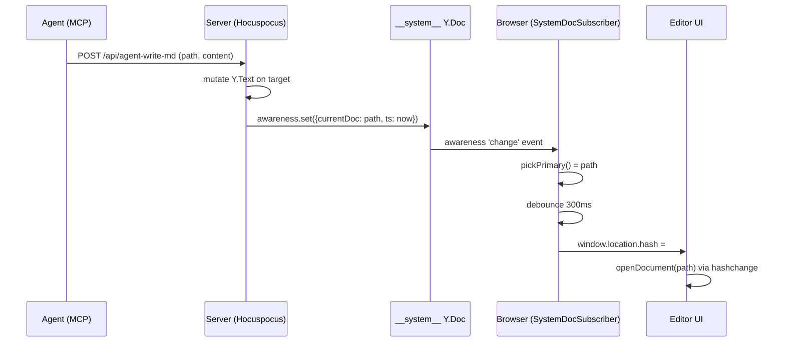
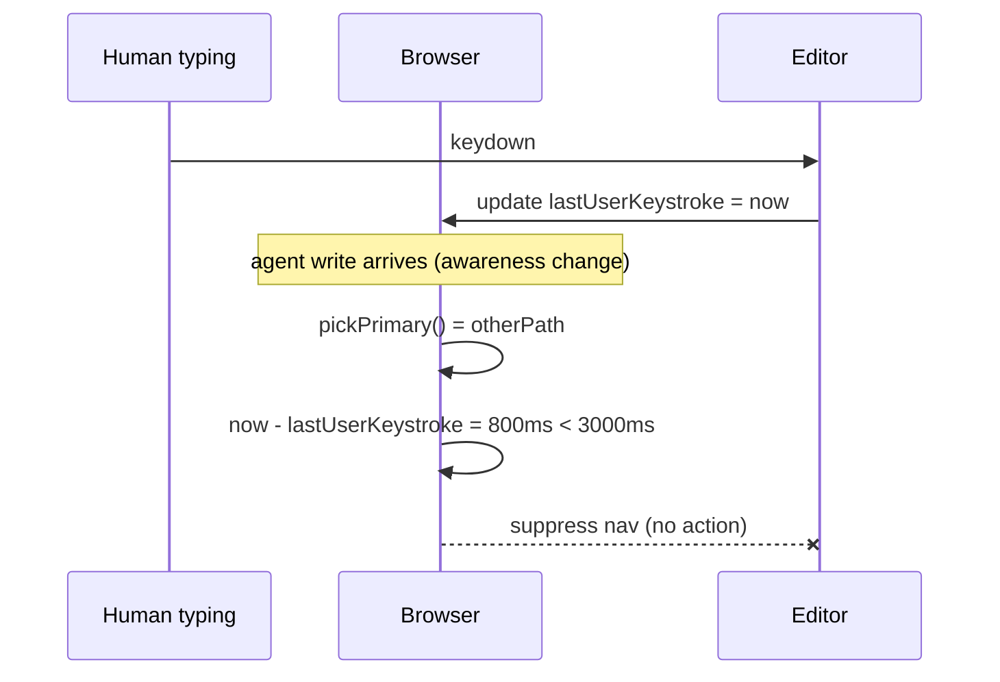
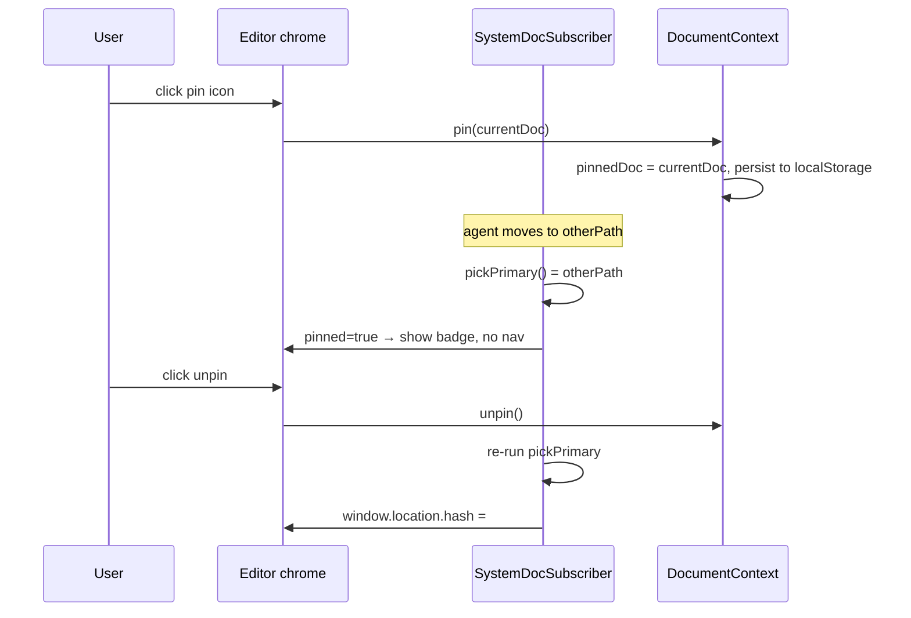

# Agent-driven browser navigation + cadence norms

**Baseline commit:** `892290a`

## 1. Problem (SCR)

**Situation.** Open Knowledge is built for human+agent co-editing of a wiki. Humans keep the editor open in a browser. Agents write to wiki docs via `write_document` / `edit_document` over MCP. The server runs on Hocuspocus; all state syncs via Yjs CRDT; a `__system__` Y.Doc already provides a global push channel to every connected browser (CC1 broadcast).

**Complication.** When an agent writes, the human can't see it unless they happen to already be viewing that document. They must poll the file sidebar, remember what the agent just said it would do, and click manually. With bursts across files, tracking is worse — the human can't tell *where the action is*. Agents also tend to batch — writing five files before updating any hub/index doc — so the human sees a blob of files appear with no story. Result: the collaboration feels like "agent mails files to disk," not pair-programming.

**Resolution.** Push-navigate the browser to the doc an agent is focused on, with care for bursts, user in-progress edits, and focus sovereignty. Pair the nav primitive with instruction-level cadence norms that encourage agents to maintain hub docs alongside children, so the nav *has something worth following*. The nav primitive and the cadence norms are complementary — nav alone on batched writes produces flicker; good cadence alone without nav produces invisible work. Together they make agent work legible in real time.

## 2. Goals

1. **Nav primitive:** when an agent writes to a wiki doc, the open browser session navigates to the primary file being edited, unless the user has pinned the current doc or is actively typing.
2. **Cadence norms:** ship instruction-level guidance that encourages agents to maintain hub docs (`INDEX.md`, `REPORT.md`, `SPEC.md`, etc.) as they create children, so the sequence of edits tells a narrative.
3. **Tool nudge:** `write_document` returns a lightweight hint when a new doc is orphaned, suggesting candidate parent hubs — makes the cadence norm the path of least resistance without forcing it.
4. **Zero new transport infrastructure.** Reuse the existing `__system__` Y.Doc + awareness protocol. Reuse the existing URL hash navigation. No new MCP tools in v1.

### Non-goals (NOT NOW)

- **Explicit `open_file(path)` MCP tool** — redundant with write side-effects for v1. Revisit if research-heavy sessions where agents read 20 files before writing prove common (see Future Work).
- **Multi-tab leader election** — single-tab behavior in v1. Each tab follows independently; if the user opens two tabs, both will nav, which is slightly messy but not broken (see Future Work).
- **Hard enforcement of cadence** (rejecting orphan writes, throttling bursts) — nav flicker is a sufficient feedback signal for bad cadence. Escalate only if soft nudges fail.
- **Presence-bar "follow this specific agent" click-to-override** — infrastructure exists (`PresenceBar.tsx`); deferred until multi-agent sessions are common enough to need the disambiguation.

### Non-goals (NEVER UNLESS)

- **Syncing agent focus across different human users.** Focus is a per-human UX preference, not shared state.
- **Automatic conflict resolution when two agents fight for primary.** Handled by "latest wins" — simple and correct enough.

## 3. In Scope / Out of Scope

### In Scope

| ID | Item | Why |
|----|------|-----|
| IS-1 | Awareness state channel on `__system__` carrying `{agentId, agentName, classification, currentDoc, writeKind, ts}` per agent session | Core transport |
| IS-2 | Server-side: per-agent `DirectConnection` to `__system__` at session start; awareness update on every `write_document` / `edit_document` | How the agent's focus gets broadcast |
| IS-3 | Client-side: extend `SystemDocSubscriber` to observe `__system__` awareness, compute primary focus (latest-wins + 300ms debounce), drive navigation via hash | How the browser consumes the signal |
| IS-4 | Pin/unpin UI in editor chrome; pin state persisted in localStorage | User sovereignty over "am I following?" |
| IS-5 | Pause-follow guard: suppress nav if user typed in the last 3 seconds | Don't yank focus during active editing |
| IS-6 | Instruction updates: N1 (hub-maintenance) + N4 (link-as-you-write — already shipped in PR #129) in `buildInstructions` and the appended `CLAUDE.md` section | Shape agent cadence |
| IS-7 | Tool nudge: `write_document` returns `{ok: true, hints: [{type: 'orphan', parentCandidates: [...]}]}` when a new doc has zero backlinks and a plausible hub exists in the same folder | Soft nudge for cadence |

### Out of Scope / Future Work

| ID | Item | Tier | Trigger to revisit |
|----|------|------|---------------------|
| FW-1 | Explicit `open_file(path)` MCP tool | Explored | Research-heavy sessions where reads drive the narrative |
| FW-2 | Multi-tab leader election (BroadcastChannel, single follower) | Identified | User reports double-nav friction |
| FW-3 | Presence-bar click-to-follow for specific agent (override latest-wins) | Identified | Multi-agent parallel sessions become common |
| FW-4 | Hard enforcement of cadence (throttle bursts, require hub update before next child write) | Noted | Soft nudges prove insufficient |
| FW-5 | Session worklog doc (`worklog.md`) as an alternative narrative surface | Noted | Hub-maintenance pattern proves brittle |
| FW-6 | Agent-visible "recent edits" summary in tool response | Noted | Agents show signs of losing track of their own edit history |

## 4. User journeys

### J1 — Solo human watching a single agent (primary journey)

1. Human opens editor at `#/README.md`.
2. Agent starts a session, begins research; writes `reports/r1/evidence/a.md`.
3. Awareness update propagates → 300ms debounce → browser navs to `a.md`. Activity-flash highlights the new content.
4. Agent updates hub: `reports/r1/REPORT.md`. Browser navs to `REPORT.md`. Human sees the new link appear.
5. Agent writes `reports/r1/evidence/b.md`; nav pulses there. Then back to `REPORT.md` with second link.
6. Human watches the pattern unfold. At any point, clicks the pin icon → stays on current doc while agent continues. Pin badge shows "Agent on X".
7. Human unpins → nav jumps to wherever the agent is now.

### J2 — Human actively editing while agent writes

1. Human is typing in `docs/auth.md`.
2. Agent writes to `reports/r1/evidence/a.md`.
3. Last-keystroke was <3s ago → nav suppressed. Pin indicator briefly shows "Agent writing elsewhere".
4. Human idles for 3s; next agent write triggers nav normally.

### J3 — Agent batching (undesired cadence — self-correcting)

1. Agent writes 5 files in 600ms without hub updates.
2. Nav flickers through the first 4 within the 300ms window, settles on the 5th.
3. Human experiences jarring UI. Reports back to agent: "please update the hub between children."
4. Agent adopts N1 pattern; subsequent sessions feel smooth.

### J4 — Fresh install

1. User runs `open-knowledge init` (already shipped in PR #129).
2. Root `CLAUDE.md` / `AGENTS.md` gets the OK block including the cadence norm: "update hub docs as you create children."
3. First Claude Code session reads the block, adopts the pattern naturally.

## 5. Surface-area map

### Product surfaces touched

| Surface | Change | Status |
|---------|--------|--------|
| Editor URL (hash) | Programmatic updates from awareness observer | New consumer of existing surface |
| Editor chrome | Pin/unpin button + "agent on X" badge when pinned | New UI |
| Presence bar (`PresenceBar.tsx`) | Ambient indication of active agents + their current focus | Enriched |
| `buildInstructions` (MCP handshake) | New "Cadence — maintain hubs as you write children" section | Content update |
| Appended `CLAUDE.md` section | Same cadence guidance for persistence across compaction | Content update |

### Internal surfaces touched

| File | Change |
|------|--------|
| `packages/server/src/api-extension.ts` | On `write_document` / `edit_document`, update per-agent awareness on `__system__` |
| `packages/server/src/agent-sessions.ts` | On session start: open per-agent `DirectConnection` to `__system__`, set initial awareness. On session end: release. |
| `packages/app/src/components/SystemDocSubscriber.tsx` | Extend to also subscribe to `__system__` awareness changes; drive nav |
| `packages/app/src/editor/DocumentContext.tsx` | New `pinnedDoc` + `isPinned` state; `setPinned(path)` action |
| `packages/app/src/editor/` (new or existing chrome component) | Pin icon + badge |
| `packages/cli/src/mcp/server.ts` | `buildInstructions` cadence section |
| `packages/cli/src/content/init.ts` | `CLAUDE_MD_SECTION` cadence guidance |
| `packages/server/src/api-extension.ts` (write handler) | Return orphan/parent-candidate hint in response body |

## 6. Technical design

### 6.1 Transport — awareness on `__system__`

Yjs awareness is a per-Y.Doc side-channel where each peer publishes an ephemeral state keyed by its `clientID`. Already in use for presence (human cursors, mode). Its properties match our needs:

- **Global reach:** every client subscribes to `__system__` on mount (via `ProviderPool`), so an awareness update there is seen by every tab.
- **Per-agent isolation:** each agent session gets its own `clientID`, so concurrent agents don't stomp each other's focus.
- **Auto-expiry:** if an agent's connection drops, its awareness entry is timed out and removed by the protocol — no stale-focus cleanup code needed.
- **No new transport:** the wire protocol, server infrastructure (pre-materialized `__system__` doc), and client subscription (`SystemDocSubscriber`) already exist.

**Awareness state shape (per agent session):**

```ts
{
  agentId: string;        // stable MCP-session-level ID
  agentName: string;      // human-readable ('claude-1', etc.)
  classification: 'agent'; // disambiguates from human peers on __system__
  currentDoc: string | null;  // relative path from content root, or null between writes
  writeKind: 'write' | 'edit' | null;  // which tool produced the update
  ts: number;             // Date.now() — used by latest-wins
}
```

### 6.2 Server-side wiring

**On agent session open (`AgentSessionManager`):**

```ts
// In addition to existing DirectConnection for agent's target docs
const systemDc = await hocuspocus.openDirectConnection('__system__');
systemDc.awareness.setLocalStateField('agent', {
  agentId, agentName, classification: 'agent',
  currentDoc: null, writeKind: null, ts: Date.now(),
});
agentSession.systemDc = systemDc;
```

**On every `write_document` / `edit_document` (in `api-extension.ts` handlers, after the Y.Text mutation):**

```ts
session.systemDc.awareness.setLocalStateField('agent', {
  agentId, agentName, classification: 'agent',
  currentDoc: targetPath,
  writeKind: 'write' | 'edit',
  ts: Date.now(),
});
```

**On session close:** release `systemDc` (awareness auto-clears via protocol timeout; explicit release is belt-and-suspenders).

### 6.3 Client-side wiring

Extend `SystemDocSubscriber.tsx`:

```ts
useEffect(() => {
  const awareness = provider.awareness;
  const onChange = () => {
    const primary = pickPrimary(awareness, Date.now());
    if (!primary) return;
    if (primary === activeDocName) return;
    if (pinned) { showBadge(`Agent on ${primary}`); return; }
    if (Date.now() - lastUserKeystroke < 3000) return;
    navigateTo(primary);
  };
  const debouncedOnChange = debounce(onChange, 300);
  awareness.on('change', debouncedOnChange);
  return () => awareness.off('change', debouncedOnChange);
}, [provider, activeDocName, pinned, lastUserKeystroke]);
```

**`pickPrimary` (latest-wins):**

```ts
function pickPrimary(awareness: Awareness, now: number): string | null {
  const agents = [...awareness.getStates().values()]
    .map(s => s.agent)
    .filter(a => a?.classification === 'agent' && a.currentDoc)
    .filter(a => now - a.ts < 5000);
  if (agents.length === 0) return null;
  agents.sort((a, b) => b.ts - a.ts);
  return agents[0].currentDoc;
}
```

**`navigateTo`:** `window.location.hash = toInternalHashHref(docName)` — uses existing helper (`packages/app/src/lib/doc-hash.ts`).

**`lastUserKeystroke`:** React ref, updated on every `input` / `keydown` in the editor root. No CRDT involvement.

### 6.4 Pin UX

- **State:** `DocumentContext` gets `pinnedDoc: string | null` + `pin(doc)` / `unpin()` actions. Persisted to `localStorage` under `ok-pin-v1`.
- **UI:** pin icon next to the document title in editor chrome. States:
  - Unpinned (default): outline icon, click to pin current doc
  - Pinned: filled icon, click to unpin
  - Pinned + agent elsewhere: filled icon with a small dot, hover tooltip "Agent on `<path>` — click to unpin and follow"
- **Unpin behavior:** on unpin, immediately re-run `pickPrimary` and nav if there's a live primary.

### 6.5 Cadence norms (instructions)

**New section in `buildInstructions(config)` (after the existing "Writing" section):**

```
## Cadence — maintain hubs as you create children

When you create or meaningfully edit a doc inside a folder that has a hub doc
(`INDEX.md`, `REPORT.md`, `SPEC.md`, or any top-level doc in that folder),
update the hub to reflect the change before moving to the next child. Write one
child → update hub → write next child. Don't batch five children and then the
hub.

Why: the browser follows your focus in real time. Hub-as-you-go makes your
work legible to the human watching — each pulse is a complete thought. Batched
writes make the nav flicker and hide the narrative.

Link-as-you-write (already emphasized): when the child references another doc,
include the `[[wiki-link]]` in the same edit. Don't batch links into a
"finalization pass."
```

**Parallel addition to `CLAUDE_MD_SECTION`** (appended to user's root `CLAUDE.md` / `AGENTS.md` by `init`): shorter version of the same — the persistent backup nudge.

### 6.6 Tool nudge (orphan + parent-candidate hint)

In `write_document` handler, after a successful create:

```ts
if (isNewDoc && backlinkCount === 0) {
  const candidates = findHubCandidates(targetPath);  // sibling or parent-folder hub docs
  if (candidates.length > 0) {
    response.hints = [{
      type: 'orphan',
      parentCandidates: candidates,
      message: `This doc is orphaned. Consider linking from a hub: ${candidates.map(c => `[[${c}]]`).join(', ')}`,
    }];
  }
}
```

**`findHubCandidates(path)`:**
1. Walk up from `dirname(path)` to content root.
2. At each level, look for well-known hub filenames: `INDEX.md`, `README.md`, `REPORT.md`, `SPEC.md`, or any file whose name matches the folder name (e.g., `reports/r1/r1.md`).
3. Return up to 3 candidates, nearest-first.

Agent sees the hint in the MCP response body. No enforcement — ignoring is fine; acting completes the cadence loop.

## 7. Sequence diagrams

### 7.1 Happy path — agent writes, browser follows



### 7.2 Guarded path — user is typing



### 7.3 Pin path



## 8. Acceptance criteria

### Nav primitive

1. Given an agent writes to `foo.md` and the human is viewing `bar.md`, the browser navigates to `foo.md` within 400ms (300ms debounce + ~100ms propagation).
2. Given an agent writes to `a.md`, `b.md`, `c.md` within a 300ms window, the browser navigates only once, to `c.md` (latest-wins).
3. Given the human has typed a character in the last 3 seconds, an agent write does not trigger navigation.
4. Given the human has pinned doc X, an agent write to doc Y does not trigger navigation. The pin badge shows "Agent on Y".
5. When the human unpins, the browser immediately navigates to the current agent primary (if any).
6. Given no active agent focus in the last 5 seconds, no navigation is triggered on stale entries.
7. Two concurrent agents writing to different docs produce a nav sequence of latest-wins transitions, never both at once.

### Cadence + nudge

8. `buildInstructions` output contains the "Cadence — maintain hubs" section.
9. After `open-knowledge init` on a fresh repo, root `CLAUDE.md` contains the cadence guidance in its appended block.
10. `write_document(new_orphan_path)` where a hub candidate exists returns a response body with `hints` array containing an `orphan` entry with `parentCandidates`.
11. `write_document(path_with_existing_backlinks)` returns no hints (not orphan).
12. `write_document(orphan_in_folder_with_no_hub)` returns no hints (no candidate).

### Multi-tab (v1 behavior)

13. Given two browser tabs on the same repo, an agent write causes *both* tabs to navigate (documented, not enforced single-tab). No error state. No user data loss.

## 9. Decision log

| # | Decision | Resolution | Evidence / rationale |
|---|----------|-----------|----------------------|
| D1 | Transport: awareness on `__system__` (vs. new CC1 channel, vs. activity Y.Map) | **LOCKED** | Awareness is global, per-peer, auto-expiring, and already wired. CC1 is pure-signal by contract (would fork semantics). Activity is per-doc (needs subscribe-everywhere). See `evidence/cc1-and-awareness-transport.md`. |
| D2 | Primary-focus heuristic: latest-wins + 300ms debounce | **LOCKED** | Matches pair-programming intuition ("watch the cursor now"). Debounce prevents burst flicker while still responsive. Alternative (first-wins) would "stick" to the opener, but that fights the mental model for follow-up edits. |
| D3 | UX: follow with pin (vs. always-follow, opt-in toggle, follow-with-undo) | **LOCKED** | Default captures the 90% case; pin gives sovereignty without hiding the feature; undo-toast would be noisy. Pin state is per-tab, localStorage-persisted. |
| D4 | User-edit guard: suppress nav if typed in last 3s | **LOCKED** | Prevents focus-yanking mid-edit. 3s is conservative; can tune down if users report "it's too slow to follow." |
| D5 | Multi-tab: single-tab v1, no coordination | **LOCKED** (v1 scope) | Leader election is ~20 lines of BroadcastChannel code, but adds a surface to test and maintain. Defer until user reports friction. Both tabs nav independently in v1 — documented, not bug. |
| D6 | Cadence norms: ship N1 (hub-maintenance) + N4 (link-as-you-write, already shipped) as instruction updates. Drop N2 (small edits — emergent from N1). Skip N3 (worklog — redundant with hubs). | **LOCKED** | N1 produces observable narrative by reusing the wiki's own hub structure — no new surface. Nav flicker is negative feedback for bad cadence (self-correcting loop). N3 is a parallel surface that duplicates hub semantics. |
| D7 | Tool nudge: `write_document` returns orphan + parent-candidate hint | **LOCKED** | Lightweight (no enforcement). Makes right behavior the path of least resistance. Cost: ~40 lines server-side. |
| D8 | Explicit `open_file(path)` MCP tool | **DEFERRED** (Future Work FW-1) | Every meaningful agent action already emits a nav-worthy side-effect. Adding a tool is surface area for uncertain payoff. Revisit if read-heavy sessions become a common pattern. |
| D9 | Enforcement: soft nudge only; no hard throttle on bursts | **LOCKED** | Nav flicker IS the feedback signal. Hard enforcement risks agent thrashing against rules and degrades tool reliability. |
| D10 | Awareness clientID strategy: one DirectConnection per agent session (vs. one server-wide + custom agent list) | **LOCKED** | Matches Yjs awareness's native per-peer model. N concurrent agents = N entries, auto-expire, no custom list management. |

## 10. Assumptions

| # | Assumption | Confidence | Verification plan |
|---|-----------|------------|-------------------|
| A1 | Opening a `DirectConnection` to `__system__` per agent session is cheap (local pipe; no wire cost) | HIGH | Confirmed by `CLAUDE.md` — `hocuspocus.openDirectConnection` is the documented pattern, already used for the server-side CC1 broadcaster. |
| A2 | `__system__` awareness is not tracked by the existing cross-cutting `isSystemDoc()` skip helper in a way that would filter out agent awareness updates | MEDIUM | Read `cc1-broadcast.ts` to confirm `isSystemDoc` only guards CRDT content sync, not awareness. If it does guard awareness, we'd need to except agent-focus awareness. |
| A3 | `SystemDocSubscriber` already has the `provider.awareness` reference, or can easily get it | HIGH | Component already uses `HocuspocusProvider`; awareness is a first-class provider field. |
| A4 | 300ms debounce is tight enough to feel live but loose enough to coalesce reasonable bursts | MEDIUM | Instrumented user test (or dogfood session). Adjustable. If bursts are <100ms typical, 300ms may be too loose. |
| A5 | Agent-classified awareness entries can be disambiguated from human-classified ones by a `classification: 'agent'` field | HIGH | Human awareness presumably doesn't set this field (or sets `'human'`); safe disambiguation. |

## 11. Risks

| # | Risk | Likelihood | Impact | Mitigation |
|---|------|-----------|--------|-----------|
| R1 | `__system__` awareness namespace collides with some other subsystem adding fields to it | LOW | MEDIUM | Use a nested field `agent: {...}` rather than flat fields; isolates our namespace. Already planned in §6.2. |
| R2 | Multi-agent awareness entries exceed some client-side rendering budget (e.g., 50 agents writing simultaneously) | LOW | LOW | Cap presence bar rendering at top-N-recent; `pickPrimary` is O(n) and fine for any realistic n. |
| R3 | User reports nav being "too eager" or "too slow" — debounce mis-tuned | MEDIUM | LOW | Make 300ms a constant in one place; iterate in v1.1 based on feedback. |
| R4 | Awareness updates during a session rename / cleanup leave stale entries | LOW | LOW | `ts < 5s` filter in `pickPrimary` handles stale; plus Yjs's own awareness timeout. |
| R5 | `write_document` response format change (adding `hints`) breaks an existing client | LOW | MEDIUM | New field is additive; old clients ignore it. Verify no schema enforcement on the response. |
| R6 | Agent instruction noise — adding N1 section dilutes the others | LOW | LOW | Keep the new section short (~6 lines). Monitor agent behavior to see if other sections are being followed less; iterate. |
| R7 | Hub-detection `findHubCandidates` produces bad suggestions (e.g., `README.md` at repo root for every orphan) | MEDIUM | LOW | Start with nearest-first walk; cap at 3 candidates; only suggest if the hub is a wiki doc (in `content.include`). If noisy, tighten. |

## 12. Observability

- **Metrics** (add to existing `metrics.ts`):
  - `agent_nav_signal_total{agent_id}` — count of awareness updates emitted.
  - `agent_nav_debounce_coalesced_total` — count of awareness updates suppressed by the 300ms debounce.
  - `agent_nav_suppressed_typing_total` — count of navs suppressed by the typing guard.
  - `agent_nav_suppressed_pin_total` — count of navs suppressed by the pin.
- **Logs:** server-side awareness updates at TRACE; no log spam in normal operation.
- **Client devtools:** existing awareness inspection via Y.Doc devtools extension; no new tooling.

## 13. Rollout

1. Land PR in one shot (all of §6 wiring + instructions + tool nudge). No feature flag — the behavior is additive; if broken, clients simply see no navigation (fallback to existing manual nav).
2. Dogfood with 2-3 parallel agent sessions: verify nav feels right, pin works, typing guard fires.
3. Tune debounce (D4 value, 300ms) based on dogfood feel.
4. If behavior is wrong in ways the spec didn't predict, revert or gate behind a config flag; revisit spec.

No backwards-compat concerns — awareness addition is a new field on a new classification; existing clients ignore unknown awareness fields.

## 14. Implementation plan (vertical slice)

Order of operations for one PR:

1. **Server — per-agent `__system__` DirectConnection** (`packages/server/src/agent-sessions.ts`)
   - On session start: open DC, set initial awareness.
   - On session close: release.
2. **Server — awareness update on writes** (`packages/server/src/api-extension.ts`)
   - After `write_document` / `edit_document` Y.Text mutation, set `currentDoc` / `writeKind` / `ts`.
3. **Server — orphan hint in response** (`api-extension.ts`, `write_document` handler only)
   - Compute `findHubCandidates`, attach `hints` array when orphan + candidate exists.
4. **Client — nav subscriber** (`packages/app/src/components/SystemDocSubscriber.tsx`)
   - Subscribe to awareness change; `pickPrimary`; debounce; nav with all guards.
5. **Client — pin state** (`DocumentContext.tsx` + new chrome component)
   - `pinnedDoc` state, localStorage, pin icon UI.
6. **Client — typing guard** (editor root event listener)
   - `lastUserKeystroke` ref, updated on keydown; read by subscriber.
7. **Instructions updates** (`packages/cli/src/mcp/server.ts`, `packages/cli/src/content/init.ts`)
   - Cadence section in `buildInstructions`; matching section in `CLAUDE_MD_SECTION`.
8. **Tests**
   - Unit: `pickPrimary` latest-wins, stale filter, empty-case.
   - Integration: multi-client scenario — two clients + server, agent writes, assert hash updates on the right client, not during typing.
   - Manual: dogfood with two tabs + real Claude session.

Estimated LOC: ~200 app, ~100 server, ~30 instructions, ~50 tests. One focused PR.

## 15. Agent constraints

**SCOPE:**
- `packages/server/src/agent-sessions.ts`
- `packages/server/src/api-extension.ts` (write_document / edit_document handlers only)
- `packages/app/src/components/SystemDocSubscriber.tsx`
- `packages/app/src/editor/DocumentContext.tsx`
- `packages/app/src/editor/` (add a small pin-button chrome component)
- `packages/cli/src/mcp/server.ts` (buildInstructions cadence section)
- `packages/cli/src/content/init.ts` (CLAUDE_MD_SECTION cadence guidance)

**EXCLUDE:**
- Multi-tab BroadcastChannel coordination (FW-2)
- New MCP tools (`open_file`) (FW-1)
- Hard enforcement (throttling, rejecting orphan writes) (FW-4)
- Worklog doc pattern (FW-5)
- Presence bar rework beyond passive display (FW-3)
- Any change to the CC1 broadcast contract (stays `{v:1,ch,seq}`)

**STOP_IF:**
- The implementation requires changing the CC1 payload shape.
- Awareness updates collide with `isSystemDoc()` skip logic (per A2) — needs cross-cutting audit.
- `write_document` response schema has enforcement (Zod validation) that would reject the new `hints` field.

**ASK_FIRST:**
- Any change to `buildInstructions` length >40 lines (keep cadence section tight).
- Moving any Future Work item (FW-1…FW-6) into v1 scope.
- Adding a config flag to gate the feature (default OFF would change rollout plan).

## 16. Open questions

None at spec finalization. A2 (awareness isSystemDoc interaction) is an assumption with a 5-minute verification during implementation; flag if it doesn't hold.

## 17. References

- `evidence/cc1-and-awareness-transport.md` — why awareness beats CC1 payload extension
- `evidence/nav-and-url-state.md` — URL hash as the nav mechanism
- `evidence/write-path-and-activity.md` — where agent writes land today and what side-effects they emit
- CLAUDE.md §CC1 push-over-awareness — existing transport background
- PR #129 — cadence norm N4 (link-as-you-write) already shipped in the appended CLAUDE.md block
