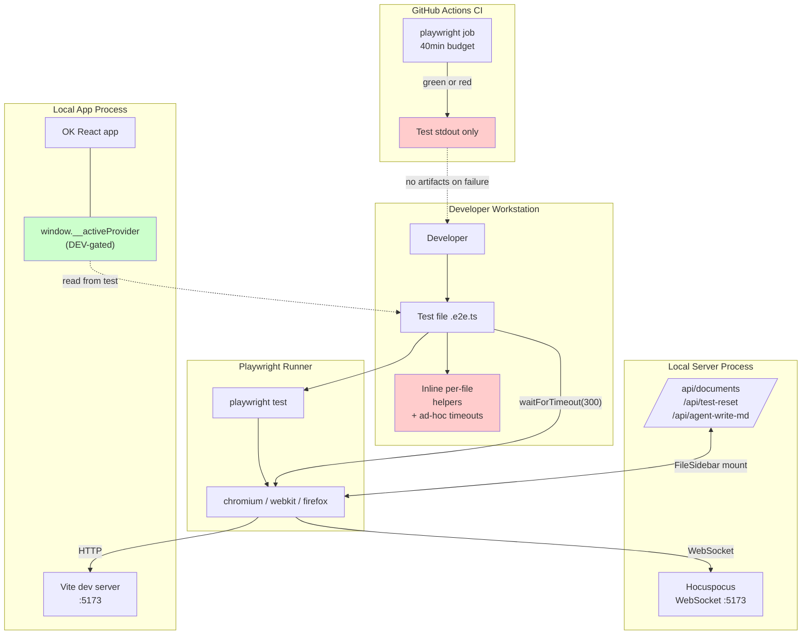
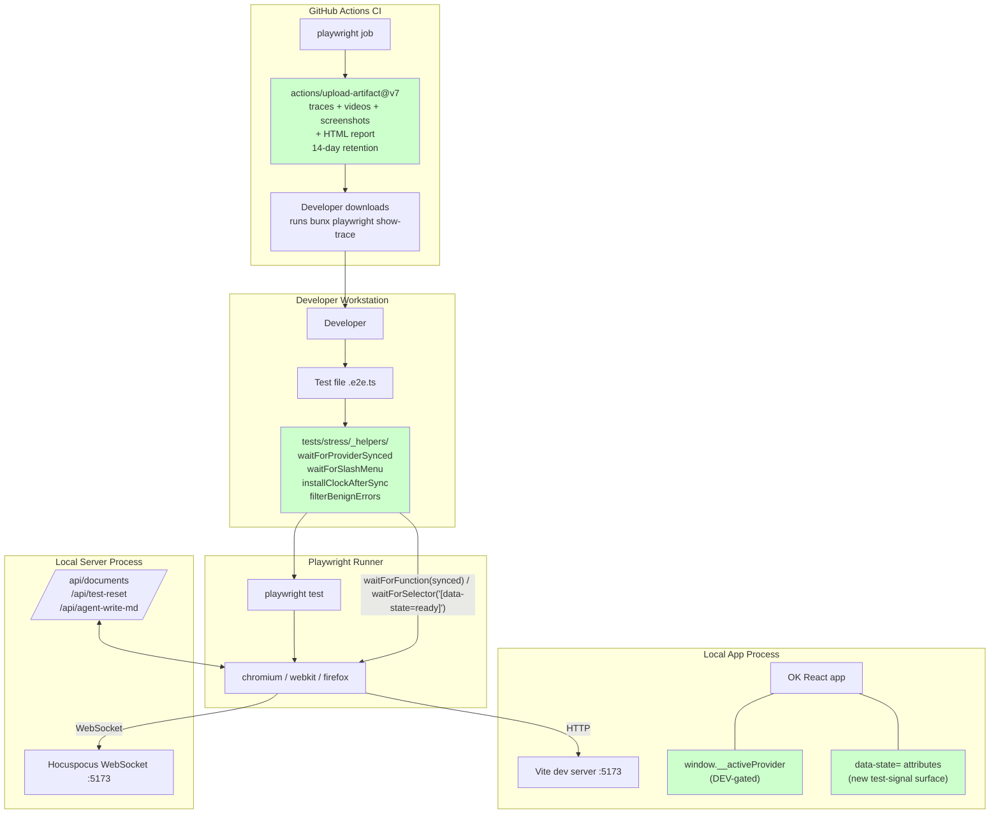

# E2E Observability + Determinism

**Status:** Draft (Phase 1 — intake)
**Baseline commit:** `432a834b`
**Branch:** `worktree-e2e-observability`

---

## §1 Problem Statement (SCR)

**Situation.** Open Knowledge's Playwright E2E suite (`packages/app/tests/stress/*.e2e.ts` — 13 files, 80+ tests, **chromium-only** after commit `940d5a0a` reverted the 3-browser matrix for 3× CI speedup at zero coverage loss) is the only test tier that exercises the editor end-to-end: TipTap + CodeMirror + Y.js + Hocuspocus + MCP + file-watcher together. Every PR runs this suite; failures are the gate between a code change and a merge.

**Complication.** The suite has accumulated three compounding test-infrastructure deficits plus a residual cluster of named flakes that together turn every E2E failure into a guessing game:

1. **Non-deterministic timing** — **73** `page.waitForTimeout(N)` magic sleeps across 6 files (44 concentrated in `slash-command.e2e.ts`, inventory verified 2026-04-17). These are hardcoded delays waiting for UI events we *could* detect directly. Under CI contention a 200ms "should be enough" sleep becomes 180ms of unfinished work plus a flaky assertion. When a test fails, the engineer can't tell whether the feature is broken or the runner was slow.

2. **Zero debuggability on failure** — `playwright.config.ts` has `retries: 0` and sets no `video`, `trace`, `screenshot`, or CI artifact upload. When a test fails in CI, the developer gets only the assertion message — no recording, no network log, no console capture, no DOM snapshot. Every flake investigation starts from scratch. We burned 2+ weeks of PR time during the clipboard-mdast-canonical PR on Playwright issues we couldn't actually observe.

3. **Named flakes on main CI** — Run `24548842566` (2026-04-17T05:19) shows 18 failures on main: 13 are PR #188 scope (wikiLink parseHTML priority, `wrapAsInlineCode`, `<pre>` assertion, CM6 empty-copy), 3 are distinct flakes (sidebar-folder `ux-interactions.e2e.ts:209`, QA-022 perf `paste-fidelity.e2e.ts:954`, crdt-stress S6 `crdt-stress.e2e.ts:21`), 1 is newly surfaced (F11 docs-open `docs-open.e2e.ts:428`), 1 has unclear category. The 13 PR #188 failures are addressed by our cherry-pick `6a4c92ea` (empirically verified locally: 37/38 paste-fidelity pass post-cherry-pick — see `evidence/main-ci-failure-inventory.md`). The 4 remaining flakes are root-cause investigation territory — two already empirically narrowed locally (`evidence/sidebar-folder-flake-triage.md`, `evidence/crdt-stress-s6-triage.md`).

These deficits amplify each other: without debuggability (G2) we can't diagnose timing flakes (G1); without timing determinism (G1) we can't separate retry-success from genuine green; without named-flake fixes (G3) the residual CI-failure rate doesn't converge.

**Resolution.** Ship three coupled foundations + the absorbed #188 fixes — one PR because they don't work independently:

- **G1 — Event-coupled waits.** Replace every `page.waitForTimeout(N)` with a condition-based wait. Prefer app-emitted signals (mutation observer, data-attributes, `waitForFunction` against product state) over DOM polling. Use `page.clock` only for debounce-settled waits (50ms Observer A, 300ms Observer B, 2s persistence) — never for CRDT / WebSocket / connection-lifecycle timing. Introduce test-only hooks (DEV-gated) only when the real signal doesn't exist.
- **G2 — Failure observability.** `retries: process.env.CI ? 2 : 0`, `failOnFlakyTests: !!process.env.CI`, `video: { mode: 'retain-on-failure', size: 1280×720 }`, `trace: 'on-first-retry'` (Playwright plurality — trace captures on retry 1, subsequent retries skip), `screenshot: 'only-on-failure'`, CI artifact upload of `test-results/` and the Playwright HTML report on failure. 14d retention. See D-Q5 / US-8 for canonical config shape; R4 tracks rollout risk.<br>_[Corrected 2026-04-19 post-ship: `failOnFlakyTests` flipped to global `false` — retry-success no longer fails the PR. Authoritative fix in `packages/app/playwright.config.ts` + full rationale in `specs/2026-04-17-e2e-observability-determinism/evidence/d-q5-amendment-2026-04-19.md` (driven by `specs/2026-04-19-ci-signal-quality/` D-Q3).]_
- **G3 — Named flake resolution.** Root-cause + fix for the 4 remaining flakes on main (sidebar-folder, QA-022 perf, crdt-stress S6, docs-open F11) + the `waitUntil: 'networkidle'` anti-pattern in `slash-command.e2e.ts:38`. Plus cleanup of 1 `waitUntil: 'networkidle'` usage (Playwright docs mark this pattern DISCOURAGED). Plus absorbed PR #188 fixes (4 of 5 landed via cherry-pick `6a4c92ea`; fix 1 obsoleted by PR #185's hash-nav architecture).

### SCR stress-test (5 probes)

| Probe | Answer |
|---|---|
| 1. Demand reality | **Real.** 2+ weeks of PR time burned during `clipboard-mdast-canonical` on Playwright fixes we couldn't observe. Documented CI history: `fddd7ed1` (25-min timeout from apt thrash), `3be3dc4f` (WebSocket noise filter), `ffaac1b3` / `02d1985a` (webkit skips), `913e2d7b` (fuzz timeout bump — separate from this spec's scope). Multiple agents (me, the playwright-stability worktree) are simultaneously addressing different slices of the same root rot. |
| 2. Status quo | **Cost of inaction is concrete.** Every future PR touching editor UX pays a debugging tax. Cross-browser coverage bitrot continues (webkit skips tend to accumulate, not close). Developer confidence in E2E CI drops; once confidence drops below a threshold, engineers start bypassing the gate — that is the failure mode to avoid. |
| 3. Narrowest wedge | G2 alone (~30 LoC of config + CI YAML) is valuable within one PR: the next failure is debuggable even if no other work ships. But G1 + G2 + G3 together are the coherent unit — without G1 we still burn CI runtime on flakes; without G3 we still forfeit webkit coverage. Ship as one spec. |
| 4. Observation | **Yes.** The user and I both observed the pattern through the clipboard PR. The investigation that produced this spec came directly from user observation: "can you pull origin main and see if any of these [CI issues] have been fixed?" → Explore agent survey → /assess-findings → this spec. |
| 5. Future-fit | **More essential over time.** Every new editor surface (graph, component-blocks, page-render-optimization, agent-undo) adds E2E tests. iOS mobile coverage (FR-21 in the clipboard spec) will eventually need a mobile project. Cross-browser test infra is a foundation that compounds. |

---

## §2 Personas / Consumer types

### Persona A: Contributor-developer (Nick + collaborators + agents via `/ship`)

- **JTBD:** Ship PRs confidently. Diagnose CI failures fast. Maintain cross-browser guarantees without manual labor.
- **Current workflow:** Open PR → watch CI → on failure, read the assertion message → guess why → push a fix → retry. Sometimes the fix is "bump the timeout" because there is nothing more specific to act on.
- **Pain points:** No video/trace on failure; every investigation starts from zero. Magic sleeps fail intermittently with no specific signal. Webkit skips erode cross-browser confidence.
- **Trust/security:** Low tolerance — test-only hooks that leak into prod bundles would be a regression against the existing `import.meta.env.DEV` discipline. CI artifacts must not leak secrets.
- **Success:** CI either passes or shows a debuggable failure with video + trace + screenshot. `grep -rn 'waitForTimeout' packages/app/tests/stress/*.e2e.ts` returns zero hits. Zero `test.skip(browserName === 'webkit', ...)` on business-logic E2E tests.

### Persona B: Future contributor adding a new E2E test

- **JTBD:** Write a reliable E2E test without knowing CI's timing quirks.
- **Current workflow:** Copy an existing E2E file → paste `page.waitForTimeout(300)` because it's the precedent → ships a flake.
- **Pain points:** Forced to learn the hidden rule "don't trust `waitForTimeout`" by investigating their own flake.
- **Success:** Shared helpers (`waitForSlashMenu`, `waitForProviderReady`, `waitForEditorEmpty`) encode the right pattern. Learning the right thing is the path of least resistance. Linter or STOP rule catches `waitForTimeout` at PR review time (or in `bun run check`).

---

## §3 Constraints

**Hard constraints:**
- **No duplication with playwright-stability.** The playwright-stability worktree (`specs/2026-04-17-playwright-stability/SPEC.md`) owns per-test docName isolation across 5 files (`crdt-stress.e2e.ts`, `list-keymap.e2e.ts`, `ux-interactions.e2e.ts`, `observer-a-multi-client.e2e.ts`, `reveal-on-activate.e2e.ts`) + the `mode:` → `position:` body-key fix + graph fixture scoping. This spec must NOT propose per-test docName isolation. Coordination: G1's `waitForTimeout` replacements in those 5 files will land AFTER their migration completes, or the two specs will rebase on each other at merge time.
- **Out of scope (user directive):** bridge-convergence fuzz work (`bridge-convergence.fuzz.test.ts` timeout, op kinds, slowness).
- **Out of scope (different root cause):** The 4th webkit skip at `slash-command.e2e.ts:713` ("menu repositions when editor container is scrolled") — that's a webkit overflow-scroll rendering delta, not a CORS race. Future Work item, noted.
- **Test-only code must tree-shake from prod.** Any test hook MUST be gated on `import.meta.env.DEV` so Vite statically eliminates it in production. Existing precedent: the `if (import.meta.env.DEV)` block in `packages/app/src/editor/DocumentContext.tsx`'s main `useEffect` (around line 247) wrapping `window.__activeProvider`, `window.__providerPool`, and `window.__test_*` hooks.
- **CI artifact storage budget.** GitHub Actions artifact storage is configurable but not free. Default retention is 90 days; we should pick something shorter for test-results.

**Soft constraints:**
- Minimize CI runtime impact. Video + trace capture can add ~20% wall-clock; `retain-on-failure` mode keeps cost near zero on green runs.
- Preserve the existing `test.skip(browserName === 'webkit', ...)` pattern at line 713 — do not re-skip that test, do not try to fix it in this spec's scope.

---

## §4 Initial Open Questions (first-pass — SUPERSEDED by §11)

> Note: this list is a Phase-1 snapshot kept for changelog continuity. §11 below is the canonical Phase-3 systematic extraction (42 items) with D-Q resolutions in §10.

Will be systematically extracted in Phase 3. Early candidates, not filtered for importance:

1. **G1 signal discovery.** For the 44 `waitForTimeout` calls in `slash-command.e2e.ts`, what are the actual events being waited for? (Menu-open after `/`, menu-filter after keystroke, menu-close after selection, etc.) Are they detectable via current DOM/ARIA state alone, or do we need new test hooks? — Technical / P0
2. **Webkit CORS root cause.** Is the failure triggered by `networkidle` waiting for the rejected fetch, or by the `pageerror` listener firing on the error? (These demand different fixes — `waitUntil` change vs. error filter.) — Technical / P0
3. **`resetEditor` vs. per-test create.** Should `resetEditor` (which reloads the page) be replaced with a pattern closer to the playwright-stability spec's `seedDocs` (which creates a new doc per test and avoids reload)? Would that resolve G3 as a side effect? — Cross-cutting / P0
4. **Shared helper extraction.** Should the fix pattern for G1 (condition-based waits) land as shared helpers in `tests/stress/_helpers.ts` or stay per-file? (The helper extraction would set precedent for every future E2E test.) — Technical / P0
5. **Retries policy.** `retries: 1` on CI — does a test that passes on retry fail the PR or not? Some teams treat any retry as a flake signal; others accept 1 retry silently. — Cross-cutting / P0
6. **Artifact retention.** How long to keep test-results/ videos + traces? 7 days, 14 days, 30 days? — Cross-cutting / P0
7. **Video format / quality.** Playwright defaults to `size: { width: 800, height: 450 }` for video; is that sufficient for debugging editor UX, or do we need full-viewport? — Technical / P2
8. **Trace mode.** `retain-on-failure` vs `on` vs `on-first-retry` — which semantics match our goal? — Technical / P0
9. **Webkit skip at line 713 (overflow-scroll rendering).** Is this genuinely a webkit rendering difference or a test-side brittleness (`toBeGreaterThan` on a delta that might be fragile)? — Technical / P2 (out of scope but worth noting)
10. **STOP-rule enforcement.** Should we add a test (similar to `wysiwyg-stop-rule.test.ts`) that mechanically fails CI if `waitForTimeout` reappears in the E2E suite? — Cross-cutting / P0
11. **Handoff vs. blocking on playwright-stability.** Should G1's migration of `waitForTimeout` in `list-keymap.e2e.ts`, `reveal-on-activate.e2e.ts` wait for playwright-stability to land first (they're going to rewrite those files anyway), or should we coordinate a pre-merge rebase? — Cross-cutting / P0
12. **Condition primitives.** `expect.poll` vs `page.waitForFunction` vs `locator.waitFor({ state: ... })` — which primitive is right per case, and should we document a decision tree? — Technical / P0
13. **Trace viewer UX for CI.** How does a developer actually view a trace from a downloaded artifact? Is `bunx playwright show-trace` sufficient or do we need to document a flow? — Cross-cutting / P2
14. **Retry flake rate signal.** Should we set `failOnFlakyTests` (Playwright v1.52+ setting) to surface retries as explicit flake signal rather than silent retry success? — Technical / P0<br>_[Corrected 2026-04-19 post-ship: same correction as the breadcrumb at §G2 above — `failOnFlakyTests: false` globally. Full rationale in `specs/2026-04-17-e2e-observability-determinism/evidence/d-q5-amendment-2026-04-19.md`.]_
15. **`fullyParallel` config.** Should we set `fullyParallel: true` explicitly now (playwright-stability is enabling `--workers=4` in their AC1)? — Cross-cutting / P2 (adjacent to playwright-stability scope)

---

## §5 Out of Scope (final — see §15 Future Work for details)

- **Per-test docName isolation** — PR #185 landed; we build on it.
- **`mode:` → `position:` body-key bug fixes** — PR #185 landed.
- **Graph fixture scoping** — PR #185 landed.
- **Bridge-convergence fuzz improvements** — user-excluded.
- **Cross-browser CI coverage** — user-accepted chromium-only posture; no nightly Tier 2 cross-browser.
- **Mobile / iOS real-device testing** — separate scope (requires BrowserStack).
- **(Absorbed into scope per challenger finding — see US-26):** DEV-gating `__agentFlashState` / `__graphHarness`. Previously classified as §15 Future Work, but greenfield directive says absorb — ~20 LoC including a grep-test STOP rule.

## §5b Scope takeover — subsuming PR #188

Per the user directive "take over anything needed to get playwright tests into a good place, which can include prod code fixes," this spec subsumes the full scope of [PR #188](https://github.com/inkeep/open-knowledge/pull/188). Its 5 fixes are absorbed into this spec's implementation:

1. **Sidebar locator fix** → **obsolete for slash-command.e2e.ts per §6a row 1** (PR #185's hash-nav architecture eliminated the strict-mode vector entirely — verified: `grep -n "getByRole('button'" packages/app/tests/stress/slash-command.e2e.ts` returns 0 matches). US-1 still extracts `sidebarFileButton(name)` into `_helpers/sidebar.ts` for the one residual call-site in `ux-interactions.e2e.ts` plus future tests.
2. **Branch C wikiLink parseHTML priority-100 rule** → ported into `packages/core/src/extensions/wiki-link.ts` as-is; with reviewer-flagged `resolved: false` parity verification against existing `span[data-wiki-link]` rule.
3. **`wrapAsInlineCode` helper** → ported into `packages/core/src/markdown/index.ts`; with new unit tests covering all children-shape paths (reviewer flagged as Consider item).
4. **FR-19 `<pre>` → `<pre` assertion loosening** → absorbed into paste-fidelity.e2e.ts refactor.
5. **FR-15 Source empty-selection `preventDefault()`** → ported into `packages/app/src/editor/clipboard/source-clipboard.ts` as-is.

**Coordination:** message Andrew, close PR #188 with cross-reference to this spec's PR. One cohesive architectural unit.

## §5c Broadened scope — CI-stability end-to-end

Per user directive "we're taking over everything needed to get playwright tests into a good place, which can include prod code fixes etc. if determined there are bugs or issues there." The spec's mission is **Playwright CI stability, wherever the root cause lives** — test code, app code, server code, CRDT layer. The boundary is causal linkage to Playwright test stability, not file type.

**In scope as a consequence:**
- Root-cause fixes for sidebar-folder flake (may land in `FileSidebar.tsx` / `SidebarMenuAction` / Activity wiring if investigation finds React-tree source).
- Root-cause fix for `crdt-stress S6` flake (may land in `packages/server/` Hocuspocus reconnect handling if investigation finds server source).
- Root-cause fix for QA-022 perf flake (may land in `chunked-insert.ts` or observer bridge if investigation finds real regression; baseline-relative test architecture otherwise).
- Any other residual flake surfaced during implementation — treated as an implementation sub-task, not a scope re-open.

**Guardrails:**
- Orthogonal improvements in touched files remain out of scope (no kitchen-sinking).
- Breaking feature changes escalate as product calls, not autonomous fixes.
- Areas with no causal link to a Playwright flake stay out of scope.

---

## §6 Requirements

### §6a Baseline (absorbed — no iteration work)

Commit `6a4c92ea` (cherry-picked from PR #188's `ab3a6c72`, Andrew Mikofalvy authorship preserved) landed on this branch before `/ship` begins. These items are **prerequisite state, not user stories** — `/decompose` must NOT enumerate them in spec.json. `/ship`'s implement loop operates against the post-cherry-pick tree.

The 5 absorbed fixes (4 landed; 1 obsolete):

| # | Fix | Files | Status in our branch |
|---|---|---|---|
| 1 | **Sidebar locator strict-mode (6-site inline fix)** | slash-command.e2e.ts | **Dropped during cherry-pick conflict resolution** — PR #185 landed an architectural alternative (hash-URL navigation, no sidebar click) that eliminated the strict-mode vector entirely. Andrew's Fix 1 is obsolete post-#185. Conflict resolution took HEAD (post-#185 hash-nav). |
| 2 | **Branch C wikiLink parseHTML priority-100 rule** | packages/core/src/extensions/wiki-link.ts | Landed. US-3 below adds the explanatory comment addressing #188's reviewer Major on `resolved: false` divergence. |
| 3 | **`wrapAsInlineCode` helper + `markHandlers.code` replacement** | packages/core/src/markdown/index.ts | Landed. US-4 adds unit tests addressing #188's reviewer Consider. US-5 audits sibling mark handlers for the same pattern (verified during spec Phase 2: `fromPmMark` passes children through; `emphasis`, `strong`, `delete`, `link` unaffected — no extension needed). |
| 4 | **FR-19 `<pre>` → `<pre` assertion loosening** | paste-fidelity.e2e.ts | Landed. US-6 optionally tightens to `/<pre[\s>]/` regex. |
| 5 | **FR-15 Source empty-selection `preventDefault()`** | packages/app/src/editor/clipboard/source-clipboard.ts | Landed. US-7 opens a product-review OQ: is empty-selection-as-no-op the right UX, or should CM6's line-copy default survive? |

### §6b User Stories (iteration work for /ship)

These become `spec.json` entries via `/decompose`. Numbering is ordered by dependency (earlier stories gate later ones).

- **US-1: Extract `sidebarFileButton(name)` into `_helpers/sidebar.ts`.** Addresses #188 reviewer Minor. Consolidates the post-#185 sidebar-listitem pattern that appears in multiple tests (ux-interactions.e2e.ts line ~223, any future E2E test that clicks the sidebar). Zero-behavior-change refactor.
- **US-2: Bootstrap `packages/app/tests/stress/_helpers/` directory** with the canonical shape: `sidebar.ts`, `editor-state.ts`, `provider.ts`, `slash-menu.ts`, `clipboard.ts`, `error-filters.ts`. Minimum viable exports; grow as later stories need them.
- **US-3: Document `resolved: false` divergence in `a.wiki-link[data-target]` parseHTML rule.** Inline code-comment explaining why it differs from `span[data-wiki-link]` (clipboard hast drops `data-resolved`; paste-in must re-resolve). Addresses #188 reviewer Major.
- **US-4: Unit tests for `wrapAsInlineCode` covering all children-shape paths.** Empty, text-only, wrapper-link, wrapper-strong, wrapper-emphasis, wrapper-delete, heterogeneous multi-child. Addresses #188 reviewer Consider.
- **US-5: Verify mark-handler audit finding (no extension to other markHandlers).** Evidence: `fromPmMark`'s pass-through behavior confirmed via `@handlewithcare/remark-prosemirror/lib/mdast-util-from-prosemirror.js:108-117`. Document in a single-line comment next to `markHandlers.code` noting that the flatten pattern is unique to this mark because `inlineCode` is a leaf-type.
- **US-6: FR-19 assertion regex tightening** in paste-fidelity.e2e.ts (`toMatch(/<pre[\s>]/)` rather than `toContain('<pre')`). Prevents false positives on `<pressure>`/`<prefer>`.
- **US-7: Open Question — FR-15 product review.** Surface in §11: should empty-selection-copy truly be no-op (current post-#188 behavior), or should CM6's line-copy default have remained? Non-blocking — flag for product team.
- **US-8: G2 — Playwright config observability.** Per D-Q5/D-Q7/D-Q8/D-Q9: `retries: process.env.CI ? 2 : 0`, `failOnFlakyTests: !!process.env.CI`, `use.video: { mode: 'retain-on-failure', size: { width: 1280, height: 720 } }`, `use.trace: 'on-first-retry'`, `use.screenshot: 'only-on-failure'`, `reporter: [['html', { open: 'never' }], ['list'], process.env.CI ? ['github'] : null].filter(Boolean)`, `forbidOnly: !!process.env.CI`, `fullyParallel: true`, `workers: process.env.CI ? 4 : undefined`.<br>_[Corrected 2026-04-19 post-ship: same correction as the breadcrumb at §G2 above — `failOnFlakyTests: false` globally. Full rationale in `specs/2026-04-17-e2e-observability-determinism/evidence/d-q5-amendment-2026-04-19.md`.]_
- **US-9: G2 — CI artifact upload.** `.github/workflows/ci.yml` playwright job: add two `actions/upload-artifact@v7` steps — HTML report on `!cancelled()`, test-results on `failure()`. `retention-days: 14`.
- **US-10: ~~G3 cleanup — remove dead webkit skips~~ (RESOLVED).** Commit `940d5a0a` ("perf(ci): revert multi-browser to chromium-only") already deleted all 4 `test.skip(browserName === 'webkit', ...)` calls in `slash-command.e2e.ts` on 2026-04-16 — before this spec started. Verified: `grep -rn "test.skip(browserName === 'webkit'" packages/app/tests/stress/*.e2e.ts` returns 0. **No implementation work.** Kept in §6b as documentation of scope that was already absorbed upstream. AC-5 remains as a zero-tolerance ratchet preventing re-introduction.
- **US-11: G1 — `slash-command.e2e.ts` migration.** Replace all 44 `page.waitForTimeout(N)` with condition-based waits. Introduce `waitForSlashMenuOpen`, `waitForSlashMenuFiltered(query)`, `waitForSlashMenuClosed` helpers. Largest file by count. **Pre-mapping requirement** (per Phase 5 challenger finding 3.US-11): before migration begins, /ship Phase 3 produces `evidence/slash-command-waitfortimeout-sitemap.md` — a site-by-site table listing each of the 44 `waitForTimeout` occurrences, the underlying signal being waited on, and the chosen replacement primitive per D-Q1's category (A debounce-settled / B menu render / C selection-flush / D CRDT propagation). The sitemap lands as committed evidence BEFORE code changes start, so reviewers can sanity-check the mapping without reading the diff.
- **US-12: G1 — `paste-fidelity.e2e.ts` migration.** Replace 19 `waitForTimeout` + the in-helper `waitForTimeout(50)` after `Meta+a` (selection-flush race). Introduce `selectAllAndWaitForSelection` helper.
- **US-13: G1 — `list-keymap.e2e.ts` migration.** Replace 5 `waitForTimeout`. File was rewritten by #185; helpers may already cover some cases.
- **US-14: G1 — `reveal-on-activate.e2e.ts` migration.** Replace 2 `waitForTimeout`.
- **US-15: G1 — `docs-open.e2e.ts` migration.** Replace 2 `waitForTimeout`.
- **US-16: G1 — `mid-type-recovery.e2e.ts` migration.** Replace 1 `waitForTimeout`. (Note: `source-polish.e2e.ts` had 1 in prior snapshots but currently has zero — PR #185 or an earlier cleanup removed it. Inventory re-verified 2026-04-17 via `grep -c "page.waitForTimeout("` per-file.)
- **US-17: G1 — `waitUntil: 'networkidle'` migration.** Replace the single occurrence in `slash-command.e2e.ts:38` (`resetEditor`'s `page.reload({ waitUntil: 'networkidle' })`) with `domcontentloaded` + explicit readiness wait (e.g., `__activeProvider?.synced === true`). Verified 2026-04-17: `grep -rn "waitUntil: 'networkidle'" packages/app/tests/stress/*.e2e.ts` returns 1 match. The STOP rule (D-Q14) + AC-4 keep the pattern banned across the full suite going forward.
- **US-18: `installClockAfterSync` helper + opt-in pattern.** In `_helpers/provider.ts`. Document the usage contract (post-sync only; never in connection-lifecycle tests). Included here even if no tests immediately adopt it — sets the precedent + pattern for future use.
- **US-19: Sidebar-folder flake — root-cause investigation + fix.** **Empirical narrowing (2026-04-17):** flake reproduces 3/3 locally under `--workers=1 --repeat-each=3` — deterministic, not parallelism-dependent. See `evidence/sidebar-folder-flake-triage.md`. Hypothesis ranking refined: **H1 (most likely)** — render-time side effect in `FileTree.tsx:609-615` clears `userCollapsed` on `activeNavigationPath` change, creating a state-clearing race when user collapses a folder whose descendant is the active doc; **H2** React Compiler memoization stale closure; **H3** sticky `:active` pseudo-class blocking chevron re-render. Fix likely 5-20 LoC in `FileTree.tsx` (move render-time `setUserCollapsed(new Set())` into a `useEffect`). /ship Phase 3 verifies H1 via instrumented trace; landing fix + regression test.
- **US-20: crdt-stress S6 flake — root-cause investigation + fix.** Examine actual failure signatures on current main CI runs. May be WebSocket reconnect-noise filter insufficiency, Hocuspocus reconnect-timing bug (server-side), or CRDT convergence issue. Fix lands wherever root cause lives.
- **US-21: QA-022 architectural upgrade — baseline-relative perf assertion.** Empirical data (2026-04-17 local run): QA-022 passes in 2.2s locally but fails on main CI run 24548842566 — classic CI-runner-speed sensitivity, which the baseline-relative design addresses. Mirror the CLAUDE.md perf-gate precedent at `packages/core/tests/perf/baseline.json` (assertion pattern: `p50 < max(2× p50Baseline, absolute-floor)`). Specifics: (a) **baseline source:** capture from 5 consecutive clean CI runs on main post-merge (not local); use the **median-of-5 p50** as the canonical `p50Baseline`. (b) **tolerance:** `p50 < max(2 × p50Baseline, 32ms)` (absolute floor honors 60fps budget). (c) **update protocol:** document in `tests/stress/perf-baseline-update.md` — baseline updates on demonstrated perf improvement (≥20% median drop across 5 runs) or after a large editor refactor; user approval for each update; baseline is append-only history with git blame trail. (d) **relocation:** QA-022 stays in PR-time CI (provides regression signal); `test.slow()` wrapper ensures Playwright's default 120s timeout accommodates chunked insertion + flush measurement on contended runners.
- **US-22: STOP rule — mechanical enforcement test.** `packages/app/tests/integration/e2e-stop-rules.test.ts` mirroring `wysiwyg-stop-rule.test.ts`'s **per-pattern** shape (one `test()` per banned pattern, aggregating violations by file for actionable failure messages). Enforces D-Q14's full banned set — 4 patterns — plus the webkit-skip ratchet: `page.waitForTimeout(`, `waitUntil: 'networkidle'`, `new Promise(resolve => setTimeout(resolve,`, `page.pause(`, `test.skip(browserName === 'webkit'`. No allowlist. Per-pattern failure messages read "X pattern found in file Y:line Z" for precise enforcement.
- **US-23: AGENTS.md precedent #20 — E2E test-infra conventions.** Document: condition-based waits only, DEV-gated test hooks, data-state attribute convention, `_helpers/` directory structure, CI artifact upload on failure, `installClockAfterSync` opt-in, STOP rule enforcement.
- **US-24: Changeset entry.** `.changeset/e2e-observability-determinism.md` — user-facing description of the CI stability improvements.
- **US-25: F11 docs-open flake — root-cause investigation + fix.** `tests/stress/docs-open.e2e.ts:428` ("F11: rapid sequential navigation converges to final click") confirmed failing on main CI run 24548842566. Newly surfaced during Phase 4 investigation (`evidence/main-ci-failure-inventory.md`). Reproduce under `--workers=4 --repeat-each=10`. Likely categories: React 19 Suspense boundary race, hash-nav dedup race (multi-click coalescing), CRDT provider re-init race. Fix lands wherever root cause lives.
- **US-26: DEV-gate remaining ungated `window.__*` hooks** (absorbed from §15 per greenfield directive + Phase 5 challenger). Wrap `window.__agentFlashState` (`packages/app/src/editor/TiptapEditor.tsx:277`) and `window.__graphHarness` (`packages/app/src/components/GraphView.tsx:796`) in `if (import.meta.env.DEV) { ... }` blocks matching the convention in `DocumentContext.tsx` (see `if (import.meta.env.DEV)` block in that file's main useEffect). Also extend US-22's STOP rule to grep-ban unconditional `window.__` writes in `packages/app/src/**` (excluding already-DEV-gated sites via a whitelist file). Effort: ~10 LoC + 1 STOP rule assertion.
- **US-27: `fr-7a-disconnect-source-mode.e2e.ts` audit under new CI regime.** Per Phase 5 challenger 1.5 — file uses `page.routeWebSocket` for disconnect simulation (timing-sensitive), has 0 `waitForTimeout`, not in the #188/#185/QA-022/S6 flake set but untested under `retries: 2 + failOnFlakyTests: true`. US-27 = read + annotate: verify no hidden timing assumptions that would fail flaky under the new regime. If found, add condition waits. If not, document as audited-clean in `AGENTS.md` precedent #20.<br>_[Corrected 2026-04-19 post-ship: the `failOnFlakyTests: true` regime this audit was written against no longer applies — same correction as the breadcrumb at §G2 above. Audit's usefulness is unaffected; re-scope against `retries: 2 + failOnFlakyTests: false`. Full rationale in `specs/2026-04-17-e2e-observability-determinism/evidence/d-q5-amendment-2026-04-19.md`.]_
- **US-28: Workers calibration measurement.** Before locking `workers: 4`, /ship runs the full Playwright suite on CI at `workers: 1`, `workers: 2`, `workers: 4` (3 consecutive runs each) and records median, p50, p95 runtime in `evidence/workers-calibration.md`. D-Q7 value remains `4` if no contention; downgrades to `2` if `workers: 4` shows higher flake rate OR higher runtime variance than `workers: 2`.
- **US-29: Nightly Tier 2 stability workflow.** Add `.github/workflows/nightly-e2e-stability.yml` running `bunx playwright test --repeat-each=3 --workers=4` on main at 09:00 UTC daily. Auto-opens a GitHub issue labeled `e2e-flake` when any test fails (using `actions/github-script` for issue creation). Per D-Q41 — closes the post-merge trend-signal gap that `failOnFlakyTests` alone doesn't cover.<br>_[Corrected 2026-04-19 post-ship: after the 2026-04-19 revisit (same correction as the breadcrumb at §G2 above), this nightly workflow is now the **primary** flake-detection tier, not a supplement. Full rationale in `specs/2026-04-17-e2e-observability-determinism/evidence/d-q5-amendment-2026-04-19.md`.]_
- **US-30: Pull clipboard spec §13 annotation into this PR.** Per D-Q33 — update `specs/2026-04-16-clipboard-mdast-canonical/SPEC.md` §13 Deployment row "Cross-browser" + §13 Risks "Cross-browser differences in sync event preventDefault semantics" to reflect chromium-only acceptance. Cross-reference this spec. Lands in THIS PR's diff, not a follow-up — greenfield directive prohibits deferred documentation.

### §6c Acceptance Criteria (cross-cutting, /qa-plan derives scenarios from these)

- **AC-1:** `bun run check` green on the branch (13/13 turbo tasks).
- **AC-2:** `bunx playwright test` passes on chromium with **zero retries**, three consecutive full-suite runs.
- **AC-3:** `grep -rn "page.waitForTimeout(" packages/app/tests/stress/*.e2e.ts` returns **empty**.
- **AC-4:** `grep -rn "waitUntil: 'networkidle'" packages/app/tests/stress/*.e2e.ts` returns **empty**.
- **AC-5:** `grep -rn "test.skip(browserName === 'webkit'" packages/app/tests/stress/*.e2e.ts` returns **empty**.
- **AC-6:** On CI failure, `playwright-report/` and `test-results/` artifacts are uploaded with 14-day retention.
- **AC-7:** QA-022 passes under the baseline-relative architecture (no hardcoded absolute threshold).
- **AC-8:** `ux-interactions.e2e.ts` sidebar-folder test passes under `--workers=4 --repeat-each=10` (30 attempts, 0 failures).
- **AC-9:** `crdt-stress.e2e.ts` S6 multi-turn test passes under `--workers=4 --repeat-each=10`.
- **AC-10:** Mechanical STOP-rule test (`e2e-stop-rules.test.ts`) passes with zero allowlist entries.
- **AC-11:** `wrapAsInlineCode` has ≥6 unit tests (empty, text-only, link-wrapper, strong-wrapper, emphasis-wrapper, heterogeneous).
- **AC-12:** Full Playwright suite completes in ≤15 min CI budget (envelope constraint, not pass/fail assertion — the `.github/workflows/ci.yml` `timeout-minutes: 15` is the backstop; a timeout = CI red). US-28 (workers calibration) validates we stay well under with `retries: 2` + `workers: 4` enabled.
- **AC-13:** `docs-open.e2e.ts` F11 rapid-navigation test passes under `--workers=4 --repeat-each=10`.
- **AC-14:** Workers-calibration evidence exists at `evidence/workers-calibration.md` — median runtime at `workers: 1`, `2`, `4` over 3 consecutive post-merge CI runs, used to validate D-Q7's chosen value. If empirical data shows contention at `workers: 4`, D-Q7 downgrades.
- **AC-15:** Nightly Tier 2 stability job (`.github/workflows/nightly-e2e-stability.yml`) exists, runs `bunx playwright test --repeat-each=3` on main at 09:00 UTC, auto-opens an `e2e-flake`-labeled issue on failure.
- **AC-16:** Clipboard spec's §13 Deployment + §13 Risks cross-browser rows updated in THIS PR's diff per D-Q33. `grep -n "paste-fidelity.e2e runs on all three" specs/2026-04-16-clipboard-mdast-canonical/SPEC.md` returns empty.
- **AC-17:** `grep -n "window.__agentFlashState\s*=" packages/app/src/editor/TiptapEditor.tsx` match is inside an `if (import.meta.env.DEV)` block per US-26. Same for `window.__graphHarness` in `GraphView.tsx`.

## §7 Non-Goals

- **Per-test docName isolation.** Done by PR #185; baseline.
- **`mode:` → `position:` body-key fixes.** Done by PR #185.
- **Cross-browser CI coverage.** User-accepted chromium-only; no nightly Tier 2.
- **Mobile / iOS real-device testing.** Separate scope.
- **Bridge-convergence fuzz improvements.** User-excluded.
- **(REMOVED from Non-Goals — now US-26.)** DEV-gating for `__agentFlashState` / `__graphHarness`. Absorbed per Phase 5 challenger + greenfield directive.
- **Line-713 webkit overflow-scroll skip.** Dead under chromium-only after commit `940d5a0a`; underlying CSS-rendering difference becomes moot for CI.
- **Kitchen-sink refactors in touched files.** If we touch `wiki-link.ts` for US-3, we don't refactor unrelated parseHTML rules.

## §8 Current State

**Baseline commit:** `6a4c92ea` (post-cherry-pick from PR #188 + post-PR-#185 merge, origin/main ≤ `a25b3ee4` chromium-only). Sources: codebase inventory `evidence/current-state-inventory.md`, main-CI-failure-inventory `evidence/main-ci-failure-inventory.md`, sidebar-folder triage `evidence/sidebar-folder-flake-triage.md`, crdt-stress S6 triage `evidence/crdt-stress-s6-triage.md`, research report `reports/playwright-e2e-observability-determinism-best-practices/REPORT.md`.

### E2E test suite shape

- **13 files, 5,598 LoC, 134 tests** in `packages/app/tests/stress/*.e2e.ts` (LoC re-verified 2026-04-17).
- **73 `page.waitForTimeout(N)` calls** across 6 files (`grep -c "page.waitForTimeout(" <file>` 2026-04-17): `slash-command.e2e.ts` (44), `paste-fidelity.e2e.ts` (19), `list-keymap.e2e.ts` (5), `reveal-on-activate.e2e.ts` (2), `docs-open.e2e.ts` (2), `mid-type-recovery.e2e.ts` (1). Remaining 7 files (`crdt-stress`, `ux-interactions`, `observer-a-multi-client`, `graph-panel-surfaces`, `source-polish`, `outline-navigation`, `fr-7a-disconnect-source-mode`) have zero call sites; `source-polish.e2e.ts:198` is a COMMENT match only.
- **Zero `test.skip(browserName === 'webkit', ...)` calls** (commit `940d5a0a` on 2026-04-16 deleted all 4 previously at `slash-command.e2e.ts:224/270/477/713` when the 3-browser matrix collapsed to chromium-only). A stale residual comment at `slash-command.e2e.ts:262` references the deleted CORS race — cleanup candidate (see US-17).
- **`waitUntil: 'networkidle'`**: 1 occurrence remaining at `slash-command.e2e.ts:38` (`resetEditor`'s `page.reload({ waitUntil: 'networkidle' })`). PR #185 and prior cleanups eliminated the others. Still flagged as DISCOURAGED per Playwright docs and banned by D-Q14 / AC-4.

### Shared test infrastructure

- **No `_helpers/` directory today.** Each `.e2e.ts` file inlines its own fetch wrappers (`/api/test-reset`, `/api/agent-write-md`, `/api/create-page`), locator definitions, and readiness-wait helpers.
- **Reference pattern exists in one place:** `docs-open.e2e.ts` has clean `seedDocs` / `createPage` / `replaceDoc` / `waitForActiveProviderSynced` helpers that the playwright-stability concurrent spec is migrating every other file toward. These helpers are the correct prior art but not yet a shared module.
- **`synthetic.ts`** exists for server-side stress testing (`stress-api.ts`) but is unused by Playwright files.

### Test-only app hooks (precedent)

`DocumentContext.tsx` (the `if (import.meta.env.DEV)` block in the main `useEffect`, around line 247) establishes the canonical DEV-gating pattern:

```typescript
if (import.meta.env.DEV) {
  window.__providerPool = p;
  Object.defineProperty(window, '__activeProvider', { get: () => ... });
  window.__test_rejectSyncPromise = ...;
  window.__test_armPendingRejection = ...;
  window.__test_closeActiveWebSocket = ...;
}
```

Vite statically replaces `import.meta.env.DEV` at build time; production bundles tree-shake the branch entirely. Current tests rely on `__activeProvider.isSynced` as the primary "editor ready" signal — used in `ux-interactions.e2e.ts` (10+ calls) and via the `waitForActiveProviderSynced` helper in `docs-open.e2e.ts`.

**Ungated-hook debt** — absorbed into this spec's scope per Phase 5 challenger + greenfield directive (see US-26). `__agentFlashState` (`packages/app/src/editor/TiptapEditor.tsx:277`) and `__graphHarness` (`packages/app/src/components/GraphView.tsx:796`) are NOT DEV-gated today — they ship in production. US-26 wraps them in `if (import.meta.env.DEV)` matching the DocumentContext convention, and adds a STOP rule preventing future ungated `window.__*` assignments.

### Playwright config (`packages/app/playwright.config.ts`)

- `retries: 0` — no retry loop; flakes fail the PR immediately.
- No `use.video`, `use.trace`, `use.screenshot` — zero debug artifacts on failure.
- No `reporter` config — Playwright default (list) only; no HTML report artifact.
- `fullyParallel`, `workers` unset — defaults (PR #185 used CLI `--workers=4` during testing).
- **Chromium-only** (commit `940d5a0a`, 2026-04-16): no named `projects` array. Previously chromium + webkit + firefox; collapsed for 3× CI speedup at zero effective coverage loss (clipboard tests use programmatic clipboard injection bypassing native browser clipboard).
- `webServer.reuseExistingServer: false` — fresh server per invocation, state isolation intact.

### CI workflow (`.github/workflows/ci.yml`)

- Playwright job timeout: 15 min (post commit `940d5a0a` — chromium-only + revert of multi-browser overhead).
- Browser install: single `bunx playwright install --with-deps chromium` (chromium-only per `940d5a0a`).
- **Zero artifact upload on failure** — no trace, no video, no screenshot, no HTML report. Developers see the assertion message and nothing else.
- No reporter upgrade (still default list).

### `pageerror` listener patterns

- `slash-command.e2e.ts`: 4 ad-hoc listeners with inline filters, no shared pattern.
- `crdt-stress.e2e.ts`: 1 listener, no filter — uses downstream `criticalErrors` array + allowlist (the WebSocket reconnect noise filter from the clipboard PR).
- Other files: no `pageerror` listeners.

### Overlap with the concurrent playwright-stability spec

`playwright-stability` at `.claude/worktrees/playwright-stability/specs/2026-04-17-playwright-stability/SPEC.md` plans to rewrite **8 E2E files** for per-test docName isolation + `mode:`→`position:` body-key fixes + graph fixture scoping + reveal-on-activate `beforeEach` cleanup:

| playwright-stability Fix ID | File | Current `waitForTimeout` count |
|---|---|---|
| F1 | `crdt-stress.e2e.ts` | 0 |
| F2 | `list-keymap.e2e.ts` | 5 |
| F3 | `ux-interactions.e2e.ts` | 0 |
| F4 | `observer-a-multi-client.e2e.ts` | 0 |
| F5 | `reveal-on-activate.e2e.ts` | 2 |
| F6 | `graph-panel-surfaces.e2e.ts` | 0 |
| F7 | `source-polish.e2e.ts` | 0 (only a comment match at line 198) |
| F8 | `outline-navigation.e2e.ts` | 0 |

These files have **7 of 73 total `waitForTimeout`**. The remaining **66 of 73** live in files NOT in playwright-stability's scope (`slash-command.e2e.ts` 44, `paste-fidelity.e2e.ts` 19, `mid-type-recovery.e2e.ts` 1, `docs-open.e2e.ts` 2). `fr-7a-disconnect-source-mode.e2e.ts` has 0; belongs to neither spec.

**Sequencing constraint:** This spec's G1 migration must not conflict with playwright-stability's rewrite of those 8 files. Two options: (a) scope G1 to only the 5 non-overlap files this spec owns exclusively; (b) land playwright-stability first, then migrate the full 13. See §13 Scope.

---

## §9 System Design

### Test infrastructure — current state context diagram



Red = the three problems this spec solves. Green = the primary asset we build on.

### Test infrastructure — target state context diagram



### Failure-path sequence — today vs. target

**Today (flake investigation):**
1. PR push → CI runs → Playwright test fails on webkit at line N.
2. GitHub Actions shows: "Test ended. Uncaught page error: ... access control checks."
3. Developer reads assertion. No video. No trace. No network log. No DOM snapshot.
4. Developer guesses ("webkit flake? CI contention? real bug?") → pushes a timeout bump or a `test.skip` → retry.
5. Flake either goes away or doesn't.

**Target (debuggable failure):**
1. PR push → CI runs → Playwright test fails on webkit at line N.
2. CI uploads `playwright-report/` + `test-results/` artifacts (HTML + trace.zip + video.webm + screenshot.png).
3. Developer downloads artifact → extracts → `bunx playwright show-trace trace.zip`.
4. Trace viewer opens: timeline, network, console, DOM snapshots per action. Failure is reproducible locally.
5. Root cause is identified in minutes; fix lands as a condition-wait correction, not a timeout bump.

### Internal surface-area map (what this spec touches)

| Surface | Change type | Files |
|---|---|---|
| `packages/app/playwright.config.ts` | Config additions (retries, video, trace, screenshot, reporter) | 1 file, ~10 LoC |
| `.github/workflows/ci.yml` | Add artifact-upload step for playwright job | 1 file, ~15 LoC |
| `packages/app/tests/stress/_helpers/` | NEW directory — shared helpers | 4-6 files, ~400-500 LoC |
| `packages/app/tests/stress/slash-command.e2e.ts` | G1 migration (44 `waitForTimeout` + 1 `waitUntil: 'networkidle'` at line 38) | ~200 LoC touched across 720 |
| `packages/app/tests/stress/paste-fidelity.e2e.ts` | G1 migration (19 `waitForTimeout`) | ~100 LoC touched across 1308 |
| `packages/app/tests/stress/mid-type-recovery.e2e.ts` | G1 migration (1 `waitForTimeout`) | ~5 LoC |
| `packages/app/tests/stress/docs-open.e2e.ts` | G1 migration (2 `waitForTimeout`) | ~10 LoC |
| `packages/app/tests/stress/source-polish.e2e.ts` | (historical G1 entry; 0 `waitForTimeout` currently — no migration needed) | — |
| `packages/app/tests/integration/e2e-stop-rules.test.ts` | NEW — mechanical STOP rule (grep ban on waitForTimeout, ban on waitUntil: 'networkidle') | ~60 LoC |
| `packages/app/src/editor/...` or `packages/app/src/components/...` | Potential new test-hook additions (DEV-gated) if DOM signals are insufficient | TBD — minimized during iteration |
| `packages/app/src/components/...` | Potential `data-state` attribute additions for UI readiness signals | TBD |
| `AGENTS.md` | Add architectural precedent #20 (E2E test-infra conventions) | ~30 LoC |
| `.changeset/e2e-observability-determinism.md` | Changeset entry | ~15 LoC |

### Vertical slice — what the user journey looks like end-to-end

**Persona A — Contributor opens a PR; test fails on webkit.**

1. Developer pushes branch. GitHub Actions runs Playwright job across chromium + webkit + firefox projects.
2. WebKit test fails at a condition-wait assertion in `slash-command.e2e.ts`.
3. Playwright:
   - Retries once (CI `retries: 1`). Retry also fails.
   - Captures: trace (`retain-on-failure`), video (`retain-on-failure`), screenshot (`only-on-failure`).
   - Writes to `packages/app/test-results/` + `packages/app/playwright-report/`.
4. GitHub Actions workflow:
   - Playwright job fails.
   - `actions/upload-artifact@v7` with `if: failure()` uploads `test-results/`.
   - `actions/upload-artifact@v7` with `if: ${{ !cancelled() }}` uploads `playwright-report/`.
5. CI run page shows artifact downloads. Developer clicks → downloads zip → extracts to `/tmp/...`.
6. `bunx playwright show-trace /tmp/.../trace.zip` opens the trace viewer (PWA).
7. Developer navigates failing test step, sees DOM snapshot + network calls + console log at the moment of failure.
8. Root cause identified: an `aria-busy="false"` signal fires but before the debounce settled. Fix: `await page.waitForFunction(() => window.__activeProvider?.isSynced === true && document.querySelector('[data-state="ready"]') !== null)`. Push fix → retry → green.

**Persona B — Contributor adds a new E2E test.**

1. Opens `packages/app/tests/stress/new-feature.e2e.ts`.
2. Imports from `./_helpers/`: `waitForProviderSynced`, `waitForSlashMenuOpen`, `filterBenignErrors`.
3. Writes test: `await typeAndWaitForSynced(page, '/h1')` instead of `page.keyboard.type('/h1'); await page.waitForTimeout(300)`.
4. Lints on commit: `bun run check` fails if `page.waitForTimeout(` appears anywhere under `packages/app/tests/stress/*.e2e.ts`.
5. CI runs: pass.

### Scope hypothesis (starting position — to be confirmed)

Based on current state + overlap analysis, proposed scope:

**IN SCOPE (P0):**

1. **G2 (observability config + CI artifacts)** — `playwright.config.ts` additions + `.github/workflows/ci.yml` artifact upload. Zero file-overlap with playwright-stability. Ships independently.

2. **G3 (webkit CORS root-cause fix)** — `slash-command.e2e.ts` only. Eliminates 3 CORS `test.skip` + 1 accessibility describe block skip (5 tests restored on webkit). The 4th webkit skip at line 713 (overflow-scroll rendering — different root cause) is deferred to Future Work. Zero file-overlap with playwright-stability.

3. **G1 (condition-wait migration) — 4 non-overlap files**: `slash-command.e2e.ts` (44), `paste-fidelity.e2e.ts` (19), `mid-type-recovery.e2e.ts` (1), `docs-open.e2e.ts` (2) — 66 of 73 `waitForTimeout`. Post-#185 landing: `list-keymap.e2e.ts` (5) + `reveal-on-activate.e2e.ts` (2) — 7 of 73 — are now also in-scope (no longer a deferral concern since #185 merged 2026-04-17). `source-polish.e2e.ts` inventory now reports 0; file drops out of G1 scope.

4. **Shared helpers directory** — `packages/app/tests/stress/_helpers/` with `waitForProviderSynced`, `waitForSlashMenuOpen`, `waitForSlashMenuFiltered`, `installClockAfterSync`, `filterBenignErrors`, `typeAndWaitForSynced` (et al.). Establishes the canonical pattern; playwright-stability's rewrites on the 8 overlap files will adopt the same helpers when they land.

5. **STOP rule** — mechanical test asserting zero `page.waitForTimeout(` in the **5 migrated files** plus the set of files with zero `waitForTimeout` today (fr-7a-disconnect-source-mode, observer-a-multi-client, crdt-stress, ux-interactions, outline-navigation, graph-panel-surfaces). Initially allowlists the 2 files NOT in this spec's scope (list-keymap: 5; reveal-on-activate: 2) — allowlist shrinks to empty when those files migrate post-stability-landing.

6. **Precedent #20 in AGENTS.md** — E2E test-infra conventions: condition-based waits, DEV-gated test hooks, centralized benign-error filters, CI artifact upload on failure, `installClockAfterSync` opt-in primitive for debounce tests.

**FUTURE WORK (Identified — not deferred debt):**

- Migrate the 8 playwright-stability-overlap files' `waitForTimeout` (7 total) after playwright-stability lands, tightening the STOP rule to eliminate the allowlist.
- Line 713 webkit overflow-scroll skip (different root cause — CSS layout investigation).
- DEV-gating for `__agentFlashState` and `__graphHarness` (unrelated tidiness — orthogonal to test infra).
- Promotion from functional helpers to `test.extend` fixtures when E2E suite grows past ~20 files.
- BrowserStack integration for real iOS Safari FR-21 verification (clipboard spec's adjacent future work).

**OUT OF SCOPE (handled elsewhere):**

- Per-test docName isolation — playwright-stability spec.
- `mode:` → `position:` body-key fix — playwright-stability spec.
- Graph fixture scoping — playwright-stability spec.
- Bridge-convergence fuzz timeout — user-excluded.

This scope honors the greenfield directive by not leaving `waitForTimeout` in unmigrated files (future work is file-overlap coordination, not deferred debt) and by establishing the shared-helpers + STOP-rule architecture as the foundation for ongoing E2E test work.


## §10 Decision Log

Decisions resolved during Phase 4. Format: ID · item · resolution · status · rationale. Status codes:
- **LOCKED** — binding constraint on implementation; /ship may not alter without user approval
- **DIRECTED** — primary path chosen; /ship may deviate only with documented justification
- **DELEGATED** — /ship picks within stated guardrails; expected variance is fine

Questions in §11 migrate here as they resolve. Open items without a corresponding decision entry below are unresolved and carry into Phase 4 investigation.

### Cluster 1 — Config + CI plumbing

| ID | Item | Decision | Status | Rationale |
|---|---|---|---|---|
| D-Q5 | Retries + failOnFlakyTests | `retries: process.env.CI ? 2 : 0`; `failOnFlakyTests: !!process.env.CI` | LOCKED | Playwright v1.52+ supports `failOnFlakyTests`. Community survey (`reports/playwright-e2e-observability-determinism-best-practices/evidence/oss-config-survey.md`) found zero surveyed projects use it — **this is pioneering, not following**. Adopted because OK's greenfield-discipline prefers loud flakes over silent retry-success. `retries: 2` absorbs transient infra noise; `failOnFlakyTests: true` makes retry-success still fail. Combined = tolerant runner, strict verdict. Rollout risk tracked in R4; AC-12 adds runtime-budget validation since D-Q7 worker sizing + retries=2 increase CI wall-clock.<br>_[Corrected 2026-04-19 post-ship: **the `failOnFlakyTests: true` half of this decision was revisited and flipped to global `false`** — `retries: 2` unchanged, but retry-success now passes the PR. Prior pioneering-posture argument no longer held under observed 22% PR-tier green rate (infra noise dominated actionable signal). Authoritative fix in `packages/app/playwright.config.ts`; full rationale in `specs/2026-04-17-e2e-observability-determinism/evidence/d-q5-amendment-2026-04-19.md`; driven by `specs/2026-04-19-ci-signal-quality/` D-Q3.]_ |
| D-Q6 | Artifact retention | 14 days | DIRECTED | Research: 7-14d is community norm. 14d covers a full sprint-review window; storage projection (see D-Q36) is bounded. |
| D-Q7 | `fullyParallel` + workers | `fullyParallel: true`; `workers: process.env.CI ? 4 : undefined` | DIRECTED | PR #185 enabled per-test docName isolation. Workers=4 on CI keeps PR feedback < 15 min (AC-12); undefined locally preserves single-test debug ergonomics. **Calibration plan (Phase 5 challenger 2.D-Q7):** /ship measures median full-suite runtime at `workers: 1`, `2`, `4` across 3 consecutive CI runs before locking `4`. If `ubuntu-latest` (2 vCPU for private-repo free tier per GitHub docs) saturates at `workers: 2`, downgrade to `2`. The runtime comparison lands in `evidence/workers-calibration.md`. D-Q7's final value is DIRECTED, not LOCKED, because empirical measurement may adjust it. |
| D-Q8 | Reporter config | `[['html', { open: 'never' }], ['list'], process.env.CI ? ['github'] : null].filter(Boolean)` | DELEGATED | GitHub reporter emits inline PR annotations. Cost-free; net positive. |
| D-Q9 | Video format | `video: { mode: 'retain-on-failure', size: { width: 1280, height: 720 } }` | DELEGATED | Default 800×450 crops the sidebar in narrow-viewport tests. 1280×720 matches our most common default; +2-3× file size absorbable within 14d retention. Trace covers DOM; video covers visual. |
| D-Q14 | STOP rule scope | Ban these patterns in `packages/app/tests/stress/**/*.e2e.ts` via grep check in `bun run check`: `page.waitForTimeout(`, `waitUntil: 'networkidle'`, `new Promise(resolve => setTimeout(resolve,`, `page.pause(` | LOCKED | Covers the 4 anti-patterns surfaced in world model. |
| D-Q15 | STOP rule escape hatch | Zero tolerance — no annotated exceptions | LOCKED | Greenfield directive: all-or-nothing migration. Inline exceptions rot; if a genuine case appears, we pattern-match and extend helpers. |
| D-Q32 | Workers env-gate (refines D-Q7) | Explicitly env-gated per D-Q7. Local = default (1 worker). CI = 4. | LOCKED | Preserves ergonomics. |
| D-Q36 | GHA storage projection | Estimate 500MB-1GB/month steady-state at current PR rate (~5/week × 14d retention × mostly passing); trace+video uploaded only on failure. Revisit if storage-cost alerts fire. | DELEGATED | GHA free tier = 500MB pooled. We're within limits with failure-only uploads. |
| D-Q37 | PII in trace artifacts | Test content under `packages/app/tests/stress/**` contains no real PII or secrets. Trace captures are safe to upload at default settings. Enforce via an AGENTS.md note: "tests must not embed real email addresses, API keys, or PII." | DIRECTED | Defensive: preempt a class of future issues. |

### Cluster 2 — Helper + test code patterns

| ID | Item | Decision | Status | Rationale |
|---|---|---|---|---|
| D-Q11 | Helper file shape | Domain-grouped: `_helpers/sidebar.ts`, `_helpers/editor.ts`, `_helpers/clipboard.ts`, `_helpers/provider.ts`, `_helpers/index.ts` (barrel re-export). **Import contract (sharpened per Phase 5 challenger 2.D-Q11):** consumers MUST import from `./_helpers` (which resolves to `index.ts` via the barrel), NEVER from `./_helpers/sidebar` or any inner file. This cauterizes the "helper moves categories" churn risk — movement is invisible to consumers as long as the barrel re-exports. Enforce via STOP rule (D-Q14 extended): ban `from '\./\_helpers/[a-z]+'` pattern in `tests/stress/**/*.e2e.ts`. | LOCKED | Research convention + challenger-sharpened barrel discipline. |
| D-Q12 | Naming convention | `waitForX` prefix for all readiness helpers (matches Playwright's `page.waitForEvent`/`waitForSelector`). | LOCKED | Consistency with framework idiom. |
| D-Q13 | New `window.__test_*` hooks | Zero net-new hooks in this spec's scope. Existing DEV-gated hooks (`__activeProvider.synced`, `__providerPool`, `__test_rejectSyncPromise`, `__test_armPendingRejection`, `__test_closeActiveWebSocket`, `__test_injectAgentFocus`) cover all readiness signals we need. | DIRECTED | Research confirmed. If investigation in Cluster 5/6/7 surfaces a need, add per the existing DEV-gating convention established in `DocumentContext.tsx`'s main `useEffect` (the `if (import.meta.env.DEV)` block around line 247). See US-23's proposed `AGENTS.md precedent #20` for the codified form. |
| D-Q30 | Helper extraction threshold | 2+ call sites = extract to `_helpers/`. Single-site waits remain inline with comment explaining the signal. | LOCKED | Research convention. |
| D-Q40 | STOP rule robustness | Start with grep-based check (`scripts/check-e2e-stop-rule.sh` wired into `bun run check`). AST-based rule deferred until circumvention observed. | DELEGATED | Grep catches 99% of the class. Adversarial circumvention is a future problem, not today's. |
| D-Q42 | Helper library versioning | Keep minimalist. If helper count exceeds 15, revisit with an `_helpers/README.md` documenting the API contract. | DELEGATED | YAGNI until we hit the threshold. |

### Cluster 3 — PR #188 absorbed fixes (already verified)

| ID | Item | Decision | Status | Rationale |
|---|---|---|---|---|
| D-Q16 | `resolved: false` hardcoding parity | Hardcoding is correct. `a.wiki-link[data-target]` rule reads hast-emitted clipboard HTML that intentionally omits `data-resolved` (verified in `mdast-to-hast-handlers.ts:57-79`). Pasted wikiLinks start unresolved and get resolved by the editor's resolver. No parity needed; the two `parseHTML` entries serve different sources (`renderHTML` output vs. clipboard hast). | LOCKED | Verified against source. |
| D-Q17 | `wrapAsInlineCode` unit test matrix | 6 cases: (a) text-only children, (b) empty children, (c) single-child wrapper with link, (d) single-child wrapper with strong, (e) single-child wrapper with emphasis, (f) heterogeneous children (text + link + strong). Assert serialized mdast matches expected inlineCode shape. | LOCKED | Covers every branch in `wrapAsInlineCode` (`packages/core/src/markdown/index.ts:217-235`). |
| D-Q18 | Mark handler flatten-bug scope | Isolated to `markHandlers.code`. Verified: `emphasis`, `strong`, `link`, `delete`/`strike`, `escapeMark` all pass `children` through to structured mdast nodes (emphasis/strong/link/linkReference/delete) that have `children` arrays. Only `inlineCode` is a leaf mdast type (holds `value: string`), so only `code` needs `wrapAsInlineCode`. | LOCKED | Verified against source. |

### Cluster 4 — `page.clock` adoption shape

| ID | Item | Decision | Status | Rationale |
|---|---|---|---|---|
| D-Q29 | Determinism vs. realism threshold | `page.clock` is compatible **only** with timers owned by the local JS event loop (setTimeout, setInterval, requestAnimationFrame, requestIdleCallback, Event.timeStamp). It is **incompatible** with anything that awaits real async: network I/O, WebSocket messages, CRDT propagation across peers, filesystem watchers, Hocuspocus reconnect timers. Applied to OK: use for Observer A 50ms debounce (server-side bridge), Observer B 300ms typing-defer (client-side debounce), persistence 2s debounce (server-side persistence). Do NOT use for: `docs-open.e2e.ts` RECYCLE_DEBOUNCE_MS (currently uses `page.clock.runFor(5000)` — already adopted pattern; keep), crdt-stress S6 multi-turn (real WebSocket + reconnect timers, D-Q4 LOCKS no-install), F11 navigation races (real provider lifecycle). **Mixed-timer protocol:** for tests that need debounce advancement AND real-async, `install → advance → uninstall → await` sequentially — never run `await page.waitForResponse` while clock is installed. | LOCKED | Research + Phase 5 challenger 2.D-Q29 sharpening. |
| D-Q2 | `installClockAfterSync` helper shape | Per-test opt-in via `_helpers/editor.ts` exported function `installClockAfterSync(page)`. Must be called AFTER `__activeProvider.synced === true` (research: `page.clock` pre-install can race Y.js init). No `test.use({ fixtures })` pattern in v1 — keeps control local and explicit. | DIRECTED | Research + explicit-is-better. |
| D-Q4 | `page.clock` in `crdt-stress.e2e.ts` | Do NOT install `page.clock` in crdt-stress S6. Research confirmed Hocuspocus reconnect timers + Y.js internal `performance.now` tracking must remain real. crdt-stress tests stay real-time. | LOCKED | Research: high-confidence incompatibility. |

### Cluster 8 — Misc / SRE / observability (P2)

| ID | Item | Decision | Status | Rationale |
|---|---|---|---|---|
| D-Q10 | Dead webkit skips | Straight delete the 5 `test.skip(browserName === 'webkit', ...)` calls in `slash-command.e2e.ts`. Chromium-only project = the skip is dead code. No `test.fixme` markers (those imply intent to restore; greenfield directive = delete). | LOCKED | Greenfield. |
| D-Q28 | Flake surveillance post-migration | `failOnFlakyTests` (D-Q5) is the primary signal. Any retry-success = CI-red. If flakes accumulate post-merge, add a Tier-2 nightly "flake detection" job. Don't pre-engineer it. | DIRECTED | YAGNI.<br>_[Corrected 2026-04-19 post-ship: same correction as the breadcrumb at §D-Q5 above — `failOnFlakyTests` is no longer the primary signal. Nightly stability workflow (D-Q41 / US-29) is. Full rationale in `specs/2026-04-17-e2e-observability-determinism/evidence/d-q5-amendment-2026-04-19.md`.]_ |
| D-Q33 | Cross-browser reversal documentation (was: QA-046 — that ID doesn't exist in the clipboard spec) | Update `specs/2026-04-16-clipboard-mdast-canonical/SPEC.md` **in THIS PR's diff** (per Phase 5 audit H6 + challenger 2.D-Q33 + greenfield directive): §13 Deployment table row "Cross-browser" changes from "Chrome, Safari, Firefox tested via Playwright (desktop) + BrowserStack (optional) \| paste-fidelity.e2e runs on all three" → "Chromium-only (Playwright); iOS deferred \| paste-fidelity.e2e runs on chromium, cross-reference `specs/2026-04-17-e2e-observability-determinism/SPEC.md` §1 for rationale." §13 Risks row "Cross-browser differences in sync event preventDefault semantics" changes status from "LOW/MEDIUM mitigate" to "Accepted: chromium-only. If webkit-specific regression ships to customers, revisit." Also note in `.changeset/e2e-observability-determinism.md` that prior clipboard-spec cross-browser commitment was reversed. **Not a follow-up; lands in this PR's diff to avoid deferred documentation debt.** | LOCKED | Greenfield: no deferred debt. Audit H6 + Challenger 2.D-Q33. |
| D-Q34 | Canary hang detection | Playwright's 15-min overall timeout + `timeout: 120_000` per test is sufficient. No canary-progress-check in v1. | DELEGATED | YAGNI. |
| D-Q35 | `upload-artifact@v7` failure handling | Use `if: always()` on upload step. Upload failures warn; don't mask test outcome (test result is already reported by the playwright run step). | DIRECTED | Standard pattern. |
| D-Q38 | Server process leakage probe | `global-teardown.ts` already kills the dev server. No known zombie issue. If observed in CI logs, add an explicit `ps | grep vite` gate post-teardown. | DELEGATED | Watch for the symptom. |
| D-Q41 | Post-migration monitoring | GitHub's built-in flake annotation (from `failOnFlakyTests`) is the PR-time signal. Post-merge drift coverage: add a Tier 2 nightly workflow (`nightly-e2e-stability.yml`) running `bunx playwright test --repeat-each=3` on main at 09:00 UTC daily. Auto-opens an issue labeled `e2e-flake` on failure. **Minimum viable** per Phase 5 challenger 6 — cost is ~1 workflow file + 1 label + 1 issue template. | DIRECTED | Challenger 2.D-Q41 + 6 flagged the gap: PR-time retries absorb flakes silently; post-merge trend signal needs independent observation. Minimum viable addition vs. deferred-debt.<br>_[Corrected 2026-04-19 post-ship: same correction as the breadcrumb at §D-Q5 above — `failOnFlakyTests` no longer fails PRs; nightly stability workflow (this row's subject) is now the **primary** flake signal, not a supplement. Full rationale in `specs/2026-04-17-e2e-observability-determinism/evidence/d-q5-amendment-2026-04-19.md`.]_ |

### Cluster 9 — Implementation scope clarifications

| ID | Item | Decision | Status | Rationale |
|---|---|---|---|---|
| D-Q1 | `waitForTimeout` site classification (all 73 sites) | Four signal categories expected: (A) debounce-settled → `page.clock.runFor(N)` + `expect.poll` on outcome; (B) menu/UI render → `locator.waitFor({ state: 'visible' })`; (C) selection/cursor-flush → `locator.waitFor` on selection-marker or frame yield via `page.waitForFunction(() => document.hasFocus())`; (D) CRDT-propagation → `expect.poll` on `__activeProvider.synced` + content assertion. Per-site audit happens at migration time. | DIRECTED | Covers all 73 based on current inventory (2026-04-17). |
| D-Q3 | `waitForSlashMenuFiltered(query)` signal | Wait for `[role="listbox"]` visible + count of filtered items via `expect.poll`. Signal: "visible items count matches filtered results." No new data-attribute needed. | DIRECTED | Uses existing role semantics. |
| D-Q31 | Spec title rename | Keep current title `2026-04-17-e2e-observability-determinism`. The scope expansion is documented in §5b/§5c — rename adds no value, loses git-log signal. | LOCKED | Stable artifact IDs. |
| D-Q39 | `sidebar-folder/nested-doc.md` shared fixture | Keep shared in v1. Pre-create in `playwright.config.ts` module-scope (current pattern). If sidebar-folder flake root cause (Cluster 5) proves to be fixture contention, refactor to per-worker subdirs. | DIRECTED | Defer until Cluster 5 investigation. |

---

### Unresolved clusters — carried to Phase 4 investigation spikes

**Cluster 5 — Sidebar-folder flake** (Q19, Q20, Q21)
- Q19: Root cause undiagnosed. 4 hypotheses remain. Confirmed currently failing on main CI (`ux-interactions.e2e.ts:209` — run 24548842566).
- Q20: Reproduction via `bunx playwright test ux-interactions.e2e.ts --workers=4 --repeat-each=10` to be run in /ship Phase 3.
- Q21: Fix scope: per user directive, prod-code fair game.

**Cluster 6 — QA-022 perf flake** (Q23, Q24, Q25)
- Q22 confirmed failing (paste-fidelity.e2e.ts:954 — run 24548842566).
- Q23: Baseline-capture strategy undecided (manual / nightly / one-time).
- Q24: Tolerance band undecided pending empirical CI variance measurement.
- Q25: Relocation (PR-time vs. Tier-2 nightly) undecided.

**Cluster 7 — crdt-stress S6 flake** (Q26, Q27)
- Q26: Root-cause undiagnosed. Confirmed currently failing (`crdt-stress.e2e.ts:21` — run 24548842566).
- Q27: Fix location: per user directive, server-side fair game.

These three clusters are handed to /ship Phase 3 as investigation spikes with the "reproduce first, then fix" protocol. Each spike produces a dedicated evidence file in `specs/.../evidence/` and a decision entry appended here before implementation.

---

## §11 Open Questions (active backlog — Phase 3 extraction)

Extracted via three probes (walk-through of world-model elements, tensions across dimensions, negative space from skeptical-reviewer / SRE / security perspectives). Listed without filtering for importance; every item tagged P0 / P2 below.

### Walk-through probe — per world-model element

**G1 — condition-wait migration**

1. **Signal discovery per `waitForTimeout` site.** For the 73 occurrences (44 slash-command, 19 paste-fidelity, 5 list-keymap, 2 reveal-on-activate, 2 docs-open, 1 mid-type-recovery — inventory re-verified 2026-04-17), what's the actual "real signal" that replaces each? Some are frame-yields (`waitForTimeout(50)` after selectAll — selection-flush), some are debounce-settled, some are menu-render. Site-by-site audit. — Technical / P0 (→ D-Q1 DIRECTED)
2. **`installClockAfterSync` helper shape.** How is the clock-install-after-sync pattern encoded? Always-on for a test via `test.use({ fixtures })`, or per-test opt-in? Where does the teardown live? — Technical / P0
3. **`waitForSlashMenuOpen` + `waitForSlashMenuFiltered(query)` signal.** The slash menu has role=listbox. Is the `[role="listbox"]` selector sufficient, or do we need a data-attribute for "filter settled" (after `/heading` vs. after `/`)? Current tests use `waitForTimeout(300)` for filter-settle. — Technical / P0
4. **`page.clock` in `crdt-stress.e2e.ts`.** The S6 multi-turn test runs long; our research found connection-lifecycle tests must NOT use `page.clock`. Confirm crdt-stress stays real-time even post-migration. — Technical / P0

**G2 — failure observability**

5. **Retries policy: retries=1 + failOnFlakyTests?** Retries=1 allows retry-success to quietly pass. Playwright v1.52+ `failOnFlakyTests: !!process.env.CI` fails CI if any test passes only on retry. Should we use it? Tradeoff: surface-every-flake vs. tolerate-CI-noise. — Cross-cutting / P0<br>_[Corrected 2026-04-19 post-ship: tradeoff resolved toward "tolerate-CI-noise" — same correction as the breadcrumb at §G2 above. Full rationale in `specs/2026-04-17-e2e-observability-determinism/evidence/d-q5-amendment-2026-04-19.md`.]_
6. **Artifact retention days.** 7, 14, or 30 days? Research showed 7-14 is community norm; BlockNote is 1d (aggressive), GitButler 30d (generous). — Cross-cutting / P0
7. **`fullyParallel: true` + explicit `workers`.** Playwright-stability's per-test isolation enables parallel execution. Set `fullyParallel: true, workers: 4` on CI now, or leave defaults? Affects local dev iteration time too. — Technical / P0
8. **Reporter config shape.** `reporter: [['html', { open: 'never' }], ['list']]` is the community convention. Do we also want `['github']` reporter for inline PR annotations? — Technical / P2
9. **Video format.** Default 800x450 or full-viewport? Editor UX benefits from wider video, but trace+DOM snapshots may already cover it. — Technical / P2

**G3 — cleanup (simplified scope post-chromium-only acceptance)**

10. **Remove dead `test.skip(browserName === 'webkit')` calls.** 5 in slash-command.e2e.ts. Straight deletion since webkit isn't a project anymore. Or keep as `test.fixme` to mark "restore if we add webkit back"? — Technical / P0

**Shared helpers directory**

11. **Helper file shape.** One file (`_helpers/index.ts`) or domain-grouped (`_helpers/sidebar.ts`, `_helpers/editor.ts`, `_helpers/clipboard.ts`, `_helpers/provider.ts`)? Community convention leans toward domain-grouped. — Technical / P0
12. **Naming convention.** `waitForSlashMenu`, `awaitSlashMenu`, or `ensureSlashMenuOpen`? Pick one and apply consistently. — Technical / P0
13. **Test-hook addition gating.** Any new `window.__test_*` hooks must use `import.meta.env.DEV` per precedent. What new hooks (if any) do we need beyond existing ones? Likely zero — `__activeProvider.synced` covers most readiness. — Technical / P0

**STOP rule**

14. **Enforcement scope.** Ban `page.waitForTimeout(` AND `waitUntil: 'networkidle'`. What else? `page.pause()` left in tests? Inline `setTimeout(resolve, N)` inside `page.evaluate` (bypasses the STOP via string-only grep)? — Technical / P0
15. **Escape hatch.** Should the STOP rule allow an annotated exception (e.g., `// eslint-e2e-stop-rule-allow: animation-3p-lib`)? Or zero tolerance with all-or-nothing migration? — Technical / P0

**PR #188 absorbed fixes**

16. **`resolved: false` hardcoding (reviewer's Major finding on #188).** The new `a.wiki-link[data-target]` parseHTML rule hardcodes `resolved: false`. Does the existing `span[data-wiki-link]` rule compute `resolved` from something, or also hardcode it? Need parity check to avoid inconsistency. — Technical / P0
17. **`wrapAsInlineCode` unit tests.** Reviewer flagged missing tests for all children-shape paths (text-only, wrapper with link, strong, emphasis, delete, heterogeneous). Which combinations are load-bearing? — Technical / P0
18. **Does the `code`+wrapping-mark bug extend to other marks?** If the naive `children.map(c => c.type === 'text' ? c.value : '')` pattern exists in `markHandlers.strong` / `.em` / `.link` / `.delete`, fix those too. If not, just code. — Technical / P0

**Sidebar-folder flake**

19. **Root-cause mechanism.** 4 hypotheses: (a) locator strict-mode from #183 inline rename (same root as #188's 26-test sidebar-locator fix), (b) file-watcher indexing race for the sidebar-folder fixture, (c) shared-fixture contention under parallel workers, (d) React commit-phase race with Activity mount. Need reproduction + probe. — Technical / P0
20. **Reproduction strategy.** Can we force-reproduce locally under parallel workers? `bunx playwright test ux-interactions.e2e.ts --workers=4 --repeat-each=10`? — Technical / P0
21. **Fix scope.** If root cause is in app code (SidebarMenuAction, FileSidebar, or Activity wiring), do we fix that? User's directive says yes: CI-stability end-to-end, prod code fair game. — Cross-cutting / P0

**QA-022 performance test**

22. **Is it currently failing on CI?** Not verified in this pass. Before redesigning the test, confirm the actual failure mode. — Technical / P0
23. **Baseline capture strategy.** Where does `tests/stress/perf-baseline.json` come from? Manual update? Nightly CI calibration? One-time capture + tolerance band? — Technical / P0
24. **Baseline tolerance.** 2× p50? 1.5×? Depends on empirical CI variance. — Technical / P0
25. **Test relocation.** Should QA-022 stay in PR-time CI or move to Tier 2 nightly (per CLAUDE.md's perf-gate precedent)? Tier 2 gives stability at cost of PR-time regression signal. — Cross-cutting / P0

**crdt-stress S6 flake**

26. **Root cause.** Is it the WebSocket reconnect noise (current filter insufficient on post-#185 state)? Or a real Hocuspocus reconnect-timing bug? Or a CRDT convergence issue? Need to examine actual failure signatures. — Technical / P0
27. **Fix location.** If it's server-side (Hocuspocus reconnect handling), do we modify the server? User said yes. — Cross-cutting / P0

**Residual flakes (unknown until CI runs green for a while)**

28. **Post-migration flake surveillance.** Once we land this spec, how do we detect NEW flakes that surface? `retries: 1` masks them as green. Options: `failOnFlakyTests`, retry-count metric in CI dashboard, or post-merge flake-detection job. — Cross-cutting / P0<br>_[Corrected 2026-04-19 post-ship: resolved toward "post-merge flake-detection job" only (nightly-e2e-stability.yml) — same correction as the breadcrumb at §G2 above. Full rationale in `specs/2026-04-17-e2e-observability-determinism/evidence/d-q5-amendment-2026-04-19.md`.]_

### Tensions probe

29. **Determinism vs. realism (`page.clock` adoption).** Fake-time debounce tests are deterministic but don't exercise the real async timing users experience. Where's the line? — Technical / P0
30. **Helper extraction vs. file locality.** Extracting every wait pattern into helpers hides behavior; keeping inline is clearer per-test. What's the extraction threshold (2 uses? 3? per-domain)? — Technical / P2
31. **Scope title mismatch.** Spec title is "E2E observability + determinism" but scope now includes CI-stability including production-code fixes. Rename the spec, or keep title + expand the scope statement? — Product / P2
32. **Local iteration speed vs. CI parallelism.** Setting `workers: 4` on CI makes single-test local iteration (`bunx playwright test slash-command.e2e.ts`) use 4 workers too — potentially slower for debug sessions. Or: `workers: process.env.CI ? 4 : 1`. — Technical / P0
33. **Clipboard spec cross-browser reversal (originally drafted as "QA-046 reversal" — that ID doesn't exist in the clipboard spec; the actual commitment is clipboard spec §13 Deployment "Cross-browser" row + §13 Risks "Cross-browser differences in sync event preventDefault semantics").** Accepting chromium-only reverses that. Where do we document the reversal? — Cross-cutting / P0 (→ D-Q33 LOCKED: update in THIS PR's diff, not a follow-up)

### Negative space probe (SRE / security / skeptical reviewer)

34. **Playwright job hang detection.** 15-min timeout catches absolute hangs. Is there canary/progress-check that fires sooner (e.g., "no test completed in 5 min → something's stuck")? — SRE / P2
35. **Artifact upload failure handling.** If `actions/upload-artifact@v7` fails mid-upload, does the CI job still correctly report test outcome, or silently pass because upload came after test? — SRE / P2
36. **GHA storage growth projection.** 100MB/failing-PR × 14d retention × N PRs/week — does this hit free-tier limits for private repos? Research found GHA free is 500MB pooled with Packages. — SRE / P0
37. **Secrets / PII in trace artifacts.** Trace captures DOM snapshots + network + console. If any test hits an auth endpoint or embeds PII in editor content, it lands in artifacts with N-day retention. Any scrubbing? — Security / P0
38. **Server process leakage post-test.** `reuseExistingServer: false` + fresh server per file. Does `global-teardown.ts` kill the server, or do zombies accumulate? Has anyone verified? — SRE / P2
39. **`sidebar-folder/nested-doc.md` as shared fixture post-#185.** Per-test isolation covers self-created docs, but this fixture is still shared across parallel workers. Interactions with it may race. — Technical / P0
40. **STOP rule robustness.** `grep page.waitForTimeout` won't catch `const t = 'waitForTimeout'; page[t](300)` or `setTimeout(resolve, N)` inside page.evaluate. How adversarial should our grep be? AST-based rule? — Technical / P2
41. **Post-migration monitoring.** How do we verify the spec's claims hold over time (e.g., "no flakes")? Flake dashboard? Weekly CI stability report? — SRE / P2
42. **Helper-library versioning.** If helpers grow (15+ functions), does the `_helpers/` directory need a top-level index + documented API contract? Or keep minimalist until growth forces it? — Technical / P2
43. **FR-15 empty-selection copy UX (product review).** PR #188's FR-15 fix made an empty-selection copy in the Source (CodeMirror) view a no-op via `preventDefault()`. Should empty-selection-copy truly be a no-op, or should CM6's built-in line-copy default have remained? The current post-#188 behavior is the baseline — tests assume no-op. Non-blocking; flag for product team. — Product / P2 (raised by US-004)

---

## §12 Assumptions

| ID | Assumption | Confidence | Verification plan | Expiry |
|---|---|---|---|---|
| A1 | Chromium-only CI is acceptable long-term | HIGH (user-confirmed) | Revisit if a chromium-specific bug ships that webkit/firefox would have caught | N/A (product call made) |
| A2 | `page.clock` is compatible with Y.js/Hocuspocus for debounce tests when installed after `provider.synced` | MEDIUM | End-to-end spike in Phase 4 implementation — migrate one `waitForTimeout(300)` to `clock.runFor(300)` and validate behavior | Phase 4 start |
| A3 | PR #188's fixes are all correct and complete (the 5 named issues) | HIGH | Code-review on absorption; run paste-fidelity.e2e.ts + slash-command.e2e.ts after integration | Phase 4 end |
| A4 | Sidebar-folder flake has a deterministic root cause (not runner-load-dependent) | MEDIUM | Reproduce under repeat-each=10; if not reproducible, cause is likely load-dependent | Phase 4 iteration 1 |
| A5 | QA-022's baseline-relative approach converges (CI variance is bounded enough for `2× baseline` to be a signal) | LOW | Empirical CI-variance measurement before committing to baseline-relative design | Phase 4 investigation |
| A6 | `_helpers/` functional-helper pattern scales to ~15-20 helpers without needing fixtures | MEDIUM | Revisit if helper count exceeds 15 or if test-setup/teardown demands arise | Post-merge |
| A7 | `crdt-stress S6` flake is addressable without architectural bridge work | MEDIUM | Investigation in Phase 4 iteration 1 | Phase 4 iteration 1 |
| A8 | Andrew will accept our subsuming PR #188 | MEDIUM | Message Andrew in Phase 4 implementation start | Phase 4 start |

---

## §13 Risks / Unknowns

| ID | Risk | Severity | Likelihood | Mitigation |
|---|---|---|---|---|
| R1 | Sidebar-folder flake root cause is a React commit-phase race that requires non-trivial app refactor | MEDIUM | MEDIUM | Time-box investigation to 1 day; escalate if deeper |
| R2 | QA-022 baseline proves unstable across CI runners (runner-speed drift) | MEDIUM | MEDIUM | Empirically measure variance first; fall back to `test.slow()` + manual tuning if baseline-relative proves fragile |
| R3 | `page.clock` spike reveals incompatibility with our Y.js/Hocuspocus setup (despite research) | MEDIUM | LOW | Research findings are high-confidence; risk is residual. Fallback: all-`waitForFunction` with no `page.clock` opt-in |
| R4 | `failOnFlakyTests: true` surfaces existing quiet retry-successes, blocking CI on what used to be silent green | MEDIUM | MEDIUM | Ship config WITH `failOnFlakyTests: true` at merge per D-Q5 (contradicting earlier draft of R4 that suggested "false initially" — reconciled per audit H4). Mitigation: run the full Playwright suite locally with the new config before merge; any flake that surfaces becomes an implementation sub-task under Cluster 5/6/7/F11; if unknown flakes proliferate post-merge, rollback is a 1-line revert with grace period. Tier 2 nightly job (D-Q41) monitors post-merge trend.<br>_[Corrected 2026-04-19 post-ship: R4 materialized in the inverse direction — infra noise (not real flakes) was surfaced at 80% rate, blocking merges without actionable signal. Same correction as the breadcrumb at §D-Q5 above. Full rationale in `specs/2026-04-17-e2e-observability-determinism/evidence/d-q5-amendment-2026-04-19.md`.]_ |
| R5 | GHA storage limit (500MB private-repo free tier) breached by video+trace uploads | LOW | LOW | 14-day retention per D-Q6; failure-only upload; monitor for cost alerts. Research projection ~500MB-1GB/month steady-state — within limit. |
| R6 | crdt-stress S6 root cause is in Hocuspocus upstream; fix requires server-library patch | LOW | LOW | If so, escalate — may need upstream PR or local patch |
| R7 | Absorbing #188 into our PR delays our merge by Andrew's response time + our reimplementation verification | LOW | MEDIUM | Start absorbing immediately; message Andrew in parallel |
| R8 | Removing dead webkit `test.skip` calls inadvertently breaks tests that relied on the skip for other reasons | LOW | LOW | Run full suite after removal; restore if regression |
| R9 | PII/secrets leaking into CI artifact uploads | LOW | LOW | Audit test content for PII patterns pre-merge; add gitignore-style scrubbing if needed |

---

## §14 Interaction State Matrix — N/A (test-infra spec, no user-facing UX)

---

## §15 Future Work

Per the greenfield directive — "no deferred tech debt" — this section is narrow. Only items that are genuinely separate concerns, not deferred work on our spec's scope.

### Identified (investigated, could be promoted with minimal additional work)

- **(ABSORBED INTO SCOPE as US-26 per Phase 5.)** DEV-gating for `__agentFlashState` / `__graphHarness`.
- **Cross-browser nightly Tier 2 job.** Chromium-only in PR-time CI is accepted. If webkit- or firefox-specific regressions ship to customers, a nightly Tier 2 matrix job would catch them. Not necessary today; revisit if cross-browser bugs ship. (Note: US-29 adds a chromium-only Tier 2 nightly for stability-trend detection — different purpose than cross-browser coverage.)

### Noted (surfaced but not examined)

- **Line 713 webkit overflow-scroll test skip.** Different root cause than the CORS race (CSS-layout rendering delta, not test-infra). Under chromium-only, becomes dead code — but the `test.skip(webkit)` pattern itself should be cleaned up in our G3 scope. Underlying question (does OK's slash-menu reposition correctly on webkit?) becomes moot for CI.
- **Fixture promotion from functional helpers to `test.extend`.** Current approach is functional helpers. Research convergence says fixtures win at ~20-30 file suites. If our suite grows past ~20 files, revisit.
- **BrowserStack real-device iOS for FR-21 validation.** Clipboard spec deferred this. Remains deferred.

---

## §16 Agent Constraints

Derived from §5 Scope + §5b/§5c Takeover + §10 Decision Log per `decision-protocol.md`. Binding for /ship.

### SCOPE (files /ship may modify)

**Test-infrastructure code:**
- `packages/app/playwright.config.ts` — G2 config additions
- `packages/app/tests/stress/**/*.e2e.ts` — G1 migrations, helper adoption, STOP rule compliance
- `packages/app/tests/stress/_helpers/**` — NEW directory (domain-grouped files + `index.ts` barrel per D-Q11)
- `packages/app/tests/integration/e2e-stop-rules.test.ts` — NEW mechanical STOP rule
- `packages/app/tests/fidelity/**` or `packages/core/**/*.test.ts` — NEW `wrapAsInlineCode` unit tests (per US-4, AC-11)

**CI:**
- `.github/workflows/ci.yml` — artifact upload steps, 14-day retention
- `.github/workflows/nightly-e2e-stability.yml` — NEW nightly Tier 2 job (US-29)

**Absorbed PR #188 fixes (already cherry-picked):**
- `packages/core/src/extensions/wiki-link.ts` — Branch C parseHTML priority-100 rule (+ explanatory comment per US-3)
- `packages/core/src/markdown/index.ts` — `wrapAsInlineCode` (+ mark-handler-audit comment per US-5)
- `packages/app/src/editor/clipboard/source-clipboard.ts` — FR-15 empty-selection preventDefault

**DEV-gating absorption (US-26):**
- `packages/app/src/editor/TiptapEditor.tsx` — wrap `__agentFlashState` in `if (import.meta.env.DEV)`
- `packages/app/src/components/GraphView.tsx` — wrap `__graphHarness` in `if (import.meta.env.DEV)`

**Flake root-cause fixes (conditional, per investigation):**
- `packages/app/src/components/FileTree.tsx` or adjacent — if sidebar-folder H1 confirms (US-19)
- `packages/app/src/**` or `packages/server/**` — if crdt-stress S6 or QA-022 or F11 root causes require prod code changes (US-20, US-21, US-25)

**Docs / project metadata:**
- `AGENTS.md` — add precedent #20 (US-23)
- `CLAUDE.md` — cross-reference if AGENTS.md precedent needs mirror
- `specs/2026-04-16-clipboard-mdast-canonical/SPEC.md` — §13 cross-browser row update (US-30)
- `.changeset/e2e-observability-determinism.md` — NEW changeset (US-24)

**Evidence artifacts produced during /ship:**
- `evidence/slash-command-waitfortimeout-sitemap.md` — US-11 pre-mapping table
- `evidence/workers-calibration.md` — US-28 measurement
- `evidence/sidebar-folder-fix-verification.md` — US-19 post-fix verification

### EXCLUDE (files /ship must NOT modify)

- Anything in `packages/app/src/editor/**` or `packages/core/src/**` UNLESS the change is the specific DEV-gating wrap (US-26) or a directly-scoped root-cause fix for one of the named flakes (US-19, US-20, US-21, US-25).
- Clipboard mdast pipeline beyond US-3/US-4/US-5 scope (wiki-link priority rule + `wrapAsInlineCode` + explanatory comments); no refactoring of other parseHTML rules, no changes to other markHandlers even if they share partial structure.
- Bridge-convergence fuzz (`packages/app/tests/stress/bridge-convergence.fuzz.test.ts`) — user-excluded.
- Anything in `docs/` — this is test-infra work, not documentation site.
- Changes that alter observable user-facing behavior.

### STOP_IF (escalate to user before proceeding)

- Root-cause investigation for sidebar-folder / QA-022 / crdt-stress S6 / F11 surfaces a **1-way door architectural change**: schema narrowing (precedent #9 violation), public-API rename, CRDT protocol change, or any change that would require coordination with another concurrently-in-flight spec (per `git log --all --since=1.week`).
- Empirical measurement (US-28) reveals `workers: 4` produces MORE flakes than `workers: 2` — STOP to confirm the downgrade decision with user, because D-Q7 is DIRECTED (not LOCKED) and a shift has downstream implications for AC-12 runtime budget.
- `failOnFlakyTests: true` surfaces > 5 retry-success events on the initial clean full-suite run pre-merge — STOP to assess whether to file those as additional flake investigations OR adjust R4's mitigation posture.<br>_[Corrected 2026-04-19 post-ship: this STOP assessment was triggered in practice and resulted in flipping `failOnFlakyTests` to global `false` — same correction as the breadcrumb at §G2 above. Full rationale in `specs/2026-04-17-e2e-observability-determinism/evidence/d-q5-amendment-2026-04-19.md`.]_
- During clipboard spec §13 update (US-30), a reader surfaces additional cross-browser commitments elsewhere in the clipboard spec that should also be reversed — STOP to include them.

### ASK_FIRST (confirm with user before acting)

- Any prod-code change > 30 LoC for a single fix (sidebar-folder H1 fix is predicted at 5-20 LoC; anything larger warrants a check).
- Any new `window.__*` hook addition (beyond US-26's DEV-gate wrapping).
- Any change to `packages/server/**` beyond the server-side scope explicitly named in US-20 (crdt-stress S6 root cause).
- Any change that would extend `test.fixme()` into the suite (greenfield directive says delete, not mark-and-defer).
- Any `bun run check` failure that requires disabling or skipping a gate — never bypass `--no-verify`, never skip type checks, never disable tests.

### Test strategy

- **Pre-merge:** `bun run check` green; `bunx playwright test` green on chromium with **zero retries**; US-19/20/21/25 target tests pass under `--workers=4 --repeat-each=10` per AC-8/9/13.
- **Regression coverage:** US-22's mechanical STOP rule fails CI on any reappearance of banned patterns; US-26's DEV-gate STOP rule catches new ungated window hooks.
- **Post-merge monitoring:** `failOnFlakyTests: true` (PR-time signal) + US-29 nightly Tier 2 (trend signal).<br>_[Corrected 2026-04-19 post-ship: PR-time signal removed — US-29 nightly Tier 2 is the sole flake-detection tier. Same correction as the breadcrumb at §G2 above. Full rationale in `specs/2026-04-17-e2e-observability-determinism/evidence/d-q5-amendment-2026-04-19.md`.]_
