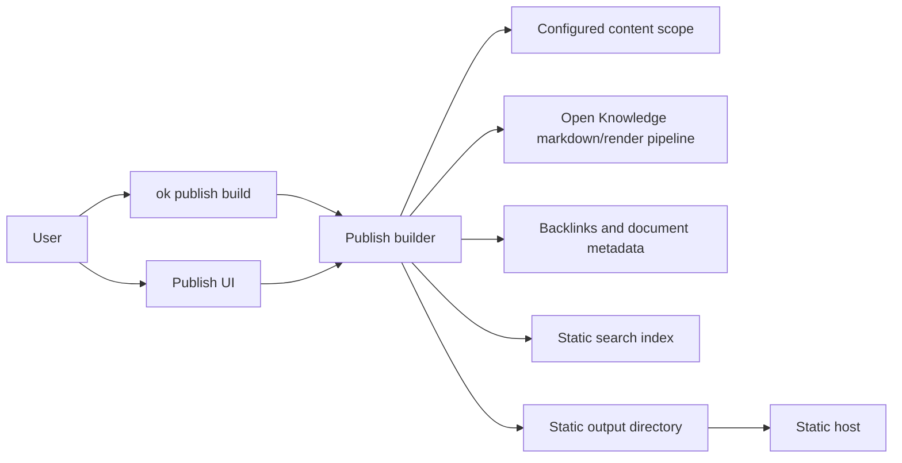
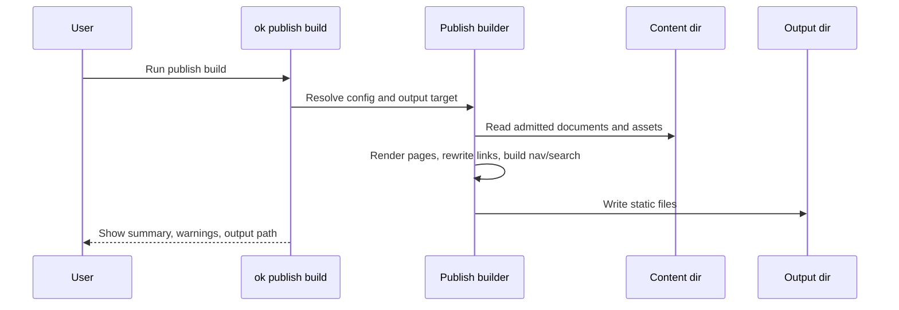
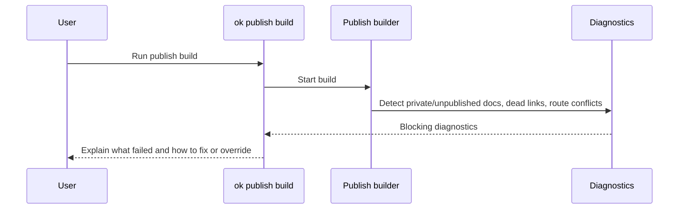

# Publish Knowledge Base As Static Site

## 1. Problem Statement

Open Knowledge users can author a local-first markdown knowledge base with CRDT collaboration, agent writes, backlinks, graph views, and Git-backed persistence. They do not yet have a first-class way to turn that knowledge base into a static public website.

The feature under exploration is a publish flow that converts the current content directory into static web assets that can be hosted on generic static hosts.

## 2. Draft Personas

| Persona | Job-to-be-done | Success signal |
| --- | --- | --- |
| Individual knowledge author | Share selected notes publicly without adopting a separate docs stack. | Can run one command or click one UI action and get a browsable site. |
| Small team maintainer | Publish team knowledge with navigation, backlinks, and search. | Published site reflects the intended content scope and is easy to update. |
| Docs-oriented operator | Integrate publishing into GitHub Pages, Netlify, Vercel, S3, or similar. | Output is deterministic static assets with predictable paths and deploy hooks. |

## 3. Current State

Confirmed findings are in `evidence/current-system-surfaces.md` and `evidence/static-site-prior-art.md`.

- The published CLI package is `@inkeep/open-knowledge` with `open-knowledge` and `ok` bins; its Commander entry point already exposes lifecycle, content, auth, clone, sync, and preview commands.
- Content scope is configured through `.open-knowledge/config.yml` and the shared Zod schema: `content.dir`, `content.include`, and `content.exclude` default to markdown and MDX files.
- The server already maintains an in-memory document index and exposes document listing, document read, backlink, forward-link, graph, orphan, hub, dead-link, heading, and create/rename APIs.
- The core package already exposes `markdownToHtml` / `mdastToHtml`, using the same markdown pipeline family as the editor copy path and stripping dangerous URL schemes at HTML serialization.
- The repo already contains a private Next/Fumadocs docs app. It is useful prior art for a branded docs website, but not automatically the right engine for per-user publishing.

## 4. Target State Hypothesis

Initial target: Open Knowledge can export and publish a selected content scope into a static site with generated pages, navigation, backlinks, graph-adjacent affordances where feasible, assets, search index, and publish metadata.

Confirmed direction:

- Support both local static export and hosted/deploy workflows in the feature direction.
- Keep the build step as the shared primitive: hosted deploy should consume the same deterministic static output that `ok publish build` creates.
- Use an Open Knowledge-branded published-site default.
- Make publication scope ergonomic: start with all eligible content selected, then let the user remove documents/folders before saving/publishing the manifest.
- Preserve document paths as the public URL source of truth.
- Store publish configuration in `.open-knowledge/publish.yml`.
- For build freshness, flush/await the running server when available; otherwise read disk and warn that unsaved live edits may be absent.
- Use GitHub Pages as the first first-class hosted publishing target, through a conservative auth/security model.
- Warn but continue on broken links by default.

## 5. Product Surface Area

| Surface | Likely change | Why it matters |
| --- | --- | --- |
| CLI | New publish command group, likely `ok publish build` and later `ok publish deploy`. | Fastest path for power users, CI, and local verification. |
| App UI | Publish entry point, status, preview/open output, and error display. | Makes publishing legible to non-CLI users. |
| Config | Site title, base URL/path, included/excluded content, theme, search, privacy/default visibility. | Public output needs stable names and security posture. |
| Docs/onboarding | Explain local export, hosting targets, limitations, and privacy model. | Publishing is a trust-sensitive workflow. |
| Error messages | Build diagnostics for broken links, unsupported markdown/MDX constructs, unsafe assets, and path conflicts. | Static export failures need actionable recovery. |

## 6. Internal Surface Area

| Subsystem | Touch | Notes |
| --- | --- | --- |
| `packages/cli` | Command wiring and user-facing workflow. | Existing command pattern uses lazy imports for command handlers. |
| `packages/server` | Content indexing, metadata, backlinks, graph, file reads. | Could either reuse server APIs or factor shared publish-time modules that read content directly. |
| `packages/core` | Markdown to HTML/render model. | Existing `markdownToHtml` is promising but was built for clipboard HTML, not full-page rendering. |
| `packages/app` | Publish UI, progress/status, local-op bridge in desktop/web. | Needs a shared service layer rather than duplicating CLI behavior. |
| `docs` | Possible theme/renderer precedent. | Fumadocs/Next can static-export, but dynamic route/static-export constraints need validation. |
| CI/tests | Unit/integration for builder, fixture export tests, possibly Playwright smoke for generated site. | Static output needs deterministic snapshot/fidelity checks. |

## 7. Initial Scope Hypothesis

### In Scope, Proposed

- Static export command that reads configured content scope and writes to a local output directory.
- Hosted/deploy workflow exploration built on the same export artifact.
- Native Open Knowledge static renderer as the canonical publishing engine.
- Generated page routes from markdown/MDX document names.
- Navigation from folder structure and page titles.
- Link rewriting for wiki links and relative markdown links.
- Asset copying for admitted sibling assets.
- Static search index, likely Pagefind or a lightweight generated JSON index.
- Build diagnostics for dead links, duplicate slugs, unsupported dynamic content, path escape attempts, and output overwrite behavior.
- Publish scope manifest UX that defaults to all eligible content selected and makes exclusion/removal fast.
- Open Knowledge-branded default theme.
- `.open-knowledge/publish.yml` as the publish configuration and saved manifest location.
- GitHub Pages as the first hosted deploy target.

### Out Of Scope, Proposed

- Hosted Open Knowledge publishing service.
- Real-time updates to a published site.
- Private authenticated static sites.
- Collaborative editing on the published site.
- Comments, analytics, newsletter, and other publishing-platform features.
- Full MDX component runtime compatibility unless chosen explicitly.

## 8. Candidate Architecture Options

### Option A: Minimal Native Static Renderer

Build a repo-native package/module that reads content files, uses Open Knowledge markdown parsing/rendering, emits HTML/CSS/JS, copies assets, and writes search/navigation indexes.

Pros: small runtime surface, deterministic, can share core pipeline, no framework constraints, and can preserve Open Knowledge-specific semantics such as wiki links and graph/backlink affordances without adapting them to another framework's content model.

Cons: more UI/theme work, more responsibility for routing/search/accessibility, and more code that Open Knowledge owns long-term.

### Option B: Fumadocs/Next Export Template

Generate or invoke a Fumadocs/Next site, point it at user content, set `output: 'export'`, and emit the generated `out` directory.

Pros: strong docs UI quickly, aligned with existing repo docs package, fewer theme decisions, and a mature page/layout/navigation foundation.

Cons: Next static export constraints, MDX schema/config coupling, heavier dependencies in the published CLI, potential mismatch with arbitrary knowledge-base content, and a risk that Open Knowledge's own markdown/link semantics become secondary to Fumadocs' content model.

Significance of the A vs B choice: Option A makes publishing an Open Knowledge-native product surface. Option B makes publishing a generated docs-site wrapper around Open Knowledge content. A is usually better if published knowledge bases should preserve graph/wiki-link semantics and feel like Open Knowledge. B is usually better if the main goal is to ship a polished conventional docs site quickly and accept framework constraints.

### Option C: Astro/Starlight Export Template

Use Astro/Starlight as the publishing engine for markdown/MDX docs.

Pros: static-first docs framework, strong content collection model, built-in docs affordances.

Cons: new framework in the monorepo, content schema migration questions, additional dependency surface.

### Option D: Docusaurus Export Template

Use Docusaurus as the publishing engine.

Pros: mature docs/static publishing conventions.

Cons: heavier mental model and dependency surface; likely less aligned with existing Open Knowledge markdown semantics.

## 9. Recommendation, Pending User Direction

Decision: use Option A for the build engine, while borrowing product affordances from Fumadocs/Starlight/Pagefind. This keeps Open Knowledge's markdown semantics authoritative and avoids coupling public publishing to a framework that may reject arbitrary user content.

Confidence: MEDIUM-HIGH. The tradeoff is that Open Knowledge owns more renderer/theme code, but that cost buys control over wiki-link, backlink, graph, manifest, and privacy semantics.

## 10. Decision Log

| ID | Type | Priority | Decision | Status | Rationale |
| --- | --- | --- | --- | --- | --- |
| D1 | Product | P0 | Support both local static export and hosted/deploy workflows, with local export as the shared build primitive. | Decided 2026-04-28 | User chose both local export and hosted publishing. Build artifact should be reusable across both. |
| D2 | Technical | P0 | Use a native Open Knowledge static renderer rather than a framework-template renderer. | Decided 2026-04-28 | User chose Option A. Keeps OK markdown/link/graph semantics authoritative; avoids making publish behavior subordinate to Fumadocs/Next or another docs framework. |
| D3 | Cross-cutting | P0 | Publish scope UX defaults to all eligible content selected, but requires an ergonomic remove/exclude flow before saving/publishing the manifest. | Decided 2026-04-28 | User wants opt-in/selection semantics without making users manually add every page. |
| D4 | Product | P1 | Use Pagefind for static search if packaging checks pass; otherwise use a generated JSON index fallback. | Decided 2026-04-28 | User accepted recommendation. Search should work on generic static hosts without hosted services. |
| D5 | Technical | P1 | Preserve document paths as public URLs. | Decided 2026-04-28 | User accepted recommendation. Path-based URLs are stable, map to local files, and simplify link rewriting. |
| D6 | Product | P1 | Default published-site identity is Open Knowledge-branded. | Decided 2026-04-28 | User chose Open Knowledge branding. |
| D7 | Technical | P0 | Store publish configuration and saved scope manifest in `.open-knowledge/publish.yml`. | Decided 2026-04-28 | User accepted recommendation. Keeps publishing state out of individual content files and avoids per-doc sidecars. |
| D8 | Technical | P0 | Build freshness: if a server is running, request/await flush before building; otherwise read disk and warn about unsaved live edits. | Decided 2026-04-28 | User accepted recommendation. Balances correctness with CLI usability when no server is running. |
| D9 | Cross-cutting | P0 | GitHub Pages is the first first-class hosted publishing target. | Decided 2026-04-28 | User accepted recommendation. Aligns with existing git/GitHub surfaces. |
| D10 | Cross-cutting | P0 | Hosted publish auth/security uses conservative GitHub Pages flow: local build, manifest/target confirmation, local git credentials where possible, explicit GitHub auth only for setup, dedicated branch/output, no publish without dry-run. | Decided 2026-04-28 | User accepted recommendation. Minimizes credential scope and accidental publication risk. |
| D11 | Technical | P1 | Broken internal links warn but do not block publish by default. | Decided 2026-04-28 | User overrode recommendation. Publish should continue while surfacing diagnostics. |
| D12 | Product | P1 | Exclusion ergonomics support doc, folder, and glob removals first; tag/frontmatter rules are future work. | Decided 2026-04-28 | User accepted recommendation. Covers common removal workflows without expanding the metadata model immediately. |

## 11. Open Questions

| ID | Type | Priority | Blocking | Question | Investigation status |
| --- | --- | --- | --- | --- | --- |
| Q1 | Product | P0 | Yes | Is the first release for personal public publishing, team docs, or customer-facing documentation? | Needs user judgment. |
| Q2 | Product | P0 | Yes | Should publishing be opt-in per document/folder, or publish the configured content scope by default? | Resolved by D3. |
| Q3 | Cross-cutting | P0 | Yes | Is a local static export enough for v1, or must v1 include deploy-to-host workflows? | Resolved by D1. |
| Q4 | Technical | P0 | Yes | Which parts of `markdownToHtml` can the native publishing renderer reuse, and which publishing-specific rendering steps are needed? | Partially investigated; native renderer selected by D2. Needs deeper source/test review. |
| Q5 | Technical | P1 | No | How should generated URLs handle nested folders, `index.md`, `.mdx`, anchors, wiki links, and renamed documents? | Partially resolved by D5; detailed edge cases need fixture exploration. |
| Q6 | Technical | P1 | No | Should the publish build run against disk files only, or ask the running server to flush/read current CRDT state first? | Resolved by D8. |
| Q7 | Product | P1 | No | What visual identity should published sites carry: Open Knowledge-branded, neutral docs, or user-customizable? | Resolved by D6. |
| Q8 | Technical | P1 | No | Which static search implementation best fits Bun/Node 24 packaging and static-host constraints? | Direction decided by D4; Pagefind packaging still needs verification. |

## 12. Assumptions

| ID | Assumption | Confidence | Verification plan | Expiry |
| --- | --- | --- | --- | --- |
| A1 | Users want a static output directory that can be deployed anywhere. | Confirmed | Confirmed by D1. | Resolved 2026-04-28. |
| A2 | Publishing arbitrary content makes explicit privacy controls more important than one-click speed. | Revised | D3 confirms ergonomic selection/removal, not strict manual opt-in. | Resolved 2026-04-28. |
| A3 | A native renderer can satisfy v1 faster than framework export because Open Knowledge already owns markdown semantics. | MEDIUM | Verify with rendering spike and fixture export tests. | Before D2 final. |

## 13. Risks / Unknowns

| Risk | Impact | Mitigation |
| --- | --- | --- |
| Accidental publication of private notes. | High trust/security impact. | Prefer explicit publish scope or dry-run manifest with warnings. |
| Renderer diverges from editor/markdown fidelity. | Published site does not match authored content. | Reuse core pipeline where appropriate and add export fixture tests. |
| Framework template rejects arbitrary content or requires schema migration. | Build failures and support load. | Validate before choosing Option B/C; keep native renderer as fallback. |
| Public URL scheme changes after release. | Broken external links. | Treat URL strategy as a 1-way-door decision. |
| Static export reads stale disk state while CRDT changes are pending. | Published output omits recent edits. | Define flush/quiescence behavior before build. |

## 14. Future Work Candidates

| Item | Maturity | Notes |
| --- | --- | --- |
| One-click GitHub Pages deployment | Identified | Likely valuable after local export semantics are stable. |
| Hosted Open Knowledge publish service | Noted | Larger product/security surface. |
| Password-protected or private static sites | Noted | Not truly static without host-specific auth or generated access layer. |
| Custom themes/templates | Identified | Depends on renderer/template architecture. |
| Incremental publish/watch mode | Identified | Useful, but local export must be deterministic first. |
| Tag/frontmatter-based publish inclusion/exclusion rules | Identified | Deferred in favor of doc/folder/glob exclusions first. |
| Strict broken-link blocking mode | Noted | Default is warn-and-continue by D11; a stricter flag may be useful later for CI. |

## 15. System Sketch

Primary happy path:

Important failure path:

