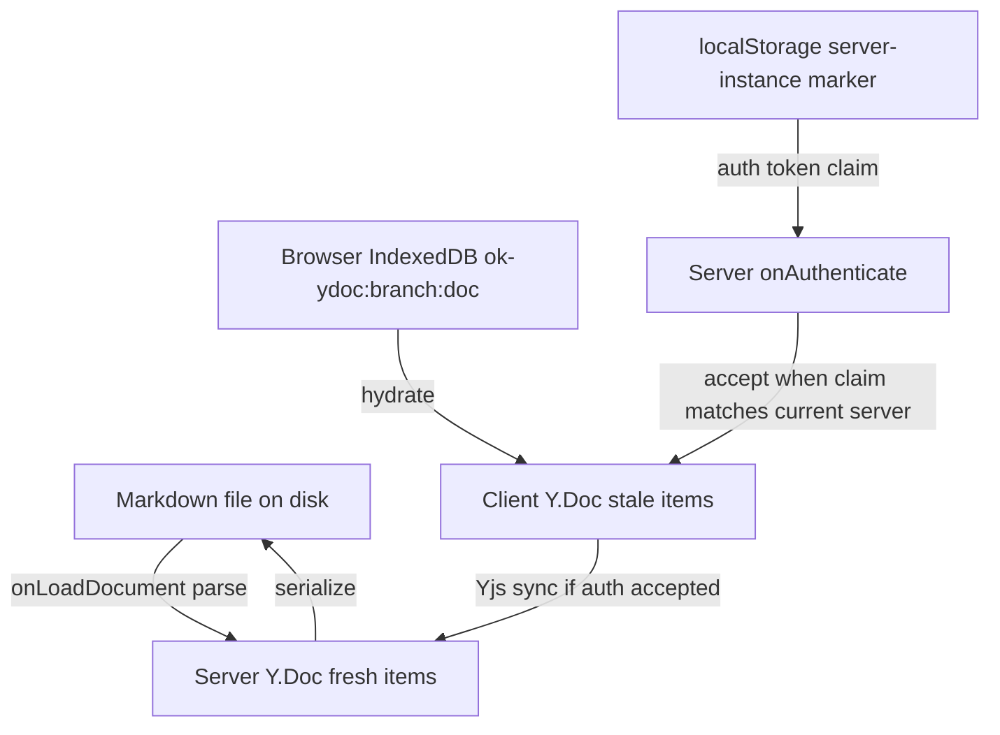
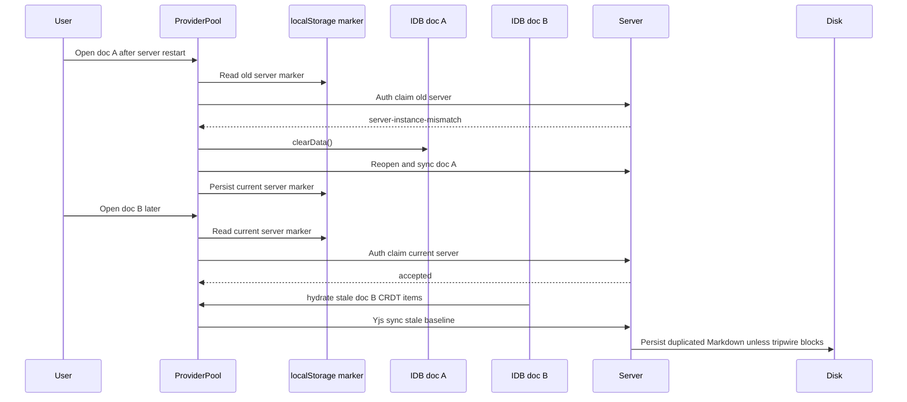

# CRDT Cache Epoch Recovery — Spec

**Status:** Draft
**Owner(s):** Open Knowledge
**Last updated:** 2026-04-29
**Links:**

- Evidence: [`./evidence/current-system-trace.md`](./evidence/current-system-trace.md), [`./evidence/incident-shape.md`](./evidence/incident-shape.md), [`./evidence/test-coverage-gap.md`](./evidence/test-coverage-gap.md)
- Related commit: `627a5c52` (`Fix/dupe text (#362)`)

---

## 1) Problem statement

- **Who is affected:** Open Knowledge editor users with browser-side Yjs/IndexedDB state, especially during dev-server restarts, app refreshes, branch switches, or navigation across already-cached documents.
- **What pain / job-to-be-done:** Users need Markdown documents to never be silently duplicated or corrupted when they click around the UI. If the server has reconstructed a document from Markdown, stale browser CRDT state must not merge back as duplicate baseline content.
- **Why now:** A fresh incident duplicated `.changeset/README.md` while the user was only navigating in the UI. Server logs show the document loaded from disk with 6 children, then immediately mutated to 12 children and wrote \~2x bytes to disk.
- **Current workaround(s):** Manually revert the duplicated Markdown file and clear browser storage / IndexedDB. This is not acceptable as a normal recovery path.

## 2) Goals

- **G1 — No silent Markdown corruption:** A stale client cache must not silently persist duplicated content to the real `.md` / `.mdx` file.
- **G2 — Preserve real unsynced edits when possible:** If a user has edits not durably acknowledged by the server, recovery should replay only those edits after clearing stale baseline CRDT state.
- **G3 — Keep the current server/Markdown-canonical architecture coherent:** The fix should align with the repo's current design where Markdown is durable source of truth and browser IDB is a restart/cache optimization.
- **G4 — Make recurrence diagnosable:** Logs, tests, and telemetry should distinguish stale-cache recovery, replay, blocked writes, and user-visible recovery failures.
- **G5 — Preserve a path to a future true offline-first CRDT architecture:** Pragmatic fixes should not make durable CRDT storage harder if the product later chooses that direction.

## 3) Non-goals

- **NG1 — Full offline-first CRDT persistence:** This spec does not migrate the server to durable Yjs update/snapshot storage as canonical state.
- **NG2 — Generic semantic deduplication of all Yjs updates:** This spec does not attempt to classify arbitrary incoming CRDT updates as semantically equivalent to current Markdown in normal sync.
- **NG3 — Document-level last-write-wins as default collaboration semantics:** LWW may be a recovery fallback in future work, but not the primary fix.
- **NG4 — Rewriting the observer bridge:** The server-authoritative XmlFragment/Y.Text observer architecture remains in place.

## 4) Personas / consumers

- **P1 — Human editor user:** Clicks and edits documents in the browser UI. Expects no corruption from navigation/reload/restart events.
- **P2 — Agent/MCP writer:** Writes through server APIs. Expects server persistence and attribution to remain consistent while browser clients are connected.
- **P3 — Maintainer/operator:** Needs clear logs and rescue artifacts when recovery blocks a suspicious write.
- **P4 — Future implementer:** Needs regression tests and crisp invariants for client cache epoch handling.

## 5) User journeys

### Journey A — Normal navigation after server restart

1. User has browser IndexedDB state for multiple documents.
2. Server process restarts and reconstructs Y.Docs from Markdown.
3. User clicks a cached document.
4. Client detects that the cached CRDT state belongs to an old server/doc epoch before Yjs sync can merge baseline items.
5. Client clears only that document's stale IndexedDB state, opens a fresh provider, syncs canonical Markdown-backed server state, and shows the document without duplication.
6. If there were acknowledged server/disk watermarks, client replays only unsynced local delta.

### Journey B — Suspicious duplication reaches persistence anyway

1. A stale-cache edge case escapes client-side detection.
2. Server persistence serializes a document whose output strongly resembles a duplicated baseline.
3. Persistence refuses to overwrite the real Markdown file.
4. Server saves the suspicious in-memory state to a rescue/checkpoint location and logs a structured event.
5. User/operator can recover intentionally instead of discovering silent file corruption.

### Journey C — ClearData blocked/fails

1. Browser recovery detects epoch mismatch.
2. IndexedDB deletion is blocked by another tab, DevTools, or storage failure.
3. Client does not recycle that provider into the still-stale DB.
4. User sees a recovery failure path with actionable instructions; real Markdown remains protected by the server tripwire.

## 6) Requirements

### Functional requirements

| Priority | Requirement                                                                                          | Acceptance criteria                                                                                                                                                         | Notes                                                                                         |
| -------- | ---------------------------------------------------------------------------------------------------- | --------------------------------------------------------------------------------------------------------------------------------------------------------------------------- | --------------------------------------------------------------------------------------------- |
| Must     | Epoch-scope client IndexedDB state at the same granularity as persisted Yjs data.                    | Opening doc B after doc A synced to a fresh server cannot mask doc B's stale cache with a global server-instance marker.                                                    | Current DB name is branch+doc; current marker is global.                                      |
| Must     | Reject or recycle stale client cache before Yjs sync can merge with a Markdown-rebuilt server Y.Doc. | Integration test reproduces multi-doc stale-cache scenario and shows no doubled headings/paragraphs.                                                                        | Extends `627a5c52`, which handles first-open page reload.                                     |
| Must     | Preserve only unsynced local deltas during mismatch recovery.                                        | Buffer is computed relative to the strongest available trusted baseline (`disk-ack` preferred over server sync); no baseline means no blind replay of the full local Y.Doc. | Existing buffer-and-replay logic already has this shape; scope is to preserve and tighten it. |
| Must     | Add server-side duplication tripwire before disk write.                                              | When serialized Markdown is high-confidence duplicated baseline, persistence does not write the real file and emits rescue + structured log.                                | Existing warning writes anyway.                                                               |
| Must     | Regression tests cover the reported incident shape.                                                  | Test covers: cached doc A syncs current marker, cached doc B opens later, doc B does not duplicate. Persistence tripwire test covers warn→block behavior.                   |                                                                                               |
| Should   | Recovery UX distinguishes clearing, reconnecting, failed clear, and blocked suspicious write.        | Active doc shows actionable recovery state; logs have machine-readable events.                                                                                              | Existing recovery state can be extended.                                                      |
| Should   | Preserve future durable-CRDT option.                                                                 | New cache keys/epochs are isolated implementation details, not public API commitments.                                                                                      | Avoid making Markdown↔CRDT epoch coupling impossible to remove later.                         |
| Could    | Provide manual “clear this document cache and reload” debug action.                                  | User/operator can recover without clearing all site storage.                                                                                                                | Future work unless needed for UX polish.                                                      |

### Non-functional requirements

- **Reliability:** No known path should write duplicated baseline content to disk without an explicit rescue/override path.
- **Performance:** Epoch checks must be O(1) at provider open; no full-document semantic diff on every Yjs update.
- **Security/privacy:** Rescue artifacts must follow existing shadow/checkpoint path discipline and avoid leaking content into logs.
- **Operability:** Structured events for stale-cache recycle, clear failures/timeouts, buffer replay failures, and blocked duplication writes.
- **Cost:** Additional storage keys should be bounded by branch+doc cache cardinality; stale key cleanup is nice-to-have, not correctness-critical.

## 7) Success metrics & instrumentation

- **Metric 1 — duplication-block count**
  - Baseline: existing persistence warning count unknown; latest incident emitted one warning and wrote the file.
  - Target: suspicious duplication never reaches real Markdown without explicit recovery.
  - Instrumentation notes: structured `ok-persistence-duplication-blocked` event with `doc.name`, byte ratio, child-count ratio, and rescue/checkpoint id.
- **Metric 2 — stale-cache recovery count**
  - Baseline: current `server-instance-mismatch` recovery logs are client-side only for some failure paths.
  - Target: all mismatch recoveries produce bounded structured diagnostics.
  - Instrumentation notes: `ok-client-cache-epoch-mismatch`, `ok-client-cache-clear-failed`, `ok-buffer-replay-failed`.
- **Metric 3 — regression coverage**
  - Baseline: tests cover page-reload same-doc stale ID, not cross-doc global-marker masking.
  - Target: targeted integration and unit tests fail on current HEAD and pass after fix.

## 8) Current state (how it works today)

- Server persistence treats Markdown as the sole durable source of truth on load. It parses the file, populates an empty Y.XmlFragment, then seeds reconciled base from normalized serialization.
- Server observer extension populates Y.Text from the XmlFragment and keeps XmlFragment/Y.Text synchronized under server-authoritative observer rules.
- Client-side persistence stores Yjs state in IndexedDB under `ok-ydoc:${branch}:${docName}`.
- Commit `627a5c52` added a server-instance auth claim and recovery path: clients claim `expectedServerInstanceId`, server rejects mismatches, client clears IndexedDB and recycles providers before sync.
- The server-instance marker is currently one global localStorage key: `ok-idb-synced-server-instance-id`.
- On a clean synced provider, the client writes the current server ID into the global marker, regardless of which doc's IndexedDB state actually synced.
- This creates a likely cross-doc hole: doc A can update the global marker to the current server while doc B still has stale `ok-ydoc:${branch}:docB` state. Opening doc B then claims the current server ID and bypasses mismatch recovery.
- Persistence already detects suspicious size growth (`markdown.length > currentBase.length * 1.5`) and logs “possible duplication,” but still writes the file.

### Failure sequence for the suspected remaining hole

## 9) Proposed solution (vertical slice)

### User experience / surfaces

- Normal users should see no new UI during successful recovery.
- During active recovery, reuse/extend existing server-restart recovery state so the active document can show “Recovering local cache…” and “Could not clear local cache” states.
- If server tripwire blocks a write, surface an actionable error/banner for the active document if possible; at minimum, emit structured logs and keep the disk file unchanged.

### System design

#### Recommended architecture: server/Markdown canonical + server-epoch-scoped client cache

The recommended path keeps the current architecture: Markdown remains durable source of truth; browser IndexedDB is a disposable cache plus unsynced-edit staging area. Client persistence is keyed by the server epoch so stale CRDT items from a prior server instance are never hydrated into a provider that will sync with the current server.

Key design points:

1. **Put the server epoch in the IndexedDB database name.**
   - Database name: `ok-ydoc:${branch}:${serverInstanceId}:${docName}`.
   - Remove the global `ok-idb-synced-server-instance-id` marker as a correctness dependency.
   - Provider construction must know the current `serverInstanceId` before attaching persistent IndexedDB. If the server ID is not known yet, either wait for `/api/server-info` or open without persistent IDB; do not hydrate a persistent “unknown epoch” database that could be reused across restarts.

2. **Auth still claims the live server instance ID.**
   - `/api/server-info` and CC1 `server-info` update the live current server ID.
   - Provider auth claims the server ID used in the DB name. If the server restarts between info fetch and provider connect, `server-instance-mismatch` rejects before sync and the client refreshes/recycles into the new epoch DB.

3. **On mismatch, preserve only unsynced delta when a trusted baseline exists.**
   - Continue preferring `lastDiskAckedSV` over `lastServerSyncedSV` as baseline.
   - If no baseline exists, drop local CRDT state and sync from server; stale baseline replay is the duplication mechanism.
   - After fresh sync into the new epoch DB, apply buffered update once via `TAB_REPLAY_ORIGIN`.
   - Old-epoch DB deletion becomes storage hygiene, not correctness-critical: a blocked delete must not prevent recovery because the fresh provider uses a different DB name.

4. **Tripwire before disk write.**
   - Replace warn-only duplication detection with a narrow high-confidence block before the real Markdown file is overwritten.
   - Block only when the candidate body is an exact/near-exact duplication of the current base body under bridge normalization (frontmatter compared separately). Size ratio and child-count ratio are supporting diagnostics only, not sufficient to block.
   - Ambiguous cases warn only. Blocking is reserved for baseline-doubling shapes that match the stale-cache failure signature.
   - On block, do not create new rescue UI. Keep disk unchanged, emit a structured event, and reset/recycle the live document from the current disk/base state so the in-memory duplicate does not repeatedly retry persistence.

5. **Tests first.**
   - Add regression test for cross-doc marker masking.
   - Add unit tests for server-epoch DB-name derivation and “no persistent unknown epoch DB” behavior.
   - Add persistence test for tripwire block behavior.

### API/transport

- Existing `expectedServerInstanceId` auth token field can remain; its source changes from the live server ID used in the epoch-scoped IndexedDB database name.
- No public API changes required.
- `/api/server-info` continues to supply current server instance ID and disk-ack state vectors.

### Data model

- Current:
  - IndexedDB: `ok-ydoc:${branch}:${docName}`
  - localStorage marker: `ok-idb-synced-server-instance-id`
- Decided target:
  - IndexedDB: `ok-ydoc:${branch}:${serverInstanceId}:${docName}`
  - localStorage marker: removed entirely (D8). The DB name carries the epoch; no separate marker is retained, even as a diagnostic aid.
- Open implementation detail:
  - Provider opens must not attach persistent IndexedDB until `serverInstanceId` is known. If the ID is temporarily unavailable, use a non-persistent provider or wait for `/api/server-info`.

### Failure modes and handling

| Failure mode                                  | Handling                                                                                                                 |
| --------------------------------------------- | ------------------------------------------------------------------------------------------------------------------------ |
| Stale per-doc IDB after server restart        | New server epoch uses a different DB name; old stale DB is not hydrated into current provider.                           |
| Doc A synced current marker while doc B stale | Eliminated by removing global marker correctness dependency; doc B opens current epoch DB, not old branch+doc DB.        |
| clearData blocked/timeouts                    | Old-epoch cleanup is hygiene only; do not block recovery into the new epoch DB.                                          |
| Buffer too large                              | Drop buffer with loud mark/log; do not replay full stale doc.                                                            |
| Tripwire false positive                       | Real file remains unchanged; in-memory state is recycled/reloaded from disk; no new rescue UI.                           |
| Tripwire false negative                       | Regression tests and client epoch fix reduce likelihood; remaining residual should be visible through warning telemetry. |

### Alternatives considered

- **A — True offline-first durable CRDT canonical storage.** Store Yjs updates/snapshots durably and treat Markdown as projection/export. This preserves the “offline for 6 months” ideal, but requires a larger architecture migration: branch-aware CRDT stores, compaction, migrations, external-disk-edit reconciliation, and new recovery semantics.
- **B — Generic semantic dedupe of incoming CRDT updates.** Apply incoming updates in a sandbox, serialize/compare, and drop equivalent baseline content. This is difficult to distinguish from intentional duplicated content and becomes a semantic three-way merge problem.
- **C — Document-level last-write-wins.** Prevents duplication by choosing one side, but drops concurrent edits and undermines collaboration semantics.
- **D — Current recommended path.** Make browser cache epoch-scoped and disposable, preserve only trusted unsynced deltas, and block suspicious persistence writes.

## 10) Decision log

| ID | Decision                                                                                                                                                   | Type (P/T/X) | 1-way door? | Status             | Rationale                                                                                                                                                                                                 | Evidence / links                                                 | Implications                                                                                                                                                               |
| -- | ---------------------------------------------------------------------------------------------------------------------------------------------------------- | ------------ | ----------- | ------------------ | --------------------------------------------------------------------------------------------------------------------------------------------------------------------------------------------------------- | ---------------------------------------------------------------- | -------------------------------------------------------------------------------------------------------------------------------------------------------------------------- |
| D1 | Keep server/Markdown canonical for this fix; browser IDB remains disposable cache + unsynced-edit staging, not equal durable CRDT authority.               | X            | Yes         | Decided 2026-04-29 | Current repo design already treats Markdown as source of truth; true CRDT canonical is larger and product-significant. User confirmed server/Markdown canonical posture.                                  | `evidence/current-system-trace.md`                               | In-scope fix should use cache epoch invalidation/recovery, not durable CRDT storage migration.                                                                             |
| D2 | Use server-epoch-scoped IndexedDB names: `ok-ydoc:${branch}:${serverInstanceId}:${docName}`.                                                               | T            | Reversible  | Decided 2026-04-29 | Current IDB state is branch+doc but marker is global; epoch-scoped DB names structurally prevent stale old-server CRDT items from hydrating into current-server providers. User chose epoch-scoped cache. | `evidence/current-system-trace.md`, `evidence/incident-shape.md` | First open after server restart is cold; provider creation must know serverInstanceId or avoid persistent IDB until known; old DB cleanup is hygiene, not correctness.     |
| D3 | Add a narrow persistence tripwire: exact/near-exact baseline duplication blocks disk write; ambiguous suspicious cases warn only; no rescue checkpoint UI. | X            | Reversible  | Decided 2026-04-29 | Existing warning caught the incident shape but still wrote corrupted file. User accepted narrow block/recycle recommendation and prefers no rescue UI.                                                    | `evidence/incident-shape.md`                                     | Protects disk from known stale-cache duplication class; false positives are limited to rare whole-document duplicate edits matching the exact baseline-doubling signature. |
| D4 | If no trusted baseline exists during mismatch recovery, drop local CRDT state and sync from server; do not replay whole local doc.                         | X            | Reversible  | Decided 2026-04-29 | Replaying full no-baseline local Y.Doc is unsafe because it may be entirely stale baseline content. User chose corruption safety over preserving ambiguous local state.                                   | `provider-pool.ts` current behavior                              | Narrow cold-window unsynced edits can be lost; make behavior visible via logs/marks.                                                                                       |

### Decision log addendum (D5–D8)

| ID | Decision                                                                                                                                                                                                               | Type (P/T/X) | 1-way door? | Status             | Rationale                                                                                                                                                                                                    | Evidence / links                                                   | Implications                                                                                                                                                                                                                                                                                                                                      |
| -- | ---------------------------------------------------------------------------------------------------------------------------------------------------------------------------------------------------------------------- | ------------ | ----------- | ------------------ | ------------------------------------------------------------------------------------------------------------------------------------------------------------------------------------------------------------ | ------------------------------------------------------------------ | ------------------------------------------------------------------------------------------------------------------------------------------------------------------------------------------------------------------------------------------------------------------------------------------------------------------------------------------------- |
| D5 | `ProviderPool.open()` waits for a known `serverInstanceId` before attaching persistent IndexedDB. No ephemeral / non-persistent provider mode is added.                                                                | T            | Reversible  | Decided 2026-04-29 | Eliminates the "unknown-epoch persistent DB" pitfall called out by D2 without introducing a swap-provider state machine. `/api/server-info` is fast-boot local; awaiting it once on cold open is acceptable. | §9 design point 1                                                  | Pool exposes `whenServerInstanceKnown(): Promise<string>` resolved by `setExpectedServerInstanceId()` (initial `/api/server-info`) or by CC1 `server-info`; `open()` awaits it before constructing `IndexeddbPersistence`.                                                                                                                        |
| D6 | Tripwire blocks only when the candidate body is a **structural duplication** of the current base body under bridge normalization, with frontmatter stripped. Size and child-count ratios remain warn-only diagnostics. | T            | Reversible  | Decided 2026-04-29 | D3 binds: ratios alone are insufficient. Structural duplication directly matches the incident class without flagging long single-copy edits.                                                                 | `evidence/incident-shape.md`, `packages/server/src/persistence.ts` | Algorithm: strip YAML frontmatter from both candidate and `currentBase`; bridge-normalize; check that the candidate body equals an integer concatenation (k≥2) of the normalized base body, allowing only inter-copy whitespace. Implementation in `packages/server/src/persistence-tripwire.ts` (new), unit-testable in isolation from disk I/O. |
| D7 | Tripwire test acceptance is two-sided: incident-shape reproduction MUST trigger a block; a corpus of ≥3 intentional whole-document duplicate fixtures MUST NOT trigger a block. Both halves are blocking gates.        | X            | Reversible  | Decided 2026-04-29 | Closes A3 (false-positive risk) with a concrete merge gate, not a hand-wave.                                                                                                                                 | §7 Metric 1, §12 A3                                                | Fixtures committed under `packages/server/src/persistence-tripwire.fixtures/`: (a) the `.changeset/README` doubling shape; (b) ≥3 intentional duplicates (FAQ repeating a section, intentionally duplicated code blocks, "see also" mirror). All asserted in `packages/server/src/persistence-tripwire.test.ts`.                                  |
| D8 | Remove the global `ok-idb-synced-server-instance-id` localStorage marker entirely. Epoch-scoped IndexedDB names (D2) are the sole correctness signal; the marker is not retained as a diagnostic aid.                  | T            | Reversible  | Decided 2026-04-29 | "No deferred tech debt" (greenfield posture): a non-authoritative diagnostic-only key invites future drift. The DB name `ok-ydoc:${branch}:${serverInstanceId}:${docName}` is itself self-diagnostic.        | `evidence/current-system-trace.md` F4-F5                           | Deletes `IDB_SYNCED_SERVER_INSTANCE_ID_KEY`, `getOrInitIdbSyncedServerInstanceId`, `persistIdbSyncedServerInstanceId` and call sites in `packages/app/src/editor/provider-pool.ts`. Auth-claim derivation reads `serverInstanceId` from the pool's known-current value (D5), not from localStorage.                                               |

## 11) Open questions

| ID | Question                                                                                            | Type (P/T/X) | Priority | Blocking? | Plan to resolve / next action                                                                                                                                                                                | Status   |
| -- | --------------------------------------------------------------------------------------------------- | ------------ | -------- | --------- | ------------------------------------------------------------------------------------------------------------------------------------------------------------------------------------------------------------ | -------- |
| Q1 | Should the long-term product promise include true “offline for months as equal peer” semantics?     | Product      | P0       | Yes       | Resolved by D1 for this fix: server/Markdown canonical. Durable CRDT canonical remains Future Work, not in scope.                                                                                            | Resolved |
| Q2 | Should minimum fix use per-doc marker keys or include server/doc epoch in IndexedDB database names? | Technical    | P0       | Yes       | Resolved by D2: use server-epoch-scoped IndexedDB names.                                                                                                                                                     | Resolved |
| Q3 | What exact duplication tripwire heuristic is safe enough to block writes?                           | Technical    | P0       | Yes       | Resolved by D3 policy: block exact/near-exact normalized current-base body duplication only; size ratio alone remains warn-only. Implementation must validate with incident and intentional-duplicate tests. | Resolved |
| Q4 | What should user see when tripwire blocks persistence?                                              | Product      | P1       | No        | Resolved by D3 (no rescue UI): tripwire blocks silently with structured `ok-persistence-duplication-blocked` event and recycles the live document from disk. No new banner. (Status: Resolved)               | Open     |
| Q5 | Should stale per-doc localStorage marker keys be garbage-collected?                                 | Technical    | P2       | No        | Resolved by D8: the global marker is removed entirely; per-doc localStorage cleanup is moot. (Status: Resolved)                                                                                              | Open     |

## 12) Assumptions

| ID | Assumption                                                                                                                           | Confidence | Verification plan                                                                                         | Expiry                         | Status |
| -- | ------------------------------------------------------------------------------------------------------------------------------------ | ---------- | --------------------------------------------------------------------------------------------------------- | ------------------------------ | ------ |
| A1 | The reported `.changeset/README` duplication came from stale client IndexedDB merging with a Markdown-rebuilt server Y.Doc.          | MED        | Add targeted repro/integration test; inspect browser IDB if reproduced.                                   | Before implementation complete | Active |
| A2 | Per-doc marker or epoch keying is sufficient to close the observed cross-doc masking hole.                                           | MED        | Write failing unit/integration test for doc A updates marker then doc B opens stale.                      | Before scope freeze            | Active |
| A3 | A persistence tripwire can be high-confidence enough to block obvious duplicated baseline without blocking common intentional edits. | LOW        | Build corpus/probe from duplication incident + intentional duplicate docs + Markdown normalization cases. | Before implementation complete | Active |

## 13) In Scope (implement now)

Scope hypothesis:

- Server-epoch-scoped IndexedDB naming.
- Provider-open gating so persistent IDB is only attached when `serverInstanceId` is known; otherwise use non-persistent open or wait for server-info.
- Preserve and tighten buffer-and-replay for trusted unsynced deltas only; no-baseline mismatch drops local CRDT state.
- Client/server regression tests for multi-doc stale-cache recovery.
- Server persistence tripwire that blocks exact/near-exact duplicated-baseline writes, warns on ambiguous cases, and recycles/reloads without adding rescue checkpoint UI.
- Structured logs/metrics for recovery and blocked writes.

## 14) Risks & mitigations

| Risk                                                                            | Likelihood                                                        | Impact                        | Mitigation                                                                                                                                                       | Owner |
| ------------------------------------------------------------------------------- | ----------------------------------------------------------------- | ----------------------------- | ---------------------------------------------------------------------------------------------------------------------------------------------------------------- | ----- |
| Tripwire false positive blocks an intentional whole-document duplicate edit.    | Low if heuristic is exact/near-exact baseline body doubling only. | Medium/High for affected edit | Do not block on size ratio alone; block only exact/near-exact current-base duplication; ambiguous cases warn-only; tests include intentional duplicate examples. | TBD   |
| No-baseline recovery drops real user edits in narrow cold window.               | Low/Medium                                                        | High for affected user        | Prefer disk-ack/server-SV baseline when available; do not replay ambiguous full local doc; emit structured log/mark when local state is dropped.                 | TBD   |
| Epoch-scoped DB names increase stale browser storage.                           | Medium                                                            | Low                           | Bounded by doc cardinality; optional cleanup as Future Work.                                                                                                     | TBD   |
| Fix preserves server-canonical architecture but not true offline-first promise. | Certain                                                           | Product-dependent             | Make D1 explicit; keep durable CRDT migration as Future Work, not silently foreclosed.                                                                           | TBD   |
| Test environment fails to reproduce real browser IDB ordering.                  | Medium                                                            | Medium                        | Add both mechanism tests with fake-indexeddb and integration/E2E-style test through ProviderPool/server.                                                         | TBD   |

## 15) Future Work

### Explored

- **Durable CRDT canonical storage**
  - What we learned: The pure CRDT offline-peer model requires preserving CRDT item identity across server restarts. Markdown reconstruction creates fresh item identities and cannot safely merge stale peer baselines.
  - Recommended approach: Store Yjs updates/snapshots as durable canonical state and make Markdown a projection/export if product chooses true offline-first semantics.
  - Why not in scope now: Large architecture shift touching persistence, file watcher, branch switching, migration, compaction, and external edit semantics.
  - Triggers to revisit: Product requires long-lived offline editing as a first-class promise; repeated cache invalidation UX becomes unacceptable.
  - Implementation sketch: Branch+doc CRDT store, update log compaction, snapshot migration, Markdown projection writer, external file edit importer as CRDT operation.

### Identified

- **Manual per-document cache reset UI**
  - What we know: Could help recovery without asking users to clear all site storage.
  - Why it matters: Useful if clearData failures or stale cache edge cases remain visible.
  - What investigation is needed: UX placement and whether it should be dev-only or production user-facing.

- **Semantic duplicate detector as diagnostic-only analyzer**
  - What we know: Full semantic dedupe is risky as an automatic merge policy, but diagnostic analysis could improve tripwire confidence.
  - Why it matters: Can reduce false positives/negatives in persistence tripwire.
  - What investigation is needed: Corpus against intentional duplicates, normal Markdown normalization, and known duplication incidents.

### Noted

- **Browser storage garbage collection** — Old epoch-scoped IndexedDB/localStorage entries may accumulate. Correctness does not depend on cleanup, but storage hygiene may matter later.
